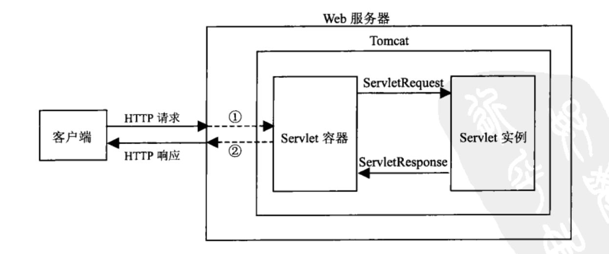
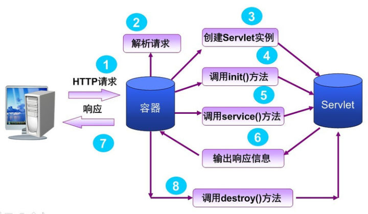
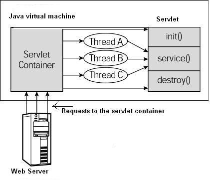
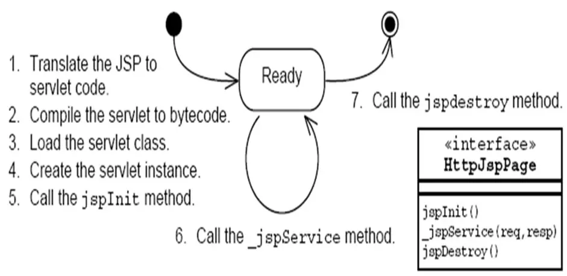
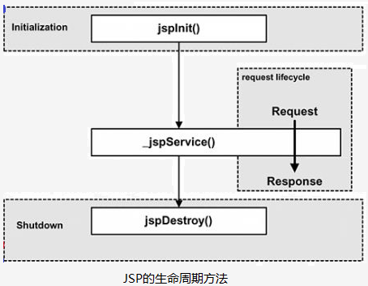

<!-- GFM-TOC -->
* [Servlet 介绍](#servlet-介绍)
  * [Servlet 简介](#servlet-简介)
    * [Servlet 对比 CGI](#servlet-对比-cgi)
  * [Servlet 的运行](#servlet-的运行)
    * [Servlet 工作原理](#servlet-工作原理)
    * [Servlet 工作模式](#servlet-工作模式)
    * [Tomcat和Servlet的关系](#tomcat和servlet的关系)
    * [Servlet 生命周期](#servlet-生命周期)
* [Servlet 使用](#servlet-使用)
  * [Servlet 请求方法](#servlet-请求方法)
  * [Servlet 重点对象](#servlet-重点对象)
    * [Request](#request)
    * [Response](#response)
    * [ServletConfig](#servletconfig)
    * [ServletContext](#servletcontext)
    * [Cookie](#cookie)
    * [Session](#session)
  * [Servlet 三大作用域](#servlet-三大作用域)
    * [Request 请求对象](#request-请求对象)
    * [Session 会话对象](#session-会话对象)
    * [ServletContext 上下文对象](#servletcontext-上下文对象)
  * [Servlet Filter](#servlet-filter)
  * [Servlet Listener](#servlet-listener)
  * [Servlet 线程安全问题](#servlet-线程安全问题)
    * [Servlet 同时处理多请求访问](#servlet-同时处理多请求访问)
    * [Servlet 单线程模式](#servlet-单线程模式)
  * [Servlet 应用细节](#servlet-应用细节)
    * [Servlet URL 映射](#servlet-url-映射)
    * [Servlet与普通Java类的区别](#servlet与普通java类的区别)
* [JSP 介绍](#jsp-介绍)
  * [JSP 简介](#jsp-简介)
  * [JSP 运行](#jsp-运行)
    * [JSP 工作原理](#jsp-工作原理)
    * [JSP 执行过程](#jsp-执行过程)
    * [JSP 生命周期](#jsp-生命周期)
  * [和 Servlet 的关系](#和-servlet-的关系)
* [JSP 使用](#jsp-使用)
  * [JSP 语法](#jsp-语法)
    * [JSP 注释](#jsp-注释)
    * [JSP 指令](#jsp-指令)
    * [JSP 脚本元素](#jsp-脚本元素)
    * [JSP 动作](#jsp-动作)
  * [JSP 路径](#jsp-路径)
  * [JSP 内置对象](#jsp-内置对象)
  * [JSP 作用域对象](#jsp-作用域对象)
<!-- GFM-TOC -->

# Servlet 介绍

## Servlet 简介

Servlet是sun公司提供的一门用于开发动态web资源的技术。

Sun公司在其API中提供了一个servlet接口，用户若想用发一个动态web资源(即开发一个Java程序向浏览器输出数据)，需要完成以下2个步骤：
1. 编写一个Java类，实现servlet接口。
2. 把开发好的Java类部署到web服务器中。

按照一种约定俗成的称呼习惯，通常我们也把实现了servlet接口的java程序，称之为Servlet

狭义的Servlet是指Java语言实现的一个接口，广义的Servlet是指任何实现了这个Servlet 接口的类，一般情况下，人们将Servlet理解为后者。Servlet运行于支持Java的应用服务器中。从原理上讲，Servlet可以响应任何类型的请求，但绝大多数情况下 Servlet 只用来扩展基于HTTP协议的Web服务器。

Java Servlet 是运行在 Web 服务器或应用服务器上的程序，它是作为来自 Web 浏览器或其他 HTTP 客户端的请求和 HTTP 服务器上的数据库或应用程序之间的中间层。

### Servlet 对比 CGI

**CGI的不足之处**:
- 需要为每个请求启动一个操作CGI程序的系统进程。如果请求频繁，这将会带来很大的开销。、
- 需要为每个请求加载和运行一个CGI程序，这将带来很大的开销 
- 需要重复编写处理网络协议的代码以及编码，这些工作都是非常耗时的。

**Servlet的优点**:
- 只需要启动一个操作系统进程以及加载一个JVM，大大降低了系统的开销
- 如果多个请求需要做同样处理的时候，这时候只需要加载一个类，这也大大降低了开销
- 所有动态加载的类可以实现对网络协议以及请求解码的共享，大大降低了工作量。
- Servlet能直接和Web服务器交互，而普通的CGI程序不能。Servlet还能在各个程序之间共享数据，使数据库连接池之类的功能很容易实现。

**补充**：Sun Microsystems公司在1996年发布Servlet技术就是为了和CGI进行竞争，Servlet是一个特殊的Java程序，一个基于Java的Web应用通常包含一个或多个Servlet类。Servlet不能够自行创建并执行，它是在Servlet容器中运行的，容器将用户的请求传递给Servlet程序，并将Servlet的响应回传给用户。通常一个Servlet会关联一个或多个JSP页面。以前CGI经常因为性能开销上的问题被诟病，然而Fast CGI早就已经解决了CGI效率上的问题，所以面试的时候大可不必信口开河的诟病CGI，事实上有很多你熟悉的网站都使用了CGI技术。


## Servlet 的运行

Servlet
–GenericServlet
–HttpServlet
–自己的servlet

ServletRequest
–HttpServletRequest

ServletResponse
–HttpServletResponse

### Servlet 工作原理

Servlet接口定义了Servlet与servlet容器之间的契约。这个契约是：Servlet容器将Servlet类载入内存，并产生Servlet实例和调用它具体的方法。但是要注意的是，在一个应用程序中，每种Servlet类型只能有一个实例。

用户请求致使Servlet容器调用Servlet的Service（）方法，并传入一个ServletRequest对象和一个ServletResponse对象。ServletRequest对象和ServletResponse对象都是由Servlet容器（例如TomCat）封装好的，并不需要程序员去实现，程序员可以直接使用这两个对象。

ServletRequest中封装了当前的Http请求，因此，开发人员不必解析和操作原始的Http数据。ServletResponse表示当前用户的Http响应，程序员只需直接操作ServletResponse对象就能把响应轻松的发回给用户。

对于每一个应用程序，Servlet容器还会创建一个ServletContext对象。这个对象中封装了上下文（应用程序）的环境详情。每个应用程序只有一个ServletContext。每个Servlet对象也都有一个封装Servlet配置的ServletConfig对象。

### Servlet 工作模式

Servlet程序是由WEB服务器调用，web服务器收到客户端的Servlet访问请求后：
1. Web服务器首先检查是否已经装载并创建了该Servlet的实例对象。如果是，则直接执行第4步，否则，执行第2步。
2. 装载并创建该Servlet的一个实例对象。
3. 调用Servlet实例对象的init()方法。
4. 创建一个用于封装HTTP请求消息的HttpServletRequest对象和一个代表HTTP响应消息的HttpServletResponse对象，然后调用Servlet的service()方法并将请求和响应对象作为参数传递进去。
5. WEB应用程序被停止或重新启动之前，Servlet引擎将卸载Servlet，并在卸载之前调用Servlet的destroy()方法。

### Tomcat和Servlet的关系

Tomcat 是Web应用服务器,是一个Servlet/JSP容器. Tomcat 作为Servlet容器,负责处理客户请求,把请求传送给Servlet,并将Servlet的响应传送回给客户.而Servlet是一种运行在支持Java语言的服务器上的组件. Servlet最常见的用途是扩展Java Web服务器功能,提供非常安全的,可移植的,易于使用的CGI替代品.



1. Tomcat将http请求文本接收并解析，然后封装成HttpServletRequest类型的request对象，所有的HTTP头数据读可以通过request对象调用对应的方法查询到。
2. Tomcat同时会要响应的信息封装为HttpServletResponse类型的response对象，通过设置response属性就可以控制要输出到浏览器的内容，然后将response交给tomcat，tomcat就会将其变成响应文本的格式发送给浏览器

Java Servlet API 是Servlet容器(tomcat)和Servlet之间的接口，它定义了Serlvet的各种方法，还定义了Servlet容器传送给Servlet的对象类，其中最重要的就是ServletRequest和ServletResponse。所以说我们在编写servlet时，需要实现Servlet接口，按照其规范进行操作。

#### Servlet 容器

Servlet容器也叫做Servlet引擎，是Web服务器或应用程序服务器的一部分，用于在发送的请求和响应之上提供网络服务，解码基于 MIME的请求，格式化基于MIME的响应。Servlet没有main方法，不能独立运行，它必须被部署到Servlet容器中，由容器来实例化和调用 Servlet的方法，Servlet容器在Servlet的生命周期内包容和管理Servlet。在JSP技术 推出后，管理和运行Servlet/JSP的容器也称为Web容器。

**Servlet容器的作用**：负责处理客户请求，当客户请求来到时，Servlet容器获取请求，然后调用某个Servlet，并把Servlet的执行结果返回给客户。

**使用Servlet容器的原因**：   
- 通信支持：利用容器提供的方法，你能轻松的让servlet与web服务器对话，而不用自己建立serversocket、监听某个端口、创建流等 等。容器知道自己与web服务器之间的协议，所以你的servlet不用担心web服务器（如Apache）和你自己的web代码之间的API，只需要考虑如何在servlet中实现业务逻辑（如处理一个订单）。     
- 生命周期管理：servlet容器控制着servlet的生与死，它负责加载类、实例化和初始化servlet，调用servlet方法，以及使servlet实例被垃圾回收，有了servlet容器，你不需要太多的考虑资源管理。     
- 多线程支持：容器会自动为它所接收的每个servlet请求创建一个新的java线程。针对用户的请求，如果servlet已经运行完相应的http服务方法，这个线程就会结束。这并不是说你不需要考虑线程安全性，其实你还会遇到同步问题，不过这样能使你少做很多工作。     
- 声明方式实现安全：利用servlet容器，可以使用xml部署描述文件来配置和修改安全性，而不必将其硬编码写到servlet类代码中。     
- JSP支持：servlet容器负责将jsp代码翻译为真正的java代码。

#### Tomcat

[Tomcat工作原理](https://www.ibm.com/developerworks/cn/java/j-lo-servlet/)

Servlet容器处理客户端的请求并填充response对象。Servlet容器实现了Container接口。

在Tomcat中有4种级别的容器：Engine，Host，Context和Wrapper。
- Engine：整个Catalina Servlet引擎；
- Host:包含一个或多个Context容器的虚拟主机；
- Context：表示一个Web应用程序，可以包含多个Wrapper；
- Wrapper：表示一个独立的Servlet；

### Servlet 生命周期



1. 加载和实例化
   - 当Servlet容器启动或客户端发送一个请求时，Servlet容器会查找内存中是否存在该Servlet实例，若存在，则直接读取该实例响应请求；如果不存在，就创建一个Servlet实例。
2. 初始化
   - 实例化后，Servlet容器将调用Servlet的init()方法进行初始化（一些准备工作或资源预加载工作）。
3. 服务
   - 初始化后，Servlet处于能响应请求的就绪状态。当接收到客户端请求时，调用service()的方法处理客户端请求，HttpServlet的service()方法会根据不同的请求 转调不同的doXXX()方法。
4. 销毁
   - 当Servlet容器关闭时，Servlet实例也随时销毁。其间，Servlet容器会调用Servlet 的destroy()方法去判断该Servlet是否应当被释放（或回收资源）。

由上面可以看见，servlet的init方法和destroy方法，一般容器调用这两个方法之间的过程，就叫做servlet的生命周期。
- 从第一次调用到服务器关闭
- 如果Servlet在web.xml中配置了load-on-startup，生命周期为从服务器启动到服务器关闭

# Servlet 使用

## Servlet 请求方法

- Service方法:不管是get方式还是post方式的请求，如果Servlet类中有service方法，则优先调用Service方法。
- doGet方法: 在没有service方法的情况下如果是get方式的请求所调用的处理请求的方法 
- doPost方法: 在没有service方法的情况下如果是post方式的请求所调用的处理请求的方法
- 注意：如果在覆写的service方法中调用了父类的service方法(super.service(arg0, arg1)),则service方法处理完后，会再次根据请求方式响应的doGet和doPost方法执行。所以，一般情况下我们是不在覆写的service中调用父类的service方法的，避免出现405错误。doget/dopost与Http协议有关，是在 javax.servlet.http.HttpServlet 中实现的

**Servlet的常见错误**：
- 404错误:资源未找到
    - 原因一：在请求地址中的servlet的别名书写错误。
    - 原因二：虚拟项目名称拼写错误
- 500错误：内部服务器错误
    - 错误一：java.lang.ClassNotFoundException
    - 解决：在web.xml中校验servlet类的全限定路径是否拼写错误。
    - 错误二：因为service方法体的代码执行错误导致
    - 解决：根据错误提示对service方法体中的代码进行错误更改。
- 405错误:请求方式不支持
    - 原因：请求方式和servlet中的方法不匹配所造成的。
    - 解决：尽量使用service方法进行请求处理，并且不要再service方法中调用父类的service。


## Servlet 重点对象

### Request

服务器接收到浏览器的请求后，会创建一个Request对象，对象中存储了此次请求相关的请求数据。服务器在调用Servlet时会将创建的Request对象作为实参传递给Servlet的方法

使用：
- 获取请求头数据
- 获取请求行数据
- 获取用户数据

Request对象中获取请求信息的方法
- 获取请求头数据
```java
    req.getMethod();      //获取请求方式
    req.getRequestURL();  //获取请求URL信息
    req.getRequestURI();  //获取请求URI信息
    req.getScheme();      //获取协议
```
- 获取请求行数据
```java
    req.getHeader("键名");    //返回指定的请求头信息
    req.getHeaderNames();     //返回请求头的键名的枚举集合
```
- 获取用户数据
```java
    req.getParameter("键名");         //返回指定的用户数据
    req.getParameterValues("键名");   //返回同键不同值的请求数据(多选)，返回的数组。
    req.getParameterNames();          //返回所有用户请求数据的枚举集合
```
    - 注意：如果要获取的请求数据不存在，不会报错，返回null。
    - 注意：request对象由tomcat服务器创建，并作为实参传递给处理请求的servlet的service方法。

#### getAttribute() 和 getParameter()

**从获取方向来看：**

`getParameter()`是获取 POST/GET 传递的参数值；

`getAttribute()`是获取对象容器中的数据值；

**从用途来看：**

`getParameter()`用于客户端重定向时，即点击了链接或提交按扭时传值用，即用于在用表单或url重定向传值时接收数据用。

`getAttribute()` 用于服务器端重定向时，即在 sevlet 中使用了 forward 函数,或 struts 中使用了
mapping.findForward。 getAttribute 只能收到程序用 setAttribute 传过来的值。

另外，可以用 `setAttribute()`,`getAttribute()` 发送接收对象.而 `getParameter()` 显然只能传字符串。
`setAttribute()` 是应用服务器把这个对象放在该页面所对应的一块内存中去，当你的页面服务器重定向到另一个页面时，应用服务器会把这块内存拷贝另一个页面所对应的内存中。这样`getAttribute()`就能取得你所设下的值，当然这种方法可以传对象。session也一样，只是对象在内存中的生命周期不一样而已。`getParameter()`只是应用服务器在分析你送上来的 request页面的文本时，取得你设在表单或 url 重定向时的值。

**总结：**

`getParameter()`返回的是String,用于读取提交的表单中的值;（获取之后会根据实际需要转换为自己需要的相应类型，比如整型，日期类型啊等等）

`getAttribute()`返回的是Object，需进行转换,可用`setAttribute()`设置成任意对象，使用很灵活，可随时用


**请求中文乱码解决**:
- 使用String进行数据重新编码：uname=new String(uname.getBytes("iso8859-1"),"utf-8");
- 使用公共配置
    - get方式：
        - 步骤一：req.setCharacterEncoding("utf-8");
        - 步骤二：在tomcat的目录下的conf目录中修改server.xml文件：在Connector标签中增加属性 useBodyEncodingForURI="true"(不建议)
    - post方式：req.setCharacterEncoding("utf-8");


#### 请求转发

请求转发指一个web资源收到客户端请求后，通知服务器去调用另外一个web资源进行处理。

服务器在接收到浏览器的请求后，仅仅使用一个Servlet进行请求处理，会造成不同的Servlet逻辑代码 冗余，Servlet的职责不明确。

**使用请求转发**。实现多个servlet联动操作处理请求，这样避免代码冗余，让servlet的职责更加明确。

实现请求转发的方式
- 通过ServletContext的getRequestDispatcher(String path)方法，该方法返回一个RequestDispatcher对象，调用这个对象的forward方法可以实现请求转发。
- 通过request对象提供的getRequestDispatche(String path)方法，该方法返回一个RequestDispatcher对象，调用这个对象的forward方法可以实现请求转发。

**特点**:一次请求，浏览器地址栏信息不改变

**注意**：请求转发后直接return结束即可

### Response

服务器在调用指定的Servlet进行请求处理的时候，会给Servlet的方法传递两个实参request和response。其中request中封存了请求相关的请求数据，而response则是用来进行响应的一个对象。

Response对象的使用：
- 设置响应头
```java
    setHeader(String name,String value);  //在响应头中添加响应信息，但是同键会覆盖
    addHeader(String name,String value);  //在响应头中添加响应信息，但是不会覆盖。
```
- 设置响应状态
    - `sendError(int num,String msg);`        //自定义响应状态码。
- 设置响应实体
    - `resp.getWrite().write(String str);`    //响应具体的数据给浏览器
- 设置响应编码格式：
    - `resp.setContentType("text/html;charset=utf-8");`

#### 重定向

如果当前的请求，Servlet 无法进行处理怎么办?如果使用请求转发，造成表单数据重复提交怎么办？**使用重定向**

实现重定向的方式
- response.setStatus(302);  response.setHeader("location", uri);
- response.sendRedirect(uri);

重定向的地址
- 本地路径为：uri(/项目部署文件目录/···)
- 网络路径为：定向资源的 URL 信息

**特点**
- 两次请求，两个request对象
- 浏览器地址栏信息改变
- 避免表单重复提交

**适用场景**
- 如果请求中有表单数据，而数据又比较重要，不能重复提交，建议使用重定向。
- 如果请求被Servlet接收后，无法进行处理，建议使用重定向定位到可以处理的资源。

#### 与请求转发的区别

**请求转发（Forward）** 通过RequestDispatcher对象的forward（HttpServletRequest request,HttpServletResponse response）方法实现的。RequestDispatcher可以通过HttpServletRequest 的getRequestDispatcher()方法获得。例如下面的代码就是跳转到login_success.jsp页面。
```java
     request.getRequestDispatcher("login_success.jsp").forward(request, response);
```
**重定向（Redirect）**  是利用服务器返回的状态码来实现的。客户端浏览器请求服务器的时候，服务器会返回一个状态码。服务器通过 `HttpServletResponse` 的 `setStatus(int status)` 方法设置状态码。如果服务器返回301或者302，则浏览器会到新的网址重新请求该资源。


- **定义**
  - 一个web资源收到客户端请求后，通知服务器去调用另外一个web资源进行处理，称之为请求转发  /307。
  - 一个web资源收到客户端请求后，通知浏览器去访问另外一个web资源进行处理，称之为请求重定向/302。
- **行为**：转发是服务器行为，重定向是客户端行为
- **请求数目**：重定向是两次请求(重定向的第二个请求一定是GET)，转发是一次请求（在内部转发的）
- **地址栏**
  - redirect是服务端根据逻辑,发送一个状态码,告诉浏览器重新去请求那个地址.所以地址栏显示的是新的URL
  - forward是服务器请求资源,服务器直接访问目标地址的URL,把那个URL的响应内容读取过来,然后把这些内容再发给浏览器.浏览器根本不知道服务器发送的内容从哪里来的,所以它的地址栏还是原来的地址
- **访问资源**：重定向可以访问外部网站资源，转发只能访问内部资源
- **数据共享**：forward转发页面和转发到的页面可以共享request里面的数据；redirect:不能共享数据
- **运用地方**
  - forward一般用于用户登陆的时候,根据角色转发到相应的模块.
  - redirect一般用于用户注销登陆时返回主页面和跳转到其它的网站等
- **效率**：转发的性能要优于重定向

### ServletConfig

ServletConfig 对象是 Servlet 的专属配置对象，每个Servlet都单独拥有一个 ServletConfig 对象，用来获取web.xml中的配置信息。

**ServletConfig 对象的使用**：
    - 获取 ServletConfig 对象
    - 获取 web.xml 中 servlet 的配置信息

**web.xml 文件的使用**

web.xml 文件作用：存储项目相关的配置信息，保护 Servlet。解耦一些数据对程序的依赖。

web.xml 文件不同位置的作用
- Web 项目下的 web.xml 文件为局部配置，针对本项目的位置。
- Tomcat 下的 web.xml 文件为全局配置，配置公共信息。

web.xml 文件内容(核心组件)
- 全局上下文配置(全局配置参数)
- Servlet 配置
- 过滤器配置
- 监听器配置

web.xml 文件中**加载顺序**：Web 容器会按 ServletContext -> context-param -> listener -> filter -> servlet 这个顺序加载组件，这些元素可配置在 web.xml文件中的任意位置。**加载时机**是服务器启动时。

### ServletContext

ServletContext对象由服务器进行创建，一个项目只有一个对象。不管在项目的任意位置进行获取得到的都是同一个对象，那么不同用户发起的请求获取到的也就是同一个对象了，该对象由用户共同拥有。

ServletContext 特点：
  - 服务器进行创建
  - 用户共享
  - 一个项目只有一个

**生命周期**：
  - 服务器启动到服务器关闭

作用域：整个项目内

ServletContext对象的使用：
- 获取 ServletContext 对象
```java
    ServletContext sc=this.getServletContext();
    ServletContext sc2=this.getServletConfig().getServletContext();
    ServletContext sc3=req.getSession().getServletContext();
```
- 使用作用域进行共享数据流转
```java
    sc.setAttribute(String name, Object value);
    sc.getAttribute("str")      //返回的是Object类型
```
  - 注意：
    - 不同的用户可以给ServletContext对象进行数据的存取。
    - 获取的数据不存在返回null。
- 获取 web.xml 中的全局配置
```java
    sc.getInitParameter(String name);   //根据键的名字返回web.xml中配置的全局数据的值，返回String类型。如果数据不存在返回null。
    sc.getInitParameterNames();         //返回键名的枚举。
```
  - 作用：将静态数据和代码进行解耦。
- 获取 webroot 下项目资源流对象
  - `InputStream is = sc.getResourceAsStream(String path);`   //**注意**：此种方式只能获取项目根目录下的资源流对象，class文件的流对象需要使用类加载器获取。path参数为项目根目录中的路径
- 获取 webroot 下资源绝对路径
  - `String path=sc.getRealPath(String path);` 获取的路径为项目根目录，path参数为项目根目录中的路径


### Cookie

HTTP 协议是没有记忆功能的，一次请求结束后，相关数据会被销毁。如果第二次的请求需要使用相同的请求数据怎么办呢？**使用 Cookie 技术**

Cookie 技术其实是浏览器端的数据存储技术，解决了不同请求需要使用相同的请求数据的问题。我们把请求需要共享的请求数据，存储在浏览器端，避免用户进行重复的书写请求数据。但是哪些数据需要使用Cookie技术存储起来是一个主观问题，需要在后台进行响应的时候来告诉浏览器，有些数据其他请求还会使用，需要存储起来。

**Cookie特点**
- 浏览器端的数据存储技术。
- 适合少量数据，键值对，不安全
- 存储的数据声明在服务器端。
- 存储时限
  - 临时存储:存储在浏览器的运行内存中，浏览器关闭即失效。
  - 定时存储:设置了Cookie的有效期，存储在客户端的硬盘中，在有效期内符合路径要求的请求都会附带该信息。
- 默认cookie信息存储好之后，每次请求都会附带，除非设置有效路径

**作用**:解决了发送的不同请求的数据共享问题

**Cookie的使用**
- Cookie 的创建和存储以及可选设置
- Cookie 数据存储
  - 临时存储：不设置 cookie 信息的存储时间，周期为一次会话，存储在浏览器内存中
  - 定时存储：设置存储时间，周期为时间设置，存储在用户电脑中。
- Cookie 获取
- **注意**:一个Cookie对象存储一条数据。多条数据，可以多创建几个Cookie对象进行存储。


**Cookie 常用方法**
```java
    Cookie c=new Cookie(String name, String value);     //创建Cookie对象
    resp.addCookie(c);                  //响应Cookie信息给客户端
    Cookie[] cks=req.getCookies();      //获取Cookie信息数组,遍历即可
    String  getName() 
    void  setValue(String value)    //Cookie的name不能被修改，所以没有setName()方法
    String  getValue()
    void  setMaxAge(int expiry)   //设置此Cookie的有效期，从当前时间起，在浏览器上多少秒内有效。
    String  getMaxAge()
    void  setPath(String url)   //设置此Cookie的作用页面。缺省时默认只对当前页面所在目录有效。
    String getPath()
    void  setDomain(String domain)   //设置此Cookie作用的网站（隶属于哪个网站），缺省时默认为当前网站。
    String  getDomain()
```

### Session

Request 对象解决了一次请求内的不同Servlet的数据共享问题，那么一个用户的不同请求的处理需要使用相同的数据怎么办呢?**使用 session 技术**

用户使用浏览器第一次向服务器发送请求，服务器在接受到请求后，调用对应的Servlet进行处理。在处理过程中会给用户创建一个session对象，用来存储用户请求处理相关的公共数据，并将此session对象的JSESSIONID以Cookie的形式存储在浏览器中(临时存储，浏览器关闭即失效)。用户在发起第二次请求及后续请求时，请求信息中会附带JSESSIONID，服务器在接收到请求后，调用对应的Servlet进行请求处理，同时根据JSESSIONID返回其对应的session对象。

**Session 特点**
- 存储在服务器端
- 服务器进行创建
- 依赖Cookie技术
- 一次会话
- 每个用户独立拥有一个 session 默认存储时间为 30 分钟

**作用**：解决了一个用户的不同请求的数据共享问题。

**Session的使用**
- 创建 Session对象
- 存储数据到session对象
- 获取session对象
- 获取数据从session对象，如果获取session中不存在的数据返回null。
- **注意**：只要不关闭浏览器，并且session不失效的情况下，同一个用户的任意请求在项目的任意Servlet中获取到的都是同一个session对象。JSESSIONID存储在了Cookie的临时存储空间中，浏览器关闭即失效。

**适用场景**：一般用户在登陆web项目时会将用户的个人信息存储到Sesion中，供该用户的其他请求使用。

**作用域**：一次会话；在JSESSIONID和SESSION对象不失效的情况下为整个项目内。

**session失效处理**：将用户请求中的JSESSIONID和后台获取到的SESSION对象的JSESSIONID进行比对，如果一致，则session没有失效，如果不一致则证明session失效了。重定向到登录页面，让用户重新登录。

**Session常用方法**
```java
    HttpSession  request.getSession(true)    //从request中获取HttpSession对象。参数是一个boolean，表示request没有获取到HTTPSession对象怎么处理，true:自动创建并返回一个HttpSession对象，false:不自动创建，直接返回null。
    HttpSession  request.getSession()    //从request中获取HttpSession对象，如果不存在，则自动创建并返回。一般用这个。
    //从遍历request中的Cookie，找到JSESSIONID这个Cookie，获取值（SessionId），根据值获取服务器内存中相应的Session对象，并返回这个Session对象。
    //如果没有获取到Session对象（首次访问或Session超时已被清除），则自动创建一个新的Session对象并返回，创建新的Session对象时，会产生一个新的SessionId，服务器会自动把这个SessionId作为Cookie添加到响应头中。
    String  session.getId()   //获取创建新Session时产生的SessionId。
    session.setAttribute(String name, Object  value)    //往指定Session中存储数据
    Object   session.getAttribute(String name)    
    void  session.removeAttribute(String name)    
    void setMaxInactiveInterval(int seconds);       //设置session存储时间,在指定的时间内session对象没有被使用则销毁，如果使用了则重新计时。
    void  session.invalidate()   //强制使此Session对象失效，会删除此Session对象。除了等超时管理的时间到使Session失效，还可以用此方法使Session立刻失效。
```

#### Cookie 和 Session 对比

Cookie 和 Session都是用来跟踪浏览器用户身份的会话方式，但是两者的应用场景不太一样。

**Cookie 一般用来保存用户信息** 比如①我们在 Cookie 中保存已经登录过得用户信息，下次访问网站的时候页面可以自动帮你登录的一些基本信息给填了；②一般的网站都会有保持登录也就是说下次你再访问网站的时候就不需要重新登录了，这是因为用户登录的时候我们可以存放了一个 Token 在 Cookie 中，下次登录的时候只需要根据 Token 值来查找用户即可(为了安全考虑，重新登录一般要将 Token 重写)；③登录一次网站后访问网站其他页面不需要重新登录。**Session 的主要作用就是通过服务端记录用户的状态。** 典型的场景是购物车，当你要添加商品到购物车的时候，系统不知道是哪个用户操作的，因为 HTTP 协议是无状态的。服务端给特定的用户创建特定的 Session 之后就可以标识这个用户并且跟踪这个用户了。

Cookie 数据保存在客户端(浏览器端)，Session 数据保存在服务器端。

Cookie 存储在客户端中，而Session存储在服务器上，相对来说 Session 安全性更高。如果使用 Cookie 的一些敏感信息不要写入 Cookie 中，最好能将 Cookie 信息加密然后使用到的时候再去服务器端解密。

HttpServletResponse 接口提供了重写 URL 的方法：public java.lang.String encodeURL(java.lang.String url)  
该方法的实现机制为：  
- 先判断当前的 Web 组件是否启用 Session，如果没有启用 Session，直接返回参数 url。  
- 再判断客户端浏览器是否支持 Cookie，如果支持 Cookie，直接返回参数 url；如果不支持 Cookie，就在参数 url 中加入 Session ID 信息，然后返回修改后的 url。  

## Servlet 三大作用域

### Request 请求对象

共享的数据：请求共享

特点：同一次请求中，共享数据可以获取（请求一旦结束，请求共享清除站）（请求转发能共享参数，重定向不行）

### Session 会话对象

共享的数据：session共享/会话共享

特点：同一次会话，共享参数可以获取（会话：从共享数据开始，到浏览器关闭/主动清除。不受请求转发和重定向的影响，只要存到session中，浏览器不主动清除都可以获取。）

### ServletContext 上下文对象

共享数据：上下文共享

特点：从存储开始到tomcat关闭都有

## Servlet Filter

Servlet 的作用是针对浏览器发起的请求，进行请求的 处理。通过 Servlet 技术我们可以灵活的进行请求的处理，但是我们不但要对请求记性处理，我们还需对服务器的资源进行统一的管理，比如请求编码格式的统一设置，资源的统一分配等等，这个时候该怎么办呢？**使用过滤器**

**Filter作用**：
- 对服务器接受的请求资源和响应给浏览器的资源进行管理
- 保护 servlet

**Filter接口**
- init方法:服务器启动即执行。资源初始化
- doFilter方法:拦截请求的方法，在此方法中可以对资源实现管理。**注意**：需要手动对请求进行放行。chain.doFilter(request, response);
- destory方法：服务器关闭执行。

**Filter的xml配置**
- url-pattern:'/*' :表示拦截所有的请求
- url-pattern: '*.do' ：表示所有以.do结尾的请求。一般是用来进行模块拦截处理
- url-pattern:/ts.do：表示拦截指定url的请求。针对某个servlet的请求进行拦截，保护servlet。

**过滤器的执行**:浏览器发起请求到服务器，服务器接收到请求后，根据URI信息在web.xml中找到对应的过滤器执行doFilter方法，该方法对此次请求进行处理后如果符合要求则放行，放行后如果还有符合要求的过滤则继续进行过滤，找到执行对应的servlet进行请求处理。servlet对请求处理完毕后，也就service方法结束了。还需继续返回相应的doFilter方法继续执行。

**过滤器的生命周期**：服务器启动到服务器关闭。

**应用**
- 统一编码格式设置。
- session管理
- 权限管理
- 资源管理（统一水印，和谐词汇等等）

## Servlet Listener

Servlet 监听器是 Servlet 规范中定义的一种特殊类，用于监听 ServletContext、HttpSession 和 ServletRequest 等域对象的创建与销毁事件，以及监听这些域对象中属性发生修改的事件。

**监听对象**：Request Session Application

**监听内容**：创建、销毁、属性改变事件

**监听作用**：在事件发生之前，之后进行一些处理

**监听器的使用**：创建一个实现了指定接口的java类
- 监听request--->ServletRequestListener  监听request对象的创建和销毁
- 监听request--->ServletRequestAttributeListener  监听request作用域数据的变更。
- 监听session--->HttpSessionListener 监听session的创建和销毁
- 监听session--->HttpSessionAttributeListener 监听session数据的变更
- 监听application--->ServletContextListener 监听application对象的初始化和销毁
- 监听application--->ServletContextAttributeListener 监听数据的变更

**应用**
- 统计当前在线人数。
- 统计网页浏览器次数。

## Servlet 线程安全问题

当多个请求同时请求servlet时，容器会起多个线程同时访问一个servlet的service（）方法。



由此可以看出，多个客户访问同一 service（）方法，会涉及线程安全的问题。

- 如果service()方法没有访问Servlet的成员变量也没有访问全局的资源比如静态变量、文件、数据库连接等，而是只使用了当前线程自己的资源，比如非指向全局资源的临时变量、request和response对象等。该方法本身就是线程安全的，不必进行任何的同步控制。
- 如果service()方法访问了Servlet的成员变量，但是对该变量的操作是只读操作，该方法本身就是线程安全的，不必进行任何的同步控制。
- 如果service()方法访问了Servlet的成员变量，并且对该变量的操作既有读又有写，通常需要加上同步控制语句。
- 如果service()方法访问了全局的静态变量，如果同一时刻系统中也可能有其它线程访问该静态变量，如果既有读也有写的操作，通常需要加上同步控制语句。
- 如果service()方法访问了全局的资源，比如文件、数据库连接等，通常需要加上同步控制语句。

### Servlet 同时处理多请求访问

单实例多线程: 主要是请求来时，会由线程调度者从线程池李取出来一个线程，来作为响应线程。这个线程可能是已经实例化的，也可能是新创建的。

Servlet容器默认是采用单实例多线程的方式处理多个请求的： 
- 当web服务器启动的时候（或客户端发送请求到服务器时），Servlet就被加载并实例化(只存在一个Servlet实例)； 
- 容器初始化化Servlet主要就是读取配置文件（例如tomcat,可以通过servlet.xml的设置线程池中线程数目，初始化线程池通过web.xml,初始化每个参数值等等。 
- 当请求到达时，Servlet容器通过调度线程(Dispatchaer Thread) 调度它管理下线程池中等待执行的线程（Worker Thread）给请求者； 
- 线程执行Servlet的service方法； 
- 请求结束，放回线程池，等待被调用； 
- **注意**：避免使用实例变量（成员变量），因为如果存在成员变量，可能发生多线程同时访问该资源时，都来操作它，照成数据的不一致，因此产生线程安全问题）


从上面可以看出： 
- Servlet单实例，减少了产生servlet的开销； 
- 过线程池来响应多个请求，提高了请求的响应时间； 
- Servlet容器并不关心到达的Servlet请求访问的是否是同一个Servlet还是另一个Servlet，直接分配给它一个新的线程；如果是同一个Servlet的多个请求，那么Servlet的service方法将在多线程中并发的执行； 
- 每一个请求由ServletRequest对象来接受请求，由ServletResponse对象来响应该请求；

### Servlet 单线程模式

对于JSP页面，可以通过page指令进行设置。 `<%@page isThreadSafe="false"%>`

对于Servlet，可以让自定义的Servlet实现SingleThreadModel标识接口。

说明：如果将JSP或Servlet设置成单线程工作模式，会导致每个请求创建一个Servlet实例，这种实践将导致严重的性能问题（服务器的内存压力很大，还会导致频繁的垃圾回收），所以通常情况下并不会这么做。

## Servlet 应用细节

### Servlet URL 映射

### Servlet与普通Java类的区别

Servlet是一个供其他Java程序（Servlet引擎）调用的Java类，它不能独立运行，它的运行完全由Servlet引擎来控制和调度。

针对客户端的多次Servlet请求，通常情况下，服务器只会创建一个Servlet实例对象，也就是说Servlet实例对象一旦创建，它就会驻留在内存中，为后续的其它请求服务，直至web容器退出，servlet实例对象才会销毁。

在Servlet的整个生命周期内，Servlet的init方法只被调用一次。而对一个Servlet的每次访问请求都导致Servlet引擎调用一次servlet的service方法。对于每次访问请求，Servlet引擎都会创建一个新的HttpServletRequest请求对象和一个新的HttpServletResponse响应对象，然后将这两个对象作为参数传递给它调用的Servlet的service()方法，service方法再根据请求方式分别调用doXXX方法。

如果在`<servlet>`元素中配置了一个`<load-on-startup>`元素，那么WEB应用程序在启动时，就会装载并创建Servlet的实例对象、以及调用Servlet实例对象的init()方法。

# JSP 介绍

## JSP 简介

JSP(Java Server Pages)是Sun 公司指定的一种服务器端动态页面技术的组件规范，Jsp是以“.jsp”为后缀的文件，在该文件中主要是html 和少量的java 代码。jsp 文件在容器中会转换成Servlet中执行。

- 在HTML中嵌入Java脚本代码
- 由应用服务器中的JSP引擎来编译和执行嵌入的Java脚本代码
- 然后将生成的整个页面信息返回给客户端

**特点**：
- 本质上还是 Servlet
- 跨平台，一次编写处处运行
- 组件跨平台
- 健壮性和安全性


## JSP 运行

### JSP 工作原理

1. 当一个JSP文件第一次被请求的时候，JSP引擎(本身也是一个Servlet)首先会把这个JSP文件转换成一个Java源文件。在转换过程中如果发现JSP文件有语法错误，转换过程将中断，并向服务端和客户端输出出错信息；如果转换成功，JSP引擎用javac把该Java源文件编译成相应的.class文件并将该.class文件加载到内存中。
2. 其次创建一个该Servlet的实例，并执行该实例的jspInit()方法(jspInit()方法在Servlet的生命周期中只被执行一次)。
3. 然后创建并启动一个新的线程，新线程调用实例的jspService()方法。(对于每一个请求，JSP引擎会创建一个新的线程来处理该请求。如果有多个客户端同时请求该JSP文件，则JSP引擎会创建多个线程，每个客户端请求对应一个线程)。
4. 浏览器在调用JSP文件时，Servlet容器会把浏览器的请求和对浏览器的回应封装成HttpServletRequest和HttpServletResponse对象，同时调用对应的Servlet实例中的jspService()方法，把这两个对象作为参数传递到jspService()方法中。
5. jspService()方法执行后会将HTML内容返回给客户端。
6. 如果JSP文件被修改了，服务器将根据设置决定是否对该文件进行重新编译。如果需要重新编译，则将编译结果取代内存中的Servlet，并继续上述处理过程。 如果在任何时候由于系统资源不足，JSP引擎将以某种不确定的方式将Servlet从内存中移去。当这种情况发生时，jspDestroy()方法首先被调用, 然后Servlet实例便被标记加入“垃圾收集”处理。

以多线程方式执行可大大降低对系统的资源需求,提高系统的并发量及响应时间，但应该注意多线程的编程限制，由于该Servlet始终驻于内存，所以响应是非常快的。

虽然JSP效率很高，但在第一次调用时由于需要转换和编译而有一些轻微的延迟。

在jspInit()中可以进行一些初始化工作,如建立与数据库的连接、建立网络连接、从配置文件中获取一些参数等，而在jspDestory()中释放相应的资源。


### JSP 执行过程


- 客户端发出请求。
- Web容器将JSP转译成Servlet源代码。
- Web容器将产生的源代码进行编译。
- Web容器加载编译后的代码并执行。
- 把执行结果响应至客户端。



1. 客户端发出请求，请求为JSP，web容器就会找出相应的servlet进行处理
2. 将servlet转成字节码文件
3. 将字节码文件加载到web容器里
4. 这时会在web容器里建立实例
5. 进行初始化
6. 通过service接受请求
7. 然后web容器会自动产生两个对象servlet和service最后进行销毁

### JSP 生命周期

- 一个JSP的生命周期方法分别是通过 jspInit() 、  jspDestroy()  、 _jspService() 来实现的。如果某个JSP要做初始化和清理工作，则可以重写jspInit() 和 jspDestroy()方法实现。
- JSP转译后的Servlet必须实现_jspService方法，作为处理响应的逻辑方法。JSP转译后自动根据JSP代码实现。
- 因为HttpJspBase重写了 HttpServlet中的service方法，覆盖了根据请求发生选择不同处理方法doXXX的派发逻辑，对一个JSP使用任何HTTP请求方法都会调用_jspService方法处理。



JSP的生命周期相比于Servlet只多了最开始的一步：转译工作。且这个工作只做一次（在JSP文件不改变的情况下）。

在JSP被请求时，容器会先检查这个JSP是否被修改过，如果修改过，则重新转译，然后编译，其后的过程和Servlet生命周期一致。 如果没有，则直接调用内存中驻留的实例的方法。

1. 如果JSP文件是新的，则转译为Servlet java文件，然后编译为class文件。加载类到内存，创建一个(仅仅一个)Servlet对象。并执行jspInit，表示这个servlet被启用。
   - 如果不是，则直接调用驻留在内存上的实例的_jspService 方法。
2. 通过_jspService方法处理请求。多个请求同时请求同一个JSP的servlet实例，则这些请求会使用独立的线程去调用_jspService 方法。
3. 当此Servlet实例不再被使用、或者服务器关机时，调用jspDestroy，GC

## 和 Servlet 的关系

Servlet是一个特殊的Java程序，它运行于服务器的JVM中，能够依靠服务器的支持向浏览器提供显示内容。JSP本质上是Servlet的一种简易形式，JSP会被服务器处理成一个类似于Servlet的Java程序，可以简化页面内容的生成。Servlet和JSP最主要的不同点在于，Servlet的应用逻辑是在Java文件中，并且完全从表示层中的HTML分离开来。而JSP的情况是Java和HTML可以组合成一个扩展名为.jsp的文件。有人说，Servlet就是在Java中写HTML，而JSP就是在HTML中写Java代码，当然这个说法是很片面且不够准确的。JSP侧重于视图，Servlet更侧重于控制逻辑，在MVC架构模式中，JSP适合充当视图（view）而Servlet适合充当控制器（controller）。

JSP负责页面展现，Servlet 负责业务逻辑处理。

# JSP 使用

## JSP 语法

### JSP 注释

```html
HTML的注释：会被转译，也会被发送，但是不会被浏览器执行
    <!-- 这是注释,但客户端可以查看到 -->

JSP注释：不会被转译   
    <%-- 这是注释,但客户端不能查看到 --%>

在JSP脚本中注释(java语言注释)：会被转译，但是不会被servlet执行
    <% //单行注释 %>
    <% /*多行注释 */ %>
```
### JSP 指令

语法：<%@ 　　　　%> 

#### include

把另外一个文件完全包含入当前文件中
```jsp
<%@ include file = " Filename" %>
```

**JSP的静态引入和动态引入**：
- 静态引入:`<%@include file="要引入的jsp文件的相对路径" %>`
  - 特点：会将引入的jsp文件和当前jsp文件转译成一个java(Servlet)文件使用。在网页中也就显示了合并后的显示效果。
  - 注意：静态引入的jsp文化不会单独转译成java(Servlet)文件。当前文件和静态引入的jsp文件中不能够使用java代码块声明同名变量。
- 动态引入：`<jsp:include page="要引入的jsp文件的相对路径"></jsp:include>`
  - 特点：会将引入的jsp文件单独转译，在当前文件转译好的java文件中调用引入的jsp文件的转译文件。在网页中显示合并后的显示效果。
  - 注意：动态引入允许文件中声明同名变量。
- 优点：降低jsp代码的冗余，便于维护升级。


#### page

```jsp
<%@ page 属性1="属性值" 属性2="属性值1,属性值2"… 属性n="属性值n"%>
```

常用属性：
- language：指定JSP页面使用的脚本语言，默认为Java。
- import：通过该属性来引用脚本语言中使用得到的类文件。
- contentType：用来指定JSP页面所采用的编码方式，默认为text/html。

### JSP 脚本元素

用来嵌入Java代码的，主要用来实现页面的动态请求

#### JSP 局部代码块

`<% java代码 %>`

**特点**：局部代码块中声明的java代码会被原样转译到jsp对应的servlet文件的_JspService方法中代码块中声明的变量都是局部变量。

**缺点**：使用局部代码块在jsp中进行逻辑判断，书写麻烦，阅读困难。

#### JSP 全局代码块

`<%! 全局代码 %>`

**特点**：声明的java代码作为全局代码转译到对应的servlet类中

**注意**：全局代码块声明的代码，需要使用局部代码块调用。

#### JSP 脚本段语句(表达式)

`<%=变量名或者方法%>`

**特点**：帮助我们快速的获取变量或者方法的返回值作为数据响应给浏览器。

**注意**：不要在变量名或者方法后使用分号。

**位置**：除jsp语法要求以外的任意位置。


### JSP 动作

#### 转发标签forward

`<jsp:forward page="要转发的jsp文件的相对路径">···</jsp:forward>`

**特点**：
- 一次请求
- 地址栏信息不改变。

**注意**：
- 在转发标签的两个标签中间除了写<jsp:param name="str" value="aaa" />子标签不会报错，其他任意字符都会报错。
- <jsp:param name="str" value="aaa" />
  - name属性为附带的数据的键名；value为附带的数据内容
  - 注意：会将数据以？的形式拼接在转发路径的后面。

## JSP 路径

- 在jsp中资源路径可以使用相对路径完成跳转
  - 问题一：资源的位置不可随意更改。
  - 问题二：需要使用../进行文件夹的跳出。使用比较麻烦。
- 使用绝对路径：/虚拟项目名/项目资源路径
  - 注意：在jsp中资源的第一个/表示的是服务器根目录，相当于:localhost:8080
```jsp
<a href="/jsp/jspPro.jsp">jspPro.jsp</a>
<a href="/jsp/a/a.jsp">a.jsp</a><br />
```

```jsp
<%
    String path = request.getContextPath();
    String basePath = request.getScheme()+"://"+request.getServerName()+":"+request.getServerPort()+path+"/";
%>
<base href="<%=basePath%>">
<!-- 作用：给资源前面添加项目路径：        http://127.0.0.1:8080/虚拟项目名/上  -->
```


## JSP 内置对象

JSP内置对象：可以不用声明和创建，就可以直接在JSP页面脚本（Java程序片和Java表达式）中使用的成员变量。内置对象必须由支持JSP的容器去创建。

JSP共有以下9大内置对象

| 变量名      | 真实类型            | 对象           | 作用域      | 功能                                                                              |
| ----------- | ------------------- | -------------- | ----------- | --------------------------------------------------------------------------------- |
| request     | HttpServletRequest  | 请求对象       | request     | 向客户端请求数据                                                                  |
| response    | HTTPServletResponse | 响应对象       | page        | 封装了jsp产生的响应,然后被发送到客户端以响应客户的请求                            |
| session     | HttpSession         | 会话对象       | session     | 用来保存每个用户的信息,以便跟踪每个用户的操作状态                                 |
| application | ServletContext      | 应用程序对象   | application | 所有用户间共享数据                                                                |
| pageContext | PageContext         | 页面上下文对象 | page        | 为JSP页面包装页面的上下文。管理对属于JSP中特殊可见部分中己经命名对象的该问        |
| page        | Object              | 页面对象       | page        | Jsp实现类的实例,它是jsp本身,通过这个可以对它进行访问                              |
| out         | JspWriter           | 输出对象       | page        | 向客户端输出数据                                                                  |
| config      | ServletConfig       | 配置对象       | page        | 表示Servlet的配置,当一个Servlet初始化时,容器把某些信息通过此对象传递给这个Servlet |
| exception   | Throwable           | 异常对象       | page        | 反映运行的异常                                                                    |

JSP九大内置对象分为四类：

- 输入输出对象：out对象、response对象、request对象
- 通信控制对象：pageContext对象、session对象、application对象
- Servlet对象:page对象、config对象
- 错误处理对象：exception对象

**request 对象**

request 对象是 javax.servlet.httpServletRequest类型的对象。 该对象代表了客户端的请求信息，主要用于接受通过HTTP协议传送到服务器的数据。（包括头信息、系统信息、请求方式以及请求参数等）。request对象的作用域为一次请求。

**response 对象**

response 代表的是对客户端的响应，主要是将JSP容器处理过的对象传回到客户端。response对象也具有作用域，它只在JSP页面内有效。

**session 对象**

session 对象是由服务器自动创建的与用户请求相关的对象。服务器为每个用户都生成一个session对象，用于保存该用户的信息，跟踪用户的操作状态。session对象内部使用Map类来保存数据，因此保存数据的格式为 “Key/value”。 session对象的value可以使复杂的对象类型，而不仅仅局限于字符串类型。

**application 对象**

application 对象可将信息保存在服务器中，直到服务器关闭，否则application对象中保存的信息会在整个应用中都有效。与session对象相比，application对象生命周期更长，类似于系统的“全局变量”。

**out 对象**

out 对象用于在Web浏览器内输出信息，并且管理应用服务器上的输出缓冲区。在使用 out 对象输出数据时，可以对数据缓冲区进行操作，及时清除缓冲区中的残余数据，为其他的输出让出缓冲空间。待数据输出完毕后，要及时关闭输出流。

**pageContext 对象**

pageContext 对象的作用是取得任何范围的参数，通过它可以获取 JSP页面的out、request、reponse、session、application 等对象。pageContext对象的创建和初始化都是由容器来完成的，在JSP页面中可以直接使用 pageContext对象

**config 对象**

config 对象的主要作用是取得服务器的配置信息。通过 pageConext对象的 getServletConfig() 方法可以获取一个config对象。当一个Servlet 初始化时，容器把某些信息通过 config对象传递给这个 Servlet。 开发者可以在web.xml 文件中为应用程序环境中的Servlet程序和JSP页面提供初始化参数。

**page 对象**

page 对象代表JSP本身，只有在JSP页面内才是合法的。 page隐含对象本质上包含当前 Servlet接口引用的变量，类似于Java编程中的 this 指针。

**exception 对象**

exception 对象的作用是显示异常信息，只有在包含 isErrorPage="true" 的页面中才可以被使用，在一般的JSP页面中使用该对象将无法编译JSP文件。excepation对象和Java的所有对象一样，都具有系统提供的继承结构。exception 对象几乎定义了所有异常情况。在Java程序中，可以使用try/catch关键字来处理异常情况； 如果在JSP页面中出现没有捕获到的异常，就会生成 exception 对象，并把 exception 对象传送到在page指令中设定的错误页面中，然后在错误页面中处理相应的 exception 对象。

## JSP 作用域对象

| 变量名      | 作用范围 | 功能                                                                   |
| ----------- | -------- | ---------------------------------------------------------------------- |
| pageContext | 当前页面 | 解决了在当前页面内的数据共享问题。获取其他内置对象。                   |
| request     | 一次请求 | 一次请求的servlet的数据共享。通过请求转发，将数据流转给下一个servlet。 |
| session     | 一次会话 | 一个用户的不同请求的数据共享。将数据从一次请求流转给其他请求。         |
| application | 项目内   | 不同用户的数据共享。将数据从一个用户流转给其他用户。                   |

作用：数据流转

作用域的大小依次是application > session > request > page

