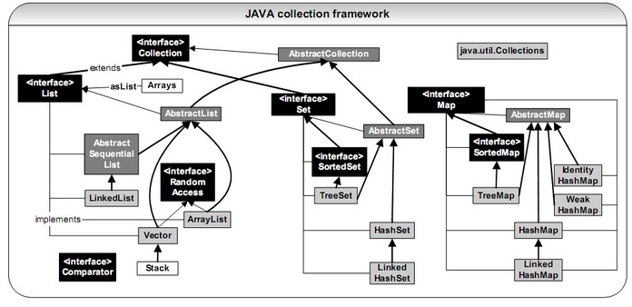

<!-- GFM-TOC -->
* [一、概览](#一概览)
  * [Collection](#Collection)
    * [1. Set](#1-Set)
    * [2. List](#2-List)
    * [3. Queue](#3-Queue)
  * [Map](#Map)
* [二、容器中的设计模式](#二容器中的设计模式)
  * [迭代器模式](#迭代器模式)
  * [适配器模式](#适配器模式)
* [三、源码分析](#三源码分析)
  * [ArrayList](#ArrayList)
    * [1. 概览](#1-概览)
    * [2. 初始化](#2-初始化)
    * [3. 扩容](#3-扩容)
    * [4. 删除元素](#4-删除元素)
    * [5. Fail-Fast](#5-Fail-Fast)
    * [6. 序列化](#6-序列化)
  * [Vector](#Vector)
    * [1. 同步](#1-同步)
    * [2. 扩容](#2-扩容)
    * [3. 与 ArrayList 的比较](#3-与-ArrayList-的比较)
    * [4. 替代方案](#4-替代方案)
  * [CopyOnWriteArrayList](#CopyOnWriteArrayList)
    * [读写分离](#读写分离)
    * [适用场景](#适用场景)
  * [LinkedList](#LinkedList)
    * [1. 概览](#1-概览-1)
    * [2. 与 ArrayList 的比较](#2-与-ArrayList-的比较)
  * [HashMap](#HashMap)
    * [1. 存储结构](#1-存储结构)
    * [2. 拉链法的工作原理](#2-拉链法的工作原理)
    * [3. put 操作](#3-put-操作)
    * [4. 确定桶下标](#4-确定桶下标)
    * [5. 扩容-基本原理](#5-扩容-基本原理)
    * [6. 扩容-重新计算桶下标](#6-扩容-重新计算桶下标)
    * [7. 计算数组容量](#7-计算数组容量)
    * [8. HashMap 多线程操作导致死循环问题](#8-HashMap-多线程操作导致死循环问题)
    * [9. 与 HashTable 的比较](#9-与-HashTable-的比较)
    * [10. 与HashSet 的比较](#10-与HashSet-的比较)
  * [ConcurrentHashMap](#ConcurrentHashMap)
    * [1. 存储结构](#1-存储结构-1)
    * [2. put 操作](#2-put-操作)
    * [3. size 操作](#3-size-操作)
    * [4. 和 Hashtable 的对比](#4-和-Hashtable-的对比)
  * [LinkedHashMap](#LinkedHashMap)
    * [存储结构](#存储结构)
    * [afterNodeAccess()](#afterNodeAccess)
    * [afterNodeInsertion()](#afterNodeInsertion)
    * [LRU 缓存](#LRU-缓存)
  * [WeakHashMap](#WeakHashMap)
    * [存储结构](#存储结构-1)
    * [ConcurrentCache](#ConcurrentCache)
* [参考资料](#参考资料)
<!-- GFM-TOC -->


# 一、概览

容器主要包括 Collection 和 Map 两种，Collection 存储着对象的集合，而 Map 存储着键值对(两个对象)的映射表。



## Collection

<div align="center">  </div><br>

### 1. Set

- TreeSet：基于红黑树实现，支持有序性操作，例如根据一个范围查找元素的操作。但是查找效率不如 HashSet，HashSet 查找的时间复杂度为 O(1)，TreeSet 则为 O(logN)。

- HashSet：基于哈希表实现，支持快速查找，但不支持有序性操作。并且失去了元素的插入顺序信息，也就是说使用 Iterator 遍历 HashSet 得到的结果是不确定的。

- LinkedHashSet：具有 HashSet 的查找效率，且内部使用双向链表维护元素的插入顺序。

### 2. List

- ArrayList：基于动态数组实现，支持随机访问。

- Vector：和 ArrayList 类似，但它是线程安全的。

- LinkedList：基于双向链表实现，只能顺序访问，但是可以快速地在链表中间插入和删除元素。不仅如此，LinkedList 还可以用作栈、队列和双向队列。

### 3. Queue

- LinkedList：可以用它来实现双向队列。

- PriorityQueue：基于堆结构实现，可以用它来实现优先队列。

## Map

<div align="center">  </div><br>

- TreeMap：基于红黑树实现。

- HashMap：基于哈希表实现。

- HashTable：和 HashMap 类似，但它是线程安全的，这意味着同一时刻多个线程可以同时写入 HashTable 并且不会导致数据不一致。它是遗留类，不应该去使用它。现在可以使用 ConcurrentHashMap 来支持线程安全，并且 ConcurrentHashMap 的效率会更高，因为 ConcurrentHashMap 引入了分段锁。

- LinkedHashMap：使用双向链表来维护元素的顺序，顺序为插入顺序或者最近最少使用(LRU)顺序。


# 二、容器中的设计模式

## 迭代器模式

<div align="center">  </div><br>

Collection 继承了 Iterable 接口，其中的 iterator() 方法能够产生一个 Iterator 对象，通过这个对象就可以迭代遍历 Collection 中的元素。

从 JDK 1.5 之后可以使用 foreach 方法来遍历实现了 Iterable 接口的聚合对象。

```java
List<String> list = new ArrayList<>();
list.add("a");
list.add("b");
for (String item : list) {
    System.out.println(item);
}
```

## 适配器模式

java.util.Arrays.asList() 可以把数组类型转换为 List 类型。

```java
@SafeVarargs
public static <T> List<T> asList(T... a)
```

应该注意的是 asList() 的参数为泛型的变长参数，不能使用基本类型数组作为参数，只能使用相应的包装类型数组。

```java
Integer[] arr = {1, 2, 3};
List list = Arrays.asList(arr);
```

也可以使用以下方式调用 asList()：

```java
List list = Arrays.asList(1, 2, 3);
```

# 三、源码分析

如果没有特别说明，以下源码分析基于 JDK 1.8。

## ArrayList

### 1. 概览

因为 ArrayList 是基于数组实现的，所以支持快速随机访问。RandomAccess 接口标识着该类支持快速随机访问。

```java
public class ArrayList<E> extends AbstractList<E>
        implements List<E>, RandomAccess, Cloneable, java.io.Serializable
```

数组的默认大小为 10。

```java
private static final int DEFAULT_CAPACITY = 10;
```

<div align="center">  </div><br>

### 2. 初始化

以无参数构造方法创建 ArrayList 时，实际上初始化赋值的是一个空数组。当真正对数组进行添加元素操作时，才真正分配容量。即向数组中添加第一个元素时，数组容量扩为10。

```java
    private static final int DEFAULT_CAPACITY = 10;
    private static final Object[] DEFAULTCAPACITY_EMPTY_ELEMENTDATA = {};

    public ArrayList(int initialCapacity) {
        if (initialCapacity > 0) {
            this.elementData = new Object[initialCapacity];
        } else if (initialCapacity == 0) {
            this.elementData = EMPTY_ELEMENTDATA;
        } else {
            throw new IllegalArgumentException("Illegal Capacity: "+
                                               initialCapacity);
        }
    }

    public ArrayList() {
        this.elementData = DEFAULTCAPACITY_EMPTY_ELEMENTDATA;
    }

    public ArrayList(Collection<? extends E> c) {
        elementData = c.toArray();
        if ((size = elementData.length) != 0) {
            // c.toArray might (incorrectly) not return Object[] (see 6260652)
            if (elementData.getClass() != Object[].class)
                elementData = Arrays.copyOf(elementData, size, Object[].class);
        } else {
            // replace with empty array.
            this.elementData = EMPTY_ELEMENTDATA;
        }
    }
```
### 3. 扩容

添加元素时使用 ensureCapacityInternal() 方法来保证容量足够，如果不够时，需要使用 grow() 方法进行扩容，新容量的大小为 `oldCapacity + (oldCapacity >> 1)`，也就是旧容量的 1.5 倍。

扩容操作需要调用 `Arrays.copyOf()` 把原数组整个复制到新数组中，这个操作代价很高，因此最好在创建 ArrayList 对象时就指定大概的容量大小，减少扩容操作的次数。

```java
    public boolean add(E e) {
        ensureCapacityInternal(size + 1);  // Increments modCount!!
        elementData[size++] = e;
        return true;
    }
    //得到最小扩容量
    private void ensureCapacityInternal(int minCapacity) {
        if (elementData == DEFAULTCAPACITY_EMPTY_ELEMENTDATA) {
            // 获取默认初始容量大小和传入参数的较大值
            minCapacity = Math.max(DEFAULT_CAPACITY, minCapacity);
        }
        ensureExplicitCapacity(minCapacity);
    }
    //判断是否需要扩容
    private void ensureExplicitCapacity(int minCapacity) {
        modCount++;
        // overflow-conscious code
        if (minCapacity - elementData.length > 0)
            grow(minCapacity);
    }

    private static final int MAX_ARRAY_SIZE = Integer.MAX_VALUE - 8;

    //ArrayList扩容的核心方法
    private void grow(int minCapacity) {
        // overflow-conscious code
        int oldCapacity = elementData.length;
        int newCapacity = oldCapacity + (oldCapacity >> 1);
        if (newCapacity - minCapacity < 0)
            newCapacity = minCapacity;
        if (newCapacity - MAX_ARRAY_SIZE > 0)
            newCapacity = hugeCapacity(minCapacity);
        // minCapacity is usually close to size, so this is a win:
        elementData = Arrays.copyOf(elementData, newCapacity);
    }
    private static int hugeCapacity(int minCapacity) {
        if (minCapacity < 0) // overflow
            throw new OutOfMemoryError();
        //对minCapacity和MAX_ARRAY_SIZE进行比较
        //若minCapacity大，将Integer.MAX_VALUE作为新数组的大小
        //若MAX_ARRAY_SIZE大，将MAX_ARRAY_SIZE作为新数组的大小
        //MAX_ARRAY_SIZE = Integer.MAX_VALUE - 8;
        return (minCapacity > MAX_ARRAY_SIZE) ?
            Integer.MAX_VALUE :
            MAX_ARRAY_SIZE;
    }
```

最好在 add 大量元素之前用 ensureCapacity 方法，以减少增量重新分配的次数

如果新容量大于 MAX_ARRAY_SIZE,进入(执行) hugeCapacity() 方法来比较 minCapacity 和 MAX_ARRAY_SIZE，如果minCapacity大于最大容量，则新容量则为Integer.MAX_VALUE，否则，新容量大小则为 MAX_ARRAY_SIZE 即为 Integer.MAX_VALUE - 8。

**System.arraycopy()和Arrays.copyOf()方法**

这两个实现数组复制的方法被广泛使用而且很多地方都特别巧妙

联系： 从两者源代码可以发现copyOf()内部调用了System.arraycopy()方法 

区别：
1. arraycopy()需要目标数组，将原数组拷贝到你自己定义的数组里，而且可以选择拷贝的起点和长度以及放入新数组中的位置
2. copyOf()是系统自动在内部新建一个数组，并返回该数组。

### 4. 删除元素

需要调用 System.arraycopy() 将 index+1 后面的元素都复制到 index 位置上，该操作的时间复杂度为 O(N)，可以看出 ArrayList 删除元素的代价是非常高的。

```java
public E remove(int index) {
    rangeCheck(index);
    modCount++;
    E oldValue = elementData(index);
    int numMoved = size - index - 1;
    if (numMoved > 0)
        System.arraycopy(elementData, index+1, elementData, index, numMoved);
    elementData[--size] = null; // clear to let GC do its work
    return oldValue;
}
```

### 5. Fail-Fast

modCount 用来记录 ArrayList 结构发生变化的次数。结构发生变化是指添加或者删除至少一个元素的所有操作，或者是调整内部数组的大小，仅仅只是设置元素的值不算结构发生变化。

在进行序列化或者迭代等操作时，需要比较操作前后 modCount 是否改变，如果改变了需要抛出 ConcurrentModificationException。

```java
private void writeObject(java.io.ObjectOutputStream s)
    throws java.io.IOException{
    // Write out element count, and any hidden stuff
    int expectedModCount = modCount;
    s.defaultWriteObject();

    // Write out size as capacity for behavioural compatibility with clone()
    s.writeInt(size);

    // Write out all elements in the proper order.
    for (int i=0; i<size; i++) {
        s.writeObject(elementData[i]);
    }

    if (modCount != expectedModCount) {
        throw new ConcurrentModificationException();
    }
}
```

### 6. 序列化

ArrayList 基于数组实现，并且具有动态扩容特性，因此保存元素的数组不一定都会被使用，那么就没必要全部进行序列化。

保存元素的数组 elementData 使用 transient 修饰，该关键字声明数组默认不会被序列化。

```java
transient Object[] elementData; // non-private to simplify nested class access
```

ArrayList 实现了 writeObject() 和 readObject() 来控制只序列化数组中有元素填充那部分内容。

```java
private void readObject(java.io.ObjectInputStream s)
    throws java.io.IOException, ClassNotFoundException {
    elementData = EMPTY_ELEMENTDATA;

    // Read in size, and any hidden stuff
    s.defaultReadObject();

    // Read in capacity
    s.readInt(); // ignored

    if (size > 0) {
        // be like clone(), allocate array based upon size not capacity
        ensureCapacityInternal(size);

        Object[] a = elementData;
        // Read in all elements in the proper order.
        for (int i=0; i<size; i++) {
            a[i] = s.readObject();
        }
    }
}
```

```java
private void writeObject(java.io.ObjectOutputStream s)
    throws java.io.IOException{
    // Write out element count, and any hidden stuff
    int expectedModCount = modCount;
    s.defaultWriteObject();

    // Write out size as capacity for behavioural compatibility with clone()
    s.writeInt(size);

    // Write out all elements in the proper order.
    for (int i=0; i<size; i++) {
        s.writeObject(elementData[i]);
    }

    if (modCount != expectedModCount) {
        throw new ConcurrentModificationException();
    }
}
```

序列化时需要使用 ObjectOutputStream 的 writeObject() 将对象转换为字节流并输出。而 writeObject() 方法在传入的对象存在 writeObject() 的时候会去反射调用该对象的 writeObject() 来实现序列化。反序列化使用的是 ObjectInputStream 的 readObject() 方法，原理类似。

```java
ArrayList list = new ArrayList();
ObjectOutputStream oos = new ObjectOutputStream(new FileOutputStream(file));
oos.writeObject(list);
```

## Vector

### 1. 同步

它的实现与 ArrayList 类似，但是使用了 synchronized 进行方法同步。

```java
public synchronized boolean add(E e) {
    modCount++;
    ensureCapacityHelper(elementCount + 1);
    elementData[elementCount++] = e;
    return true;
}

public synchronized E get(int index) {
    if (index >= elementCount)
        throw new ArrayIndexOutOfBoundsException(index);

    return elementData(index);
}
```

### 2. 扩容

Vector 的构造函数可以传入 capacityIncrement 参数，它的作用是在扩容时使容量 capacity 增长 capacityIncrement。如果这个参数的值小于等于 0，扩容时每次都令 capacity 为原来的两倍。

```java
public Vector(int initialCapacity, int capacityIncrement) {
    super();
    if (initialCapacity < 0)
        throw new IllegalArgumentException("Illegal Capacity: "+
                                           initialCapacity);
    this.elementData = new Object[initialCapacity];
    this.capacityIncrement = capacityIncrement;
}
```

```java
private void grow(int minCapacity) {
    // overflow-conscious code
    int oldCapacity = elementData.length;
    int newCapacity = oldCapacity + ((capacityIncrement > 0) ?
                                     capacityIncrement : oldCapacity);
    if (newCapacity - minCapacity < 0)
        newCapacity = minCapacity;
    if (newCapacity - MAX_ARRAY_SIZE > 0)
        newCapacity = hugeCapacity(minCapacity);
    elementData = Arrays.copyOf(elementData, newCapacity);
}
```

调用没有 capacityIncrement 的构造函数时，capacityIncrement 值被设置为 0，也就是说默认情况下 Vector 每次扩容时容量都会翻倍。

```java
public Vector(int initialCapacity) {
    this(initialCapacity, 0);
}

public Vector() {
    this(10);
}
```

### 3. 与 ArrayList 的比较

- Vector 是同步的，因此开销就比 ArrayList 要大，访问速度更慢。最好使用 ArrayList 而不是 Vector，因为同步操作完全可以由程序员自己来控制；
- Vector 每次扩容请求其大小的 2 倍(也可以通过构造函数设置增长的容量)，而 ArrayList 是 1.5 倍。

### 4. 替代方案

可以使用 `Collections.synchronizedList();` 得到一个线程安全的 ArrayList。

```java
List<String> list = new ArrayList<>();
List<String> synList = Collections.synchronizedList(list);
```

也可以使用 concurrent 并发包下的 CopyOnWriteArrayList 类。

```java
List<String> list = new CopyOnWriteArrayList<>();
```

## CopyOnWriteArrayList

### 读写分离

写操作在一个复制的数组上进行，读操作还是在原始数组中进行，读写分离，互不影响。

写操作需要加锁，防止并发写入时导致写入数据丢失。

写操作结束之后需要把原始数组指向新的复制数组。

```java
public boolean add(E e) {
    final ReentrantLock lock = this.lock;
    lock.lock();
    try {
        Object[] elements = getArray();
        int len = elements.length;
        Object[] newElements = Arrays.copyOf(elements, len + 1);
        newElements[len] = e;
        setArray(newElements);
        return true;
    } finally {
        lock.unlock();
    }
}

final void setArray(Object[] a) {
    array = a;
}
```

```java
@SuppressWarnings("unchecked")
private E get(Object[] a, int index) {
    return (E) a[index];
}
```

### 适用场景

CopyOnWriteArrayList 在写操作的同时允许读操作，大大提高了读操作的性能，因此很适合读多写少的应用场景。

但是 CopyOnWriteArrayList 有其缺陷：

- 内存占用：在写操作时需要复制一个新的数组，使得内存占用为原来的两倍左右；
- 数据不一致：读操作不能读取实时性的数据，因为部分写操作的数据还未同步到读数组中。

所以 CopyOnWriteArrayList 不适合内存敏感以及对实时性要求很高的场景。

## LinkedList

LinkedList是一个实现了List接口和Deque接口的**双端链表**。 LinkedList底层的链表结构使它**支持高效的插入和删除操作**，另外它实现了Deque接口，使得LinkedList类也具有队列的特性; LinkedList不是线程安全的，如果想使LinkedList变成线程安全的，可以调用静态类Collections类中的synchronizedList方法：
```java
    List list=Collections.synchronizedList(new LinkedList(...));
```

### 1. 概览

基于双向链表实现，使用 Node 存储链表节点信息。

```java
private static class Node<E> {
    E item;
    Node<E> next;
    Node<E> prev;
}
```

每个链表存储了 first 和 last 指针：

```java
transient Node<E> first;
transient Node<E> last;
```

<div align="center">  </div><br>

### 2. 与 ArrayList 的比较

- 线程安全：ArrayList 和 LinkedList 都是不同步的，也就是不保证线程安全
- 底层数据结构：Arraylist 底层使用的是动态数组(Object 数组)；LinkedList 底层使用的是双向链表数据结构(JDK1.6之前为循环链表，JDK1.7取消了循环)
- 随机访问：LinkedList 不支持高效的随机元素访问，而 ArrayList 支持
- 内存空间占用： ArrayList的空 间浪费主要体现在在list列表的结尾会预留一定的容量空间，而LinkedList的空间花费则体现在它的每一个元素都需要消耗比ArrayList更多的空间(因为要存放直接后继和直接前驱以及数据)。
- 插入和删除是否受元素位置的影响：
  - ArrayList 采用数组存储，所以插入和删除元素的时间复杂度受元素位置的影响。执行add(E e)方法的时候， ArrayList 会默认在将指定的元素追加到此列表的末尾，这种情况时间复杂度就是O(1)；但是如果要在指定位置 i 插入和删除元素的话(add(int index, E element))时间复杂度就为 O(n-i)。因为在进行上述操作的时候集合中第 i 和第 i 个元素之后的(n-i)个元素都要执行向后位/向前移一位的操作。
  - LinkedList 采用链表存储，所以对于add(E e)方法的插入，删除元素时间复杂度不受元素位置的影响，近似 O(1)，如果是要在指定位置i插入和删除元素的话(add(int index, E element) 时间复杂度近似为o(n))因为需要先移动到指定位置再插入

## HashMap

### 1. 存储结构


#### JDK1.8之前

JDK1.8 之前 HashMap 底层是 数组和链表 结合在一起使用也就是 链表散列。HashMap 通过 key 的 hashCode 经过扰动函数处理过后得到 hash 值，然后通过 (n - 1) & hash 判断当前元素存放的位置(这里的 n 指的是数组的长度)，如果当前位置存在元素的话，就判断该元素与要存入的元素的 hash 值以及 key 是否相同，如果相同的话，直接覆盖，不相同就通过拉链法解决冲突。

<div align="center"> 


</div>

#### JDK1.8之后

jdk1.8在解决哈希冲突时有了较大的变化，当链表长度大于阈值(默认为8)时，将链表转化为红黑树，以减少搜索时间。

<div align="center"> 


</div>


### 2. 拉链法的工作原理

```java
HashMap<String, String> map = new HashMap<>();
map.put("K1", "V1");
map.put("K2", "V2");
map.put("K3", "V3");
```

- 新建一个 HashMap，默认大小为 16；
- 插入 <K1,V1> 键值对，先计算 K1 的 hashCode 为 115，使用除留余数法得到所在的桶下标 115%16=3。
- 插入 <K2,V2> 键值对，先计算 K2 的 hashCode 为 118，使用除留余数法得到所在的桶下标 118%16=6。
- 插入 <K3,V3> 键值对，先计算 K3 的 hashCode 为 118，使用除留余数法得到所在的桶下标 118%16=6，插在 <K2,V2> 前面。

应该注意到链表的插入是以头插法方式进行的，例如上面的 <K3,V3> 不是插在 <K2,V2> 后面，而是插入在链表头部。

查找需要分成两步进行：

- 计算键值对所在的桶；
- 在链表上顺序查找，时间复杂度显然和链表的长度成正比。

<div align="center">  </div><br>

### 3. put 操作

#### JDK1.8之前

```java
public V put(K key, V value) {
    if (table == EMPTY_TABLE) {
        inflateTable(threshold);
    }
    // 键为 null 单独处理
    if (key == null)
        return putForNullKey(value);
    int hash = hash(key);
    // 确定桶下标
    int i = indexFor(hash, table.length);
    // 先找出是否已经存在键为 key 的键值对，如果存在的话就更新这个键值对的值为 value
    for (Entry<K,V> e = table[i]; e != null; e = e.next) {
        Object k;
        if (e.hash == hash && ((k = e.key) == key || key.equals(k))) {
            V oldValue = e.value;
            e.value = value;
            e.recordAccess(this);
            return oldValue;
        }
    }

    modCount++;
    // 插入新键值对
    addEntry(hash, key, value, i);
    return null;
}
```

HashMap 允许插入键为 null 的键值对。但是因为无法调用 null 的 hashCode() 方法，也就无法确定该键值对的桶下标，只能通过强制指定一个桶下标来存放。HashMap 使用第 0 个桶存放键为 null 的键值对。

```java
private V putForNullKey(V value) {
    for (Entry<K,V> e = table[0]; e != null; e = e.next) {
        if (e.key == null) {
            V oldValue = e.value;
            e.value = value;
            e.recordAccess(this);
            return oldValue;
        }
    }
    modCount++;
    addEntry(0, null, value, 0);
    return null;
}
```

使用链表的头插法，也就是新的键值对插在链表的头部，而不是链表的尾部。

```java
void addEntry(int hash, K key, V value, int bucketIndex) {
    if ((size >= threshold) && (null != table[bucketIndex])) {
        resize(2 * table.length);
        hash = (null != key) ? hash(key) : 0;
        bucketIndex = indexFor(hash, table.length);
    }

    createEntry(hash, key, value, bucketIndex);
}

void createEntry(int hash, K key, V value, int bucketIndex) {
    Entry<K,V> e = table[bucketIndex];
    // 头插法，链表头部指向新的键值对
    table[bucketIndex] = new Entry<>(hash, key, value, e);
    size++;
}
```

```java
Entry(int h, K k, V v, Entry<K,V> n) {
    value = v;
    next = n;
    key = k;
    hash = h;
}
```

#### JDK1.8之后

HashMap只提供了put用于添加元素，putVal方法只是给put方法调用的一个方法，并没有提供给用户使用。

对putVal方法添加元素的分析如下：
1. 如果定位到的数组位置没有元素 就直接插入。
2. 如果定位到的数组位置有元素就和要插入的key比较，如果key相同就直接覆盖，如果key不相同，就判断p是否是一个树节点，如果是就调用e = ((TreeNode<K,V>)p).putTreeVal(this, tab, hash, key, value)将元素添加进入。如果不是就遍历链表插入(插入的是链表尾部)。

<div align="center"> 


</div>


```java
    public V put(K key, V value) {
        return putVal(hash(key), key, value, false, true);
    }

    final V putVal(int hash, K key, V value, boolean onlyIfAbsent,
                   boolean evict) {
        Node<K,V>[] tab; Node<K,V> p; int n, i;
        if ((tab = table) == null || (n = tab.length) == 0)
            n = (tab = resize()).length;
        if ((p = tab[i = (n - 1) & hash]) == null)
            tab[i] = newNode(hash, key, value, null);
        else {
            Node<K,V> e; K k;
            if (p.hash == hash &&
                ((k = p.key) == key || (key != null && key.equals(k))))
                e = p;
            else if (p instanceof TreeNode)
                e = ((TreeNode<K,V>)p).putTreeVal(this, tab, hash, key, value);
            else {
                for (int binCount = 0; ; ++binCount) {
                    if ((e = p.next) == null) {
                        p.next = newNode(hash, key, value, null);
                        if (binCount >= TREEIFY_THRESHOLD - 1) // -1 for 1st
                            treeifyBin(tab, hash);
                        break;
                    }
                    if (e.hash == hash &&
                        ((k = e.key) == key || (key != null && key.equals(k))))
                        break;
                    p = e;
                }
            }
            if (e != null) { // existing mapping for key
                V oldValue = e.value;
                if (!onlyIfAbsent || oldValue == null)
                    e.value = value;
                afterNodeAccess(e);
                return oldValue;
            }
        }
        ++modCount;
        if (++size > threshold)
            resize();
        afterNodeInsertion(evict);
        return null;
    }
```
### 4. 确定桶下标


很多操作都需要先确定一个键值对所在的桶下标。

```java
int hash = hash(key);
int i = indexFor(hash, table.length);
```

**4.1 计算 hash 值** 

#### JDK1.8之前

所谓扰动函数指的就是 HashMap 的 hash 方法。使用 hash 方法也就是扰动函数是为了防止一些实现比较差的 hashCode() 方法 换句话说使用扰动函数之后可以减少碰撞。

相比于 JDK1.8 的 hash 方法 ，JDK 1.7 的 hash 方法的性能会稍差一点点，因为毕竟扰动了 4 次

```java
final int hash(Object k) {
    int h = hashSeed;
    if (0 != h && k instanceof String) {
        return sun.misc.Hashing.stringHash32((String) k);
    }
    h ^= k.hashCode();
    // This function ensures that hashCodes that differ only by
    // constant multiples at each bit position have a bounded
    // number of collisions (approximately 8 at default load factor).
    h ^= (h >>> 20) ^ (h >>> 12);
    return h ^ (h >>> 7) ^ (h >>> 4);
}
```
```java
public final int hashCode() {
    return Objects.hashCode(key) ^ Objects.hashCode(value);
}
```

#### JDK1.8之后

```java
    static final int hash(Object key) {
        int h;
        return (key == null) ? 0 : (h = key.hashCode()) ^ (h >>> 16);
    }
```

**4.2 取模** 

令 x = 1<<4，即 x 为 2 的 4 次方，它具有以下性质：

```
x   : 00010000
x-1 : 00001111
```

令一个数 y 与 x-1 做与运算，可以去除 y 位级表示的第 4 位以上数：

```
y       : 10110010
x-1     : 00001111
y&(x-1) : 00000010
```

这个性质和 y 对 x 取模效果是一样的：

```
y   : 10110010
x   : 00010000
y%x : 00000010
```

我们知道，位运算的代价比求模运算小的多，因此在进行这种计算时用位运算的话能带来更高的性能。

确定桶下标的最后一步是将 key 的 hash 值对桶个数取模：hash%capacity，如果能保证 capacity 为 2 的 n 次方，那么就可以将这个操作转换为位运算。

```java
static int indexFor(int h, int length) {
    return h & (length-1);
}
```

### 5. 扩容-基本原理

设 HashMap 的 table 长度为 M，需要存储的键值对数量为 N，如果哈希函数满足均匀性的要求，那么每条链表的长度大约为 N/M，因此平均查找次数的复杂度为 O(N/M)。

为了让查找的成本降低，应该尽可能使得 N/M 尽可能小，因此需要保证 M 尽可能大，也就是说 table 要尽可能大。HashMap 采用动态扩容来根据当前的 N 值来调整 M 值，使得空间效率和时间效率都能得到保证。

和扩容相关的参数主要有：capacity、size、threshold 和 load_factor。

|       参数       | 含义                                                                          |
| :--------------: | :---------------------------------------------------------------------------- |
|     capacity     | table 的容量大小，默认为 16。需要注意的是 capacity 必须保证为 2 的 n 次方。   |
|       size       | 键值对数量。                                                                  |
|    threshold     | size 的临界值，当 size 大于等于 threshold 就必须进行扩容操作。                |
|    loadFactor    | 装载因子，table 能够使用的比例，threshold = (int)(newCapacity * loadFactor)。 |
| MAXIMUM_CAPACITY | 最大容量2^30, 最终容量Integer.MAX_VALUE                                       |

```java
    static final int DEFAULT_INITIAL_CAPACITY = 16;

    static final int MAXIMUM_CAPACITY = 1 << 30;

    static final float DEFAULT_LOAD_FACTOR = 0.75f;

    transient Entry[] table;

    transient int size;

    int threshold;

    final float loadFactor;

    transient int modCount;
```

从下面的添加元素代码中可以看出，当需要扩容时，令 capacity 为原来的两倍。

```java
void addEntry(int hash, K key, V value, int bucketIndex) {
    Entry<K,V> e = table[bucketIndex];
    table[bucketIndex] = new Entry<>(hash, key, value, e);
    if (size++ >= threshold)
        resize(2 * table.length);
}
```

扩容使用 resize() 实现，需要注意的是，扩容操作同样需要把 oldTable 的所有键值对重新插入 newTable 中，因此这一步是很费时的。

进行扩容，会伴随着一次重新hash分配，并且会遍历hash表中所有的元素，是非常耗时的。在编写程序中，要尽量避免resize。

```java
void resize(int newCapacity) {
    Entry[] oldTable = table;
    int oldCapacity = oldTable.length;
    if (oldCapacity == MAXIMUM_CAPACITY) {
        threshold = Integer.MAX_VALUE;
        return;
    }
    Entry[] newTable = new Entry[newCapacity];
    transfer(newTable);
    table = newTable;
    threshold = (int)(newCapacity * loadFactor);
}

void transfer(Entry[] newTable) {
    Entry[] src = table;
    int newCapacity = newTable.length;
    for (int j = 0; j < src.length; j++) {
        Entry<K,V> e = src[j];
        if (e != null) {
            src[j] = null;
            do {
                Entry<K,V> next = e.next;
                int i = indexFor(e.hash, newCapacity);
                e.next = newTable[i];
                newTable[i] = e;
                e = next;
            } while (e != null);
        }
    }
}
```

### 6. 扩容-重新计算桶下标

在进行扩容时，需要把键值对重新放到对应的桶上。HashMap 使用了一个特殊的机制，可以降低重新计算桶下标的操作。

假设原数组长度 capacity 为 16，扩容之后 new capacity 为 32：

```html
capacity     : 00010000
new capacity : 00100000
```

对于一个 Key，

- 它的哈希值如果在第 5 位上为 0，那么取模得到的结果和之前一样；
- 如果为 1，那么得到的结果为原来的结果 +16。

### 7. 计算数组容量

HashMap 构造函数允许用户传入的容量不是 2 的 n 次方，因为它可以自动地将传入的容量转换为 2 的 n 次方。

先考虑如何求一个数的掩码，对于 10010000，它的掩码为 11111111，可以使用以下方法得到：

```
mask |= mask >> 1    11011000
mask |= mask >> 2    11111110
mask |= mask >> 4    11111111
```

mask+1 是大于原始数字的最小的 2 的 n 次方。

```
num     10010000
mask+1 100000000
```

以下是 HashMap 中计算数组容量的代码：

```java
static final int tableSizeFor(int cap) {
    int n = cap - 1;
    n |= n >>> 1;
    n |= n >>> 2;
    n |= n >>> 4;
    n |= n >>> 8;
    n |= n >>> 16;
    return (n < 0) ? 1 : (n >= MAXIMUM_CAPACITY) ? MAXIMUM_CAPACITY : n + 1;
}
```
### 8. HashMap 多线程操作导致死循环问题

主要原因在于 并发下的Rehash 会造成元素之间会形成一个循环链表。不过，jdk 1.8 后解决了这个问题，但是还是不建议在多线程下使用 HashMap,因为多线程下使用 HashMap 还是会存在其他问题比如数据丢失。并发环境下推荐使用 ConcurrentHashMap 。

详情请查看：https://coolshell.cn/articles/9606.html

### 9. 与 HashTable 的比较
- 线程是否安全： HashMap 是非线程安全的，HashTable 是线程安全的；HashTable 内部的方法基本都经过synchronized 修饰
- 效率： 因为线程安全的问题，HashMap 要比 HashTable 效率高一点。另外，HashTable 基本被淘汰
- 对Null key 和Null value的支持： HashMap 中，null 可以作为键，这样的键只有一个，可以有一个或多个键所对应的值为 null。但是在 HashTable 中 put 进的键值只要有一个 null，直接抛出 NullPointerException。
- 底层数据结构： JDK1.8 以后的 HashMap 在解决哈希冲突时有了较大的变化，当链表长度大于阈值(默认为8)时，将链表转化为红黑树，以减少搜索时间。Hashtable 没有这样的机制。
- 接口继承：HashMap继承AbstractMap，Hashtable继承Dictionary实现Map
- 初始容量大小和每次扩充容量大小的不同 ：
  - 创建时如果不指定容量初始值，Hashtable 默认的初始大小为11，之后每次扩充，容量变为原来的2n+1。HashMap 默认的初始化大小为16。之后每次扩充，容量变为原来的2倍。
  - 创建时如果给定了容量初始值，那么 Hashtable 会直接使用你给定的大小，而 HashMap 会将其扩充为2的幂次方大小(HashMap 中的tableSizeFor()方法保证)。
- HashMap的迭代器(Iterator)是fail-fast迭代器，而Hashtable的enumerator迭代器不是fail-fast的
- HashMap 不能保证随着时间的推移 Map 中的元素次序是不变的。

### 10. 与HashSet 的比较

`HashSet` 源码的话就应该知道：HashSet 底层就是基于 HashMap 实现的。(HashSet 的源码非常非常少，因为除了 `clone() `、`writeObject()`、`readObject()`是 HashSet 自己不得不实现之外，其他方法都是直接调用 HashMap 中的方法。

|            HashMap             |                                                    HashSet                                                    |
| :----------------------------: | :-----------------------------------------------------------------------------------------------------------: |
|         实现了Map接口          |                                                  实现Set接口                                                  |
|           存储键值对           |                                                  仅存储对象                                                   |
|  调用 `put()`向map中添加元素   |                                        调用 `add()`方法向Set中添加元素                                        |
| HashMap使用键(Key)计算Hashcode | HashSet使用成员对象来计算hashcode值，对于两个对象来说hashcode可能相同，所以equals()方法用来判断对象的相等性， |

**HashSet如何检查重复**

当你把对象加入HashSet时，HashSet会先计算对象的hashcode值来判断对象加入的位置，同时也会与其他加入的对象的hashcode值作比较，如果没有相符的hashcode，HashSet会假设对象没有重复出现。但是如果发现有相同hashcode值的对象，这时会调用equals()方法来检查hashcode相等的对象是否真的相同。如果两者相同，HashSet就不会让加入操作成功。(摘自我的Java启蒙书《Head fist java》第二版)

**hashCode()与equals()的相关规定：**
1. 如果两个对象相等，则hashcode一定也是相同的
2. 两个对象相等,对两个equals方法返回true
3. 两个对象有相同的hashcode值，它们也不一定是相等的
4. 综上，equals方法被覆盖过，则hashCode方法也必须被覆盖
5. hashCode()的默认行为是对堆上的对象产生独特值。如果没有重写hashCode()，则该class的两个对象无论如何都不会相等(即使这两个对象指向相同的数据)。

**==与equals的区别**
1. ==是判断两个变量或实例是不是指向同一个内存空间 equals是判断两个变量或实例所指向的内存空间的值是不是相同
2. ==是指对内存地址进行比较 equals()是对字符串的内容进行比较
3. ==指引用是否相同 equals()指的是值是否相同


## ConcurrentHashMap

### 1. 存储结构

#### JDK1.7

```java
static final class HashEntry<K,V> {
    final int hash;
    final K key;
    volatile V value;
    volatile HashEntry<K,V> next;
}
```

ConcurrentHashMap 和 HashMap 实现上类似，最主要的差别是 ConcurrentHashMap 采用了分段锁(Segment)，每个分段锁维护着几个桶(HashEntry)，多个线程可以同时访问不同分段锁上的桶，从而使其并发度更高(并发度就是 Segment 的个数)。

Segment 继承自 ReentrantLock。所以 Segment 是一种可重入锁，扮演锁的角色。HashEntry 用于存储键值对数据

<div align="center"> 


</div>

```java
static final class Segment<K,V> extends ReentrantLock implements Serializable {

    private static final long serialVersionUID = 2249069246763182397L;

    static final int MAX_SCAN_RETRIES =
        Runtime.getRuntime().availableProcessors() > 1 ? 64 : 1;

    transient volatile HashEntry<K,V>[] table;

    transient int count;

    transient int modCount;

    transient int threshold;

    final float loadFactor;
}
```

```java
final Segment<K,V>[] segments;
```

一个 ConcurrentHashMap 里包含一个 Segment 数组。Segment 的结构和HashMap类似，是一种数组和链表结构，一个 Segment 包含一个 HashEntry 数组，每个 HashEntry 是一个链表结构的元素，每个 Segment 守护着一个HashEntry数组里的元素，当对 HashEntry 数组的数据进行修改时，必须首先获得对应的 Segment的锁。

默认的并发级别为 16，也就是说默认创建 16 个 Segment。

```java
static final int DEFAULT_CONCURRENCY_LEVEL = 16;
```

<div align="center">  </div><br>

#### JDK1.8

ConcurrentHashMap取消了Segment分段锁，采用CAS和synchronized来保证并发安全。数据结构跟HashMap1.8的结构类似，数组+链表/红黑二叉树。Java 8在链表长度超过一定阈值(8)时将链表(寻址时间复杂度为O(N))转换为红黑树(寻址时间复杂度为O(log(N)))

synchronized只锁定当前链表或红黑二叉树的首节点，这样只要hash不冲突，就不会产生并发，效率又提升N倍。

<div align="center"> 


</div>

### 2. put 操作

#### JDK1.7

当执行put方法插入数据时，根据key的hash值，在Segment数组中找到相应的位置，如果相应位置的Segment还未初始化，则通过CAS进行赋值，接着执行Segment对象的put方法通过加锁机制插入数据，实现如下：

#### JDK1.8

当执行put方法插入数据时，根据key的hash值，在Node数组中找到相应的位置，实现如下：

1. 如果相应位置的Node还未初始化，则通过CAS插入相应的数据；
2. 如果相应位置的Node不为空，且当前该节点不处于移动状态，则对该节点加synchronized锁，如果该节点的hash不小于0，则遍历链表更新节点或插入新节点；
3. 如果该节点是TreeBin类型的节点，说明是红黑树结构，则通过putTreeVal方法往红黑树中插入节点；
4. 如果binCount不为0，说明put操作对数据产生了影响，如果当前链表的个数达到8个，则通过treeifyBin方法转化为红黑树，如果oldVal不为空，说明是一次更新操作，没有对元素个数产生影响，则直接返回旧值；
5. 如果插入的是一个新节点，则执行addCount()方法尝试更新元素个数baseCount；

### 3. size 操作
#### JDK1.7
每个 Segment 维护了一个 count 变量来统计该 Segment 中的键值对个数。

```java
/**
 * The number of elements. Accessed only either within locks
 * or among other volatile reads that maintain visibility.
 */
transient int count;
```

在执行 size 操作时，需要遍历所有 Segment 然后把 count 累计起来。

ConcurrentHashMap 在执行 size 操作时先尝试不加锁，如果连续两次不加锁操作得到的结果一致，那么可以认为这个结果是正确的。

尝试次数使用 RETRIES_BEFORE_LOCK 定义，该值为 2，retries 初始值为 -1，因此尝试次数为 3。

如果尝试的次数超过 3 次，就需要对每个 Segment 加锁。

```java

    static final int RETRIES_BEFORE_LOCK = 2;

    public int size() {
        // Try a few times to get accurate count. On failure due to
        // continuous async changes in table, resort to locking.
        final Segment<K,V>[] segments = this.segments;
        int size;
        boolean overflow; // true if size overflows 32 bits
        long sum;         // sum of modCounts
        long last = 0L;   // previous sum
        int retries = -1; // first iteration isn't retry
        try {
            for (;;) {
                // 超过尝试次数，则对每个 Segment 加锁
                if (retries++ == RETRIES_BEFORE_LOCK) {
                    for (int j = 0; j < segments.length; ++j)
                        ensureSegment(j).lock(); // force creation
                }
                sum = 0L;
                size = 0;
                overflow = false;
                for (int j = 0; j < segments.length; ++j) {
                    Segment<K,V> seg = segmentAt(segments, j);
                    if (seg != null) {
                        sum += seg.modCount;
                        int c = seg.count;
                        if (c < 0 || (size += c) < 0)
                            overflow = true;
                    }
                }
                // 连续两次得到的结果一致，则认为这个结果是正确的
                if (sum == last)
                    break;
                last = sum;
            }
        } finally {
            if (retries > RETRIES_BEFORE_LOCK) {
                for (int j = 0; j < segments.length; ++j)
                    segmentAt(segments, j).unlock();
            }
        }
        return overflow ? Integer.MAX_VALUE : size;
    }
```

#### JDK1.8

- 使用一个volatile类型的变量baseCount记录元素的个数，当插入新数据或则删除数据时，会通过addCount()方法更新baseCount
  1. 初始化时counterCells为空，在并发量很高时，如果存在两个线程同时执行CAS修改baseCount值，则失败的线程会继续执行方法体中的逻辑，使用CounterCell记录元素个数的变化；
  2. 如果CounterCell数组counterCells为空，调用fullAddCount()方法进行初始化，并插入对应的记录数，通过CAS设置cellsBusy字段，只有设置成功的线程才能初始化CounterCell数组
  3. 如果通过CAS设置cellsBusy字段失败的话，则继续尝试通过CAS修改baseCount字段，如果修改baseCount字段成功的话，就退出循环，否则继续循环插入CounterCell对象
- size实现比1.7简单多，因为元素个数保存baseCount中，部分元素的变化个数保存在CounterCell数组中，通过累加baseCount和CounterCell数组中的数量，即可得到元素的总个数 

### 4. 和 Hashtable 的对比

- 底层数据结构： JDK1.7的 ConcurrentHashMap 底层采用 分段的数组+链表 实现，JDK1.8 采用的数据结构跟HashMap1.8的结构一样，数组+链表/红黑二叉树。Hashtable 和 JDK1.8 之前的 HashMap 的底层数据结构类似都是采用 数组+链表 的形式，数组是 HashMap 的主体，链表则是主要为了解决哈希冲突而存在的；
- 实现线程安全的方式(重要)：
  - 在JDK1.7的时候，ConcurrentHashMap(分段锁) 对整个桶数组进行了分割分段(Segment)，每一把锁只锁容器其中一部分数据，多线程访问容器里不同数据段的数据，就不会存在锁竞争，提高并发访问率。 到了 JDK1.8 的时候已经摒弃了Segment的概念，而是直接用 Node 数组+链表+红黑树的数据结构来实现，并发控制使用 synchronized 和 CAS 来操作。(JDK1.6以后 对 synchronized锁做了很多优化) 整个看起来就像是优化过且线程安全的 HashMap，虽然在JDK1.8中还能看到 Segment 的数据结构，但是已经简化了属性，只是为了兼容旧版本；
  - Hashtable(同一把锁) :使用 synchronized 来保证线程安全，效率非常低下。当一个线程访问同步方法时，其他线程也访问同步方法，可能会进入阻塞或轮询状态，如使用 put 添加元素，另一个线程不能使用 put 添加元素，也不能使用 get，竞争会越来越激烈效率越低。


## LinkedHashMap

### 存储结构

继承自 HashMap，因此具有和 HashMap 一样的快速查找特性。

```java
public class LinkedHashMap<K,V> extends HashMap<K,V> implements Map<K,V>
```

内部维护了一个双向链表，用来维护插入顺序或者 LRU 顺序。

```java
/**
 * The head (eldest) of the doubly linked list.
 */
transient LinkedHashMap.Entry<K,V> head;

/**
 * The tail (youngest) of the doubly linked list.
 */
transient LinkedHashMap.Entry<K,V> tail;
```

accessOrder 决定了顺序，默认为 false，此时维护的是插入顺序。

```java
final boolean accessOrder;
```

LinkedHashMap 最重要的是以下用于维护顺序的函数，它们会在 put、get 等方法中调用。

```java
void afterNodeAccess(Node<K,V> p) { }
void afterNodeInsertion(boolean evict) { }
```

### afterNodeAccess()

当一个节点被访问时，如果 accessOrder 为 true，则会将该节点移到链表尾部。也就是说指定为 LRU 顺序之后，在每次访问一个节点时，会将这个节点移到链表尾部，保证链表尾部是最近访问的节点，那么链表首部就是最近最久未使用的节点。

```java
void afterNodeAccess(Node<K,V> e) { // move node to last
    LinkedHashMap.Entry<K,V> last;
    if (accessOrder && (last = tail) != e) {
        LinkedHashMap.Entry<K,V> p =
            (LinkedHashMap.Entry<K,V>)e, b = p.before, a = p.after;
        p.after = null;
        if (b == null)
            head = a;
        else
            b.after = a;
        if (a != null)
            a.before = b;
        else
            last = b;
        if (last == null)
            head = p;
        else {
            p.before = last;
            last.after = p;
        }
        tail = p;
        ++modCount;
    }
}
```

### afterNodeInsertion()

在 put 等操作之后执行，当 removeEldestEntry() 方法返回 true 时会移除最晚的节点，也就是链表首部节点 first。

evict 只有在构建 Map 的时候才为 false，在这里为 true。

```java
void afterNodeInsertion(boolean evict) { // possibly remove eldest
    LinkedHashMap.Entry<K,V> first;
    if (evict && (first = head) != null && removeEldestEntry(first)) {
        K key = first.key;
        removeNode(hash(key), key, null, false, true);
    }
}
```

removeEldestEntry() 默认为 false，如果需要让它为 true，需要继承 LinkedHashMap 并且覆盖这个方法的实现，这在实现 LRU 的缓存中特别有用，通过移除最近最久未使用的节点，从而保证缓存空间足够，并且缓存的数据都是热点数据。

```java
protected boolean removeEldestEntry(Map.Entry<K,V> eldest) {
    return false;
}
```

### LRU 缓存

以下是使用 LinkedHashMap 实现的一个 LRU 缓存：

- 设定最大缓存空间 MAX_ENTRIES  为 3；
- 使用 LinkedHashMap 的构造函数将 accessOrder 设置为 true，开启 LRU 顺序；
- 覆盖 removeEldestEntry() 方法实现，在节点多于 MAX_ENTRIES 就会将最近最久未使用的数据移除。

```java
class LRUCache<K, V> extends LinkedHashMap<K, V> {
    private static final int MAX_ENTRIES = 3;

    protected boolean removeEldestEntry(Map.Entry eldest) {
        return size() > MAX_ENTRIES;
    }

    LRUCache() {
        super(MAX_ENTRIES, 0.75f, true);
    }
}
```

```java
public static void main(String[] args) {
    LRUCache<Integer, String> cache = new LRUCache<>();
    cache.put(1, "a");
    cache.put(2, "b");
    cache.put(3, "c");
    cache.get(1);
    cache.put(4, "d");
    System.out.println(cache.keySet());
}
```

```html
[3, 1, 4]
```

## WeakHashMap

### 存储结构

WeakHashMap 的 Entry 继承自 WeakReference，被 WeakReference 关联的对象在下一次垃圾回收时会被回收。

WeakHashMap 主要用来实现缓存，通过使用 WeakHashMap 来引用缓存对象，由 JVM 对这部分缓存进行回收。

```java
private static class Entry<K,V> extends WeakReference<Object> implements Map.Entry<K,V>
```

### ConcurrentCache

Tomcat 中的 ConcurrentCache 使用了 WeakHashMap 来实现缓存功能。

ConcurrentCache 采取的是分代缓存：

- 经常使用的对象放入 eden 中，eden 使用 ConcurrentHashMap 实现，不用担心会被回收(伊甸园)；
- 不常用的对象放入 longterm，longterm 使用 WeakHashMap 实现，这些老对象会被垃圾收集器回收。
- 当调用  get() 方法时，会先从 eden 区获取，如果没有找到的话再到 longterm 获取，当从 longterm 获取到就把对象放入 eden 中，从而保证经常被访问的节点不容易被回收。
- 当调用 put() 方法时，如果 eden 的大小超过了 size，那么就将 eden 中的所有对象都放入 longterm 中，利用虚拟机回收掉一部分不经常使用的对象。

```java
public final class ConcurrentCache<K, V> {

    private final int size;

    private final Map<K, V> eden;

    private final Map<K, V> longterm;

    public ConcurrentCache(int size) {
        this.size = size;
        this.eden = new ConcurrentHashMap<>(size);
        this.longterm = new WeakHashMap<>(size);
    }

    public V get(K k) {
        V v = this.eden.get(k);
        if (v == null) {
            v = this.longterm.get(k);
            if (v != null)
                this.eden.put(k, v);
        }
        return v;
    }

    public void put(K k, V v) {
        if (this.eden.size() >= size) {
            this.longterm.putAll(this.eden);
            this.eden.clear();
        }
        this.eden.put(k, v);
    }
}
```


# 参考资料

- Eckel B. Java 编程思想 [M]. 机械工业出版社, 2002.
- [Java Collection Framework](https://www.w3resource.com/java-tutorial/java-collections.php)
- [Iterator 模式](https://openhome.cc/Gossip/DesignPattern/IteratorPattern.htm)
- [Java 8 系列之重新认识 HashMap](https://tech.meituan.com/java_hashmap.html)
- [What is difference between HashMap and Hashtable in Java?](http://javarevisited.blogspot.hk/2010/10/difference-between-hashmap-and.html)
- [Java 集合之 HashMap](http://www.zhangchangle.com/2018/02/07/Java%E9%9B%86%E5%90%88%E4%B9%8BHashMap/)
- [The principle of ConcurrentHashMap analysis](http://www.programering.com/a/MDO3QDNwATM.html)
- [探索 ConcurrentHashMap 高并发性的实现机制](https://www.ibm.com/developerworks/cn/java/java-lo-concurrenthashmap/)
- [HashMap 相关面试题及其解答](https://www.jianshu.com/p/75adf47958a7)
- [Java 集合细节(二)：asList 的缺陷](http://wiki.jikexueyuan.com/project/java-enhancement/java-thirtysix.html)
- [Java Collection Framework – The LinkedList Class](http://javaconceptoftheday.com/java-collection-framework-linkedlist-class/)
