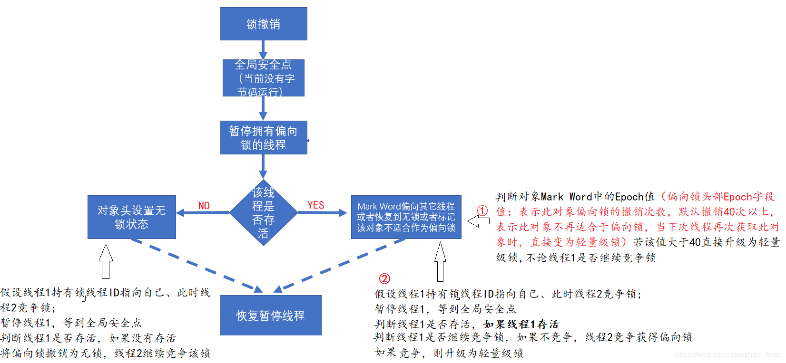

<!-- GFM-TOC --> 
* [一、线程](#一线程)
  * [线程简介](#线程简介)
    * [1. 什么是线程](#1-什么是线程)
    * [2. 上下文切换](#2-上下文切换)
    * [3. 使用多线程原因](#3-使用多线程原因)
    * [4. 守护线程](#4-守护线程)
  * [线程状态](#线程状态)
  * [线程生命周期](#线程生命周期)
  * [线程的使用](#线程的使用)
    * [实现 Runnable 接口](#实现-runnable-接口)
    * [实现 Callable 接口](#实现-callable-接口)
    * [继承 Thread 类](#继承-thread-类)
    * [实现接口 VS 继承 Thread](#实现接口-vs-继承-thread)
  * [线程间通信](#线程间通信)
    * [synchronized](#synchronized)
    * [条件队列(wait/notify)](#条件队列waitnotify)
    * [显式Condition对象(await/signal)](#显式condition对象awaitsignal)
    * [join()](#join)
    * [ThreadLocal](#threadlocal)
* [二、并发机制底层原理](#二并发机制底层原理)
  * [volatile](#volatile)
  * [synchronized](#synchronized-1)
    * [1. Java对象头](#1-java对象头)
    * [2. 锁的升级](#2-锁的升级)
    * [3. 偏向锁](#3-偏向锁)
    * [4. 轻量级锁](#4-轻量级锁)
    * [5. 锁的对比](#5-锁的对比)
    * [6. synchronized 对比 volatile](#6-synchronized-对比-volatile)
  * [原子操作的实现](#原子操作的实现)
    * [处理器实现原子操作](#处理器实现原子操作)
    * [Java实现原子操作](#java实现原子操作)
* [三、线程安全与锁优化](#三线程安全与锁优化)
  * [线程安全](#线程安全)
    * [Java语言中的线程安全](#java语言中的线程安全)
    * [线程安全的实现方法](#线程安全的实现方法)
  * [锁优化](#锁优化)
    * [自旋锁](#自旋锁)
    * [锁消除](#锁消除)
    * [锁粗化](#锁粗化)
* [四、Java内存模型](#四java内存模型)
  * [主内存与工作内存](#主内存与工作内存)
  * [内存间交互操作](#内存间交互操作)
  * [内存模型三大特性](#内存模型三大特性)
    * [1. 原子性](#1-原子性)
    * [2. 可见性](#2-可见性)
    * [3. 有序性](#3-有序性)
  * [先行发生(happens-before)原则](#先行发生happens-before原则)
    * [1. 单一线程原则](#1-单一线程原则)
    * [2. 管程锁定规则](#2-管程锁定规则)
    * [3. volatile 变量规则](#3-volatile-变量规则)
    * [4. 线程启动规则](#4-线程启动规则)
    * [5. 线程加入规则](#5-线程加入规则)
    * [6. 线程中断规则](#6-线程中断规则)
    * [7. 对象终结规则](#7-对象终结规则)
    * [8. 传递性](#8-传递性)
  * [指令重排序](#指令重排序)
    * [内存屏障](#内存屏障)
    * [数据依赖性](#数据依赖性)
    * [as-if-serial语义](#as-if-serial语义)
    * [顺序一致性](#顺序一致性)
  * [内存语义](#内存语义)
    * [volatile内存语义](#volatile内存语义)
    * [锁的内存语义](#锁的内存语义)
    * [final内存语义](#final内存语义)
* [五、Java中的锁](#五java中的锁)
  * [Lock接口](#lock接口)
  * [队列同步器](#队列同步器)
    * [队列同步器的实现](#队列同步器的实现)
  * [重入锁](#重入锁)
    * [ReentrantLock 对比 synchronized](#reentrantlock-对比-synchronized)
  * [读写锁](#读写锁)
  * [LockSupport工具](#locksupport工具)
  * [Condition接口](#condition接口)
* [六、Java中的并发工具类](#六java中的并发工具类)
  * [CountDownLatch](#countdownlatch)
  * [CyclicBarrier](#cyclicbarrier)
  * [Semaphore](#semaphore)
  * [Exchanger](#exchanger)
* [七、Java中原子操作类](#七java中原子操作类)
  * [原子更新基本类型](#原子更新基本类型)
  * [原子更新数组](#原子更新数组)
  * [原子更新引用类型](#原子更新引用类型)
  * [原子更新字段类](#原子更新字段类)
* [参考资料](#参考资料)

<!-- GFM-TOC --> 

# 一、线程

## 线程简介

### 1. 什么是线程

现代操作系统调度的最小单元是线程，也叫轻量级进程(Light Weight Process)，在一个进程里可以创建多个线程，这些线程都拥有各自的计数器、堆栈和局部变量等属性，并且能够访问共享的内存变量。处理器在这些线程上高速切换，让使用者感觉到这些线程在同时执行。

### 2. 上下文切换

多线程编程中一般线程的个数都大于 CPU 核心的个数，而一个 CPU 核心在任意时刻只能被一个线程使用，为了让这些线程都能得到有效执行，CPU 采取的策略是为每个线程分配时间片并轮转的形式。当一个线程的时间片用完的时候就会重新处于就绪状态让给其他线程使用，这个过程就属于一次上下文切换。

概括来说就是：当前任务在执行完 CPU 时间片切换到另一个任务之前会先保存自己的状态，以便下次再切换会这个任务时，可以再加载这个任务的状态。**任务从保存到再加载的过程就是一次上下文切换**。

上下文切换通常是计算密集型的。也就是说，它需要相当可观的处理器时间，在每秒几十上百次的切换中，每次切换都需要纳秒量级的时间。所以，上下文切换对系统来说意味着消耗大量的 CPU 时间，事实上，可能是操作系统中时间消耗最大的操作。 

Linux 相比与其他操作系统(包括其他类 Unix 系统)有很多的优点，其中有一项就是，其上下文切换和模式切换的时间消耗非常少。


### 3. 使用多线程原因

1. 更多处理器核心：一个线程在同一时刻只能运行在一个处理器上，将逻辑分配到多个核心处理器上更加有效率。
2. 更快的响应时间：将数据一致性不强的操作分派给其他线程，使响应用户请求的线程尽快完成，缩短响应时间。
3. 更好的编程模型：考虑问题时，仅需将业务建立起合适的模型，而无须考虑复杂的底层实现。

先从总体上来说：

- **从计算机底层来说：**线程可以比作是轻量级的进程，是程序执行的最小单位,线程间的切换和调度的成本远远小于进程。另外，多核 CPU 时代意味着多个线程可以同时运行，这减少了线程上下文切换的开销。
- **从当代互联网发展趋势来说：**现在的系统动不动就要求百万级甚至千万级的并发量，而多线程并发编程正是开发高并发系统的基础，利用好多线程机制可以大大提高系统整体的并发能力以及性能。

再深入到计算机底层来探讨：

- **单核时代：** 在单核时代多线程主要是为了提高 CPU 和 IO 设备的综合利用率。举个例子：当只有一个线程的时候会导致 CPU 计算时，IO 设备空闲；进行 IO 操作时，CPU 空闲。我们可以简单地说这两者的利用率目前都是 50%左右。但是当有两个线程的时候就不一样了，当一个线程执行 CPU 计算时，另外一个线程可以进行 IO 操作，这样两个的利用率就可以在理想情况下达到 100%了。	
- **多核时代:** 多核时代多线程主要是为了提高 CPU 利用率。举个例子：假如我们要计算一个复杂的任务，我们只用一个线程的话，CPU 只会一个 CPU 核心被利用到，而创建多个线程就可以让多个 CPU 核心被利用到，这样就提高了 CPU 的利用率。

### 4. 守护线程

**守护线程和用户线程简介:**

- **用户 (User) 线程：**运行在前台，执行具体的任务，如程序的主线程、连接网络的子线程等都是用户线程
- **守护 (Daemon) 线程：**运行在后台，为其他前台线程服务.也可以说守护线程是 JVM 中非守护线程的 **“佣人”**。一旦所有用户线程都结束运行，守护线程会随 JVM 一起结束工作.

main 函数所在的线程就是一个用户线程啊，main 函数启动的同时在 JVM 内部同时还启动了好多守护线程，比如垃圾回收线程。

**那么守护线程和用户线程有什么区别呢？**

比较明显的区别之一是用户线程结束，JVM 退出，不管这个时候有没有守护线程运行。而守护线程不会影响 JVM 的退出。

**注意事项：**

1.  `setDaemon(true)`必须在`start()`方法前执行，否则会抛出 `IllegalThreadStateException` 异常
2.  在守护线程中产生的新线程也是守护线程
3.  不是所有的任务都可以分配给守护线程来执行，比如读写操作或者计算逻辑
4.  守护 (Daemon) 线程中不能依靠 finally 块的内容来确保执行关闭或清理资源的逻辑。因为我们上面也说过了一旦所有用户线程都结束运行，守护线程会随 JVM 一起结束工作，所以守护 (Daemon) 线程中的 finally 语句块可能无法被执行。


## 线程状态

<div align="center">  </div><br>

| 状态名称     | 说明                                                                                               |
| ------------ | -------------------------------------------------------------------------------------------------- |
| New          | 初始状态，线程被构建，但还未启动                                                                   |
| Runnable     | 运行状态，Java线程将操作系统中就绪和运行两种状态称作"运行中"                                       |
| Blocked      | 阻塞状态，表示线程阻塞于锁                                                                         |
| Waiting      | 等待状态，表示线程进入等待状态，进入该状态表示当前线程需要等待其他线程做出一些特定动作(通知或中断) |
| Time_Waiting | 限时等待，不同于Waiting，可以在指定时间内自行返回                                                  |
| Terminated   | 终止状态，表示当前线程已执行完毕                                                                   |

**无限期等待(Waiting)**

等待其它线程显式地唤醒，否则不会被分配 CPU 时间片。

| 进入方法                                   | 退出方法                             |
| ------------------------------------------ | ------------------------------------ |
| 没有设置 Timeout 参数的 Object.wait() 方法 | Object.notify() / Object.notifyAll() |
| 没有设置 Timeout 参数的 Thread.join() 方法 | 被调用的线程执行完毕                 |
| LockSupport.park() 方法                    | LockSupport.unpark(Thread)           |

**限期等待(Timed Waiting)**

无需等待其它线程显式地唤醒，在一定时间之后会被系统自动唤醒。

调用 Thread.sleep() 方法使线程进入限期等待状态时，常常用“使一个线程睡眠”进行描述。

调用 Object.wait() 方法使线程进入限期等待或者无限期等待时，常常用“挂起一个线程”进行描述。

睡眠和挂起是用来描述行为，而阻塞和等待用来描述状态。

阻塞和等待的区别在于，阻塞是被动的，它是在等待获取一个排它锁。而等待是主动的，通过调用 Thread.sleep() 和 Object.wait() 等方法进入。

| 进入方法                                 | 退出方法                                        |
| ---------------------------------------- | ----------------------------------------------- |
| Thread.sleep() 方法                      | 时间结束                                        |
| 设置了 Timeout 参数的 Object.wait() 方法 | 时间结束 / Object.notify() / Object.notifyAll() |
| 设置了 Timeout 参数的 Thread.join() 方法 | 时间结束 / 被调用的线程执行完毕                 |
| LockSupport.parkNanos() 方法             | LockSupport.unpark(Thread)                      |
| LockSupport.parkUntil() 方法             | LockSupport.unpark(Thread)                      |

## 线程生命周期

Java 线程在运行的生命周期中的指定时刻只可能处于下面 6 种不同状态的其中一个状态(图源《Java 并发编程艺术》4.1.4 节)。

<div align="center"> 


</div>


线程在生命周期中并不是固定处于某一个状态而是随着代码的执行在不同状态之间切换。Java 线程状态变迁如下图所示(图源《Java 并发编程艺术》4.1.4 节)：

<div align="center"> 


</div>

由上图可以看出：线程创建之后它将处于 **NEW(新建)** 状态，调用 `start()` 方法后开始运行，线程这时候处于 **READY(可运行)** 状态。可运行状态的线程获得了 CPU 时间片(timeslice)后就处于 **RUNNING(运行)** 状态。

> 操作系统隐藏 Java 虚拟机(JVM)中的 RUNNABLE 和 RUNNING 状态，它只能看到 RUNNABLE 状态(图源：[HowToDoInJava](https://howtodoinjava.com/)：[Java Thread Life Cycle and Thread States](https://howtodoinjava.com/java/multi-threading/java-thread-life-cycle-and-thread-states/))，所以 Java 系统一般将这两个状态统称为 **RUNNABLE(运行中)** 状态 。

对静态方法 Thread.yield() 的调用声明了当前线程已经完成了生命周期中最重要的部分，可以切换给其它线程来执行。该方法只是对线程调度器的一个建议，而且也只是建议具有相同优先级的其它线程可以运行。

## 线程的使用

有三种使用线程的方法：

- 实现 Runnable 接口；
- 实现 Callable 接口；
- 继承 Thread 类。

实现 Runnable 和 Callable 接口的类只能当做一个可以在线程中运行的任务，不是真正意义上的线程，因此最后还需要通过 Thread 来调用。可以说任务是通过线程驱动从而执行的。

### 实现 Runnable 接口

需要实现 run() 方法。

通过 Thread 调用 start() 方法来启动线程。

```java
public class MyRunnable implements Runnable {
    public void run() {
        // ...
    }
}
```

```java
public static void main(String[] args) {
    MyRunnable instance = new MyRunnable();
    Thread thread = new Thread(instance);
    thread.start();
}
```

### 实现 Callable 接口

与 Runnable 相比，Callable 可以有返回值，返回值通过 FutureTask 进行封装。

```java
public class MyCallable implements Callable<Integer> {
    public Integer call() {
        return 123;
    }
}
```

```java
public static void main(String[] args) throws ExecutionException, InterruptedException {
    MyCallable mc = new MyCallable();
    FutureTask<Integer> ft = new FutureTask<>(mc);
    Thread thread = new Thread(ft);
    thread.start();
    System.out.println(ft.get());
}
```

### 继承 Thread 类

同样也是需要实现 run() 方法，因为 Thread 类也实现了 Runable 接口。

当调用 start() 方法启动一个线程时，虚拟机会将该线程放入就绪队列中等待被调度，当一个线程被调度时会执行该线程的 run() 方法。

```java
public class MyThread extends Thread {
    public void run() {
        // ...
    }
}
```

```java
public static void main(String[] args) {
    MyThread mt = new MyThread();
    mt.start();
}
```

### 实现接口 VS 继承 Thread

实现接口会更好一些，因为：

- Java 不支持多重继承，因此继承了 Thread 类就无法继承其它类，但是可以实现多个接口；
- 类可能只要求可执行就行，继承整个 Thread 类开销过大。


## 线程间通信

### synchronized

关键字synchronized可以修饰方法或者以同步块的形式来进行使用，它主要确保多个线程在同一个时刻，只能有一个线程处于方法或者同步块中，它保证了线程对变量访问的可见性和排他性。

对于同步块的实现使用了monitorenter和monitorexit指令，而同步方法则是依靠方法修饰符上的ACC_SYNCHRONIZED来完成的。无论采用哪种方式，其本质是对一个对象的监视器(monitor)进行获取，而这个获取过程是排他的，也就是同一时刻只能有一个线程获取到由synchronized所保护对象的监视器

任意一个对象都拥有自己的监视器，当这个对象由同步块或者这个对象的同步方法调用时，执行方法的线程必须先获取到该对象的监视器才能进入同步块或者同步方法，而没有获取到监视器(执行该方法)的线程将会被阻塞在同步块和同步方法的入口处，进入BLOCKED状态。

<div align="center"> 


</div>

从图中可以看到，任意线程对Object(Object由synchronized保护)的访问，首先要获得Object的监视器。如果获取失败，线程进入同步队列，线程状态变为BLOCKED。当访问Object的前驱(获得了锁的线程)释放了锁，则该释放操作唤醒阻塞在同步队列中的线程，使其重新尝试对监视器的获取。


### 条件队列(wait/notify)

等待/通知的相关方法是任意Java对象都具备的，因为这些方法被定义在所有对象的超类java.lang.Object上，方法和描述如下表

| 方法名称       | 描述 |
| -------------- | ---- |
| wait()         |      |
| wait(long)     |      |
| wait(long,int) |      |
| notify()       |      |
| notifyAll()    |      |

是指一个线程A调用了对象O的wait()方法进入等待状态，而另一个线程B调用了对象O的notify()或者notifyAll()方法，线程A收到通知后从对象O的wait()方法返回，进而执行后续操作。上述两个线程通过对象O来完成交互，而对象上的wait()和notify/notifyAll()的关系就如同开关信号一样，用来完成等待方和通知方之间的交互工作。

调用wait()、notify()以及notifyAll()时需要注意的细节，如下:
1. 使用wait()、notify()和notifyAll()时需要先对调用对象加锁。
2. 调用wait()方法后，线程状态由RUNNING变为WAITING，并将当前线程放置到对象的等待队列。
3. notify()或notifyAll()方法调用后，等待线程依旧不会从wait()返回，需要调用notify()或notifAll()的线程释放锁之后，等待线程才有机会从wait()返回。
4. notify()方法将等待队列中的一个等待线程从等待队列中移到同步队列中，而notifyAll()方法则是将等待队列中所有的线程全部移到同步队列，被移动的线程状态由WAITING变为BLOCKED。
5. 从wait()方法返回的前提是获得了调用对象的锁。

-  wait() 方法要以 try/catch 包覆，或是掷出 InterruptedException 
- 只能用在同步方法或者同步控制块中使用，否则会在运行时抛出 IllegalMonitorStateException。

<div align="center"> 


</div>

WaitThread首先获取了对象的锁，然后调用对象的wait()方法，从而放弃了锁并进入了对象的等待队列WaitQueue中，进入等待状态。由于WaitThread释放了对象的锁，NotifyThread随后获取了对象的锁，并调用对象的notify()方法，将WaitThread从WaitQueue移到SynchronizedQueue中，此时WaitThread的状态变为阻塞状态。NotifyThread释放了锁之后，WaitThread再次获取到锁并从wait()方法返回继续执行

使用 wait() 挂起期间，线程会释放锁。这是因为，如果没有释放锁，那么其它线程就无法进入对象的同步方法或者同步控制块中，那么就无法执行 notify() 或者 notifyAll() 来唤醒挂起的线程，造成死锁。


**等待/通知**的经典范式分为两部分，分别针对等待方(消费者)和通知方(生产者)

等待方遵循如下原则:
1. 获取对象的锁。
2. 如果条件不满足，那么调用对象的wait()方法，被通知后仍要检查条件。
3. 条件满足则执行对应的逻辑。

通知方遵循如下原则:
1. 获得对象的锁。
2. 改变条件。
3. 通知所有等待在对象上的线程

**wait() 和 sleep() 的区别** 

- 两者都可以暂停线程的执行。
- wait() 是 Object 的方法，而 sleep() 是 Thread 的静态方法；
- 两者最主要的区别在于：**sleep 方法没有释放锁，而 wait 方法释放了锁** 。
- Wait 通常被用于线程间交互/通信，sleep 通常被用于暂停执行。
- wait() 方法被调用后，线程不会自动苏醒，需要别的线程调用同一个对象上的 notify() 或者 notifyAll() 方法。或者可以使用wait(long timeout)超时后线程会自动苏醒。sleep() 方法执行完成后，线程会自动苏醒。
- wait()方法可以抛出异常也可以捕获异常，sleep方法必须通过try~catch块捕获异常

### 显式Condition对象(await/signal)

java.util.concurrent 类库中提供了 Condition 类来实现线程之间的协调，可以在 Condition 上调用 await() 方法使线程等待，其它线程调用 signal() 或 signalAll() 方法唤醒等待的线程。

相比于 wait() 这种等待方式，await() 可以指定等待的条件，因此更加灵活。

使用 Lock 来获取一个 Condition 对象。

synchronized关键字与wait()和notify()/notifyAll()方法相结合可以实现等待/通知机制，ReentrantLock类当然也可以实现，但是需要借助于Condition接口与newCondition() 方法。Condition是JDK1.5之后才有的，它具有很好的灵活性，比如可以实现多路通知功能也就是在一个Lock对象中可以创建多个Condition实例(即对象监视器)，**线程对象可以注册在指定的Condition中，从而可以有选择性的进行线程通知，在调度线程上更加灵活。 在使用notify()/notifyAll()方法进行通知时，被通知的线程是由 JVM 选择的，用ReentrantLock类结合Condition实例可以实现“选择性通知”** ，这个功能非常重要，而且是Condition接口默认提供的。而synchronized关键字就相当于整个Lock对象中只有一个Condition实例，所有的线程都注册在它一个身上。如果执行notifyAll()方法的话就会通知所有处于等待状态的线程这样会造成很大的效率问题，而Condition实例的signalAll()方法 只会唤醒注册在该Condition实例中的所有等待线程。


### join()

在线程中调用另一个线程的 join() 方法，会将当前线程挂起，而不是忙等待，直到目标线程结束。

线程Thread除了提供join()方法之外，还提供了join(long millis)和join(longmillis,int nanos)两个具备超时特性的方法。这两个超时方法表示，如果线程thread在给定的超时时间里没有终止，那么将会从该超时方法中返回

join()底层就是调用wait()方法的，wait()释放锁资源，故join也释放锁资源

### ThreadLocal

ThreadLocal，即线程变量，是一个以ThreadLocal对象为键、任意对象为值的存储结构。这个结构被附带在线程上，也就是说一个线程可以根据一个ThreadLocal对象查询到绑定在这个线程上的一个值。

可以通过set(T)方法来设置一个值，在当前线程下再通过get()方法获取到原先设置的值。

从Thread类源代码可以看出Thread 类中有一个 threadLocals 和 一个 inheritableThreadLocals 变量，它们都是 ThreadLocalMap 类型的变量,我们可以把 ThreadLocalMap 理解为 ThreadLocal 类实现的定制化的 HashMap。默认情况下这两个变量都是null，只有当前线程调用 ThreadLocal 类的 set 或 get 方法时才创建它们，实际上调用这两个方法的时候，我们调用的是ThreadLocalMap类对应的 get()、set()方法。

最终的变量是放在了当前线程的 ThreadLocalMap 中，并不是存在 ThreadLocal 上，ThreadLocal 可以理解为只是ThreadLocalMap的封装，传递了变量值。 ThrealLocal 类中可以通过Thread.currentThread()获取到当前线程对象后，直接通过getMap(Thread t)可以访问到该线程的ThreadLocalMap对象。

ThreadLocalMap是ThreadLocal的静态内部类。

ThreadLocalMap中使用开放地址法来处理散列冲突，而HashMap中使用的是分离链表法。

<div align="center"> 


</div>

**ThreadLocal 内存泄露问题**

ThreadLocalMap 中使用的 key 为 ThreadLocal 的弱引用,而 value 是强引用。所以，如果 ThreadLocal 没有被外部强引用的情况下，在垃圾回收的时候，key 会被清理掉，而 value 不会被清理掉。这样一来，ThreadLocalMap 中就会出现key为null的Entry。假如我们不做任何措施的话，value 永远无法被GC 回收，这个时候就可能会产生内存泄露。ThreadLocalMap实现中已经考虑了这种情况，在调用 set()、get()、remove() 方法的时候，会清理掉 key 为 null 的记录。使用完 ThreadLocal方法后 最好手动调用remove()方法

# 二、并发机制底层原理

在多线程并发编程中synchronized和volatile都扮演着重要的角色，volatile是轻量级的synchronized，它在多处理器开发中保证了共享变量的“可见性”。可见性的意思是当一个线程修改一个共享变量时，另外一个线程能读到这个修改的值。如果volatile变量修饰符使用恰当的话，它比synchronized的使用和执行成本更低，因为它不会引起线程上下文的切换和调度。

## volatile

```java
    instance = new Singleton(); // instance是volatile变量
```

```
    0x01a3de1d: movb $0×0,0×1104800(%esi);
    0x01a3de24: lock addl $0×0,(%esp);
```
有volatile变量修饰的共享变量进行写操作的时候会多出第二行汇编代码，通过查IA-32架构软件开发者手册可知，Lock前缀的指令在多核处理器下会引发了两件事情
- 将当前处理器缓存行的数据写回到系统内存。
- 这个写回内存的操作会使在其他CPU里缓存了该内存地址的数据无效。

**volatile的两条实现原则**。
1. Lock前缀指令会引起处理器缓存回写到内存
2. 一个处理器的缓存回写到内存会导致其他处理器的缓存无效


## synchronized

synchronized实现同步的基础：Java中的每一个对象都可以作为锁。具体表现为以下3种形式。
- 对于普通同步方法，锁是当前实例对象。
- 对于静态同步方法，锁是当前类的Class对象。
- 对于同步方法块，锁是synchonized括号里配置的对象。

从JVM规范中可以看到Synchonized在JVM里的实现原理，JVM基于进入和退出Monitor对象来实现方法同步和代码块同步，但两者的实现细节不一样。

代码块同步是使用monitorenter和monitorexit指令实现的，而同步方法则依靠方法修饰符上的ACC_SYNCHRONIZED来完成的。

无论采用哪种方式，其本质是对一个对象的监视器(monitor,monitor对象存在于每个Java对象的对象头中)进行获取，而这个获取过程是排他的，也就是同一时刻只能有一个线程获取到由synchronized所保护对象的监视器。

monitorenter指令是在编译后插入到同步代码块的开始位置，而monitorexit是插入到方法结束处和异常处，JVM要保证每个monitorenter必须有对应的monitorexit与之配对。任何对象都有一个monitor与之关联，当且一个monitor被持有后，它将处于锁定状态。线程执行到monitorenter指令时，将会尝试获取对象所对应的monitor的所有权，即尝试获得对象的锁。

### 1. Java对象头

锁存在Java对象头里。如果对象是数组类型，则虚拟机用3个Word(字宽)存储对象头，如果对象是非数组类型，则用2字宽存储对象头。在32位虚拟机中，一字宽等于四字节，即32bit。

| 长度     | 内容                   | 说明                           |
| -------- | ---------------------- | ------------------------------ |
| 32/64bit | Mark Word              | 存储对象的hashCode或锁信息等。 |
| 32/64bit | Class Metadata Address | 存储到对象类型数据的指针       |
| 32/64bit | Array length           | 数组的长度(如果当前对象是数组) |

Java对象头里的Mark Word里默认存储对象的HashCode，分代年龄和锁标记位。32位JVM的Mark Word的默认存储结构如下：

 

| 25 bit         | 4bit         | 1bit：是否是偏向锁 | 2bit：锁标志位 |
| -------------- | ------------ | ------------------ | -------------- |
| 对象的hashCode | 对象分代年龄 | 0                  | 01             |

在运行期间Mark Word里存储的数据会随着锁标志位的变化而变化。Mark Word可能变化为存储以下4种数据：

<table>
  	<tr>
		<td rowspan="2">锁状态</td>
		<td colspan="2">25 bit</td>
		<td rowspan="2">4 bit </td>
		<td>1 bit</td>
		<td>2 bit</td>
	</tr>
    <tr>
		<td>23 bit</td>
		<td>2 bit</td>
		<td>是否是偏向锁</td>
		<td>锁标志位</td>
	</tr>
    <tr>
        <td>无锁状态</td>
		<td colspan="2">对象的hashCode</td>
		<td>对象分代年龄</td>
		<td>0</td>
		<td>01</td>
    </tr>
	<tr>
        <td>轻量级锁</td>
		<td colspan="4">指向栈中锁记录的指针</td>
		<td>00</td>
    </tr>
    <tr>
        <td>重量级锁</td>
		<td colspan="4">指向互斥量(重量级锁)(monitor)的指针</td>
		<td>10</td>
    </tr>
    <tr>
        <td>偏向锁</td>
        <td>线程ID</td>
		<td>Epoch</td>
		<td>对象分代年龄</td>
		<td>1</td>
		<td>01</td>
    </tr>
    <tr>
        <td>GC标记</td>
		<td colspan="4">空</td>
		<td>11</td>
    </tr>
</table>

#### hashcode，分代年龄等信息

偏向锁
- 当一个对象已经计算过identity hash code，它就无法进入偏向锁状态
- 当一个对象当前正处于偏向锁状态，并且需要计算其identity hash code的话，则它的偏向锁会被撤销，并且锁会膨胀为重量锁
- 在偏向锁中，哈希码和线程ID复用同一块空间，HotSpot VM是以实际上只有很少对象会计算identity hash code为前提来进行了优化，所以对象没有计算哈希码的时候可以使用偏向锁，一但计算之后，空间被占用则不能再使用偏向锁了。
  
轻量级锁
- 虚拟机首先将在当前线程的栈帧中建立一个名为锁记录（Lock Record）的空间，用于存储锁对象目前的Mark Word的拷贝（官方为这份拷贝加了一个Displaced前缀，即Displaced Mark Word）。然后，虚拟机将使用CAS操作尝试把对象的Mark Word更新为指向Lock Record的指针

重量级锁
- 重量锁的实现中，ObjectMonitor类里有字段可以记录非加锁状态下的Mark Word，其中可以存储identity hash code的值。或者简单说就是重量锁可以存下identity hash code。ObjectMonitor是虚拟机中的一个C++类。

### 2. 锁的升级

Java SE 1.6为了减少获得锁和释放锁带来的性能消耗，引入了“偏向锁”和“轻量级锁”，在 Java SE 1.6中，锁一共有4种状态，级别从低到高依次是：无锁状态、偏向锁状态、轻量级锁状态和重量级锁状态，这几个状态会随着竞争情况逐渐升级。锁可以升级但不能降级，意味着偏向锁升级成轻量级锁后不能降级成偏向锁。这种锁升级却不能降级的策略，目的是为了提高获得锁和释放锁的效率。

<!--  -->

### 3. 偏向锁

大多数情况下，锁不仅不存在多线程竞争，而且总是由同 一线程多次获得，为了让线程获得锁的代价更低而引入了偏向锁。当一个线程访问同步块并获取锁时，会在对象头和栈帧中的锁记录里存储锁偏向的线程ID，以后该线程在进入和退出 同步块时不需要进行CAS操作来加锁和解锁，只需简单地测试一下对象头的Mark Word里是否存储着指向当前线程的偏向锁。如果测试成功，表示线程已经获得了锁。如果测试失败，则需要再测试一下Mark Word中偏向锁的标识是否设置成1(表示当前是偏向锁)：如果没有设置，则使用CAS竞争锁；如果设置了，则尝试使用CAS将对象头的偏向锁指向当前线程。

#### 偏向锁的撤销

偏向锁使用了一种等到竞争出现才释放锁的机制，所以当其他线程尝试竞争偏向锁时，持有偏向锁的线程才会释放锁。偏向锁的撤销，需要等待全局安全点(在这个时间点上没有字节码正在执行)，它会首先暂停拥有偏向锁的线程，然后检查持有偏向锁的线程是否活着，如果线程不处于活动状态，则将对象头设置成无锁状态，如果线程仍然活着，拥有偏向锁的栈会被执行，遍历偏向对象的锁记录，栈中的锁记录和对象头的Mark Word要么重新偏向于其他线程，要么恢复到无锁或者标记对象不适合作为偏向锁，最后唤醒暂停的线程。下图中的线程1演示了偏向锁初始化的流程，线程2演示了偏向锁撤销的流程。


<div align="center"> 


</div>



#### 偏向锁的关闭

偏向锁在Java 6和Java 7里是默认启用的，但是它在应用程序启动几秒钟之后才激活，如有必要可以使用JVM参数来关闭延迟-XX：BiasedLockingStartupDelay = 0。如果你确定自己应用程序里所有的锁通常情况下处于竞争状态，可以通过JVM参数关闭偏向锁-XX:-UseBiasedLocking=false，那么默认会进入轻量级锁状态。

### 4. 轻量级锁

轻量级锁是相对于传统的重量级锁而言，它使用 CAS 操作来避免重量级锁使用互斥量的开销。对于绝大部分的锁，在整个同步周期内都是不存在竞争的，因此也就不需要都使用互斥量进行同步，可以先采用 CAS 操作进行同步，如果 CAS 失败了再改用互斥量进行同步。

轻量级锁并不是用来代替重量级锁的，它的本意是在没有多线程竞争的前提下，减少传统的重量级锁使用操作系统互斥量产生的性能消耗。

#### 轻量级锁加锁

线程在执行同步块之前，JVM会先在当前线程的栈桢中创建用于存储锁记录的空间，并将对象头中的Mark Word复制到锁记录中，官方称为Displaced Mark Word。然后线程尝试使用CAS将对象头中的Mark Word替换为指向锁记录的指针。如果成功，当前线程获得锁，如果失败，表示其他线程竞争锁，当前线程便尝试使用自旋来获取锁。

#### 轻量级锁解锁

轻量级解锁时，会使用原子的CAS操作来将Displaced Mark Word替换回到对象头，如果成功，则表示没有竞争发生。如果失败，表示当前锁存在竞争，锁就会膨胀成重量级锁。下图是两个线程同时争夺锁，导致锁膨胀的流程图。

<div align="center"> 


</div>

因为自旋会消耗CPU，为了避免无用的自旋(比如获得锁的线程被阻塞住了)，一旦锁升级 成重量级锁，就不会再恢复到轻量级锁状态。当锁处于这个状态下，其他线程试图获取锁时， 都会被阻塞住，当持有锁的线程释放锁之后会唤醒这些线程，被唤醒的线程就会进行新一轮 的夺锁之争

### 5. 锁的对比

| 锁       | 优点                                                               | 缺点                                             | 适用场景                              |
| -------- | ------------------------------------------------------------------ | ------------------------------------------------ | ------------------------------------- |
| 偏向锁   | 加锁和解锁不需要额外的消耗，和执行非同步方法比仅存在纳秒级的差距。 | 如果线程间存在锁竞争，会带来额外的锁撤销的消耗。 | 适用于只有一个线程访问同步块场景。    |
| 轻量级锁 | 竞争的线程不会阻塞，提高了程序的响应速度。                         | 如果始终得不到锁竞争的线程使用自旋会消耗CPU。    | 追求响应时间。同步块执行速度非常快。  |
| 重量级锁 | 线程竞争不使用自旋，不会消耗CPU。                                  | 线程阻塞，响应时间缓慢。                         | 追求吞吐量。     同步块执行速度较长。 |

### 6. synchronized 对比 volatile

- volatile关键字是线程同步的轻量级实现，所以volatile性能肯定比synchronized关键字要好。但是volatile关键字只能用于变量而synchronized关键字可以修饰方法以及代码块。synchronized关键字在JavaSE1.6之后进行了主要包括为了减少获得锁和释放锁带来的性能消耗而引入的偏向锁和轻量级锁以及其它各种优化之后执行效率有了显著提升，实际开发中使用 synchronized 关键字的场景还是更多一些。
- 多线程访问volatile关键字不会发生阻塞，而synchronized关键字可能会发生阻塞
- volatile关键字能保证数据的可见性，但不能保证数据的原子性。synchronized关键字两者都能保证。
- volatile关键字主要用于解决变量在多个线程之间的可见性，而 synchronized关键字解决的是多个线程之间访问资源的同步性。

## 原子操作的实现

原子(atomic)本意是“不能被进一步分割的最小粒子”，而原子操作(atomic operation)意 为“不可被中断的一个或一系列操作”。

### 处理器实现原子操作

1. 使用**总线锁**保证原子性：处理器使用总线锁就是来解决这个问题的。所谓总线锁就是使用处理器提供的一个LOCK＃信号，当一个处理器在总线上输出此信号时，其他处理器的请求将被阻塞住，那么该处理器可以独占共享内存
2. 使用**缓存锁**保证原子性：在同一时刻，我们只需保证对某个内存地址的操作是原子性即可，但总线锁定把CPU和内存之间的通信锁住了，这使得锁定期间，其他处理器不能操作其他内存地址的数据，所以总线锁定的开销比较大，目前处理器在某些场合下使用缓存锁定代替总线锁定来进行优化。

### Java实现原子操作

1. 使用**循环CAS**实现原子操作：JVM中的CAS操作正是利用了处理器提供的CMPXCHG指令实现的。自旋CAS实现的基本思路就是循环进行CAS操作直到成功为止
   - 硬件支持的原子性操作最典型的是：比较并交换(Compare-and-Swap，CAS)。CAS 指令需要有 3 个操作数，分别是内存地址 V、旧的预期值 A 和新值 B。当执行操作时，只有当 V 的值等于 A，才将 V 的值更新为 B。
2. 使用**锁机制**实现原子操作：锁机制保证了只有获得锁的线程才能够操作锁定的内存区域。JVM内部实现了很多种锁机制，有偏向锁、轻量级锁和互斥锁。有意思的是除了偏向锁，JVM实现锁的方式都用了循环CAS，即当一个线程想进入同步块的时候使用循环CAS的方式来获取锁，当它退出同步块的时候使用循环CAS释放锁。

**CAS实现原子操作的三大问题**
1. ABA问题
   - 因为CAS需要在操作值的时候，检查值有没有发生变化，如果没有发生变化则更新，但是如果一个值原来是A，变成了B，又变成了A，那么使用CAS进行检查时会发现它的值没有发生变化，但是实际上却变化了。ABA问题的解决思路就是使用版本号。Java 1.5开始，JDK的Atomic包里提供了一个类AtomicStampedReference来解决ABA问题。这个类的compareAndSet方法的作用是首先检查当前引用是否等于预期引用，并且检查当前标志是否等于预期标志，如果全部相等，则以原子方式将该引用和该标志的值设置为给定的更新值。
2. 循环时间长开销大
   - 自旋CAS如果长时间不成功，会给CPU带来非常大的执行开销
3. 只能保证一个共享变量的原子操作
   - 当对一个共享变量执行操作时，我们可以使用循环CAS的方式来保证原子操作，但是对多个共享变量操作时，循环CAS就无法保证操作的原子性，这个时候就可以用锁。还有一个取巧的办法，就是把多个共享变量合并成一个共享变量来操作。Java 1.5开始，JDK提供了AtomicReference类来保证引用对象之间的原子性，就可以把多个变量放在一个对象里来进行CAS操作

# 三、线程安全与锁优化

## 线程安全

当多个线程访问一个对象时，如果不用考虑这些线程在运行时环境下的调度和交替执行，也不需要进行额外的同步，或者在调用方进行任何其他的协调操作，调用这个对象的行为都可以获得正确的结果，那这个对象是线程安全的


### Java语言中的线程安全

Java语言中各种操作共享的数据分为以下5类：不可变、绝对线程安全、相对线程安全、线程兼容和线程对立

1. 不可变
   - 不可变(Immutable)的对象一定是线程安全的，无论是对象的方法实现还是方法的调用者，都不需要再采取任何的线程安全保障措施，只要一个不可变的对象被正确地构建出来(没有发生this引用逃逸的情况)，那其外部的可见状态永远也不会改变，永远也不会看到它在多个线程之中处于不一致的状态。“不可变”带来的安全性是最简单和最纯粹的。
2. 绝对线程安全
   - 一个类要达到“不管运行时环境如何，调用者都不需要任何额外的同步措施”通常需要付出很大的，甚至有时候是不切实际的代价。在Java API中标注自己是线程安全的类，大多数都不是绝对的线程安全。
3. 相对线程安全
   - 通常意义上所讲的线程安全，它需要保证对这个对象单独的操作是线程安全的，我们在调用的时候不需要做额外的保障措施，但是对于一些特定顺序的连续调用，就可能需要在调用端使用额外的同步手段来保证调用的正确性。
4. 线程兼容
   - 指对象本身并不是线程安全的，但是可以通过在调用端正确地使用同步手段来保证对象在并发环境中可以安全地使用，我们平常说一个类不是线程安全的，绝大多数时候指的是这一种情况。
5. 线程对立
   - 指无论调用端是否采取了同步措施，都无法在多线程环境中并发使用的代码。由于Java语言天生就具备多线程特性，线程对立这种排斥多线程的代码是很少出现的，而且通常都是有害的，应当尽量避免。

### 线程安全的实现方法

#### 互斥同步

互斥同步(Mutual Exclusion＆Synchronization)是常见的一种并发正确性保障手段。

同步是指在多个线程并发访问共享数据时，保证共享数据在同一个时刻只被一个(或者是一些，使用信号量的时候)线程使用。

而互斥是实现同步的一种手段，临界区(Critical Section)、互斥量(Mutex)和信号量(Semaphore)都是主要的互斥实现方式。

#### 非阻塞同步
   
互斥同步最主要的问题就是线程阻塞和唤醒所带来的性能问题，因此这种同步也称为阻塞同步。

互斥同步属于一种悲观的并发策略，总是认为只要不去做正确的同步措施，那就肯定会出现问题。无论共享数据是否真的会出现竞争，它都要进行加锁(这里讨论的是概念模型，实际上虚拟机会优化掉很大一部分不必要的加锁)、用户态核心态转换、维护锁计数器和检查是否有被阻塞的线程需要唤醒等操作。

随着硬件指令集的发展，我们可以使用基于冲突检测的乐观并发策略：先进行操作，如果没有其它线程争用共享数据，那操作就成功了，否则采取补偿措施(不断地重试，直到成功为止)。这种乐观的并发策略的许多实现都不需要将线程阻塞，因此这种同步操作称为非阻塞同步。


乐观锁需要操作和冲突检测这两个步骤具备原子性，这里就不能再使用互斥同步来保证了，只能靠硬件来完成。硬件支持的原子性操作最典型的是：比较并交换(Compare-and-Swap，CAS)。CAS 指令需要有 3 个操作数，分别是内存地址 V、旧的预期值 A 和新值 B。当执行操作时，只有当 V 的值等于 A，才将 V 的值更新为 B。


#### 无同步方案

同步只是保证共享数据争用时的正确性的手段，如果一个方法本来就不涉及共享数据，那它自然就无须任何同步措施去保证正确性，因此会有一些代码天生就是线程安全的，

1. 栈封闭

多个线程访问同一个方法的局部变量时，不会出现线程安全问题，因为局部变量存储在虚拟机栈中，属于线程私有的。

```java
public class StackClosedExample {
    public void add100() {
        int cnt = 0;
        for (int i = 0; i < 100; i++) {
            cnt++;
        }
        System.out.println(cnt);
    }
}
```

```java
public static void main(String[] args) {
    StackClosedExample example = new StackClosedExample();
    ExecutorService executorService = Executors.newCachedThreadPool();
    executorService.execute(() -> example.add100());
    executorService.execute(() -> example.add100());
    executorService.shutdown();
}
```

```html
100
100
```

2. 线程本地存储(Thread Local Storage)

如果一段代码中所需要的数据必须与其他代码共享，那就看看这些共享数据的代码是否能保证在同一个线程中执行。如果能保证，我们就可以把共享数据的可见范围限制在同一个线程之内，这样，无须同步也能保证线程之间不出现数据争用的问题。

符合这种特点的应用并不少见，大部分使用消费队列的架构模式(如“生产者-消费者”模式)都会将产品的消费过程尽量在一个线程中消费完。其中最重要的一个应用实例就是经典 Web 交互模型中的“一个请求对应一个服务器线程”(Thread-per-Request)的处理方式，这种处理方式的广泛应用使得很多 Web 服务端应用都可以使用线程本地存储来解决线程安全问题。

可以使用 java.lang.ThreadLocal 类来实现线程本地存储功能。

对于以下代码，thread1 中设置 threadLocal 为 1，而 thread2 设置 threadLocal 为 2。过了一段时间之后，thread1 读取 threadLocal 依然是 1，不受 thread2 的影响。

```java
public class ThreadLocalExample {
    public static void main(String[] args) {
        ThreadLocal threadLocal = new ThreadLocal();
        Thread thread1 = new Thread(() -> {
            threadLocal.set(1);
            try {
                Thread.sleep(1000);
            } catch (InterruptedException e) {
                e.printStackTrace();
            }
            System.out.println(threadLocal.get());
            threadLocal.remove();
        });
        Thread thread2 = new Thread(() -> {
            threadLocal.set(2);
            threadLocal.remove();
        });
        thread1.start();
        thread2.start();
    }
}
```

```html
1
```

为了理解 ThreadLocal，先看以下代码：

```java
public class ThreadLocalExample1 {
    public static void main(String[] args) {
        ThreadLocal threadLocal1 = new ThreadLocal();
        ThreadLocal threadLocal2 = new ThreadLocal();
        Thread thread1 = new Thread(() -> {
            threadLocal1.set(1);
            threadLocal2.set(1);
        });
        Thread thread2 = new Thread(() -> {
            threadLocal1.set(2);
            threadLocal2.set(2);
        });
        thread1.start();
        thread2.start();
    }
}
```

它所对应的底层结构图为：

<div align="center">  </div><br>

每个 Thread 都有一个 ThreadLocal.ThreadLocalMap 对象。

```java
/* ThreadLocal values pertaining to this thread. This map is maintained
 * by the ThreadLocal class. */
ThreadLocal.ThreadLocalMap threadLocals = null;
```

当调用一个 ThreadLocal 的 set(T value) 方法时，先得到当前线程的 ThreadLocalMap 对象，然后将 ThreadLocal->value 键值对插入到该 Map 中。

```java
public void set(T value) {
    Thread t = Thread.currentThread();
    ThreadLocalMap map = getMap(t);
    if (map != null)
        map.set(this, value);
    else
        createMap(t, value);
}
```

get() 方法类似。

```java
public T get() {
    Thread t = Thread.currentThread();
    ThreadLocalMap map = getMap(t);
    if (map != null) {
        ThreadLocalMap.Entry e = map.getEntry(this);
        if (e != null) {
            @SuppressWarnings("unchecked")
            T result = (T)e.value;
            return result;
        }
    }
    return setInitialValue();
}
```

ThreadLocal 从理论上讲并不是用来解决多线程并发问题的，因为根本不存在多线程竞争。

在一些场景 (尤其是使用线程池) 下，由于 ThreadLocal.ThreadLocalMap 的底层数据结构导致 ThreadLocal 有内存泄漏的情况，应该尽可能在每次使用 ThreadLocal 后手动调用 remove()，以避免出现 ThreadLocal 经典的内存泄漏甚至是造成自身业务混乱的风险。

3. 可重入代码(Reentrant Code)

这种代码也叫做纯代码(Pure Code)，可以在代码执行的任何时刻中断它，转而去执行另外一段代码(包括递归调用它本身)，而在控制权返回后，原来的程序不会出现任何错误。

可重入代码有一些共同的特征，例如不依赖存储在堆上的数据和公用的系统资源、用到的状态量都由参数中传入、不调用非可重入的方法等。
## 锁优化

1. 自旋锁
2. 自旋锁的其他种类
3. 阻塞锁
4. 可重入锁
5. 读写锁
6. 互斥锁
7. 悲观锁
8. 乐观锁
9. 公平锁
10. 非公平锁
11. 偏向锁
12. 对象锁
13. 线程锁
14. 锁粗化
15. 轻量级锁
16. 锁消除
17. 锁膨胀
18. 信号量

高效并发是从JDK 1.5到JDK 1.6的一个重要改进，锁优化主要是指 JVM 对 synchronized 的优化

### 自旋锁

互斥同步进入阻塞状态的开销都很大，应该尽量避免。在许多应用中，共享数据的锁定状态只会持续很短的一段时间。自旋锁的思想是让一个线程在请求一个共享数据的锁时执行忙循环(自旋)一段时间，如果在这段时间内能获得锁，就可以避免进入阻塞状态。

自旋锁虽然能避免进入阻塞状态从而减少开销，但是它需要进行忙循环操作占用 CPU 时间，它只适用于共享数据的锁定状态很短的场景。

在 JDK 1.6 中引入了自适应的自旋锁。自适应意味着自旋的次数不再固定了，而是由前一次在同一个锁上的自旋次数及锁的拥有者的状态来决定。

### 锁消除

锁消除是指对于被检测出不可能存在竞争的共享数据的锁进行消除。

锁消除主要是通过逃逸分析来支持，如果堆上的共享数据不可能逃逸出去被其它线程访问到，那么就可以把它们当成私有数据对待，也就可以将它们的锁进行消除。

对于一些看起来没有加锁的代码，其实隐式的加了很多锁。例如下面的字符串拼接代码就隐式加了锁：

```java
public static String concatString(String s1, String s2, String s3) {
    return s1 + s2 + s3;
}
```

String 是一个不可变的类，编译器会对 String 的拼接自动优化。在 JDK 1.5 之前，会转化为 StringBuffer 对象的连续 append() 操作：

```java
public static String concatString(String s1, String s2, String s3) {
    StringBuffer sb = new StringBuffer();
    sb.append(s1);
    sb.append(s2);
    sb.append(s3);
    return sb.toString();
}
```

每个 append() 方法中都有一个同步块。虚拟机观察变量 sb，很快就会发现它的动态作用域被限制在 concatString() 方法内部。也就是说，sb 的所有引用永远不会逃逸到 concatString() 方法之外，其他线程无法访问到它，因此可以进行消除。

### 锁粗化

如果一系列的连续操作都对同一个对象反复加锁和解锁，频繁的加锁操作就会导致性能损耗。

上一节的示例代码中连续的 append() 方法就属于这类情况。如果虚拟机探测到由这样的一串零碎的操作都对同一个对象加锁，将会把加锁的范围扩展(粗化)到整个操作序列的外部。对于上一节的示例代码就是扩展到第一个 append() 操作之前直至最后一个 append() 操作之后，这样只需要加锁一次就可以了。

# 四、Java内存模型

在并发编程中，需要处理两个关键问题：线程之间如何通信及线程之间如何同步(这里的线程是指并发执行的活动实体)。通信是指线程之间以何种机制来交换信息。在命令式编程中，线程之间的通信机制有两种：共享内存和消息传递。

在共享内存的并发模型里，线程之间共享程序的公共状态，通过写-读内存中的公共状态进行隐式通信。在消息传递的并发模型里，线程之间没有公共状态，线程之间必须通过发送消息来显式进行通信。

同步是指程序中用于控制不同线程间操作发生相对顺序的机制。在共享内存并发模型里，同步是显式进行的。程序员必须显式指定某个方法或某段代码需要在线程之间互斥执行。在消息传递的并发模型里，由于消息的发送必须在消息的接收之前，因此同步是隐式进行的。

Java的并发采用的是共享内存模型，Java线程之间的通信总是隐式进行，整个通信过程对程序员完全透明。

Java 内存模型试图屏蔽各种硬件和操作系统的内存访问差异，以实现让 Java 程序在各种平台下都能达到一致的内存访问效果。

## 主内存与工作内存

在Java中，所有实例域、静态域和数组元素都存储在堆内存中，堆内存在线程之间共享。局部变量(Local Variables)，方法定义参数(Java语言规范称之为Formal Method Parameters)和异常处理器参数(Exception Handler Parameters)不会在线程之间共享，它们不会有内存可见性问题，也不受内存模型的影响。

JMM定义了线程和主内存之间的抽象关系：线程之间的共享变量存储在主内存(Main Memory)中，每个线程都有一个私有的本地 内存(Local Memory)，本地内存中存储了该线程以读/写共享变量的副本。

处理器上的寄存器的读写的速度比内存快几个数量级，为了解决这种速度矛盾，在它们之间加入了高速缓存。

加入高速缓存带来了一个新的问题：缓存一致性。如果多个缓存共享同一块主内存区域，那么多个缓存的数据可能会不一致，需要一些协议来解决这个问题。

<div align="center">  </div><br>

所有的变量都存储在主内存中，每个线程还有自己的工作内存，工作内存存储在高速缓存或者寄存器中，保存了该线程使用的变量的主内存副本拷贝。

线程只能直接操作工作内存中的变量，不同线程之间的变量值传递需要通过主内存来完成。

<div align="center">  </div><br>

## 内存间交互操作

Java 内存模型定义了 8 个操作来完成主内存和工作内存的交互操作。

<div align="center">  </div><br>

- read：把一个变量的值从主内存传输到工作内存中
- load：在 read 之后执行，把 read 得到的值放入工作内存的变量副本中
- use：把工作内存中一个变量的值传递给执行引擎
- assign：把一个从执行引擎接收到的值赋给工作内存的变量
- store：把工作内存的一个变量的值传送到主内存中
- write：在 store 之后执行，把 store 得到的值放入主内存的变量中
- lock：作用于主内存的变量
- unlock

## 内存模型三大特性

### 1. 原子性

Java 内存模型保证了 read、load、use、assign、store、write、lock 和 unlock 操作具有原子性，例如对一个 int 类型的变量执行 assign 赋值操作，这个操作就是原子性的。但是 Java 内存模型允许虚拟机将没有被 volatile 修饰的 64 位数据(long，double)的读写操作划分为两次 32 位的操作来进行，即 load、store、read 和 write 操作可以不具备原子性。

如果有多个线程共享一个并未声明为volatile的long或double类型的变量，并且同时对它们进行读取和修改操作，那么某些线程可能会读取到一个既非原值，也不是其他线程修改值的代表了“半个变量”的数值。

不过这种读取到“半个变量”的情况非常罕见(在目前商用Java虚拟机中不会出现)，因为Java内存模型虽然允许虚拟机不把long和double变量的读写实现成原子操作，但允许虚拟机选择把这些操作实现为具有原子性的操作，而且还“强烈建议”虚拟机这样实现。

有一个错误认识就是，int 等原子性的类型在多线程环境中不会出现线程安全问题。前面的线程不安全示例代码中，cnt 属于 int 类型变量，1000 个线程对它进行自增操作之后，得到的值为 997 而不是 1000。

为了方便讨论，将内存间的交互操作简化为 3 个：load、assign、store。

下图演示了两个线程同时对 cnt 进行操作，load、assign、store 这一系列操作整体上看不具备原子性，那么在 T1 修改 cnt 并且还没有将修改后的值写入主内存，T2 依然可以读入旧值。可以看出，这两个线程虽然执行了两次自增运算，但是主内存中 cnt 的值最后为 1 而不是 2。因此对 int 类型读写操作满足原子性只是说明 load、assign、store 这些单个操作具备原子性。

<div align="center">  </div><br>

AtomicInteger 能保证多个线程修改的原子性。

<div align="center">  </div><br>

使用 AtomicInteger 重写之前线程不安全的代码之后得到以下线程安全实现：

```java
public class AtomicExample {
    private AtomicInteger cnt = new AtomicInteger();

    public void add() {
        cnt.incrementAndGet();
    }

    public int get() {
        return cnt.get();
    }
}
```

```java
public static void main(String[] args) throws InterruptedException {
    final int threadSize = 1000;
    AtomicExample example = new AtomicExample(); // 只修改这条语句
    final CountDownLatch countDownLatch = new CountDownLatch(threadSize);
    ExecutorService executorService = Executors.newCachedThreadPool();
    for (int i = 0; i < threadSize; i++) {
        executorService.execute(() -> {
            example.add();
            countDownLatch.countDown();
        });
    }
    countDownLatch.await();
    executorService.shutdown();
    System.out.println(example.get());
}
```

```html
1000
```

除了使用原子类之外，也可以使用 synchronized 互斥锁来保证操作的原子性。它对应的内存间交互操作为：lock 和 unlock，在虚拟机实现上对应的字节码指令为 monitorenter 和 monitorexit。

```java
public class AtomicSynchronizedExample {
    private int cnt = 0;

    public synchronized void add() {
        cnt++;
    }

    public synchronized int get() {
        return cnt;
    }
}
```

```java
public static void main(String[] args) throws InterruptedException {
    final int threadSize = 1000;
    AtomicSynchronizedExample example = new AtomicSynchronizedExample();
    final CountDownLatch countDownLatch = new CountDownLatch(threadSize);
    ExecutorService executorService = Executors.newCachedThreadPool();
    for (int i = 0; i < threadSize; i++) {
        executorService.execute(() -> {
            example.add();
            countDownLatch.countDown();
        });
    }
    countDownLatch.await();
    executorService.shutdown();
    System.out.println(example.get());
}
```

```html
1000
```

### 2. 可见性

可见性指当一个线程修改了共享变量的值，其它线程能够立即得知这个修改。Java 内存模型是通过在变量修改后将新值同步回主内存，在变量读取前从主内存刷新变量值来实现可见性的。

主要有三种实现可见性的方式：

- volatile，关键字的主要作用就是保证变量的可见性然后还有一个作用是防止指令重排序。
- synchronized，对一个变量执行 unlock 操作之前，必须把变量值同步回主内存。
- final，被 final 关键字修饰的字段在构造器中一旦初始化完成，并且没有发生 this 逃逸(其它线程通过 this 引用访问到初始化了一半的对象)，那么其它线程就能看见 final 字段的值。

对前面的线程不安全示例中的 cnt 变量使用 volatile 修饰，不能解决线程不安全问题，因为 volatile 并不能保证操作的原子性。

#### synchronized关键字和volatile关键字比较

- **volatile关键字**是线程同步的**轻量级实现**，所以**volatile性能肯定比synchronized关键字要好**。但是**volatile关键字只能用于变量而synchronized关键字可以修饰方法以及代码块**。synchronized关键字在JavaSE1.6之后进行了主要包括为了减少获得锁和释放锁带来的性能消耗而引入的偏向锁和轻量级锁以及其它各种优化之后执行效率有了显著提升，**实际开发中使用 synchronized 关键字的场景还是更多一些**。
- **多线程访问volatile关键字不会发生阻塞，而synchronized关键字可能会发生阻塞**
- **volatile关键字能保证数据的可见性，但不能保证数据的原子性。synchronized关键字两者都能保证。**
- **volatile关键字主要用于解决变量在多个线程之间的可见性，而 synchronized关键字解决的是多个线程之间访问资源的同步性。**


**双重校验锁实现对象单例(线程安全)**

```java
public class Singleton {

    private volatile static Singleton uniqueInstance;

    private Singleton() {
    }

    public static Singleton getUniqueInstance() {
       //先判断对象是否已经实例过，没有实例化过才进入加锁代码
        if (uniqueInstance == null) {
            //类对象加锁
            synchronized (Singleton.class) {
                if (uniqueInstance == null) {
                    uniqueInstance = new Singleton();
                }
            }
        }
        return uniqueInstance;
    }
}
```
另外，需要注意 uniqueInstance 采用 volatile 关键字修饰也是很有必要。

uniqueInstance 采用 volatile 关键字修饰也是很有必要的， uniqueInstance = new Singleton(); 这段代码其实是分为三步执行：

1. 为 uniqueInstance 分配内存空间
2. 初始化 uniqueInstance
3. 将 uniqueInstance 指向分配的内存地址

但是由于 JVM 具有指令重排的特性，执行顺序有可能变成 1->3->2。指令重排在单线程环境下不会出先问题，但是在多线程环境下会导致一个线程获得还没有初始化的实例。例如，线程 T1 执行了 1 和 3，此时 T2 调用 getUniqueInstance() 后发现 uniqueInstance 不为空，因此返回 uniqueInstance，但此时 uniqueInstance 还未被初始化。

使用 volatile 可以禁止 JVM 的指令重排，保证在多线程环境下也能正常运行。

### 3. 有序性

有序性是指：在本线程内观察，所有操作都是有序的。在一个线程观察另一个线程，所有操作都是无序的，无序是因为发生了指令重排序。在 Java 内存模型中，允许编译器和处理器对指令进行重排序，重排序过程不会影响到单线程程序的执行，却会影响到多线程并发执行的正确性。

volatile 关键字通过添加内存屏障的方式来禁止指令重排，即重排序时不能把后面的指令放到内存屏障之前。

也可以通过 synchronized 来保证有序性，它保证每个时刻只有一个线程执行同步代码，相当于是让线程顺序执行同步代码。

## 先行发生(happens-before)原则

上面提到了可以用 volatile 和 synchronized 来保证有序性。除此之外，JVM 还规定了先行发生原则，让一个操作无需控制就能先于另一个操作完成。

1. 如果一个操作happens-before另一个操作，那么第一个操作的执行结果将对第二个操作可见，而且第一个操作的执行顺序排在第二个操作之前。
2. 两个操作之间存在happens-before关系，并不意味着Java平台的具体实现必须要按照happens-before关系指定的顺序来执行。如果重排序之后的执行结果，与按happens-before关系来执行的结果一致，那么这种重排序并不非法(也就是说，JMM允许这种重排序)。

上面的 1 是JMM对程序员的承诺；2 是JMM对编译器和处理器重排序的约束原则。

- as-if-serial语义保证单线程内程序的执行结果不被改变，happens-before关系保证正确同步的多线程程序的执行结果不被改变。
- as-if-serial语义给编写单线程程序的程序员创造了一个幻境：单线程程序是按程序的顺序来执行的。happens-before关系给编写正确同步的多线程程序的程序员创造了一个幻境：正确同步的多线程程序是按happens-before指定的顺序来执行的。

as-if-serial语义和happens-before这么做的目的，都是为了在不改变程序执行结果的前提下，尽可能地提高程序执行的并行度。

### 1. 单一线程原则

> Single Thread rule

在一个线程内，在程序前面的操作先行发生于后面的操作。

<div align="center">  </div><br>

### 2. 管程锁定规则

> Monitor Lock Rule

一个 unlock 操作先行发生于后面对同一个锁的 lock 操作。

<div align="center">  </div><br>

### 3. volatile 变量规则

> Volatile Variable Rule

对一个 volatile 变量的写操作先行发生于后面对这个变量的读操作。

<div align="center">  </div><br>

### 4. 线程启动规则

> Thread Start Rule

Thread 对象的 start() 方法调用先行发生于此线程的每一个动作。

<div align="center">  </div><br>

### 5. 线程加入规则

> Thread Join Rule

Thread 对象的结束先行发生于 join() 方法返回。

<div align="center">  </div><br>

### 6. 线程中断规则

> Thread Interruption Rule

对线程 interrupt() 方法的调用先行发生于被中断线程的代码检测到中断事件的发生，可以通过 interrupted() 方法检测到是否有中断发生。

### 7. 对象终结规则

> Finalizer Rule

一个对象的初始化完成(构造函数执行结束)先行发生于它的 finalize() 方法的开始。

### 8. 传递性

> Transitivity

如果操作 A 先行发生于操作 B，操作 B 先行发生于操作 C，那么操作 A 先行发生于操作 C。

## 指令重排序

在执行程序时，为了提高性能，编译器和处理器常常会对指令做重排序。重排序分3种类型。 
1. 编译器优化的重排序。编译器在不改变单线程程序语义的前提下，可以重新安排语句的执行顺序。 
2. 指令级并行的重排序。现代处理器采用了指令级并行技术(Instruction-Level Parallelism，ILP)来将多条指令重叠执行。如果不存在数据依赖性，处理器可以改变语句对应机器指令的执行顺序。 
3. 内存系统的重排序。由于处理器使用缓存和读/写缓冲区，这使得加载和存储操作看上去可能是在乱序执行。

<div align="center"> 


</div>

上述的1属于编译器重排序，2和3属于处理器重排序。这些重排序可能会导致多线程程序出现内存可见性问题。对于编译器，JMM的编译器重排序规则会禁止特定类型的编译器重排序(不是所有的编译器重排序都要禁止)。对于处理器重排序，JMM的处理器重排序规则会要求Java编译器在生成指令序列时，插入特定类型的内存屏障(Memory Barriers，Intel称之为Memory Fence)指令，通过内存屏障指令来禁止特定类型的处理器重排序。

JMM属于语言级的内存模型，它确保在不同的编译器和不同的处理器平台之上，通过禁止特定类型的编译器重排序和处理器重排序，为程序员提供一致的内存可见性保证。

### 内存屏障

| 屏障类型            | 说明                                                                                                                                                                    |
| ------------------- | ----------------------------------------------------------------------------------------------------------------------------------------------------------------------- |
| LoadLoad Barriers   | 确保Load1数据的装载先于Load2及所有后序装置指令的装载                                                                                                                    |
| StoreStore Barriers | 确保Store1数据对其他处理器可见(刷新到内存)先于Store2及所有后序存储指令的存储                                                                                            |
| LoadStore Barriers  | 确保Load1数据装载先于Store2及所有后序的存储指令刷新到内存                                                                                                               |
| StoreLoad Barriers  | 确保Store1数据对其他处理器变得可见(刷新到内存)先于Load2及所有后序装载指令的装载。使该屏障之前的所有内存访问指令(存储和装载指令)完成之后，才执行该屏障之后的内存访问指令 |

StoreLoad Barriers是一个“全能型”的屏障，它同时具有其他3个屏障的效果。现代的多处理器大多支持该屏障(其他类型的屏障不一定被所有处理器支持)。执行该屏障开销会很昂贵，因为当前处理器通常要把写缓冲区中的数据全部刷新到内存中(Buffer Fully Flush)

### 数据依赖性

如果两个操作访问同一个变量，且这两个操作中有一个为写操作，此时这两个操作之间就存在数据依赖性。

编译器和处理器可能会对操作做重排序。编译器和处理器在重排序时，会遵守数据依赖性，编译器和处理器不会改变存在数据依赖关系的两个操作的执行顺序。

这里所说的数据依赖性仅针对单个处理器中执行的指令序列和单个线程中执行的操作，不同处理器之间和不同线程之间的数据依赖性不被编译器和处理器考虑。

### as-if-serial语义

as-if-serial语义的意思是：不管怎么重排序(编译器和处理器为了提高并行度)，(单线程)程序的执行结果不能被改变。编译器、runtime和处理器都必须遵守as-if-serial语义。

为了遵守as-if-serial语义，编译器和处理器不会对存在数据依赖关系的操作做重排序，因为这种重排序会改变执行结果。但是，如果操作之间不存在数据依赖关系，这些操作就可能被编译器和处理器重排序。

### 顺序一致性

顺序一致性内存模型是一个理论参考模型，在设计的时候，处理器的内存模型和编程语言的内存模型都会以顺序一致性内存模型作为参照

JMM对正确同步的多线程程序的内存一致性做了如下保证。如果程序是正确同步的，程序的执行将具有顺序一致性(Sequentially Consistent)——即程序的执行结果与该程序在顺序一致性内存模型中的执行结果相同。马上我们就会看到，这对于程序员来说是一个极强的保证。这里的同步是指广义上的同步，包括对常用同步原语(synchronized、volatile和final)的正确使用。

顺序一致性内存模型有两大特性。
1. 一个线程中的所有操作必须按照程序的顺序来执行。
2. (不管程序是否同步)所有线程都只能看到一个单一的操作执行顺序。在顺序一致性内存模型中，每个操作都必须原子执行且立刻对所有线程可见。

未同步程序在顺序一致性模型中虽然整体执行顺序是无序的，但所有线程都只能看到一个一致的整体执行顺序。

但是，在JMM中就没有这个保证。未同步程序在JMM中不但整体的执行顺序是无序的，而且所有线程看到的操作执行顺序也可能不一致。

## 内存语义

### volatile内存语义

volatile变量自身具有下列特性：
- 可见性。对一个volatile变量的读，总是能看到(任意线程)对这个volatile变量最后的写入。
- 原子性：对任意单个volatile变量的读/写具有原子性，但类似于volatile++这种复合操作不具有原子性。

从内存语义的角度来说，volatile的写-读与锁的释放-获取有相同的内存效果：volatile写和锁的释放有相同的内存语义；volatile读与锁的获取有相同的内存语义。

- volatile写的内存语义：当写一个volatile变量时，JMM会把该线程对应的本地内存中的共享变量值刷新到主内存。
- volatile读的内存语义：当读一个volatile变量时，JMM会把该线程对应的本地内存置为无效。线程接下来将从主内存中读取共享变量。

总结：
- 线程A写一个volatile变量，实质上是线程A向接下来将要读这个volatile变量的某个线程发出了(其对共享变量所做修改的)消息。
- 线程B读一个volatile变量，实质上是线程B接收了之前某个线程发出的(在写这个volatile变量之前对共享变量所做修改的)消息。
- 线程A写一个volatile变量，随后线程B读这个volatile变量，这个过程实质上是线程A通过主内存向线程B发送消息。

#### volatile内存语义的实现

为了实现volatile内存语义，JMM会分别限制这编译器重排序和处理器重排序。

volatile重排序规则表如下：

| 第一个操作/第二个操作 | 普通读/写 | volatile读 | volatile写 |
| --------------------- | --------- | ---------- | ---------- |
| 普通读/写             |           |            | No         |
| volatile读            | No        | No         | No         |
| volatile写            |           | No         | No         |

- 当第二个操作是volatile写时，不管第一个操作是什么，都不能重排序。这个规则确保volatile写之前的操作不会被编译器重排序到volatile写之后。
- 当第一个操作是volatile读时，不管第二个操作是什么，都不能重排序。这个规则确保volatile读之后的操作不会被编译器重排序到volatile读之前。
- 当第一个操作是volatile写，第二个操作是volatile读时，不能重排序。

为了实现volatile的内存语义，编译器在生成字节码时，会在指令序列中插入内存屏障来禁止特定类型的处理器重排序。

基于保守策略的JMM内存屏障插入策略。
- 在每个volatile写操作的前面插入一个StoreStore屏障。
- 在每个volatile写操作的后面插入一个StoreLoad屏障。
- 在每个volatile读操作的后面插入一个LoadLoad屏障。
- 在每个volatile读操作的后面插入一个LoadStore屏障。

上述内存屏障插入策略非常保守，但它可以保证在任意处理器平台，任意的程序中都能得到正确的volatile内存语义。

为了保证能正确实现volatile的内存语义，JMM在采取了保守策略：在每个volatile写的后面，或者在每个volatile读的前面插入一个StoreLoad屏障。从整体执行效率的角度考虑，JMM最终选择了在每个volatile写的后面插入一个StoreLoad屏障。因为volatile写-读内存语义的常见使用模式是：一个写线程写volatile变量，多个读线程读同一个volatile变量。当读线程的数量大大超过写线程时，选择在volatile写之后插入StoreLoad屏障将带来可观的执行效率的提升。从这里可以看到JMM在实现上的一个特点：首先确保正确性，然后再去追求执行效率。

### 锁的内存语义

- 当线程释放锁时，JMM会把该线程对应的本地内存中的共享变量刷新到主内存中
- 当线程获取锁时，JMM会把该线程对应的本地内存置为无效。

锁释放和锁获取的内存语义总结：
- 线程A释放一个锁，实质上是线程A向接下来将要获取这个锁的某个线程发出了(线程A对共享变量所做修改的)消息。
- 线程B获取一个锁，实质上是线程B接收了之前某个线程发出的(在释放这个锁之前对共享变量所做修改的)消息。
- 线程A释放锁，随后线程B获取这个锁，这个过程实质上是线程A通过主内存向线程B发送消息。

由于volatile仅仅保证对单个volatile变量的读/写具有原子性，而锁的互斥执行的特性可以确保对整个临界区代码的执行具有原子性。在功能上，锁比volatile更强大；在可伸缩性和执行性能上，volatile更有优势。

#### 锁内存语义的实现

ReentrantLock的实现依赖于Java同步器框架AbstractQueuedSynchronizer(本文简称之为AQS)。AQS使用一个整型的volatile变量(命名为state)来维护同步状态，这个volatile变量是ReentrantLock内存语义实现的关键

公平锁和非公平锁的内存语义做个总结：
- 公平锁和非公平锁释放时，最后都要写一个volatile变量state。
- 公平锁获取时，首先会去读volatile变量。
- 非公平锁获取时，首先会用CAS更新volatile变量，这个操作同时具有volatile读和volatile写的内存语义。

锁释放-获取的内存语义的实现至少有下面两种方式：
1. 利用volatile变量的写-读所具有的内存语义
2. 利用CAS所附带的volatile读和volatile写的内存语义

#### concurrent包的实现

由于Java的CAS同时具有volatile读和volatile写的内存语义，因此Java线程之间的通信现在有了下面4种方式：
1. A线程写volatile变量，随后B线程读这个volatile变量。
2. A线程写volatile变量，随后B线程用CAS更新这个volatile变量。
3. A线程用CAS更新一个volatile变量，随后B线程用CAS更新这个volatile变量。
4. A线程用CAS更新一个volatile变量，随后B线程读这个volatile变量。

仔细分析concurrent包的源代码实现，会发现一个通用化的实现模式。首先，声明共享变量为volatile。然后，使用CAS的原子条件更新来实现线程之间的同步。同时，配合以volatile的读/写和CAS所具有的volatile读和写的内存语义来实现线程之间的通信。

AQS，非阻塞数据结构和原子变量类(java.util.concurrent.atomic包中的类)，这些concurrent包中的基础类都是使用这种模式来实现的，而concurrent包中的高层类又是依赖于这些基础类来实现的。从整体来看，concurrent包的实现示意图如下所示

<div align="center"> 


</div>

### final内存语义

对final域的读和写更像是普通的变量访问。

#### final域的重排序规则

对于final域，编译器和处理器要遵守两个重排序规则：
1. 在构造函数内对一个final域的写入，与随后把这个被构造对象的引用赋值给一个引用变量，这两个操作之间不能重排序
2. 初次读一个包含final域的对象的引用，与随后初次读这个final域，这两个操作之间不能重排序

#### 写final域的重排序规则

写final域的重排序规则禁止把final域的写重排序到构造函数之外。这个规则的实现包含下面2个方面：
1. JMM禁止编译器把final域的写重排序到构造函数之外。
2. 编译器会在final域的写之后，构造函数return之前，插入一个StoreStore屏障。这个屏障禁止处理器把final域的写重排序到构造函数之外。

写final域的重排序规则可以确保：在对象引用为任意线程可见之前，对象的final域已经被正确初始化过了，而普通域不具有这个保障。(前提是对象引用不能在构造函数中逸出：在构造函数内部，不能让这个被构造对象的引用为其他线程所见，也就是对象引用不能在构造函数中“逸出”。)

#### 读final域的重排序规则

读final域的重排序规则是，在一个线程中，初次读对象引用与初次读该对象包含的final域，JMM禁止处理器重排序这两个操作(注意，这个规则仅仅针对处理器)。编译器会在读final域操作的前面插入一个LoadLoad屏障

读final域的重排序规则可以确保：在读一个对象的final域之前，一定会先读包含这个final域的对象的引用。


# 五、Java中的锁

## Lock接口

在Lock接口出现之前，Java程序是靠synchronized关键字实现锁功能的，而Java SE 5之后，并发包中新增了Lock接口(以及相关实现类)用来实现锁功能，它提供了与synchronized关键字类似的同步功能，只是在使用时需要显式地获取和释放锁。虽然它缺少了(通过synchronized块或者方法所提供的)隐式获取释放锁的便捷性，但是却拥有了锁获取与释放的可操作性、可中断的获取锁以及超时获取锁等多种synchronized关键字所不具备的同步特性。

```java
    Lock lock = new ReentrantLock();
    lock.lock();
    try {
    } finally {
    lock.unlock();
    }
```
在finally块中释放锁，目的是保证在获取到锁之后，最终能够被释放。

不要将获取锁的过程写在try块中，因为如果在获取锁(自定义锁的实现)时发生了异常，异常抛出的同时，也会导致锁无故释放。

Lock接口提供的synchronized关键字不具备的主要特性:

| 特性               | 描述                                                                                     |
| ------------------ | ---------------------------------------------------------------------------------------- |
| 尝试非阻塞地获取锁 | 当前线程尝试获取锁，如果这一时刻锁没有被其他线程获取到，则成功获取并持有锁               |
| 能被中断地获取锁   | 获取到锁的线程能够响应中断，当获取到锁的线程被中断时，中断异常将会被抛出，同时锁会被释放 |
| 超时获取锁         | 在指定的截止时间之前获取锁，如果截止时间到了仍旧无法获取锁，则返回                       |


## 队列同步器

队列同步器AbstractQueuedSynchronizer(以下简称同步器)，是用来构建锁或者其他同步组件的基础框架，它使用了一个int成员变量表示同步状态，通过内置的FIFO队列来完成资源获取线程的排队工作

同步器的主要使用方式是继承，子类通过继承同步器并实现它的抽象方法来管理同步状态，在抽象方法的实现过程中免不了要对同步状态进行更改。子类推荐被定义为自定义同步组件的静态内部类(自定义同步组件将相应功能委托给AQS子类来实现)，同步器自身没有实现任何同步接口，它仅仅是定义了若干同步状态获取和释放的方法来供自定义同步组件使用，同步器既可以支持独占式地获取同步状态，也可以支持共享式地获取同步状态，这样就可以方便实现不同类型的同步组件(ReentrantLock、ReentrantReadWriteLock和CountDownLatch等)。

同步器提供如下3个方法来访问或修改同步状态(int成员变量)：
1. getState()：获取当前同步状态
2. setState(int newState)：设置当前同步状态
3. compareAndSetState(int expect, int update)：使用CAS设置当前状态，该方法能够保证状态设置的原子性。

同步器可重写的方法

| 方法名称                                    | 描述                                                                                                |
| ------------------------------------------- | --------------------------------------------------------------------------------------------------- |
| protected boolean tryAcquire(int arg)       | 独占式获取同步状态，实现该方法需要查询当前状态并判断同步状态是否符合预期，然后再进行CAS设置同步状态 |
| protected boolean tryRelease(int arg)       | 独占式释放同步状态，等待获取同步状态的线程将有机会获取同步状态                                      |
| protected int tryAcquireShared(int arg)     | 共享式获取同步状态，返回大于等于0的值，表示获取成功，反之失败                                       |
| protected boolean tryReleaseShared(int arg) | 共享式释放同步状态                                                                                  |
| protected boolean isHeldExclusively()       | 当前同步器是否在独占模式下被线程占用，一般该方法表示是否被当前线程所独占                            |

实现自定义同步组件时，将会调用同步器提供的模板方法，

同步器提供的模板方法基本上分为3类：独占式获取与释放同步状态、共享式获取与释放同步状态和查询同步队列中的等待线程情况。自定义同步组件将使用同步器提供的模板方法来实现自己的同步语义。

### 队列同步器的实现

1. **同步队列**

同步器依赖内部的同步队列(一个FIFO双向队列)来完成同步状态的管理，当前线程获取同步状态失败时，同步器会将当前线程以及等待状态等信息构造成为一个节点(Node)并将其加入同步队列，同时会阻塞当前线程，当同步状态释放时，会把首节点中的线程唤醒，使其再次尝试获取同步状态。

节点是构成同步队列(等待队列)的基础，同步器拥有首节点(head)和尾节点(tail)，没有成功获取同步状态的线程将会成为节点加入该队列的尾部。

2. **独占式同步状态获取与释放**

通过调用同步器的acquire(int arg)方法可以获取同步状态，该方法对中断不敏感，也就是由于线程获取同步状态失败后进入同步队列中，后续对线程进行中断操作时，线程不会从同步队列中移出，
```java
    public final void acquire(int arg) {
        if (!tryAcquire(arg) &&
            acquireQueued(addWaiter(Node.EXCLUSIVE), arg))
            selfInterrupt();
        }
    }
```

当前线程获取同步状态并执行了相应逻辑之后，就需要释放同步状态，使得后续节点能够继续获取同步状态。通过调用同步器的release(int arg)方法可以释放同步状态，该方法在释放了同步状态之后，会唤醒其后继节点(进而使后继节点重新尝试获取同步状态)。

```java
    public final boolean release(int arg) {
        if (tryRelease(arg)) {
            Node h = head;
            if (h != null && h.waitStatus != 0)
                unparkSuccessor(h);
            return true;
        }
        return false;
    }
```

在获取同步状态时，同步器维护一个同步队列，获取状态失败的线程都会被加入到队列中并在队列中进行自旋；移出队列
(或停止自旋)的条件是前驱节点为头节点且成功获取了同步状态。在释放同步状态时，同步器调用tryRelease(int arg)方法释放同步状态，然后唤醒头节点的后继节点。


3. **共享式同步状态获取与释放**

共享式获取与独占式获取最主要的区别在于同一时刻能否有多个线程同时获取到同步状态。

通过调用同步器的acquireShared(int arg)方法可以共享式地获取同步状态
```java
    public final void acquireShared(int arg) {
        if (tryAcquireShared(arg) < 0)
            doAcquireShared(arg);
    }

    private void doAcquireShared(int arg) {
        final Node node = addWaiter(Node.SHARED);
        boolean failed = true;
        try {
            boolean interrupted = false;
            for (; ; ) {
                final Node p = node.predecessor();
                if (p == head) {
                    int r = tryAcquireShared(arg);
                    if (r >= 0) {
                        setHeadAndPropagate(node, r);
                        p.next = null;
                        if (interrupted)
                            selfInterrupt();
                        failed = false;
                        return;
                    }
                }
                i
                f(shouldParkAfterFailedAcquire(p, node) &&
                    parkAndCheckInterrupt())
                interrupted = true;
            }
        } finally {
            if (failed)
                cancelAcquire(node);
        }
    }
```

在acquireShared(int arg)方法中，同步器调用tryAcquireShared(int arg)方法尝试获取同步状态，tryAcquireShared(int arg)方法返回值为int类型，当返回值大于等于0时，表示能够获取到同步状态。因此，在共享式获取的自旋过程中，成功获取到同步状态并退出自旋的条件就是tryAcquireShared(int arg)方法返回值大于等于0。可以看到，在doAcquireShared(int arg)方法的自旋过程中，如果当前节点的前驱为头节点时，尝试获取同步状态，如果返回值大于等于0，表示该次获取同步状态成功并从自旋过程中退出

共享式获取也需要释放同步状态，通过调用releaseShared(int arg)方法可以释放同步状态
```java
    public final boolean releaseShared(int arg) {
        if (tryReleaseShared(arg)) {
            doReleaseShared();
            return true;
        }
        return false;
    }
```
该方法在释放同步状态之后，将会唤醒后续处于等待状态的节点。对于能够支持多个线程同时访问的并发组件(比如Semaphore)，它和独占式主要区别在于tryReleaseShared(int arg)方法必须确保同步状态(或者资源数)线程安全释放，一般是通过循环和CAS来保证的，因为释放同步状态的操作会同时来自多个线程

4. **独占式超时获取同步状态**

通过调用同步器的doAcquireNanos(int arg,long nanosTimeout)方法可以超时获取同步状态，即在指定的时间段内获取同步状态，如果获取到同步状态则返回true，否则，返回false。该方法提供了传统Java同步操作(比如synchronized关键字)所不具备的特性

## 重入锁

重入锁ReentrantLock，就是支持重进入的锁，它表示该锁能够支持一个线程对资源的重复加锁。除此之外，该锁的还支持获取锁时的公平和非公平性选择。

**实现重进入**

重进入是指任意线程在获取到锁之后能够再次获取该锁而不会被锁所阻塞，该特性的实现需要解决以下两个问题:
1. 线程再次获取锁。锁需要去识别获取锁的线程是否为当前占据锁的线程，如果是，则再次成功获取
2. 锁的最终释放。线程重复n次获取了锁，随后在第n次释放该锁后，其他线程能够获取到该锁。锁的最终释放要求锁对于获取进行计数自增，计数表示当前锁被重复获取的次数，而锁被释放时，计数自减，当计数等于0时表示锁已经成功释放。

**公平性**

公平性与否是针对获取锁而言的，如果一个锁是公平的，那么锁的获取顺序就应该符合请求的绝对时间顺序，也就是FIFO

公平性锁保证了锁的获取按照FIFO原则，而代价是进行大量的线程切换。非公平性锁虽然可能造成线程“饥饿”，但极少的线程切换，保证了其更大的吞吐量

### ReentrantLock 对比 synchronized

**相同点**

- 两者都是可重入锁

**不同点**
- 锁的实现
  - synchronized 是依赖于 JVM 实现的，虚拟机团队在 JDK1.6 为 synchronized 关键字进行了很多优化，但是这些优化都是在虚拟机层面实现的，并没有直接暴露给我们。
  - ReentrantLock 是 JDK 层面实现的(也就是 API 层面，需要 lock() 和 unlock() 方法配合 try/finally 语句块来完成)。
- 性能：新版本 Java 对 synchronized 进行了很多优化，例如自旋锁、锁消除、锁粗化、偏向锁、轻量级锁，synchronized 与 ReentrantLock 大致相同。
- ReentrantLock 的高级功能：
  - 等待可中断：当持有锁的线程长期不释放锁的时候，正在等待的线程可以选择放弃等待，改为处理其他事情。
    - ReentrantLock提供了一种能够中断等待锁的线程的机制，通过`lock.lockInterruptibly()`来实现这个机制。
  - 可实现公平锁：公平锁是指多个线程在等待同一个锁时，必须按照申请锁的时间顺序来依次获得锁
    - 可以通过 ReentrantLock类的 `ReentrantLock(boolean fair)` 构造方法来制定是否是公平的
  - 可实现选择性通知(绑定多个条件)
    - synchronized关键字与wait()和notify()/notifyAll()方法相结合可以实现等待/通知机制；ReentrantLock类当然也可以实现，但是需要借助于Condition接口与newCondition() 方法。
    - 实现多路通知功能也就是在一个Lock对象中可以创建多个Condition实例(即对象监视器)，**线程对象可以注册在指定的Condition中，从而可以有选择性的进行线程通知，在调度线程上更加灵活。 在使用notify()/notifyAll()方法进行通知时，被通知的线程是由 JVM 选择的，用ReentrantLock类结合Condition实例可以实现“选择性通知”** ；这个功能非常重要，而且是Condition接口默认提供的。而synchronized关键字就相当于整个Lock对象中只有一个Condition实例，所有的线程都注册在它一个身上。如果执行notifyAll()方法的话就会通知所有处于等待状态的线程这样会造成很大的效率问题，而Condition实例的signalAll()方法 只会唤醒注册在该Condition实例中的所有等待线程。

**使用选择**
- 除非需要使用 ReentrantLock 的高级功能，否则优先使用 synchronized。这是因为 synchronized 是 JVM 实现的一种锁机制，JVM 原生地支持它，而 ReentrantLock 不是所有的 JDK 版本都支持。并且使用 synchronized 不用担心没有释放锁而导致死锁问题，因为 JVM 会确保锁的释放。

## 读写锁

读写锁在同一时刻可以允许多个读线程访问，但是在写线程访问时，所有的读线程和其他写线程均被阻塞。读写锁维护了一对锁，一个读锁和一个写锁，通过分离读锁和写锁，使得并发性相比一般的排他锁有了很大提升。

一般情况下，读写锁的性能都会比排它锁好，因为大多数场景读是多于写的。在读多于写的情况下，读写锁能够提供比排它锁更好的并发性和吞吐量。Java并发包提供读写锁的实现是ReentrantReadWriteLock，它提供的特性如表所示。

| 特性       | 说明                                                     |
| ---------- | -------------------------------------------------------- |
| 公平性选择 | 支持非公平(默认)和公平的所获取方式                       |
| 重入       | 支持重进入                                               |
| 锁降级     | 遵循获取写锁、获取读锁再释放写锁的次序，写锁能降级为读锁 |

## LockSupport工具

- 当需要阻塞或唤醒一个线程的时候，都会使用LockSupport工具类来完成相应工作。LockSupport定义了一组公共静态方法，这些方法提供了最基本的线程阻塞和唤醒功能，而LockSupport也成为了构建同步组建的基础工具。
- LockSupport提供的阻塞和唤醒方法(其中参数blocker是用来标识当前线程在等待的对象，便于问题排查和系统监控)

LockSupport定义了一组以park开头的方法用来阻塞当前线程，以及unpark(Thread thread)方法来唤醒一个被阻塞的线程。

| 方法名称                                      | 描述                                                                    |
| --------------------------------------------- | ----------------------------------------------------------------------- |
| void park(Object blocker)                     | 阻塞当前线程，如果调用unpark方法或者当前线程被终端，才能从park方法返回  |
| void parkNanos(Object blocker, long nanos)    | 阻塞当前线程，最长不超过nanos纳秒，返回条件在park的基础上增加了超时返回 |
| void parkUntil(Object blocker, long deadline) | 阻塞当前线程，直到deadline时间                                          |
| void unpark(Thread thread)                    | 唤醒处于阻塞状态的线程thread                                            |

## Condition接口

任意一个Java对象，都拥有一组监视器方法(定义在java.lang.Object上)，主要包括wait()、wait(long timeout)、notify()以及notifyAll()方法，这些方法与synchronized同步关键字配合，可以实现等待/通知模式。Condition接口也提供了类似Object的监视器方法，与Lock配合可以实现等待/通知模式，但是这两者在使用方式以及功能特性上还是有差别的。

Object的监视器方法与Condition接口的对比

| 对比项                                         | Object Monitor Methods |         Condition         |
| ---------------------------------------------- | :--------------------: | :-----------------------: |
| 前置条件                                       |      获取对象的锁      |    获取Lock和Condition    |
| 调用方式                                       | 直接调用object.wait()  | 直接调用condition.await() |
| 等待队列个数                                   |          一个          |           多个            |
| 当前线程释放锁并进入等待队列                   |          支持          |           支持            |
| 当前线程释放锁并进入等待队列，在等待中响应中断 |         不支持         |           支持            |
| 当前线程释放锁并进入限时等待队列               |          支持          |           支持            |
| 当前线程释放锁并进入等待状态到将来某个时间     |         不支持         |           支持            |
| 唤醒等待队列一个线程                           |          支持          |           支持            |
| 唤醒等待队列全部线程                           |          支持          |           支持            |

# 六、Java中的并发工具类

在JDK的并发包里提供了几个非常有用的并发工具类。 CountDownLatch 、CyclicBarrier 和 Semaphore 工具类提供了一种并发流程控制的手段，Exchanger工具类则提供了在线程间交换数据的一种手段


## CountDownLatch

等待其他线程完成可采用join，join用于让当前执行线程等待join线程执行结束。其实现原理是不停检查join线程是否存活，如果join线程存活则让当前线程永远等待。其中，wait(0)表示永远等待下去，代码片段如下
```java
    while (isAlive()) {
        wait(0);
    }
```
直到join线程中止后，线程的this.notifyAll()方法会被调用，调用notifyAll()方法是在JVM里实现的，所以在JDK里看不到

CountDownLatch的构造函数接收一个int类型的参数作为计数器，如果你想等待N个点完成，这里就传入N。

当我们调用CountDownLatch的countDown方法时，N就会减1，CountDownLatch的await方法会阻塞当前线程，直到N变成零。由于countDown方法可以用在任何地方，所以这里说的N个点，可以是N个线程，也可以是1个线程里的N个执行步骤。用在多个线程时，只需要把这个CountDownLatch的引用传递到线程里即可

维护了一个计数器 cnt，每次调用 countDown() 方法会让计数器的值减 1，减到 0 的时候，那些因为调用 await() 方法而在等待的线程就会被唤醒。

<div align="center">  </div><br>

**注意**：计数器必须大于等于0，只是等于0时候，计数器就是零，调用await方法时不会阻塞当前线程。CountDownLatch不可能重新初始化或者修改CountDownLatch对象的内部计数器的值。一个线程调用countDown方法happen-before，另外一个线程调用await方法。

可以使用另外一个带指定时间的await方法——await(long time，TimeUnit unit)，这个方法等待特定时间后，就会不再阻塞当前线程。join也有类似的方法。

## CyclicBarrier

CyclicBarrier的是可循环使用(Cyclic)的屏障(Barrier)。

让一组线程到达一个屏障(也可以叫同步点)时被阻塞，直到最后一个线程到达屏障时，屏障才会开门，所有被屏障拦截的线程才会继续运行。

CyclicBarrier 有两个构造函数：
- CyclicBarrier默认的构造方法是CyclicBarrier(int parties)，其参数表示屏障拦截的线程数量，每个线程调用await方法告诉CyclicBarrier我已经到达了屏障，然后当前线程被阻塞
- CyclicBarrier(int parties, Runnable barrierAction)，用于在线程到达屏障时，优先执行barrierAction(barrierAction 在所有线程都到达屏障的时候会执行一次)，方便处理更复杂的业务场景

```java
public CyclicBarrier(int parties) {
    this(parties, null);
}

public CyclicBarrier(int parties, Runnable barrierAction) {
    if (parties <= 0) throw new IllegalArgumentException();
    this.parties = parties;
    this.count = parties;
    this.barrierCommand = barrierAction;
}
```

<div align="center">  </div><br>

**CyclicBarrier和CountDownLatch的区别**
- CyclicBarrier 和 CountdownLatch 的一个区别是，CyclicBarrier 的计数器通过调用 reset() 方法可以循环使用，所以它才叫做循环屏障。所以CyclicBarrier能处理更为复杂的业务场景.
- CyclicBarrier还提供其他有用的方法，比如:
  - getNumberWaiting方法可以获得Cyclic-Barrier阻塞的线程数量
  - isBroken()方法用来了解阻塞的线程是否被中断
- CountDownLatch 是等待一组线程执行完，才执行后面的代码。此时这组线程已经执行完。CyclicBarrier 是等待一组线程至某个状态后再同时全部继续执行线程。此时这组线程还未执行完。

## Semaphore

Semaphore(信号量)是用来控制同时访问特定资源的线程数量，它通过协调各个线程，以保证合理的使用公共资源。Semaphore 类似于操作系统中的信号量，可以控制对互斥资源的访问线程数。

Semaphore(int permits)构造方法接收一个int参数，表示可用的许可证数量。

每次线程使用Semaphore的acquire()方法获取一个许可证，用完后调用release()方法归还。还可以用tryAcquire()方法尝试获取许可证。

应用场景：流量控制，特别是公用资源有限的应用场景，比如数据库连接

其他方法
- intavailablePermits()：返回此信号量中当前可用的许可证数。
- intgetQueueLength()：返回正在等待获取许可证的线程数。
- booleanhasQueuedThreads()：是否有线程正在等待获取许可证。
- void reducePermits(int reduction)：减少reduction个许可证，是个protected方法。
- Collection getQueuedThreads()：返回所有等待获取许可证的线程集合，是个protected方法。

## Exchanger

Exchanger(交换者)是一个用于线程间协作的工具类。Exchanger用于进行线程间的数据交换。它提供一个同步点，在这个同步点，两个线程可以交换彼此的数据。这两个线程通过exchange方法交换数据，如果第一个线程先执行exchange()方法，它会一直等待第二个线程也执行exchange方法，当两个线程都到达同步点时，这两个线程就可以交换数据，将本线程生产出来的数据传递给对方。

应用场景：
- 可以用于遗传算法：遗传算法里需要选出两个人作为交配对象，这时候会交换两人的数据，并使用交叉规则得出2个交配结果
- 可以用于校对工作

# 七、Java中原子操作类

Java从JDK 1.5开始提供了java.util.concurrent.atomic包(以下简称Atomic包)，这个包中的原子操作类提供了一种用法简单、性能高效、线程安全地更新一个变量的方式

## 原子更新基本类型

- AtomicBoolean ：原子更新布尔类型
- AtomicInteger： 原子更新整型
- AtomicLong: 原子更新长整型

## 原子更新数组

- AtomicIntegerArray ：原子更新整型数组里的元素
- AtomicLongArray :原子更新长整型数组里的元素
- AtomicReferenceArray : 原子更新引用类型数组的元素

## 原子更新引用类型

- AtomicReference ：原子更新引用类型
- AtomicReferenceFieldUpdater ：原子更新引用类型里的字段
- AtomicMarkableReference：原子更新带有标记位的引用类型。可以原子更新一个布尔类型的标记位和应用类型

## 原子更新字段类

- AtomicIntegerFieldUpdater:原子更新整型的字段的更新器
- AtomicLongFieldUpdater：原子更新长整型字段的更新器
- AtomicStampedReference:原子更新带有版本号的引用类型。该类将整型数值与引用关联起来，可用于原子的更新数据和数据的版本号，可以解决使用CAS进行原子更新时可能出现的ABA问题。


# 参考资料

- BruceEckel. Java 编程思想: 第 4 版 [M]. 机械工业出版社, 2007.
- 周志明. 深入理解 Java 虚拟机 [M]. 机械工业出版社, 2011.
- [Threads and Locks](https://docs.oracle.com/javase/specs/jvms/se6/html/Threads.doc.html)
- [线程通信](http://ifeve.com/thread-signaling/#missed_signal)
- [Java 线程面试题 Top 50](http://www.importnew.com/12773.html)
- [BlockingQueue](http://tutorials.jenkov.com/java-util-concurrent/blockingqueue.html)
- [thread state java](https://stackoverflow.com/questions/11265289/thread-state-java)
- [CSC 456 Spring 2012/ch7 MN](http://wiki.expertiza.ncsu.edu/index.php/CSC_456_Spring_2012/ch7_MN)
- [Java - Understanding Happens-before relationship](https://www.logicbig.com/tutorials/core-java-tutorial/java-multi-threading/happens-before.html)
- [6장 Thread Synchronization](https://www.slideshare.net/novathinker/6-thread-synchronization)
- [How is Java's ThreadLocal implemented under the hood?](https://stackoverflow.com/questions/1202444/how-is-javas-threadlocal-implemented-under-the-hood/15653015)
- [Concurrent](https://sites.google.com/site/webdevelopart/21-compile/06-java/javase/concurrent?tmpl=%2Fsystem%2Fapp%2Ftemplates%2Fprint%2F&showPrintDialog=1)
- [JAVA FORK JOIN EXAMPLE](http://www.javacreed.com/java-fork-join-example/ "Java Fork Join Example")
- [聊聊并发(八)——Fork/Join 框架介绍](http://ifeve.com/talk-concurrency-forkjoin/)
- [Eliminating SynchronizationRelated Atomic Operations with Biased Locking and Bulk Rebiasing](http://www.oracle.com/technetwork/java/javase/tech/biasedlocking-oopsla2006-preso-150106.pdf)


