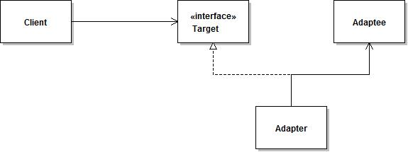

<!-- TOC -->
* [适配器（Adapter）](#适配器Adapter)
  * [介绍](#介绍)
    * [定义](#定义)
    * [类图](#类图)
    * [角色划分](#角色划分)
  * [实现](#实现)
  * [分析](#分析)
    * [优点](#优点)
    * [缺点](#缺点)
    * [适用场景](#适用场景)
  * [应用](#应用)
    * [开发场景](#开发场景)
    * [JDK](#JDK)
<!-- TOC -->

# 适配器（Adapter）

## 介绍

### 定义

把一个类接口转换成另一个用户需要的接口。

适配器模式（Adapter）的定义如下：将一个类的接口转换成客户希望的另外一个接口，使得原本由于接口不兼容而不能一起工作的那些类能一起工作。

<div align="center">  </div><br>

以下情况比较适合使用 Adapter 模式：


[适配器模式原理及实例介绍-IBM](https://www.ibm.com/developerworks/cn/java/j-lo-adapter-pattern/index.html)

###  类图

<div align="center"> 


</div>

### 角色划分
- 被适配者 Adaptee，
- 适配器 Adapter 
- 目标对象 Target：其中两个现存的想要组合到一起的类分别是被适配者 Adaptee 和目标对象 Target 角色

## 实现

客户端使用的接口,与业务相关
```java
public interface Target {
    //客户端请求处理的方法
    public void request();
}
```
被适配的对象,已经存在的接口,这个接口需要配置
```java
public class Adaptee {
    public void specificRequest(){
        //业务代码
    }
}
```
适配器实现
```java
public class Adapter implements Target {
    //持有需要被适配的接口对象
    private Adaptee adaptee;
    //构造方法，传入需要被适配的对象
    public Adapter(Adaptee adaptee) {
        this.adaptee = adaptee;
    }
    @Override
    public void request() {
        // TODO Auto-generated method stub
        adaptee.specificRequest();
    }
}
```
使用适配器的客户端
```java
public class Client {
    public static void main(String[] args){
        //创建需要被适配的对象
        Adaptee adaptee = new Adaptee();
        //创建客户端需要调用的接口对象
        Target target = new Adapter(adaptee);
        //请求处理
        target.request();
    }
}
```


鸭子（Duck）和火鸡（Turkey）拥有不同的叫声，Duck 的叫声调用 quack() 方法，而 Turkey 调用 gobble() 方法。

要求将 Turkey 的 gobble() 方法适配成 Duck 的 quack() 方法，从而让火鸡冒充鸭子！

```java
public interface Duck {
    void quack();
}
```

```java
public interface Turkey {
    void gobble();
}
```

```java
public class WildTurkey implements Turkey {
    @Override
    public void gobble() {
        System.out.println("gobble!");
    }
}
```

```java
public class TurkeyAdapter implements Duck {
    Turkey turkey;

    public TurkeyAdapter(Turkey turkey) {
        this.turkey = turkey;
    }

    @Override
    public void quack() {
        turkey.gobble();
    }
}
```

```java
public class Client {
    public static void main(String[] args) {
        Turkey turkey = new WildTurkey();
        Duck duck = new TurkeyAdapter(turkey);
        duck.quack();
    }
}
```
## 分析

### 优点
- 客户端通过适配器可以透明地调用目标接口。
- 复用了现存的类，程序员不需要修改原有代码而重用现有的适配者类。
- 将目标类和适配者类解耦，解决了目标类和适配者类接口不一致的问题。

### 缺点
对类适配器来说，更换适配器的实现过程比较复杂。

### 适用场景

- 想使用一个已经存在的类，而它的接口不符合你的需求；
- 想创建一个可以复用的类，该类可以与其他不相关的类或不可预见的类协同工作；
- 想使用一些已经存在的子类，但是不可能对每一个都进行子类化以匹配它们的接口，对象适配器可以适配它的父亲接口。

## 应用
### 开发场景

JDK中使用适配器模式的类
- java.util.Arrays#asList()
- java.io.InputStreamReader(InputStream)
- java.io.OutputStreamWriter(OutputStream)

Spring 中使用适配器模式的典型应用
- 在 Spring 的 AOP 里通过使用的 Advice（通知）来增强被代理类的功能。

### JDK

- [java.util.Arrays#asList()](http://docs.oracle.com/javase/8/docs/api/java/util/Arrays.html#asList%28T...%29)
- [java.util.Collections#list()](https://docs.oracle.com/javase/8/docs/api/java/util/Collections.html#list-java.util.Enumeration-)
- [java.util.Collections#enumeration()](https://docs.oracle.com/javase/8/docs/api/java/util/Collections.html#enumeration-java.util.Collection-)
- [javax.xml.bind.annotation.adapters.XMLAdapter](http://docs.oracle.com/javase/8/docs/api/javax/xml/bind/annotation/adapters/XmlAdapter.html#marshal-BoundType-)

