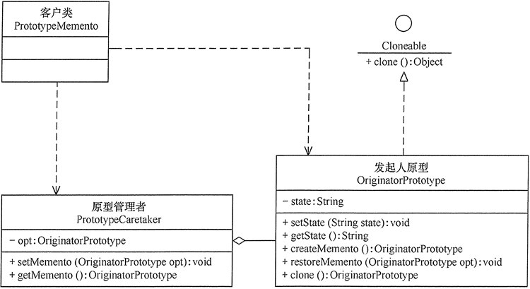

<!-- GFM-TOC -->
* [备忘录（Memento）](#备忘录memento)
  * [介绍](#介绍)
    * [定义](#定义)
    * [类图](#类图)
    * [角色划分](#角色划分)
  * [实现](#实现)
  * [分析](#分析)
    * [优点](#优点)
    * [缺点](#缺点)
    * [适用场景](#适用场景)
  * [应用](#应用)
    * [模式扩展](#模式扩展)
    * [开发场景](#开发场景)
    * [JDK](#jdk)
<!-- GFM-TOC -->

# 备忘录（Memento）
## 介绍
### 定义

在不违反封装的情况下获得对象的内部状态，从而在需要时可以将对象恢复到最初状态。

备忘录（Memento）模式的定义：在不破坏封装性的前提下，捕获一个对象的内部状态，并在该对象之外保存这个状态，以便以后当需要时能将该对象恢复到原先保存的状态。该模式又叫快照模式。

### 类图

- Originator：原始对象
- Caretaker：负责保存好备忘录
- Menento：备忘录，存储原始对象的的状态。备忘录实际上有两个接口，一个是提供给 Caretaker 的窄接口：它只能将备忘录传递给其它对象；一个是提供给 Originator 的宽接口，允许它访问到先前状态所需的所有数据。理想情况是只允许 Originator 访问本备忘录的内部状态。

<div align="center">  </div><br>

### 角色划分

- 发起人（Originator）角色：记录当前时刻的内部状态信息，提供创建备忘录和恢复备忘录数据的功能，实现其他业务功能，它可以访问备忘录里的所有信息。
- 备忘录（Memento）角色：负责存储发起人的内部状态，在需要的时候提供这些内部状态给发起人。
- 管理者（Caretaker）角色：对备忘录进行管理，提供保存与获取备忘录的功能，但其不能对备忘录的内容进行访问与修改。

## 实现

以下实现了一个简单计算器程序，可以输入两个值，然后计算这两个值的和。备忘录模式允许将这两个值存储起来，然后在某个时刻用存储的状态进行恢复。

实现参考：[Memento Pattern - Calculator Example - Java Sourcecode](https://www.oodesign.com/memento-pattern-calculator-example-java-sourcecode.html)

```java
/**
 * Originator Interface
 */
public interface Calculator {

    // Create Memento
    PreviousCalculationToCareTaker backupLastCalculation();

    // setMemento
    void restorePreviousCalculation(PreviousCalculationToCareTaker memento);

    int getCalculationResult();

    void setFirstNumber(int firstNumber);

    void setSecondNumber(int secondNumber);
}
```

```java
/**
 * Originator Implementation
 */
public class CalculatorImp implements Calculator {

    private int firstNumber;
    private int secondNumber;

    @Override
    public PreviousCalculationToCareTaker backupLastCalculation() {
        // create a memento object used for restoring two numbers
        return new PreviousCalculationImp(firstNumber, secondNumber);
    }

    @Override
    public void restorePreviousCalculation(PreviousCalculationToCareTaker memento) {
        this.firstNumber = ((PreviousCalculationToOriginator) memento).getFirstNumber();
        this.secondNumber = ((PreviousCalculationToOriginator) memento).getSecondNumber();
    }

    @Override
    public int getCalculationResult() {
        // result is adding two numbers
        return firstNumber + secondNumber;
    }

    @Override
    public void setFirstNumber(int firstNumber) {
        this.firstNumber = firstNumber;
    }

    @Override
    public void setSecondNumber(int secondNumber) {
        this.secondNumber = secondNumber;
    }
}
```

```java
/**
 * Memento Interface to Originator
 *
 * This interface allows the originator to restore its state
 */
public interface PreviousCalculationToOriginator {
    int getFirstNumber();
    int getSecondNumber();
}
```

```java
/**
 *  Memento interface to CalculatorOperator (Caretaker)
 */
public interface PreviousCalculationToCareTaker {
    // no operations permitted for the caretaker
}
```

```java
/**
 * Memento Object Implementation
 * <p>
 * Note that this object implements both interfaces to Originator and CareTaker
 */
public class PreviousCalculationImp implements PreviousCalculationToCareTaker,
        PreviousCalculationToOriginator {

    private int firstNumber;
    private int secondNumber;

    public PreviousCalculationImp(int firstNumber, int secondNumber) {
        this.firstNumber = firstNumber;
        this.secondNumber = secondNumber;
    }

    @Override
    public int getFirstNumber() {
        return firstNumber;
    }

    @Override
    public int getSecondNumber() {
        return secondNumber;
    }
}
```

```java
/**
 * CareTaker object
 */
public class Client {

    public static void main(String[] args) {
        // program starts
        Calculator calculator = new CalculatorImp();

        // assume user enters two numbers
        calculator.setFirstNumber(10);
        calculator.setSecondNumber(100);

        // find result
        System.out.println(calculator.getCalculationResult());

        // Store result of this calculation in case of error
        PreviousCalculationToCareTaker memento = calculator.backupLastCalculation();

        // user enters a number
        calculator.setFirstNumber(17);

        // user enters a wrong second number and calculates result
        calculator.setSecondNumber(-290);

        // calculate result
        System.out.println(calculator.getCalculationResult());

        // user hits CTRL + Z to undo last operation and see last result
        calculator.restorePreviousCalculation(memento);

        // result restored
        System.out.println(calculator.getCalculationResult());
    }
}
```

```html
110
-273
110
```

## 分析

### 优点

- 提供了一种可以恢复状态的机制。当用户需要时能够比较方便地将数据恢复到某个历史的状态。
- 实现了内部状态的封装。除了创建它的发起人之外，其他对象都不能够访问这些状态信息。
- 简化了发起人。发起人不需要管理和保存其内部状态的各个备份，所有状态信息都保存在备忘录中，并由管理者进行管理，这符合单一职责原则。

### 缺点

资源消耗大。如果要保存的内部状态信息过多或者特别频繁，将会占用比较大的内存资源

### 适用场景

- 需要保存与恢复数据的场景，如玩游戏时的中间结果的存档功能。
- 需要提供一个可回滚操作的场景，

## 应用
### 模式扩展

在备忘录模式中，通过定义“备忘录”来备份“发起人”的信息，而原型模式的 clone() 方法具有自备份功能，所以，如果让发起人实现 Cloneable 接口就有备份自己的功能，这时可以删除备忘录类

<div align="center">


</div>

### 开发场景

- 棋类游戏中的，悔棋
- 普通软件中的，撤销操作
- 数据库软件中的，事务管理中的，回滚操作
- Photoshop软件中的，历史记录

### JDK

- java.io.Serializable

