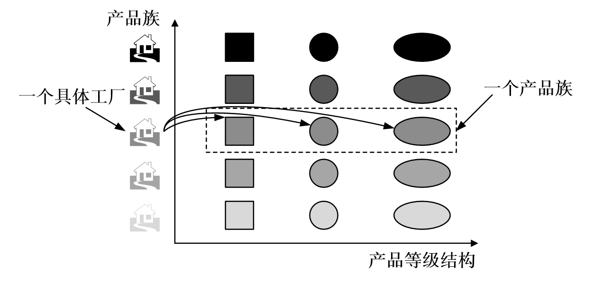

<!-- TOC -->
* [工厂模式](#工厂模式)
  * [简单工厂（Simple Factory）](#简单工厂Simple-Factory)
    * [介绍](#介绍)
    * [类图](#类图)
    * [实现](#实现)
  * [工厂方法（Factory Method）](#工厂方法Factory-Method)
    * [介绍](#介绍-1)
    * [类图](#类图-1)
    * [实现](#实现-1)
    * [应用](#应用)
  * [抽象工厂（Abstract Factory）](#抽象工厂Abstract-Factory)
    * [介绍](#介绍-2)
    * [类图](#类图-2)
    * [实现](#实现-2)
    * [应用](#应用-1)
<!-- TOC -->

# 工厂模式

在基类中定义创建对象的一个接口，让子类决定实例化哪个类。工厂方法让一个类的实例化延迟到子类中进行。

**分类**
1. 简单工厂（Simple Factory）模式，又称静态工厂方法模式（Static Factory Method Pattern）
2. 工厂方法（Factory Method）模式，又称多态性工厂（Polymorphic Factory）模式或虚拟构造子（Virtual Constructor）模式
3. 抽象工厂（Abstract Factory）模式，又称工具箱（Kit 或Toolkit）模式

**为什么要用工厂模式**
1. 解耦 ：把对象的创建和使用的过程分开
2. 降低代码重复: 如果创建某个对象的过程都很复杂，需要一定的代码量，而且很多地方都要用到，那么就会有很多的重复代码。
3. 降低维护成本 ：由于创建过程都由工厂统一管理，所以发生业务逻辑变化，不需要找到所有需要创建对象B的地方去逐个修正，只需要在工厂里修改即可，降低维护成本。

**应用场景**
- JDK中Calendar的getInstance方法
- JDBC中Connection对象的获取
- Hibernate中SessionFactory创建Session
- spring中IOC容器创建管理bean对象
- XML解析时的DocumentBuilderFactory创建解析器对象
- 反射中Class对象的newInstance()

## 简单工厂（Simple Factory）

### 介绍

#### 定义
在创建一个对象时不向客户暴露内部细节，并提供一个创建对象的通用接口。

它违背了 **开放-封闭原则**；因为每次要新添加一个功能，都需要在生switch-case 语句（或者if-else 语句）中去修改代码，添加分支条件。

**适用场景**
1. 需要创建的对象较少。
2. 客户端不关心对象的创建过程。

### 类图

简单工厂把实例化的操作单独放到一个类中，这个类就成为简单工厂类，让简单工厂类来决定应该用哪个具体子类来实例化。

这样做能把客户类和具体子类的实现解耦，客户类不再需要知道有哪些子类以及应当实例化哪个子类。客户类往往有多个，如果不使用简单工厂，那么所有的客户类都要知道所有子类的细节。而且一旦子类发生改变，例如增加子类，那么所有的客户类都要进行修改。

<div align="center">  </div><br>


#### 角色划分
- 工厂(Factory)角色 :简单工厂模式的核心，它负责实现创建所有实例的内部逻辑。工厂类可以被外界直接调用，创建所需的产品对象。
- 抽象产品(Product)角色 :简单工厂模式所创建的所有对象的父类，它负责描述所有实例所共有的公共接口。
- 具体产品(Concrete Product)角色:简单工厂模式的创建目标，所有创建的对象都是充当这个角色的某个具体类的实例。

### 实现

**产品接口和产品类**

```java
public interface Product {
}

public class ConcreteProduct implements Product {
}

public class ConcreteProduct1 implements Product {
}

public class ConcreteProduct2 implements Product {
}
```

以下的 Client 类包含了实例化的代码，这是一种错误的实现。如果在客户类中存在这种实例化代码，就需要考虑将代码放到简单工厂中。

```java
public class Client {

    public static void main(String[] args) {
        int type = 1;
        Product product;
        if (type == 1) {
            product = new ConcreteProduct1();
        } else if (type == 2) {
            product = new ConcreteProduct2();
        } else {
            product = new ConcreteProduct();
        }
        // do something with the product
    }
}
```

以下的 SimpleFactory 是**简单工厂**实现，它被所有需要进行实例化的客户类调用。

```java
public class SimpleFactory {

    public Product createProduct(int type) {
        if (type == 1) {
            return new ConcreteProduct1();
        } else if (type == 2) {
            return new ConcreteProduct2();
        }
        return new ConcreteProduct();
    }
}
```

```java
public class Client {

    public static void main(String[] args) {
        SimpleFactory simpleFactory = new SimpleFactory();
        Product product = simpleFactory.createProduct(1);
        // do something with the product
    }
}
```
```java
public class SimpleFactory {

    public static Object getClass(Class<? extends Product> clazz) {
        Object obj = null;

        try {
            obj = Class.forName(clazz.getName()).newInstance();
        } catch (ClassNotFoundException e) {
            e.printStackTrace();
        } catch (InstantiationException e) {
            e.printStackTrace();
        } catch (IllegalAccessException e) {
            e.printStackTrace();
        }

        return obj;
    }
}

public class Test2 {
    public static void main(String[] args) {

        Product product = (ConcreteProduct) SimpleFactory.getClass(factory_pattern.ConcreteProduct.class);
        circle.draw();

        Product product1 = (ConcreteProduct1) SimpleFactory.getClass(factory_pattern.ConcreteProduct1.class);
        rectangle.draw();

        Product product2 = (ConcreteProduct2) SimpleFactory.getClass(factory_pattern.ConcreteProduct2.class);
        square.draw();
    }

}
```
利用反射解决简单工厂每次增加新了产品类都要修改产品工厂的弊端；这种方式的虽然符合了 开放-关闭原则 ，但是每一次传入的都是产品类的全部路径，这样比较麻烦。如果需要改善的话可以通过 反射+配置文件 的形式来改善，这种方式使用的也是比较多的

## 工厂方法（Factory Method）

### 介绍

#### 定义

定义了一个创建对象的接口，但由子类决定要实例化哪个类。工厂方法把实例化操作推迟到子类。

工厂方法模式应该是在工厂模式家族中是用的最多模式，一般项目中存在最多的就是这个模式。

工厂方法模式是简单工厂的进一步深化， 在工厂方法模式中，我们不再提供一个统一的工厂类来创建所有的对象，而是针对不同的对象提供不同的工厂。也就是说 每个对象都有一个与之对应的工厂 。

**适用场景**
- 一个类不知道它所需要的对象的类：在工厂方法模式中，客户端不需要知道具体产品类的类名，只需要知道所对应的工厂即可，具体的产品对象由具体工厂类创建；客户端需要知道创建具体产品的工厂类。
- 一个类通过其子类来指定创建哪个对象：在工厂方法模式中，对于抽象工厂类只需要提供一个创建产品的接口，而由其子类来确定具体要创建的对象，利用面向对象的多态性和里氏
- 将创建对象的任务委托给多个工厂子类中的某一个，客户端在使用时可以无需关心是哪一个工厂子类创建产品子类，需要时再动态指定，可将具体工厂类的类名存储在配置文件或数据库中。

### 类图

在简单工厂中，创建对象的是另一个类，而在工厂方法中，是由子类来创建对象。

下图中，Factory 有一个 doSomething() 方法，这个方法需要用到一个产品对象，这个产品对象由 factoryMethod() 方法创建。该方法是抽象的，需要由子类去实现。

<div align="center">  </div><br>

#### 角色划分
- 抽象工厂(Abstract Factory)角色：是工厂方法模式的核心，与应用程序无关。任何在模式中创建的对象的工厂类必须实现这个接口或抽象类。
- 具体工厂(Concrete Factory)角色 ：这是实现抽象工厂接口的具体工厂类，包含与应用程序密切相关的逻辑，并且受到应用程序调用以创建某一种产品对象。
- 抽象产品(AbstractProduct)角色 ：工厂方法模式所创建的对象的超类型，也就是产品对象的共同父类或共同拥有的接口。
- 具体产品(Concrete Product)角色 ：这个角色实现了抽象产品角色所定义的接口。某具体产品有专门的具体工厂创建，它们之间往往一一对应

### 实现

```java
public abstract class Factory {
    abstract public Product factoryMethod();
    public void doSomething() {
        Product product = factoryMethod();
        // do something with the product
    }
}

public class ConcreteFactory extends Factory {
    public Product factoryMethod() {
        return new ConcreteProduct();
    }
}

public class ConcreteFactory1 extends Factory {
    public Product factoryMethod() {
        return new ConcreteProduct1();
    }
}

public class ConcreteFactory2 extends Factory {
    public Product factoryMethod() {
        return new ConcreteProduct2();
    }
}
```
### 应用

#### JDK

- [java.util.Calendar](http://docs.oracle.com/javase/8/docs/api/java/util/Calendar.html#getInstance--)
- [java.util.ResourceBundle](http://docs.oracle.com/javase/8/docs/api/java/util/ResourceBundle.html#getBundle-java.lang.String-)
- [java.text.NumberFormat](http://docs.oracle.com/javase/8/docs/api/java/text/NumberFormat.html#getInstance--)
- [java.nio.charset.Charset](http://docs.oracle.com/javase/8/docs/api/java/nio/charset/Charset.html#forName-java.lang.String-)
- [java.net.URLStreamHandlerFactory](http://docs.oracle.com/javase/8/docs/api/java/net/URLStreamHandlerFactory.html#createURLStreamHandler-java.lang.String-)
- [java.util.EnumSet](https://docs.oracle.com/javase/8/docs/api/java/util/EnumSet.html#of-E-)
- [javax.xml.bind.JAXBContext](https://docs.oracle.com/javase/8/docs/api/javax/xml/bind/JAXBContext.html#createMarshaller--)


## 抽象工厂（Abstract Factory）

### 介绍

#### 定义

提供一个接口，用于创建   **相关的对象家族**  。

在工厂方法模式中，其实我们有一个潜在意识的意识。那就是我们生产的都是同一类产品。抽象工厂模式是工厂方法的仅一步深化，在这个模式中的工厂类不单单可以创建一种产品，而是可以创建一组产品。

#### 适用场景
- 和工厂方法一样客户端不需要知道它所创建的对象的类。
- 需要一组对象共同完成某种功能时，并且可能存在多组对象完成不同功能的情况。（同属于同一个产品族的产品）
- 系统结构稳定，不会频繁的增加对象。（因为一旦增加就需要修改原有代码，不符合开闭原则）

### 类图

抽象工厂是生产一整套有产品的（至少要生产两个产品)，这些产品必须相互是有关系或有依赖的，而工厂方法中的工厂是生产单一产品的工厂。

<div align="center">


</div>

抽象工厂模式创建的是对象家族，也就是很多对象而不是一个对象，并且这些对象是相关的，也就是说必须一起创建出来。而工厂方法模式只是用于创建一个对象，这和抽象工厂模式有很大不同。

抽象工厂模式用到了工厂方法模式来创建单一对象，AbstractFactory 中的 createProductA() 和 createProductB() 方法都是让子类来实现，这两个方法单独来看就是在创建一个对象，这符合工厂方法模式的定义。

至于创建对象的家族这一概念是在 Client 体现，Client 要通过 AbstractFactory 同时调用两个方法来创建出两个对象，在这里这两个对象就有很大的相关性，Client 需要同时创建出这两个对象。

从高层次来看，抽象工厂使用了组合，即 Cilent 组合了 AbstractFactory，而工厂方法模式使用了继承。

<div align="center">  </div><br>

#### 角色划分
- 抽象工厂（AbstractFactory）角色 ：是工厂方法模式的核心，与应用程序无关。任何在模式中创建的对象的工厂类必须实现这个接口或抽象类。
- 具体工厂类（ConreteFactory）角色 ：这是实现抽象工厂接口的具体工厂类，包含与应用程序密切相关的逻辑，并且受到应用程序调用以创建某一种产品对象。
- 抽象产品（Abstract Product）角色 ：工厂方法模式所创建的对象的超类型，也就是产品对象的共同父类或共同拥有的接口。
- 具体产品（Concrete Product）角色 ：抽象工厂模式所创建的任何产品对象都是某一个具体产品类的实例。在抽象工厂中创建的产品属于同一产品族，这不同于工厂模式中的工厂只创建单一产品

### 实现

**抽象产品**和**具体产品**

```java
public class AbstractProductA {
}

public class AbstractProductB {
}

public class ProductA1 extends AbstractProductA {
}

public class ProductA2 extends AbstractProductA {
}

public class ProductB1 extends AbstractProductB {
}

public class ProductB2 extends AbstractProductB {
}
```

**抽象工厂**和**具体工厂**

```java
public abstract class AbstractFactory {
    abstract AbstractProductA createProductA();
    abstract AbstractProductB createProductB();
}

public class ConcreteFactory1 extends AbstractFactory {
    AbstractProductA createProductA() {
        return new ProductA1();
    }

    AbstractProductB createProductB() {
        return new ProductB1();
    }
}

public class ConcreteFactory2 extends AbstractFactory {
    AbstractProductA createProductA() {
        return new ProductA2();
    }

    AbstractProductB createProductB() {
        return new ProductB2();
    }
}
```

```java
public class Client {
    public static void main(String[] args) {
        AbstractFactory abstractFactory = new ConcreteFactory1();
        AbstractProductA productA = abstractFactory.createProductA();
        AbstractProductB productB = abstractFactory.createProductB();
        // do something with productA and productB
    }
}
```
### 应用

#### JDK

- [javax.xml.parsers.DocumentBuilderFactory](http://docs.oracle.com/javase/8/docs/api/javax/xml/parsers/DocumentBuilderFactory.html)
- [javax.xml.transform.TransformerFactory](http://docs.oracle.com/javase/8/docs/api/javax/xml/transform/TransformerFactory.html#newInstance--)
- [javax.xml.xpath.XPathFactory](http://docs.oracle.com/javase/8/docs/api/javax/xml/xpath/XPathFactory.html#newInstance--)


