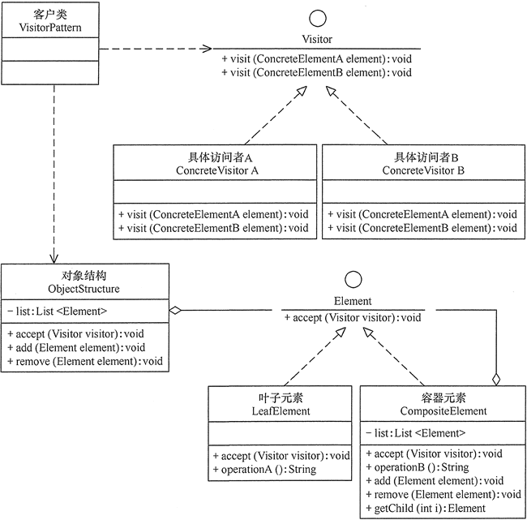

<!-- GFM-TOC -->
* [访问者（Visitor）](#访问者Visitor)
  * [介绍](#介绍)
    * [定义](#定义)
    * [类图](#类图)
    * [角色划分](#角色划分)
  * [实现](#实现)
  * [分析](#分析)
    * [优点](#优点)
    * [缺点](#缺点)
    * [适用场景](#适用场景)
  * [应用](#应用)
    * [模式扩展](#模式扩展)
    * [开发场景](#开发场景)
    * [JDK](#JDK)
<!-- GFM-TOC -->


# 访问者（Visitor）
## 介绍
### 定义

为一个对象结构（比如组合结构）增加新能力。

访问者（Visitor）模式的定义：将作用于某种数据结构中的各元素的操作分离出来封装成独立的类，使其在不改变数据结构的前提下可以添加作用于这些元素的新的操作，为数据结构中的每个元素提供多种访问方式。它将对数据的操作与数据结构进行分离，是行为类模式中最复杂的一种模式。

### 类图

- Visitor：访问者，为每一个 ConcreteElement 声明一个 visit 操作
- ConcreteVisitor：具体访问者，存储遍历过程中的累计结果
- ObjectStructure：对象结构，可以是组合结构，或者是一个集合。

<div align="center">  </div><br>

### 角色划分

- 抽象访问者（Visitor）角色：定义一个访问具体元素的接口，为每个具体元素类对应一个访问操作 visit() ，该操作中的参数类型标识了被访问的具体元素。
- 具体访问者（ConcreteVisitor）角色：实现抽象访问者角色中声明的各个访问操作，确定访问者访问一个元素时该做什么。
- 抽象元素（Element）角色：声明一个包含接受操作 accept() 的接口，被接受的访问者对象作为 accept() 方法的参数。
- 具体元素（ConcreteElement）角色：实现抽象元素角色提供的 accept() 操作，其方法体通常都是 visitor.visit(this) ，另外具体元素中可能还包含本身业务逻辑的相关操作。
- 对象结构（Object Structure）角色：是一个包含元素角色的容器，提供让访问者对象遍历容器中的所有元素的方法，通常由 List、Set、Map 等聚合类实现。

## 实现

访问者（Visitor）模式实现的关键是如何将作用于元素的操作分离出来封装成独立的类

```java
public interface Element {
    void accept(Visitor visitor);
}
```

```java
class CustomerGroup {

    private List<Customer> customers = new ArrayList<>();

    void accept(Visitor visitor) {
        for (Customer customer : customers) {
            customer.accept(visitor);
        }
    }

    void addCustomer(Customer customer) {
        customers.add(customer);
    }
}
```

```java
public class Customer implements Element {

    private String name;
    private List<Order> orders = new ArrayList<>();

    Customer(String name) {
        this.name = name;
    }

    String getName() {
        return name;
    }

    void addOrder(Order order) {
        orders.add(order);
    }

    public void accept(Visitor visitor) {
        visitor.visit(this);
        for (Order order : orders) {
            order.accept(visitor);
        }
    }
}
```

```java
public class Order implements Element {

    private String name;
    private List<Item> items = new ArrayList();

    Order(String name) {
        this.name = name;
    }

    Order(String name, String itemName) {
        this.name = name;
        this.addItem(new Item(itemName));
    }

    String getName() {
        return name;
    }

    void addItem(Item item) {
        items.add(item);
    }

    public void accept(Visitor visitor) {
        visitor.visit(this);

        for (Item item : items) {
            item.accept(visitor);
        }
    }
}
```

```java
public class Item implements Element {

    private String name;

    Item(String name) {
        this.name = name;
    }

    String getName() {
        return name;
    }

    public void accept(Visitor visitor) {
        visitor.visit(this);
    }
}
```

```java
public interface Visitor {
    void visit(Customer customer);

    void visit(Order order);

    void visit(Item item);
}
```

```java
public class GeneralReport implements Visitor {

    private int customersNo;
    private int ordersNo;
    private int itemsNo;

    public void visit(Customer customer) {
        System.out.println(customer.getName());
        customersNo++;
    }

    public void visit(Order order) {
        System.out.println(order.getName());
        ordersNo++;
    }

    public void visit(Item item) {
        System.out.println(item.getName());
        itemsNo++;
    }

    public void displayResults() {
        System.out.println("Number of customers: " + customersNo);
        System.out.println("Number of orders:    " + ordersNo);
        System.out.println("Number of items:     " + itemsNo);
    }
}
```

```java
public class Client {
    public static void main(String[] args) {
        Customer customer1 = new Customer("customer1");
        customer1.addOrder(new Order("order1", "item1"));
        customer1.addOrder(new Order("order2", "item1"));
        customer1.addOrder(new Order("order3", "item1"));

        Order order = new Order("order_a");
        order.addItem(new Item("item_a1"));
        order.addItem(new Item("item_a2"));
        order.addItem(new Item("item_a3"));
        Customer customer2 = new Customer("customer2");
        customer2.addOrder(order);

        CustomerGroup customers = new CustomerGroup();
        customers.addCustomer(customer1);
        customers.addCustomer(customer2);

        GeneralReport visitor = new GeneralReport();
        customers.accept(visitor);
        visitor.displayResults();
    }
}
```

```html
customer1
order1
item1
order2
item1
order3
item1
customer2
order_a
item_a1
item_a2
item_a3
Number of customers: 2
Number of orders:    4
Number of items:     6
```

## 分析

### 优点

- 扩展性好。能够在不修改对象结构中的元素的情况下，为对象结构中的元素添加新的功能。
- 复用性好。可以通过访问者来定义整个对象结构通用的功能，从而提高系统的复用程度。
- 灵活性好。访问者模式将数据结构与作用于结构上的操作解耦，使得操作集合可相对自由地演化而不影响系统的数据结构。
- 符合单一职责原则。访问者模式把相关的行为封装在一起，构成一个访问者，使每一个访问者的功能都比较单一。

### 缺点

- 增加新的元素类很困难。在访问者模式中，每增加一个新的元素类，都要在每一个具体访问者类中增加相应的具体操作，这违背了“开闭原则”。
- 破坏封装。访问者模式中具体元素对访问者公布细节，这破坏了对象的封装性。
- 违反了依赖倒置原则。访问者模式依赖了具体类，而没有依赖抽象类。

### 适用场景

- 对象结构相对稳定，但其操作算法经常变化的程序。
- 对象结构中的对象需要提供多种不同且不相关的操作，而且要避免让这些操作的变化影响对象的结构。
- 对象结构包含很多类型的对象，希望对这些对象实施一些依赖于其具体类型的操作。

## 应用

### 模式扩展

访问者（Visitor）模式是使用频率较高的一种设计模式，它常常同以下两种设计模式联用
- 与“迭代器模式”联用。因为访问者模式中的“对象结构”是一个包含元素角色的容器，当访问者遍历容器中的所有元素时，常常要用迭代器。
- 同“组合模式”联用。因为访问者（Visitor）模式中的“元素对象”可能是叶子对象或者是容器对象，如果元素对象包含容器对象，就必须用到组合模式

<div align="center">


</div>

### 开发场景
- XML文档解析器设计
- 编译器的设计
- 复杂集合对象的处理

### JDK

- javax.lang.model.element.Element and javax.lang.model.element.ElementVisitor
- javax.lang.model.type.TypeMirror and javax.lang.model.type.TypeVisitor

