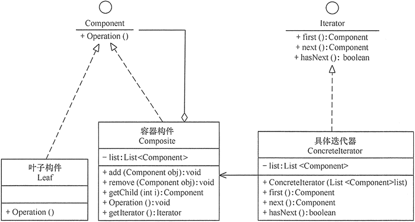

<!-- GFM-TOC -->
* [迭代器（Iterator）](#迭代器Iterator)
  * [介绍](#介绍)
    * [定义](#定义)
    * [类图](#类图)
    * [角色划分](#角色划分)
  * [实现](#实现)
  * [分析](#分析)
    * [优点](#优点)
    * [缺点](#缺点)
    * [适用场景](#适用场景)
  * [应用](#应用)
    * [模式扩展](#模式扩展)
    * [开发场景](#开发场景)
    * [JDK](#JDK)
<!-- GFM-TOC -->

# 迭代器（Iterator）

## 介绍
### 定义

提供一种顺序访问聚合对象元素的方法，并且不暴露聚合对象的内部表示。

迭代器模式是通过将聚合对象的遍历行为分离出来，抽象成迭代器类来实现的，其目的是在不暴露聚合对象的内部结构的情况下，让外部代码透明地访问聚合的内部数据。

### 类图

- Aggregate 是聚合类，其中 createIterator() 方法可以产生一个 Iterator；
- Iterator 主要定义了 hasNext() 和 next() 方法。
- Client 组合了 Aggregate，为了迭代遍历 Aggregate，也需要组合 Iterator。

<div align="center">  </div><br>

### 角色划分

- 抽象聚合（Aggregate）角色：定义存储、添加、删除聚合对象以及创建迭代器对象的接口。
- 具体聚合（ConcreteAggregate）角色：实现抽象聚合类，返回一个具体迭代器的实例。
- 抽象迭代器（Iterator）角色：定义访问和遍历聚合元素的接口，通常包含 hasNext()、first()、next() 等方法。
- 具体迭代器（Concretelterator）角色：实现抽象迭代器接口中所定义的方法，完成对聚合对象的遍历，记录遍历的当前位置。

## 实现

```java
public interface Aggregate {
    Iterator createIterator();
}
```

```java
public class ConcreteAggregate implements Aggregate {

    private Integer[] items;

    public ConcreteAggregate() {
        items = new Integer[10];
        for (int i = 0; i < items.length; i++) {
            items[i] = i;
        }
    }

    @Override
    public Iterator createIterator() {
        return new ConcreteIterator<Integer>(items);
    }
}
```

```java
public interface Iterator<Item> {

    Item next();

    boolean hasNext();
}
```

```java
public class ConcreteIterator<Item> implements Iterator {

    private Item[] items;
    private int position = 0;

    public ConcreteIterator(Item[] items) {
        this.items = items;
    }

    @Override
    public Object next() {
        return items[position++];
    }

    @Override
    public boolean hasNext() {
        return position < items.length;
    }
}
```

```java
public class Client {

    public static void main(String[] args) {
        Aggregate aggregate = new ConcreteAggregate();
        Iterator<Integer> iterator = aggregate.createIterator();
        while (iterator.hasNext()) {
            System.out.println(iterator.next());
        }
    }
}
```

## 分析

### 优点

- 访问一个聚合对象的内容而无须暴露它的内部表示。
- 遍历任务交由迭代器完成，这简化了聚合类。
- 它支持以不同方式遍历一个聚合，甚至可以自定义迭代器的子类以支持新的遍历。
- 增加新的聚合类和迭代器类都很方便，无须修改原有代码。
- 封装性良好，为遍历不同的聚合结构提供一个统一的接口。

### 缺点

增加了类的个数，这在一定程度上增加了系统的复杂性

### 适用场景

- 当需要为聚合对象提供多种遍历方式时。
- 当需要为遍历不同的聚合结构提供一个统一的接口时。
- 当访问一个聚合对象的内容而无须暴露其内部细节的表示时。

## 应用

### 模式扩展

迭代器模式常常与组合模式结合起来使用，在对组合模式中的容器构件进行访问时，经常将迭代器潜藏在组合模式的容器构成类中。当然，也可以构造一个外部迭代器来对容器构件进行访问

<div align="center">


</div>

### 开发场景 
- JDK内置的迭代器(List/Set)

### JDK

- [java.util.Iterator](http://docs.oracle.com/javase/8/docs/api/java/util/Iterator.html)
- [java.util.Enumeration](http://docs.oracle.com/javase/8/docs/api/java/util/Enumeration.html)
