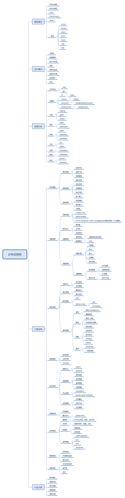

<!-- GFM-TOC -->
* [分布式架构](#分布式架构)
<!-- GFM-TOC -->

# 分布式架构

一般来说，相对于单机架构系统，分布式系统可以从以下三个方面获得收益和增强：

1.扩展性
这是一个系统对所要处理的持续增长的任务的适应能力和兼容能力，可用以下三种扩展性来概括：1）集群规模扩展性：整体服务性能可以随集群机器数量线性增长；2）地理扩展性：能够使用不同地区的数据中心以抵消地理因素带来的延迟；3）管理扩展性：集群数量的上升不会导致管理复杂度快速上升。

2.性能
所谓的性能优良的系统应该具备三个特质：短RT、低延迟，高吞吐和较低的计算资源占用率。

这里值得一提的是延迟和吞吐。延迟lantency英语本意是潜伏期，在分布式领域中描述的是 ‘从事件发生到 可被观测到’ 之间的时间间隔。数据从开始被写入，到磁盘持久化成功，花了100ms，但是这期间没有任何第三方能够观察到此次写入的变更结果，再过了100ms，终于有第三方能够观察到此次写入的最新结果。这里的”延迟“ 为  200ms，而非100ms。 吞吐可以简单理解为单位时间内最多能处理请求数量。 

3.可用性
可用性=可用时间/(可用时间+不可用时间)，可用性百分比越高，难度越高 。提升系统可用性的关键一点：在设计阶段就需要考虑容错性(Fault  tolerance) ，即“面向失败的设计”。那么如何把一个单系统应用快速改造成分布式应用呢，我们需要考虑如何提供分布式的服务，如何用分布式缓存，分布式数据库等等。

