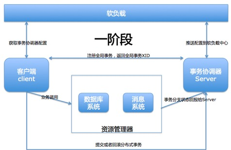
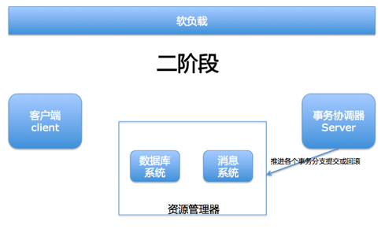
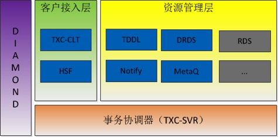
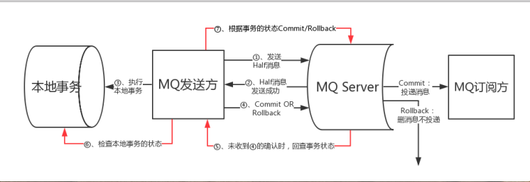

<!-- GFM-TOC -->
* [分布式事务解决方案](#分布式事务解决方案)
  * [两阶段提交](#两阶段提交)
  * [TCC](#TCC)
* [TXC](#TXC)
  * [应用场景](#应用场景)
  * [架构](#架构)
  * [TXC分阶段提交事务](#TXC分阶段提交事务)
  * [软件结构](#软件结构)
* [消息队列实现分布式事务](#消息队列实现分布式事务)
  * [RocketMQ实现](#RocketMQ实现)
  * [kafka](#kafka)
<!-- GFM-TOC -->

分布式事务是指事务的参与者、支持事务的服务器、资源服务器以及事务管理器分别位于不同的 分布式系统 的不同节点之上。

# 分布式事务解决方案

## 两阶段提交

两阶段提交，是实现分布式事务的成熟方案。第一阶段是表决阶段，是所有参与者都将本事务能否成功的反馈发给协调者；第二阶段是执行阶段，协调者根据所有参与者的反馈，通知所有参与者，步调一致地在所有分支上提交，或者在所有分支上回滚。

缺点
1. 同步阻塞：所有事务参与者在等待其它参与者响应的时候都处于同步阻塞状态，无法进行其它操作。
2. 单点问题：协调者在 2PC 中起到非常大的作用，发生故障将会造成很大影响。特别是在阶段二发生故障，所有参与者会一直等待，无法完成其它操作。
3. 数据不一致：在阶段二，如果协调者只发送了部分 Commit 消息，此时网络发生异常，那么只有部分参与者接收到 Commit 消息，也就是说只有部分参与者提交了事务，使得系统数据不一致。
4. 太过保守：任意一个节点失败就会导致整个事务失败，没有完善的容错机制。

## TCC

TCC（Try、Confirm、Cancel）是两阶段提交的一个变种。TCC提供了一个框架，需要应用程序按照该框架编程，将业务逻辑的每个分支都分为Try、Confirm、Cancel三个操作集。TCC让应用程序自己定义数据库操作的粒度，使得降低锁冲突、提高吞吐量成为可能。

# TXC

## 应用场景

TXC的目标应用场景是：解决在分布式应用中，多条数据库记录被修改而可能带来的一致性问题；该分布式应用可以接受最终一致性；该应用的事务改造对工作量有较严格的限制

- 跨多分库的分布式数据库事务场景
- 跨多数据库的事务场景
- 跨数据库系统、消息系统的事务场景
- 跨服务的事务场景

## 架构

- 客户端（TXC-Client），资源管理器（RM），事务协调器（TXC-Server）。
客户端与事务协调器间，资源管理器与事务协调器间都是通过TXC分布式事务协议进行通信。客户端负责界定事务边界，开启/提交/回滚全局事务，
- 资源管理器负责管理资源，支持的资源包括：TDDL/DRDS，Oracle，MySQL，RDS，PgSQL，H2，MQ，MetaQ，Notify，后续计划根据实际业务需求支持更多类型资源。
- 事务协调器，也就是TXC服务器，负责协调整个事务过程，是分布式事务处理的大脑。

TXC事务可以通过RPC框架和消息中间件进行事务传递，把整个业务调用链路或者消息链路串在一个分布式事务，极大简化应用开发。

## TXC分阶段提交事务

TXC通过两阶段提交方式进行分布式事务推进。客户端向事务协调器注册全局事务作为一阶段的开启的标记；分布式事务内的每一次资源（DB或消息）操作，均通过资源管理器进行，资源管理器向事务协调器注册一个事务分支；客户端通知事务协调器进行全局提交／全局回滚作为一阶段完成的标记。

TXC分布式事务的二阶段由事务协调器驱动，驱动所有事务分支执行提交或回滚操作，一旦确定某个分布式事务提交或回滚，则不断重试所有事务分支，直到完成整个分布式事务提交或回滚。

## 软件结构

TXC使用diamond实现软负载均衡，支持自动化的扩容和缩容，在业务规模发生变化时不对业务产生影响，并消除了事务协调器的单点故障风险。

业务方可通过TXC客户端API接入TXC事务，当调用已经接入TXC事务的HSF服务时，HSF服务会自动加入当前的全局事务，最大程度降低业务的开发成本。

TXC分布式事务中间件提供多种资源器支持，目前，已经完成TDDL、DRDS、Notify、MetaQ接入。

# 消息队列实现分布式事务

- 通过两阶段提交来实现事务的，事务消息都保存在单独的主题上
- 消息预发送机制：如果业务执行成功，再去发消息，此时如果还没来得及发消息，业务系统就已经宕机了，系统重启后，根本没有记录之前是否发送过消息，这样就会导致业务执行成功，消息最终没发出去的情况。

## RocketMQ实现

通过“半消息”来实现的

- producer发送half消息
- broker确认half消息，并通知producer，表示消息已经成功发送到broker（这个过程其实就是步骤1broker的返回）
- producer收到half确认消息之后，执行自己本地事务，并将事务结果（UNKNOW、commit、rollback）告诉broker（这是一个oneway消息，而且失败不重试）
- broker收到producer本地事务的结果后决定是否投递消息给consumer
- 鉴于producer发送本地事务结果可能失败，broker会定时扫描集群中的事务消息，然后回查

## kafka

直接将消息发送给对应的topic，通过客户端来过滤实现的