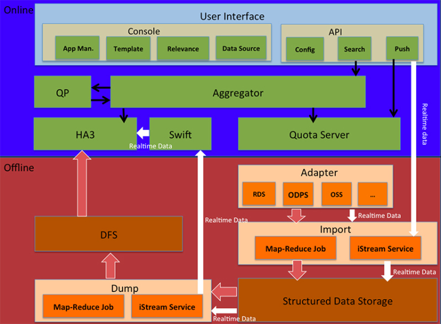
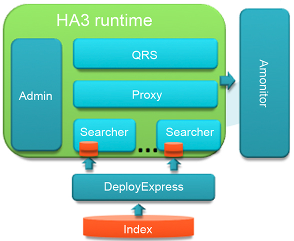

<!-- GFM-TOC -->
* [OpenSearch](#OpenSearch)
  * [简介](#简介)
  * [产品特性](#产品特性)
  * [产品架构](#产品架构)
    * [引擎HA3](#引擎HA3)
* [Solr](#Solr)
<!-- GFM-TOC -->

# OpenSearch

## 简介

开放搜索（OpenSearch）是一款结构化数据搜索托管服务，为移动应用开发者和网站站长提供简单、高效、稳定、低成本和可扩展的搜索解决方案。

OpenSearch基于阿里巴巴自主研发的大规模分布式搜索引擎平台，该平台承载了阿里巴巴全部主要搜索业务，包括淘宝、天猫、一淘、1688、ICBU、神马搜索等业务。OpenSearch以平台服务化的形式，将专业搜索技术简单化、低门槛化和低成本化，让搜索引擎技术不再成为客户的业务瓶颈，以低成本实现产品搜索功能并快速迭代。

## 产品特性

- 支持文档索引结构定制，以及自由修改
OpenSearch将搜索引擎复杂的索引结构概念简单化、可视化和自助定制化。开发者可以通过控制台创建搜索实例，定制文档字段的结构和属性，包括字段名称、类型、分词方式、搜索属性等。搜索实例在运行过程中可以自由修改，满足了产品快速变化的需求，极大缩短了需求变更到上线的过程。
- 支持多种数据接入方式，数据自动同步更新
开发者的数据如果在阿里云的云存储服务（RDS、OSS、ODPS等）上，开发者是需要在OpenSearch控制台中授权，数据皆可以自动同步至OpenSearch中，后续数据的更新也可以自动实时同步（ODPS除外）。而且在同一区域中，从云存储同步数据至OpenSearch免收流量费。书局不在阿里云上的开发者，可以通过RESTfulAPI或者SDK上传数据，小数据量也可以直接在控制台上传。
- 支持多表，插件式数据处理
类似于数据库，每个搜索实例可以创建一张或多张表，每张表的字段上可以内置数据处理插件，对字段内容做文本处理和转换，例如拼音转换、HTML标签剔除、JSON数据解释等，多个表可以Join在一起实现多表联合查询。数据存放在RDS数据库里的开发者，可以用此功能代替数据库全文检索，实现更高的性能和搜索体验。
- 支持搜索结果相关性两阶段排序定制，线上实时相关性调试
用户使用搜索功能的目的是从海量数据中找到自己想要得信息，搜索结果相关性排序是影响用户体验的最关键的一环。OpenSearch支持开发者定制两轮相关性排序规则来准确控制搜索结果的排序。
  - 第一轮为粗排，从命中的文档集合里选出相关文档。支持配置字段、文本相关性和时效性算分特征的权重。
  - 第二轮为精排，对粗排的结果做更精细筛选，支持任意复杂的表达式和语法。这样做除了方便开发者能准确控制排序效果之外，更重要的是能优化系统性能，提高搜索相应速度。开发者可以通过排序规则直接在控制台中调试效果，并在效果满意后直接切换到线上

## 产品架构

- 白色线为实时数据处理流
- 红色线为全量数据处理流
- 黑色线为搜索流程

开发者通过控制台和API与系统交互。典型的使用流程是开发者进入控制台，创建应用实例，配置应用字段结构、搜索属性，配置文本处理插件、定制相关性排序规则等。应用实例创建完成后，开发者再通过SDK/API将数据推送至云端（阿里云存储用户可以配置数据自动同步，只需在控制台中授权），数据实时流式进入Import子系统的数据导入服务模块(iStream Service)，经过格式解析和数据处理后，存储在结构化数据存储系统中。随后，Dump子系统的数据导出服务(iStream Service)将数据经过一定处理后发送给实时消息队列系统(Swift)，搜索系统(HA3)从消息队列中订阅数据，在内存中构建索引并提供搜索服务。这个数据实时流式处理过程（白色箭头）大概十秒左右。

当开发者修改了索引结构，需要对应用中的数据做增量索引重建。为了保证搜索效率，系统也会定期对所有数据做全量重建索引。索引重建流程参见红色箭头，这是一个非实时的流程，依数据大小不同可能需要几分钟到十几分钟，全量索引重建则需要数小时。

数据在云端经过一系列处理和索引构建后，开发者就可以通过API搜索应用实例中的数据。搜索请求首先发送到查询聚合服务Aggregator。

如果开发者配置了查询改写处理逻辑（即将上线），Aggregator会将查询请求发送给查询改写服务QP，QP按照开发者配置的处理规则（例如：拼写纠错、同义词或者查询语义改写）改写查询请求，并将改写后的查询回传给Aggregator，Aggregator最终将查询请求发送给搜索系统HA3，HA3根据开发者定制的相关性排序规则对命中的结果文档排序，并最终通过Aggregator将结果返回给开发者。

为了保证不同开发者各个应用数据推送和搜索相互不受影响，资源合理利用。配额管理服务（Quota Server）会对进入系统的数据和搜索请求频率依据开发者的配额（文档总量、QPS）做限流控制。超出配额部分的数据推送将失败，查询请求将随机丢弃。

### 引擎HA3

HA3是阿里自主研发的新一代分布式实时搜索系统，中文名叫问天3，具备自动容灾、动态扩容、秒级实时等能力。下图是HA3系统模块组成图。

其中，Admin是整个系统的大脑，负责节点角色分配、调度决策、FailOver处理、状态监测、动态扩容等。Amonitor是系统的性能状态监控模块，收集和展示整个系统所有节点的性能参数。QRS是查询解析和改写服务，是系统对外的搜索接口。Proxy是搜索代理模块，负责接收QRS的查询请求，并转发给下辖的所有Searcher节点。Searcher节点执行实际的查询匹配计算，将搜索结果汇总后回传给QRS。

# Solr

Solr是一个基于Lucene的Java搜索引擎服务器。Solr 提供了层面搜索、命中醒目显示并且支持多种输出格式（包括 XML/XSLT 和 JSON 格式）。它易于安装和配置，而且附带了一个基于 HTTP 的管理界面。Solr已经在众多大型的网站中使用，较为成熟和稳定。Solr 包装并扩展了 Lucene，所以Solr的基本上沿用了Lucene的相关术语。更重要的是，Solr 创建的索引与 Lucene 搜索引擎库完全兼容。通过对 Solr 进行适当的配置，某些情况下可能需要进行编码，Solr 可以阅读和使用构建到其他 Lucene 应用程序中的索引。此外，很多 Lucene 工具（如Nutch、 Luke）也可以使用 Solr 创建的索引。