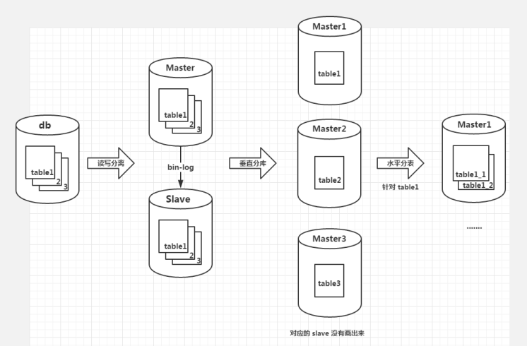
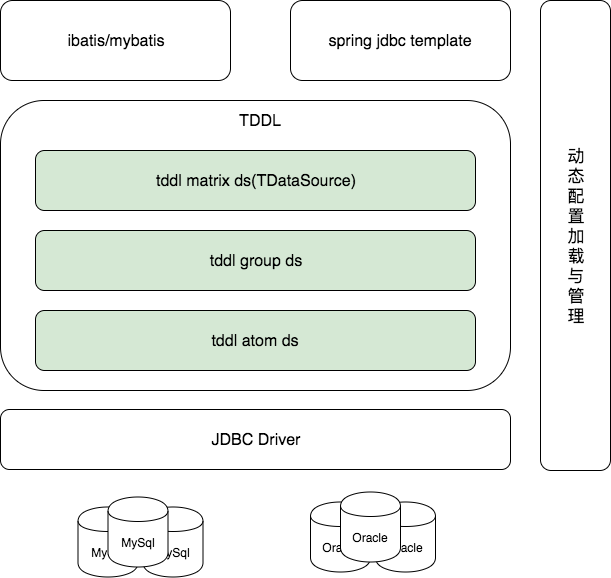
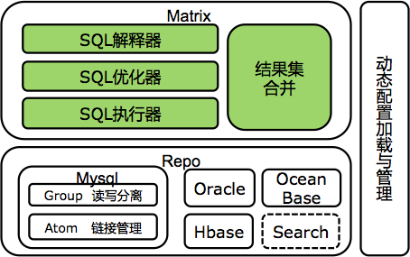
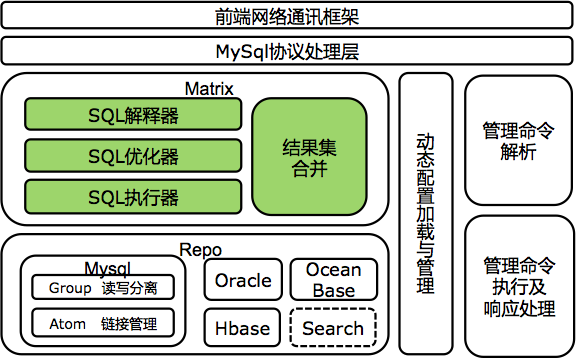
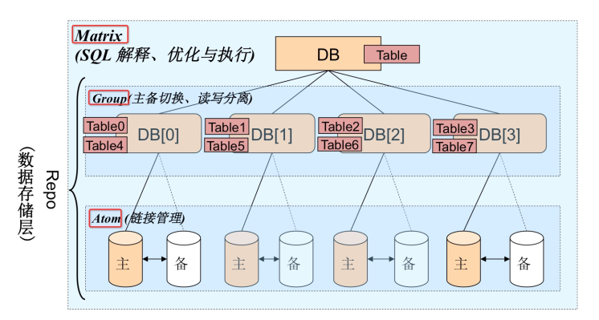

<!-- GFM-TOC -->
<!-- GFM-TOC -->

# TDDL

## 产生背景

一开始的时候，由于数据量比较少，数据库最长见的是单库单表的情况。随着业务的发展，业务库中的数据量不断增长。单库的性能已经不能再支持业务的发展。我们开始使用对数据库进行分库分表和读写分离的方式，来分散数据库的压力，提高整体的性能。

- 单库单表
通常刚开始的时候，应用的数据比较少，也不会很复杂，所以应用只有一个数据库，数据库中的表是一张完整的表，这也是我们刚开始接触数据库时的数据库形态。
- 读写分离随着业务的发展，数据量与数据访问量不断增长，很多时候应用的主要业务是读多写少的，比如说一些新闻网站，运营在后台上传了一堆新闻之后，所有的用户都会去读取这些新闻资讯，因此数据库面临的读压力远大于写压力，那么这时候在原来数据库 Master 的基础上增加一个备用数据库 Slave，备库和主库存储着相同的数据，但只提供读服务，不提供写服务。以后的写操作以及事务中的读操作就走主库，其它读操作就走备库，这就是所谓的读写分离。读写分离会直接带来两个问题：
  - **数据复制问题**：因为最新写入的数据只会存储在主库中，之后想要在备库中读取到新数据就必须要从主库复制过来，这会带来一定的延迟，造成短期的数据不一致性。但这个问题应该也没有什么特别好的办法，主要依赖于数据库提供的数据复制机制，常用的是根据数据库日志 binary-log 实现数据复制。
  - **数据源选择问题**：读写分离之后我们都知道写要找主库，读要找备库，但是程序不知道，所以我们在程序中应该根据 SQL 来判断出是读操作还是写操作，进而正确选择要访问的数据库。
- 垂直分库数据量与访问量继续上升时，主备库的压力都在变大，这时候可以根据业务特点考虑将数据库垂直拆分，即把数据库中不同的业务单元的数据划分到不同的数据库里面。比如说，还是新闻网站，注册用户的信息与新闻是没有多大关系的，数据库访问压力大时可以尝试把用户信息相关的表放在一个数据库，新闻相关的表放在一个数据库中，这样大大减小了数据库的访问压力。垂直分库会带来以下问题：
  - ACID 被打破：数据分到不同的数据库之后，原来的事务操作将会受很大影响，比如说注册账户的时候需要在用户表和用户信息表中插入一条数据，单机数据库利用事务可以很好地完成这个任务，但是多机将会变得比较麻烦。以下两点也是因为数据库在不同的机子上而导致简单的操作变得复杂，不一一分析了。
  - Join 操作困难
  - 外键约束受影响
- 水平分表经过长时间积累，特别对于 ugc 的业务，数据量会达到惊人的地步，每张表存放着大量的数据，任何 CRUD 都变成了一次极其消耗性能的操作，这个时候就会考虑水平分表，把一张表内大量的数据拆分成多张子表，比如说原来一张表中存放 50000 条数据，水平分成 5 张表之后，每张表只要存放 10000 条数据。这种结构可以比较容易的存储和维护海量数据。水平分表会在垂直分库的基础上带来更多的影响：
  - 自增主键会有影响：这个影响很明显，分表中如果使用的是自增主键的话，那么就不能产生唯一的 ID 了，因为逻辑上来说多个分表其实都属于一张表，自增主键无法标识每一条数据。
  - 有些单表查询会变成多表：比如说 count 操作，原来是一张表的问题，现在要从多张分表中共同查询才能得到结果。

## 应用场景

- 读写分离
- 分库分表
- 动态数据源
- 主备切换

TDDL 主要解决了以下问题：
1. 单机数据库容量瓶颈： 随着数据量和访问量的增长，单机数据库会遇到很大的挑战，依赖硬件升级并不能完全解决问题。
2. 单机数据库扩展困难：传统数据库容量扩展往往意味着服务中断，很难做到业务无感知或者少感知。
3. 传统数据库使用成本高。
4. 跨语言支持：基于 TDDL 的 Corona 产品提供跨语言支持。Corona 是一个 MySQL 的 proxy，提供标准的 MySQL 协议。因此，用户可以像使用 MySQL 一样使用 Corona，从而提供跨语言支持。

## 整体架构

客户端架构

服务端架构

### TDDL三层数据源关系

Matrix（TDataSource）实现分库分表逻辑，持有多个Group实例；

Group（TGroupDataSource）实现数据库的主备切换，读写分离逻辑，持有多个Atom实例；

Atom（TAtomDataSource）实现数据库ip，port，password，connectionProperties等信息的动态推送，持有原子的数据源（分离的Jboss数据源）。

- Matrix层：Matrix层主要负责的是SQL的解析，优化，执行。这一层主要解决了分库分表对应用透明化的问题。应用在这一层看到的表是作为一个单表来看待的。
- Group层：读写分离与主备切换带来的问题由 Group 层解决
- Atom层：Atom层主要是由物理DB组成，负责管理DB的链接状态，给上层提供服务。DB一般都是有主库和备库组成

## TDDL高级特性

### TDDL分库分表

### TDDL Sequence
- 主键唯一性
- 全局ID
- 高并发场景下的唯一ID

