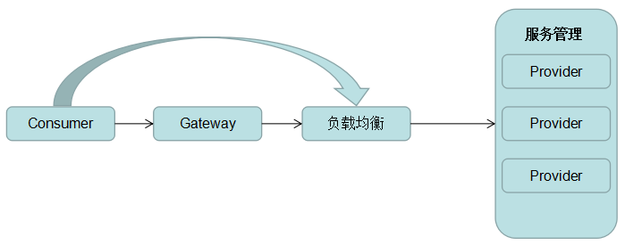
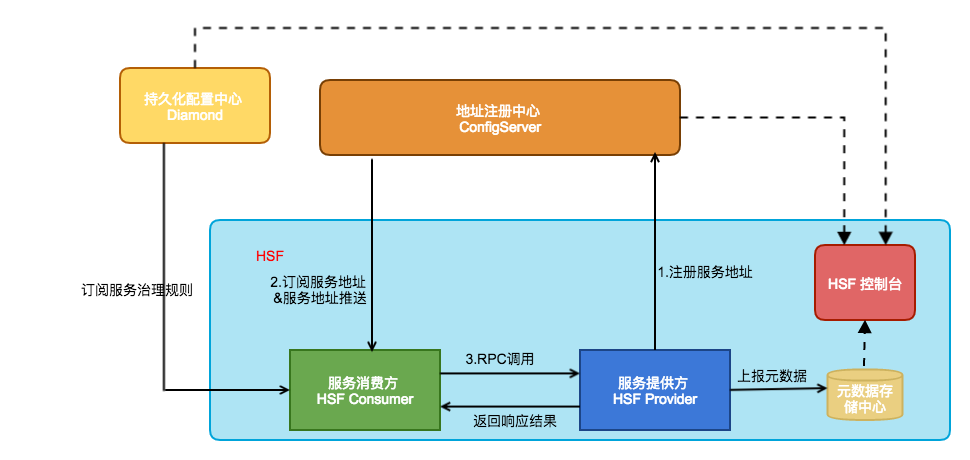
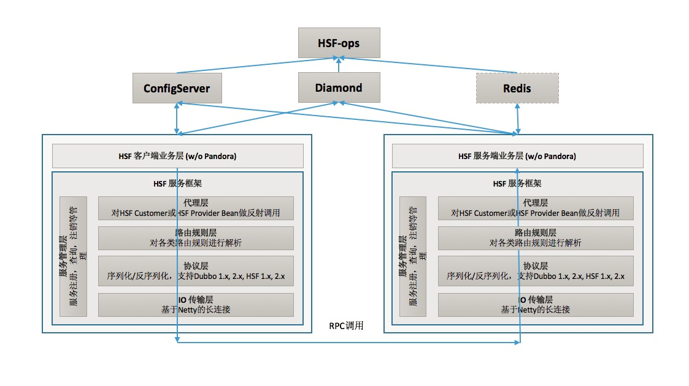
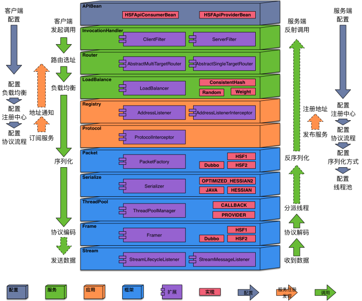
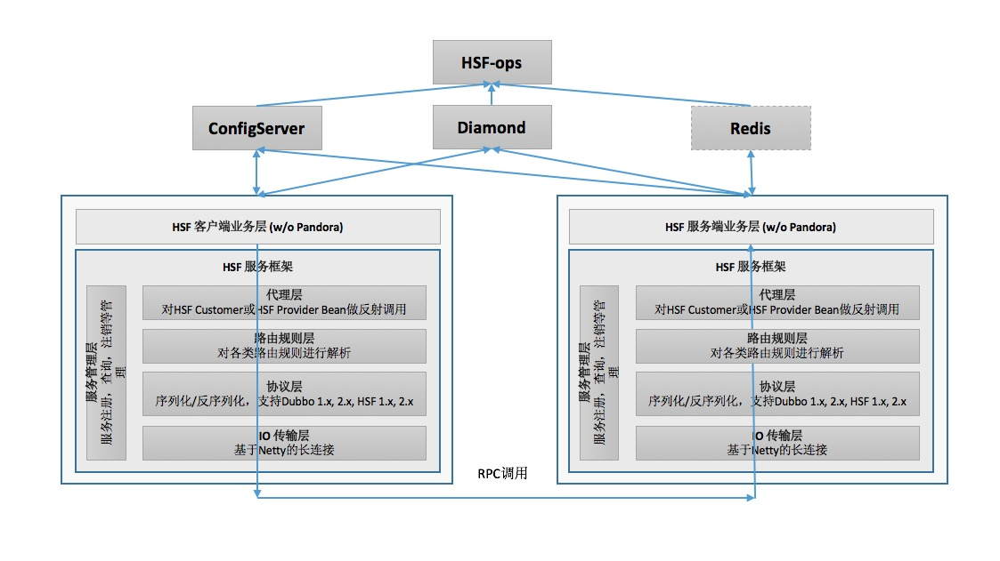
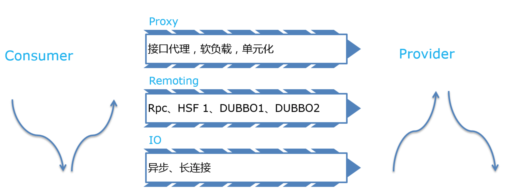

<!-- GFM-TOC -->
* [介绍](#介绍)
  * [RPC](#RPC)
  * [SOA](#SOA)
* [框架](#框架)
  * [HSF](#HSF)
    * [功能角色](#功能角色)
    * [模块](#模块)
    * [内部框架](#内部框架)
    * [调用方式](#调用方式)
    * [负载体系](#负载体系)
  * [Dubbo](#Dubbo)
<!-- GFM-TOC -->

# 介绍

一般意义上，一个公司的业务系统发展脉络基本都是类似，从单体应用到多应用，从本地调用到远程调用，随着发展需要对远程服务进行高效的资源管理，这个过程是系统应对变化和复杂的应对之道。

## RPC

RPC（Remote Process Call），即远程服务调用，被广泛地应用在很多企业应用中，是早期主要的服务治理方案，其流程较为简单，客户端consumer携带参数发送RPC请求到服务提供方provider，provider根据参数路由到具体函数，方法，并将执行获得的结果返回，至此一次RPC调用完成。

随着业务的发展，大数据时代的到来，服务提供方的压力也日益增大，单机应用的处理能力无论在软件，硬件上都受到限制，provider也不可能一直无限扩容，即使扩容，也存在着很多问题，即服务的路由，和Consumer的负载均衡问题。因此，分布式服务架构应运而生，RPC发展到一定阶段思考的变革，成为了分布式服务，云计算的计算机基础。

## SOA

由于简单的RPC调用已经不能随着时代发展满足需求，因此复杂的业务逻辑对于分布式应用架构体系的需求愈发强烈，业务希望自己的服务是分布式部署的，请求是分流的，对数据的操作是能读写分离的，同时能屏蔽许多复杂需要自己编写的底层服务，借助已有的公共服务，去快速的构建自己的应用，降低人力开发维护的成本和提高应用交付的效率，基因此，基于分布式服务思想的SOA（Service-Oriented Architecture）成了新的受追捧的架构。常见的SOA服务调用流程图如下：　

# 框架

## HSF

HSF (High-speed Service Framework)，高速服务框架，是在阿里巴巴内部广泛使用的分布式 RPC 服务框架。

### 功能角色

HSF功能结构上分为6个部分，分别是：服务消费方、服务提供方、地址注册中心、持久化配置中心、元数据存储中心和HSF运维平台（HSF 控制台），它们组合在一起可以提供全功能的分布式服务，其中必须的是服务消费方、服务提供方和地址注册中心，上述功能结构的描述如下表：

| 名称           | 是否必须 | 功能描述                                                                                                                                                                                                                              |
| :------------- | :------: | :------------------------------------------------------------------------------------------------------------------------------------------------------------------------------------------------------------------------------------ |
| 服务消费方     |    是    | 消费服务提供方提供的服务，服务消费者通过地址注册中心订阅服务，根据订阅到的地址信息发起调用，地址注册中心作为旁路不参与调用                                                                                                            |
| 服务提供方     |    是    | 服务提供方会绑定一个端口（一般是12200），接受请求并提供服务，同时将地址信息发布到地址注册中心                                                                                                                                         |
| 地址注册中心   |    是    | 接受服务提供方发布的地址，当服务消费方根据服务进行订阅时，会将地址信息推送给服务消费方，注册中心就是服务信息的中介，提供服务发现的能力                                                                                                |
| 持久化配置中心 |    否    | 持久化的配置中心用于存储 HSF 服务的各种治理规则，HSF 客户端在启动的过程中会向持久化配置中心订阅各种服务治理规则，如路由规则、归组规则、权重规则等，从而根据规则对调用过程的选址逻辑进行干预                                           |
| 元数据存储中心 |    否    | 元数据是指 HSF 服务对应的方法列表以及参数结构等信息，元数据不会对 HSF 的调用过程产生影响，因此元数据存储中心也并不是必须的。但考虑到服务运维的便捷性，HSF客户端在启动时会将元数据上报到元数据存储中心，以便提供给服务运维使用         |
| HSF运维平台    |    否    | HSF 控制台通过打通地址注册中心 ConfigServer、持久化配置中心 Diamond、元数据存储中心 Redis，为用户提供了一些列服务运维功能，包括服务查询、服务治理规则管理、服务测试、服务 Mock、单机运维等，旨在提高 HSF 服务研发的效率、运维的便捷性 |

从上图可以看到，服务提供方在启动后会向地址注册中心发布地址，服务消费方根据服务名向地址注册中心订阅服务地址，当服务地址推送到服务消费方后，服务消费方就可以从地址列表中选择一个地址发起RPC调用。

服务提供方在发布地址的同时会将服务元信息发布到元数据存储中心，HSF控制台通过访问元数据存储中心向使用者展示服务的详情，同时HSF控制台还可以通过持久化配置中心和地址注册中心客户端查询服务信息和规则信息。

### 模块

- 地址注册中心：ConfigServer可以理解为一个IP地址的管理中心，它负责向消费者用户来推送服务端的地址，所以开发人员只需自己配置消费端或者服务端的地址就好。**服务端和客户端都会跟CS建立长连接，并且通过心跳包进行维持**。
- 配置中心：对于分布式服务，客户端如何调用实现负载均衡。规则配置中心Diamond，就是用于存放HSF的各种规则，是一个持久化的配置中心，这里客户端是主动从Diamond上进行拉取配置，并且注册了Listener，当路由规则变化时，Diamond会将新的规则重新推送给客户端，所以，客户端不需要与Diamond保持长连接。
- 容器pandora：pandora是HSF的基础容器，用于管理整个HSF的生命周期和二方包的隔离，同时，其他的几个中间件，configServer和Diamond也在pandora容器中。

### 内部框架

这4块领域从下到上，分别是：框架、应用、服务和配置。框架提供了基础功能，负责通信、线程、协议、序列化以及编解码相关的工作，它们提供了良好的抽象，框架之上的域只需要基于这些抽象就能完成一次高性能的调用。

应用主要面向服务框架的注册和发现过程，是HSF完成分布式调用的基础，它用来支撑服务。服务的粒度比应用小，它包含了调用链路、地址路由以及负载均衡等功能。在服务之上是配置，用户使用API来对各层进行配置，并生成调用的代理或暴露服务。

沿着客户端配置链路可以看到，用户配置了调用的接口、版本以及分组后，可以指定负载均衡策略、注册中心类型以及支持何种协议，当配置完成后，就可以生成客户端代理，开始远程调用了。服务端配置有所不同，除了配置注册中心以外，还可以配置序列化方式以及线程池，这些都会影响服务端的服务能力。

服务注册发现链路比较简单，它们贯穿在协议流程中，负责注册地址或者订阅服务。

调用链路从客户端发起调用开始，经历了客户端的选址和负载均衡后，将参数对象完成序列化，经过框架协议编码后，通过网络层发送出去。服务端接受到数据后进行解码，解码获得的二进制协议派发到服务端线程完成反序列化，生成出参数对象，最终完成反射调用。

### 调用方式

- 同步实时调用：HSF的IO操作都是异步的，这里的同步其本质是做future.get(timeout)在这个点等待服务端的返回
- Future异步调用
- Callback异步调用（客户端需提供回调方法）
- Generic调用（不依赖二方包，通过传入方法名，方法签名和参数值的方式调用服务）
- 服务端async调用（应用将通过AsyncContext写响应）
- HTTP调用HSF(从2.1.1.6版本开始)

此外Node， C++都是可以使用HSF的

#### 兼容调用

一次远程服务调用都要经过代理层，协议层和IO层，其中在协议层，会根据服务提供者支持的协议选择不同的协议进行通信，如果服务提供者是DUBBO，那么就会根据其支持的协议选择DUBBO1或者DUBBO2协议进行传输，上层服务调用者不会感知到任何不同。

### 负载体系

HSF消费者启动的时候，会向ConfigServer注册自己订阅的服务信息，然后CS会将该服务的所有提供者IP推送给客户端，这时客户端就会根据从配置中心Diamond上拉下的规则对这些IP进行分类组装，然后返回给Consumer去随机调用，实现软负载的功能。规则的发布都可以在hsfops平台统一发布。

1. 路由规则：优先级是参数级路由 > 方法级路由 > 接口级路由
2. 归组规则：每个应用唯一的一个归组，只有相同归组的服务（group）才能调用，对于发布了同一HSF服务的所有机器的一个分组。（如果不清楚，一般不要配置）。
3. 同机房优先规则：HSF机房流量控制规则用于对跨机房间的HSF调用流量进行规划控制，能够保证HSF服务消费者在请求HSF服务时，优先选择与服务消费者同机房的服务提供者。同机房规则默认是关闭的。同样在ops上配置。有3个规则属性：
- localPreferredSwitch： on|off
- threshold： float值，生效阀值的计算方法：服务可用比例=本机房可用机器数量/服务所有机房的机器总量当服务可用比例>=threshold时，启用本地机房优先策略当服务可用比例小于threshold时，本地机房优先策略关闭，服务仍然采用随机调用的方式
- exclusions：如果期望该规则只对一部分机器生效，可以使用这一属性配置需要排除的IP，比如：172.24.*,将表示该规则不会应用于所有172.24打头的IP。
4. 权重规则：使用场景一般是压测或者机器的配置不均衡。

## Dubbo

[Dubbo详细内容](/notes/框架/Dubbo.md)
