<!-- GFM-TOC -->
* [MetaQ](#MetaQ)
  * [应用场景](#应用场景)
  * [架构](#架构)
    * [消息模型](#消息模型)
    * [物理模型](#物理模型)
    * [存储结构](#存储结构)
    * [整体存储结构](#整体存储结构)
  * [组件](#组件)
    * [broker](#broker)
  * [特性](#特性)
    * [消息的可靠性保证](#消息的可靠性保证)
    * [消息发布](#消息发布)
    * [消息订阅](#消息订阅)
    * [顺序消息](#顺序消息)
    * [消息过滤](#消息过滤)
    * [消息重试](#消息重试)
    * [消息重复性](#消息重复性)
  * [通信](#通信)
    * [通信方式](#通信方式)
    * [Reactor多线程](#Reactor多线程)
  * [事务消息](#事务消息)
* [消息队列对比](#消息队列对比)
<!-- GFM-TOC -->

分布式消息的主要目的是：解耦、滑峰填谷，保证最终一致性

# MetaQ

MetaQ是一款分布式、队列模型的消息中间件。分为Topic与Queue两种模式，Push（后台轮询pull）和Pull两种方式消费，支持严格的消息顺序，亿级别的堆积能力（超过后订阅消息吞吐量会下降），支持消息回溯（基于时间的回溯消费，）和多个维度的消息查询。

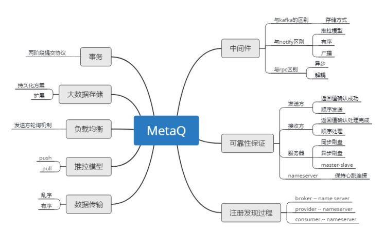

## 应用场景

- 填⾕削峰，如聚⽯塔消息推送
- 和精卫配合做binlog同步、异步分发，TC、IC、UIC、彩票等
- 订单类应⽤，如⼩微⾦融的基⾦理财、阿⾥云官⽹售卖虚拟机等
- 流计算类应⽤，⽐如实时直播间
- IM等实时消息领域，如钉钉的消息总线
- ⼴播⽅式cache同步

## 架构

### 消息模型

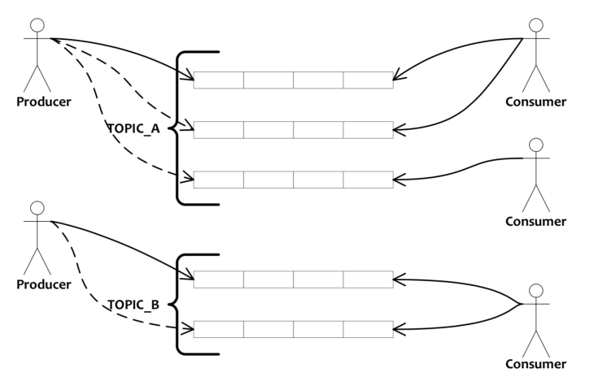

- Producer：消息生产者，负责产生消息并发送消息到meta服务器
- Consumer：消息消费者，负责消费消息，一般是后台系统负责异步消费。
- Broker：Metaq的服务器
- Topic：消息的主题,由用户定义并在服务端配置
- Message：在生产者，消费者，服务器间传递的消息
- Group：组名，一类Producer/Consumer的集合名称，通常称为Producer/Consumer集群
- Offset：消息在服务器上的每个分区都是组织成一个文件列表,消费者拉取数据需要知道数据在文件中的偏移量,这个偏移量就是所谓的offset。

### 物理模型

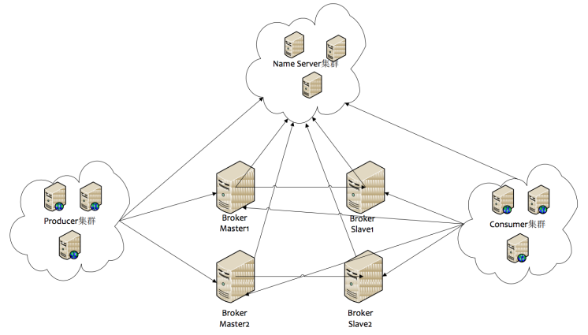

各组件功能为：

- Name Server：注册服务器，Name Server 是一个几乎无状态节点，可集群部署，节点之间无任何信息同步。name server保存topic与broker集群的对应关系，决定哪个topic路由到哪个broker集群。在broker 注册topic信息的时候，写入所有节点。
- Broker：存储转发服务器，每个broker需要与所有的name server建立长连接，从而获取topic信息；分为master和容灾的slaver，Master 与Slave 的对应关系通过指定相同的BrokerName，不同BrokerId 来定义
- Producer：消息发送方，需要与其中一个name server建立连接，获得路由信息，再与主题对应的broker建立长连接且定时向master发送心跳；消息由producer发送到master，再由master同步到所有broker
- Consumer：消息接收方，需要与其中一个name server建立连接，获得路由信息，再向提供服务的master、slaver建立长连接，具体接收消息时刻选择broker

### 存储结构

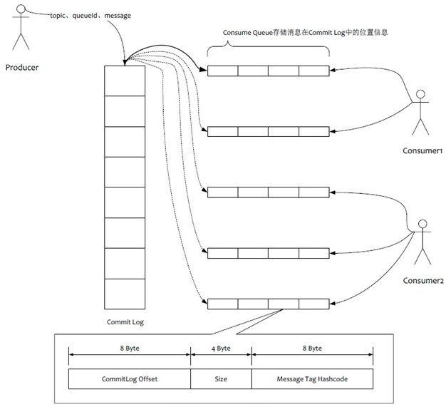

物理队列只有一个，采用固定大小的文件顺序存储消息。逻辑队列有多个，每个逻辑队列有多个分区，每个分区有多个索引。

a.消息顺序写入物理文件里面，每个文件达到一定的大小，新建一个文件继续顺序写数据（消息的写入是串行的，避免了磁盘竞争）。

b.消息的索引则顺序的写入逻辑文件中，并不存放真正的消息，只是存放指向消息的索引。 metaq对于客户端展现的是逻辑队列就是消费队列，consumer从消费队列里顺序取消息进行消费。

这种设计是把物理和逻辑分离，消费队列更加轻量化。所以metaq可以支撑更多的消费队列数，提升消息的吞吐量，并且有一定的消息堆积能力。

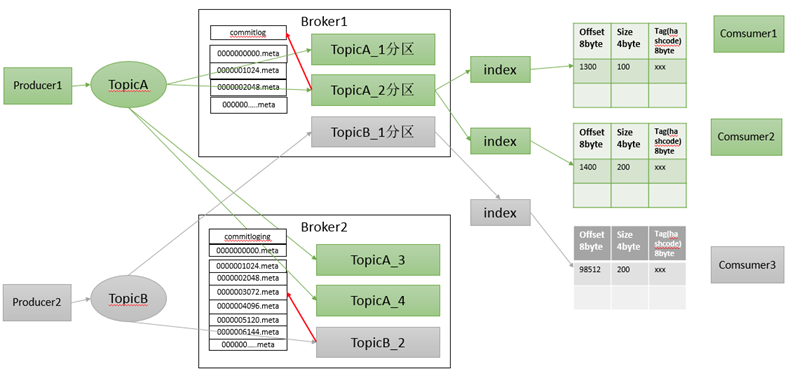

缺点 ： 写虽然是顺序写，但是读却是随机读的 解决办法 ：尽可能让读命中pageCache，减少磁盘IO次数， metaq的所有消息都是持久化的，先写入系统PAGECACHE（页高速缓存），然后刷盘，可以保证内存与磁盘都有一份数据，访问时，直接从内存读取。 刷盘策略分为异步和同步两种。

### 整体存储结构

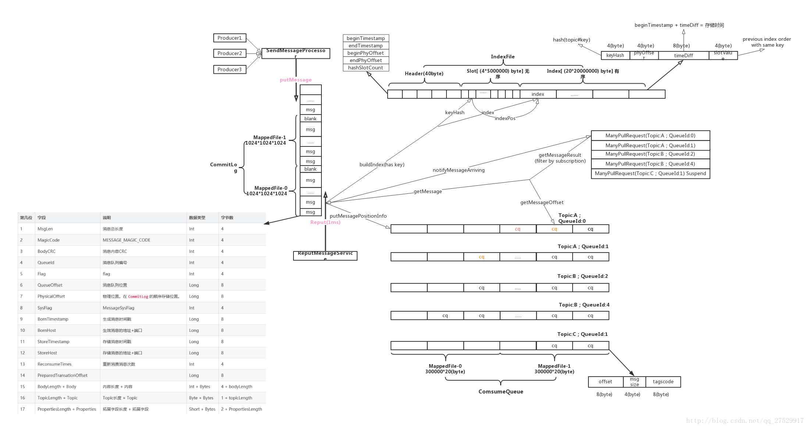

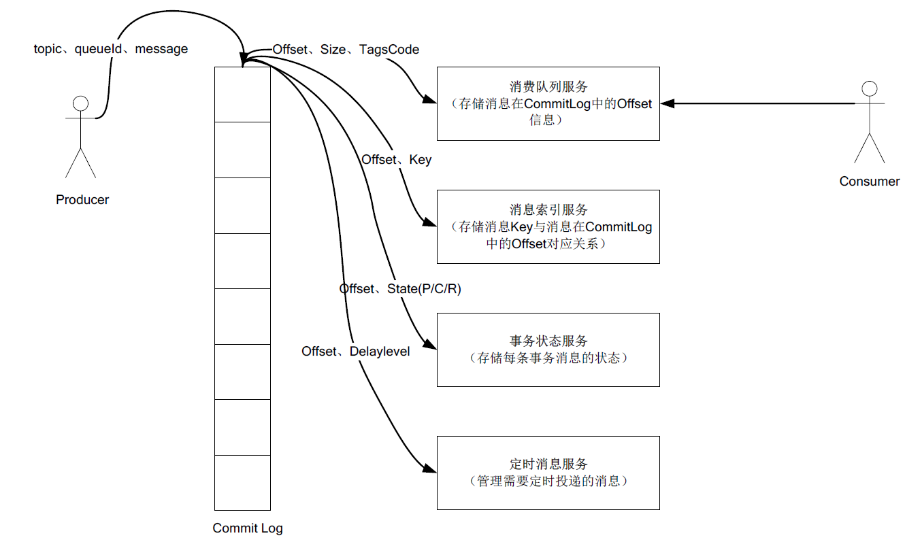

#### index结构

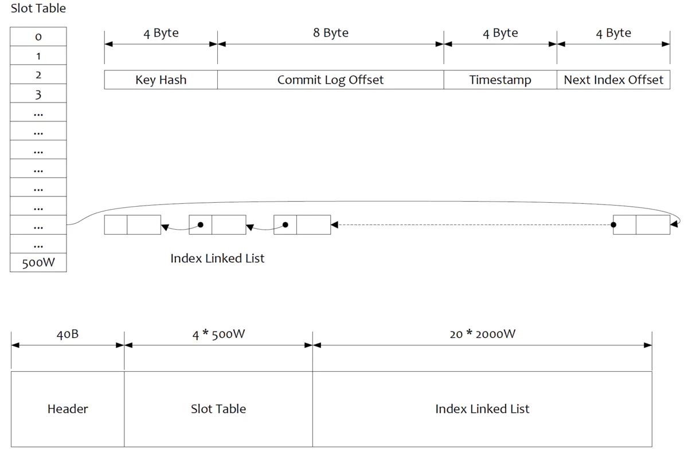

Header：记录落Broker时间戳、偏移量，槽位数目和索引个数

SlotTable：数组插槽，插槽位置 = key的Hash值 % 插槽数量，每个槽位记录当前索引总数

Index Linked List：插槽后接的链表结构，记录key的Hash值、物理偏移地址、落盘时间和哈希冲突后上一个索引地址

- 通过MessageKey检索消息：通过key定位slot，加锁从最大索引值开始倒序查找，比对hash值和落盘时间，返回一致时的物理偏移地址。

## 组件
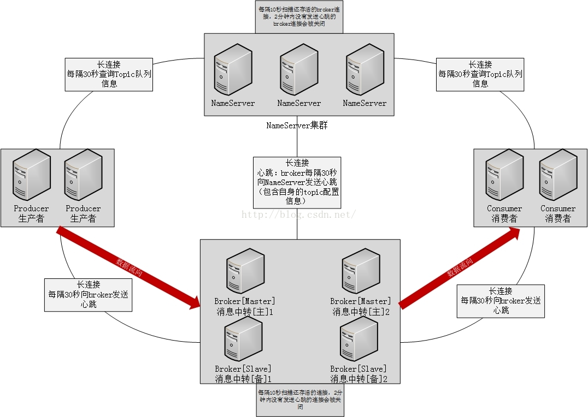

### broker

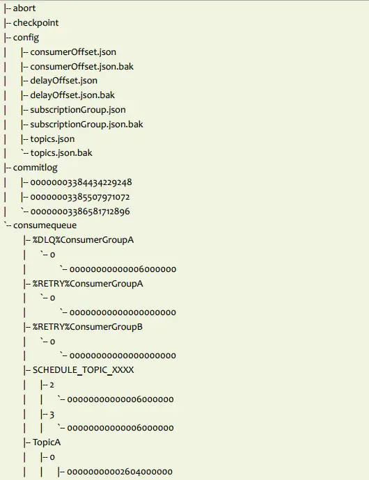

#### 负载均衡
- 一个topic分布在多个broker上，一个broker可以配置多个topic，它们是多对多的关系。
- 如果某个topic消息量很大，应该给它多配置几个队列，并且尽量多分布在不同broker上，减轻某个broker的压力。
- topic消息量都比较均匀的情况下，如果某个broker上的队列越多，则该broker压力越大。

#### 可用性

由于消息分布在各个broker上，一旦某个broker宕机，则该broker上的消息读写都会受到影响。所以rocketmq提供了master/slave的结构，salve定时从master同步数据，如果master宕机，则slave提供消费服务，但是不能写入消息，此过程对应用透明，由rocketmq内部解决。

- 一旦某个broker master宕机，生产者和消费者多久才能发现？受限于rocketmq的网络连接机制，默认情况下，最多需要30秒，但这个时间可由应用设定参数来缩短时间。这个时间段内，发往该broker的消息都是失败的，而且该broker的消息无法消费，因为此时消费者不知道该broker已经挂掉。
- 消费者得到master宕机通知后，转向slave消费，但是slave不能保证master的消息100%都同步过来了，因此会有少量的消息丢失。但是消息最终不会丢的，一旦master恢复，未同步过去的消息会被消费掉。

## 特性
### 消息的可靠性保证

一个消息从发送端应用，到消费端应用，中间有三个过程需要保证消息的可靠性。

1.发送端发消息

消息生产者发送消息后返回SendResult，如果isSuccess返回为true,则表示消息已经确认发送到服务器并被服务器接收存储。整个发送过程是一个同步的过程。保证消息送达服务器并返回结果。 只有当消息中间件及时明确的返回成功，才能确认消息可靠到达消息中间件。

2.消息中间件把消息存储起来

metaq服务器收到消息后首先把消息存放在磁盘文件中，确保持久存储，写入成功之后返回应答给发布者。因此，可以确认每条发送结果为成功的消息服务器都是写入磁盘的。 内存中内容属于非持久数据，会在断电之后丢失。

刷盘方式有同步双写和异步复制：
- 同步双写：主备都刷盘完成才返回成功，能够保证数据的完全可靠性，但是目前主备不能自动切换，还需要手动切换，所以，还可能有部分数据丢失（切换中的数据）。
- 异步复制：异步的同步两个主备磁盘，可以保证数据的99%的不丢，但是当主异常时候，可能会有部分数据没有异步复制完成，导致少量数据丢失。broker slave启动一个线程，不断从master拉取数据，然后异步构建consume queue数据结构。

3.消费端消费消息

消费者是一条接着一条地顺序消费消息，只有在成功消费一条消息后才会接着消费下一条。 如果在消费某条消息失败（如异常），则会尝试重试消费这条消息（默认最大5次），超过最大次数后仍然无法消费，则将消息存储在消费者的本地磁盘，由后台线程继续做重试。而主线程继续往后走，消费后续的消息。。由此来保证消息的可靠消费。

### 消息发布

1. 消息生产者发送消息后返回SendResult，如果isSuccess返回为true,则表示消息已经确认发送到服务器并被服务器接收存储。整个发送过程是一个同步的过程。保证消息送达服务器并返回结果。 只有当消息中间件及时明确的返回成功，才能确认消息可靠到达消息中间件。
2. 发送消息时，如果订阅方有过滤需求，请在消息Tag属性上设置相关值，Tag的名称不需要申请，可自由设置，一条消息只允许设置一个Tag。

### 消息订阅

1. 非顺序消息消费，耗时时间不做限制，但是应用应该尽可能保证耗时短，这样才能达到高性能，另外消费消息Hang住，会导致消息所在队列的消费动作暂停，直到Hang住的消息消费完。对其他队列不受影响
2. 顺序消息消费，耗时时间有限制，要保证每条消息在30s内消费完，超过30s会有潜在的乱序问题。（原因是分布式锁超时问题，但概率极低）
3. 消费方式：
   - 集群消费，一条消息只会被同一个group里一个消费端消费。不同group之间相互不影响。
   - 广播消费，一条消息会被同一个group里每一个消费端消费。
4. 消息堆积：MetaQ每台服务器提供大约亿级的消息堆积能力（多个业务方共用），超过堆积阀值，订阅消息吞吐量会下降。

### 顺序消息

普通顺序消息：正常情况下保证完全的消息顺序，一旦异常，broker重启，由于队列总数发生变化，哈希取模后定位的队列会变化，产生短暂的消息顺序不一致。

严格顺序消息：无论正常异常情况都能保证顺序，但是牺牲了分布式Failover （分布式异常回复机制）特性，即Broker 集群中只要有一台机器不可用，则整个集群都不可用，服务可用性大大降低。无论正常异常情况都能保证顺序，但是牺牲了分布式Failover 特性，即Broker 集群中只要有一台机器不可用，则整个集群都不可用，服务可用性大大降低。

### 消息过滤

在Broker 中，按照Consumer 的要求做过滤，优点是减少了对于Consumer 无用消息的网络传输。缺点是增加了Broker 的负担，实现相对复杂。Notify 支持多种过滤方式，包含直接按照消息类型过滤，灵活的语法表达式过滤，几乎可以满足最苛刻的过滤需求。metaq 支持按照简单的Message Tag 过滤，也支持按照Message Header、body 进行过滤。

### 消息重试

1. 非顺序消息消费失败重试，消费失败的消息发回服务器，应用可以指定这条失败消息下次到达Consumer的时间。消费失败重试次数有限制，通常线上为每个订阅组每条失败消息重试5次（每次消息都会定时重试，定时时间随着重试次数递增，此过程应用可干预）。超过重试次数，消息进入死信队列，并向用户报警。
2. 顺序消息消费失败重试，某个队列正在消费的消息消费失败，会将当前队列挂起（挂起时间应用可通过API设置），其他队列仍然正常消费。

### 消息重复性

MetaQ不能保证消息不重复
- 发送消息阶段，会存在分布式环境下典型的超时问题，即发送消息阶段不能保证消息不重复。
- 订阅消息阶段，由于涉及集群订阅，多个订阅者需要Rebalance方式订阅，在Rebalance短暂不一致情况下，会产生消息重复
- 订阅者意外宕机，消费进度未及时存储，也会产生消息重复
  

解决
- 应用方收到消息后，可通过Tair、DB等去重
- 应用方可通过主动拉的方式，可保证拉消息绝对不重复，但是分布式协调分配队列问题需要应用来控制

## 通信

### 通信方式

同步(sync)
异步(async)
单向(oneway)

### Reactor多线程

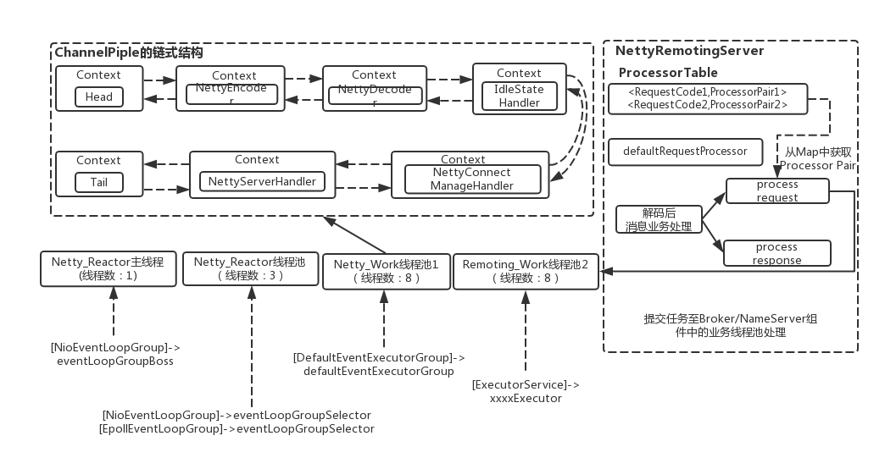

一个 Reactor 主线程（eventLoopGroupBoss，即为上面的1）负责监听 TCP网络连接请求，建立好连接后丢给Reactor 线程池（eventLoopGroupSelector，即为上面的“N”，源码中默认设置为3），它负责将建立好连接的socket 注册到 selector上去（RocketMQ的源码中会自动根据OS的类型选择NIO和Epoll，也可以通过参数配置），然后监听真正的网络数据。拿到网络数据后，再丢给Worker线程池（defaultEventExecutorGroup，即为上面的“M1”，源码中默认设置为8）。

为了更为高效的处理RPC的网络请求，这里的Worker线程池是专门用于处理Netty网络通信相关的（包括编码/解码、空闲链接管理、网络连接管理以及网络请求处理）。而处理业务操作放在业务线程池中执行（在NettyServerHandler中，对接收到的请求数据处理），根据 RomotingCommand 的业务请求码code去processorTable这个本地缓存变量中找到对应的 processor，然后封装成task任务后，提交给对应的业务processor处理线程池来执行（sendMessageExecutor，以发送消息为例，即为上面的 “M2”）。

| 线程数 | 线程名                         | 线程具体说明            |
| ------ | ------------------------------ | ----------------------- |
| 1      | NettyBoss_%d                   | Reactor 主线程          |
| N      | NettyServerEPOLLSelector_%d_%d | Reactor 线程池          |
| M1     | NettyServerCodecThread_%d      | Worker线程池            |
| M2     | RemotingExecutorThread_%d      | 业务processor处理线程池 |

## 事务消息

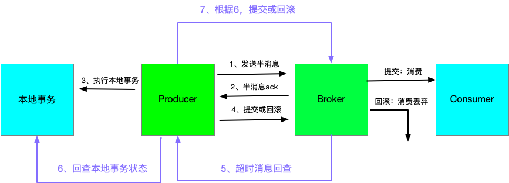

1. 事务消息与普通消息的区别就在于消息生产环节，生产者首先预发送一条消息到MQ(这也被称为发送half消息)
2. MQ接受到消息后，先进行持久化，则存储中会新增一条状态为待发送的消息
3. 然后返回ACK给消息生产者，此时MQ不会触发消息推送事件
4. 生产者预发送消息成功后，执行本地事务
5. 执行本地事务，执行完成后，发送执行结果给MQ
6. MQ会根据结果删除或者更新消息状态为可发送
7. 如果消息状态更新为可发送，则MQ会push消息给消费者，后面消息的消费和普通消息是一样的

局限性：
针对消息消费失败场景，如果是消息处理真的失败了，重试多次仍然失败，如消息消费依赖1-5业务系统，1，2，3，4执行成功，5失败，此时，为了保证一致性，如果直接回滚1-4的操作，复杂度太高。目前这里的处理主要是补偿策略和对账。

Metaq的存储结构是文件记录形式，通过Offset递增进行访问数据，缺乏KV存储具有的update能力，如果要支持事务，必须引入类似于KV存储的模块才可以。所以Metaq目前对分布式事务支持不好。

# 消息队列对比