<!-- GFM-TOC -->
* [缓存更新模式](#缓存更新模式)
  * [Cache Aside](#Cache-Aside)
  * [Read/Write Through 更新模式](#ReadWrite-Through-更新模式)
  * [Write Behind Caching 更新模式](#Write-Behind-Caching-更新模式)
  * [总结](#总结)
* [缓存淘汰算法](#缓存淘汰算法)
  * [最不经常使用算法（LFU）](#最不经常使用算法LFU)
  * [最近最少使用算法（LRU）](#最近最少使用算法LRU)
  * [先进先出算法（FIFO）](#先进先出算法FIFO)
* [Tair](#Tair)
  * [主要功能：](#主要功能)
  * [架构](#架构)
    * [物理架构](#物理架构)
    * [逻辑架构](#逻辑架构)
  * [存储模式对比](#存储模式对比)
  * [数据一致性](#数据一致性)
  * [负载均衡](#负载均衡)
  * [多级缓存](#多级缓存)
    * [热点读写](#热点读写)
* [分布式缓存面临的问题](#分布式缓存面临的问题)
  * [缓存与数据库双写不一致](#缓存与数据库双写不一致)
  * [缓存穿透](#缓存穿透)
  * [缓存雪崩](#缓存雪崩)
  * [缓存击穿](#缓存击穿)
  * [缓存并发竞争](#缓存并发竞争)
* [常见缓存框架](#常见缓存框架)
  * [EhCache](#EhCache)
    * [特性](#特性)
    * [瓶颈](#瓶颈)
  * [Guava Cache](#Guava-Cache)
    * [特性](#特性-1)
<!-- GFM-TOC -->

缓存我们知道分为本地缓存和分布式缓存，本地缓存是本机使用，随着本地计算机系统向分布式系统的扩展，在分布式计算领域中得到了广泛的应用，称为分布式缓存。

分布式缓存能够处理大量的动态数据，因此比较适合应用在Web 2.0时代中的社交网站等需要由用户生成内容的场景。从本地缓存扩展到分布式缓存后，关注重点从CPU、内存、缓存之间的数据传输速度差异也扩展到了业务系统、数据库、分布式缓存之间的数据传输速度差异。

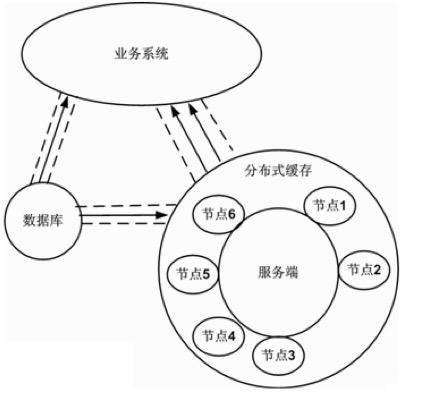

# 缓存更新模式

## Cache Aside

常用的缓存模式了，具体的流程是：

- 失效：应用程序先从 cache 取数据，没有得到，则从数据库中取数据，成功后，放到缓存中。
- 命中：应用程序从 cache 中取数据，取到后返回。
- 更新：先把数据存到数据库中，成功后，再让缓存失效。

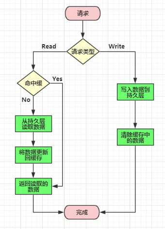

## Read/Write Through 更新模式

在上面的 Cache Aside 更新模式中，应用代码需要维护两个数据存储，一个是缓存（Cache），一个是数据库（Repository）。而在Read/Write Through 更新模式中，应用程序只需要维护缓存，数据库的维护工作由缓存代理了。

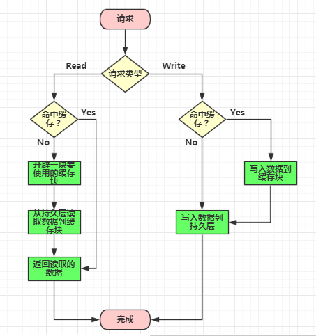

- Read Through：Read Through 模式就是在查询操作中更新缓存，也就是说，当缓存失效的时候，Cache Aside 模式是由调用方负责把数据加载入缓存，而 Read Through 则用缓存服务自己来加载。
- Write Through：Write Through 模式和 Read Through 相仿，不过是在更新数据时发生。当有数据更新的时候，如果没有命中缓存，直接更新数据库，然后返回。如果命中了缓存，则更新缓存，然后由缓存自己更新数据库（这是一个同步操作）。

## Write Behind Caching 更新模式

Write Behind Caching 更新模式就是在更新数据的时候，只更新缓存，不更新数据库，而我们的缓存会异步地批量更新数据库。这个设计的好处就是直接操作内存速度快。因为异步，Write Behind Caching 更新模式还可以合并对同一个数据的多次操作到数据库，所以性能的提高是相当可观的。

但其带来的问题是，数据不是强一致性的，而且可能会丢失。另外，Write Behind Caching 更新模式实现逻辑比较复杂，因为它需要确认有哪些数据是被更新了的，哪些数据需要刷到持久层上。只有在缓存需要失效的时候，才会把它真正持久起来。

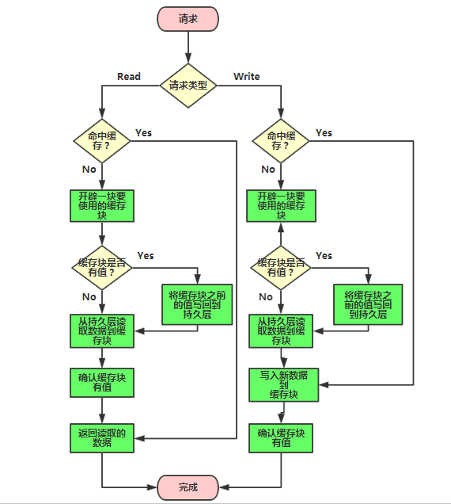

## 总结

三种缓存模式的优缺点：

Cache Aside 更新模式实现起来比较简单，但是需要维护两个数据存储，一个是缓存（Cache），一个是数据库（Repository）。

Read/Write Through 更新模式只需要维护一个数据存储（缓存），但是实现起来要复杂一些。

Write Behind Caching 更新模式和Read/Write Through 更新模式类似，区别是Write Behind Caching 更新模式的数据持久化操作是异步的，但是Read/Write Through 更新模式的数据持久化操作是同步的。优点是直接操作内存速度快，多次操作可以合并持久化到数据库。缺点是数据可能会丢失，例如系统断电等。

缓存是通过牺牲强一致性来提高性能的。所以使用缓存提升性能，就是会有数据更新的延迟。这需要我们在设计时结合业务仔细思考是否适合用缓存。然后缓存一定要设置过期时间，这个时间太短太长都不好，太短的话请求可能会比较多的落到数据库上，这也意味着失去了缓存的优势。太长的话缓存中的脏数据会使系统长时间处于一个延迟的状态，而且系统中长时间没有人访问的数据一直存在内存中不过期，浪费内存。

# 缓存淘汰算法

缓存淘汰算法是指令的一个明细表，用于决定缓存系统中哪些数据应该被删去。

## 最不经常使用算法（LFU）

这个缓存算法使用一个计数器来记录条目被访问的频率。通过使用LFU缓存算法，最低访问数的条目首先被移除。这个方法并不经常使用，因为它无法对一个拥有最初高访问率之后长时间没有被访问的条目缓存负责。

## 最近最少使用算法（LRU）

LRU（The Least Recently Used，最近最久未使用算法）是一种常见的缓存算法，在很多分布式缓存系统（如Redis, Memcached）中都有广泛使用。

这个缓存算法将最近使用的条目存放到靠近缓存顶部的位置。当一个新条目被访问时，LRU将它放置到缓存的顶部。当缓存达到极限时，较早之前访问的条目将从缓存底部开始被移除。这里会使用到昂贵的算法，而且它需要记录“年龄位”来精确显示条目是何时被访问的。此外，当一个LRU缓存算法删除某个条目后，“年龄位”将随其他条目发生改变。

## 先进先出算法（FIFO）

FIFO是英文First In First Out 的缩写，是一种先进先出的数据缓存器，他与普通存储器的区别是没有外部读写地址线，这样使用起来非常简单，但缺点就是只能顺序写入数据，顺序的读出数据，其数据地址由内部读写指针自动加1完成，不能像普通存储器那样可以由地址线决定读取或写入某个指定的地址。

# Tair

Tair是一个类似于map的key/value结构存储系统（也就是缓存系统），具备标准的特性是：高性能、高扩展、高可靠，也就是传说中的三高产品，支持分布式集群部署。官网说目前支持java和c这两个版本。

- 高性能——基于高速缓存、内存或者ssd
- 高扩展——轻量中间件+三种数据引擎+负载均衡
- 高可用——各种容灾部署方式和解决方案

## 主要功能：

- 数据库缓存——作为数据库与dao层之间的中间缓存，降低对后端数据库的访问压力，高速缓存能使得访问速度达到1ms级别，例如高频率的数据库查询；
- 临时数据存储——应用程序需要维护大量临时数据，将临时数据存储在mdb中，可以降低内存管理的开销，改进应用程序工作负载。例如：在分布式系统中，同一个用户的不同请求可能会发送到不同的服务器上，这时可以用mdb作为全局存储，用于保存Session数据、用户的Token、权限信息等数据。【通常将缓存和临时数据存储统称为“非持久化存储”】
- 持久化存储——此时类似于传统的数据库，将数据存入磁盘中做持久化存储，例如广告推荐类需要离线计算大量数据以及榜单的生成（注意：由于此时采用的数据库引擎ldb是NoSQL类型的，所以不支持sql查询）

## 架构

### 物理架构

Tair是Master/Slave结构。Config Server管理Data Server节点、维护Data Server的状态信息；Data Server负责数据存储，按照Config Server的指示完成数据复制和迁移工作，并定时给Config Server发送心跳信息。Config Server是单点，采用一主一备的方式保证可靠性。

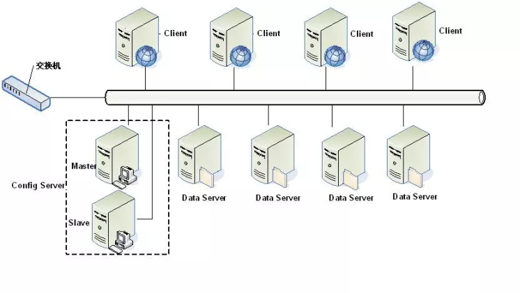

### 逻辑架构

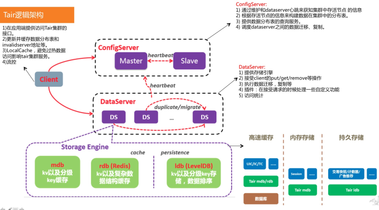

## 存储模式对比

| 名称 | 基于数据库 | 特点                                                                   | 适用场景                                                                                                                |
| ---- | ---------- | ---------------------------------------------------------------------- | ----------------------------------------------------------------------------------------------------------------------- |
| MDB  | Memcached  | 基于内存；仅支持k-v类型数据；不支持持久化                              | 数据小而简单，读多（QPS 万以上）写少，且偶尔数据丢失不应该对业务产生较大影响；例如访问量显示，session manager等功能     |
| RDB  | Redis      | 基于内存；除了kv，还支持string, list, hash, set, sortedset等数据类型； | 支持一定程度的持久化                                                                                                    | 数据形式复杂，偶尔数据丢失不应该对业务产生较大影响；例如排行榜、最新项目检索、地理位置存储及range查询。 |
| LDB  | LevelDB    | 基于ssd硬盘；仅支持k-v类型数据；支持持久化                             | 数据简单，有持久化需求，且读写QPS较高（万级别）但存储数据较简单的应用场景；例如订单计数，库存记录等功能，更新非常频繁。 |

## 数据一致性

Tair使用版本号version来保证数据一致性。在Tair的put接口中有version参数，如果不带version参数，则不考虑并发，直接强制更新。
- version：为解决并发更新同一个数据而设置。当version=0时，表示强制更新，当version非0时，判断客户端和服务端当version是否一致，不一致则返回ResultCode.VERERROR.
- version的增加是服务器端的行为，tair并不支持多版本数据。另外，更新也是使用put接口。
- version的值是由服务器端决定的，和client指定的version值无关。

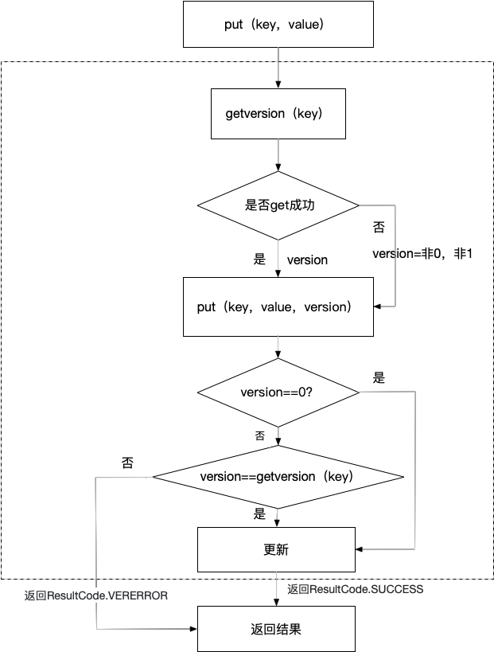

## 负载均衡

分布式负载均衡采用的是一致性哈希算法

1. 将机器根据hash函数映射到环上；
2. 将数据桶根据hash函数映射到换上；
3. 据数据映射到桶的位置顺时针找到第一台机器将该桶放到该机器上；
4. 当某台机器坏掉时，类似(3)将存储在该机器上的数据顺时针找到下一台机器；
5. 当增加机器时，将该机器与前一台机器(逆时针)之间的桶存储在新增机器上并从原来机器上移除。

- 优点：相比简单的对机器数取模算法，当节点变动的时候只有相对较少的key失效，实现也相对简单。不需要进行数据迁移，每个服务器是独立的。
- 缺点：还是会有部分的key失效，如果访问量非常大的时候，如果访问到失效的key的时候，就会直接访问到数据源上面去了，可能会导致数据源直接压挂。

## 多级缓存

问题背景

Tair是一个高性能、分布式、可扩展、高可靠的NoSQL存储系统，在阿里巴巴集团内部有着大量的部署和使用。由于Tair的访问方式是客户端对请求的Key进行类一致性 Hash 计算后，再通过数据路由表查表定位到某台DataServer（数据节点服务器）进行读写的，所以对相同Key的读写请求必然固定映射到相同的DataServer上，如图
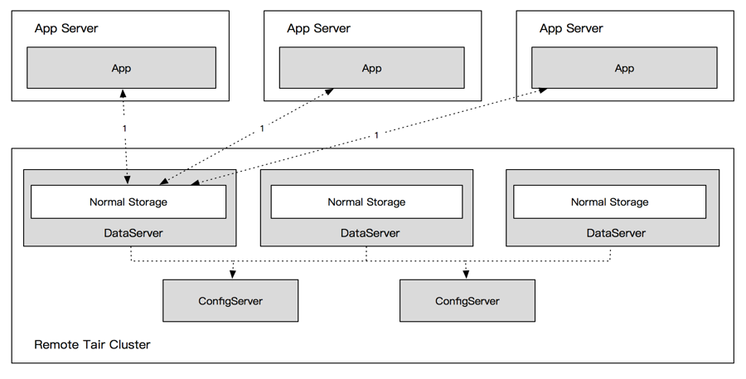

此时DataServer单节点的读写性能便成了单Key的读写性能瓶颈，且无法通过简单的水平扩展来解决。由于电商系的促销活动天然的存在热点数据，所以热点数据缓存的读写能力对整个缓存集群的稳定性和服务能力都起着至关重要的作用。

### 热点读写

#### 热点识别

DataServer收到客户端的请求后，由每个具体处理请求的工作线程（Worker Thread）进行请求的统计。工作线程用来统计热点的数据结构均为ThreadLocal模式的数据结构，完全无锁化设计。热点识别算法使用精心设计的多级加权LRU链和HashMap组合的数据结构，在保证服务端请求处理效率的前提下进行请求的全统计，支持QPS热点和流量热点（即请求的QPS不大但是数据本身过大而造成的大流量所形成的热点）的精准识别。每个采样周期结束时，工作线程会将统计的数据结构转交到后台的统计线程池进行分析处理。统计工作异步在后台进行，不抢占正常的数据请求的处理资源。

#### 读热点

1. 服务端设计

相同Key的读写请求必然落在固定的DataServer上，且无法通过水平扩展DataServer数量来解决。

通过在DataServer上划分一块HotZone存储区域的方式来解决热点数据的访问。该区域存储当前产生的所有读热点的数据，由客户端配置的缓存访问逻辑来处理各级缓存的访问。多级缓存架构如下：

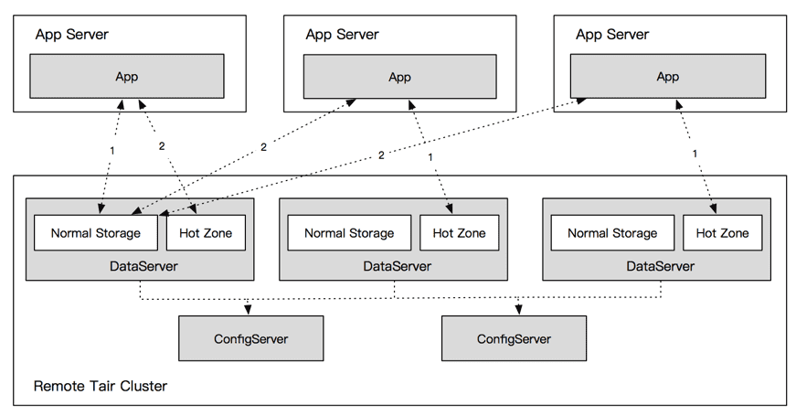

所有DataServer的HotZone存储区域之间没有权重关系，每个HotZone都存储相同的读热点数据。客户端对热点数据Key的请求会随机到任意一台DataServer的HotZone区域，这样单点的热点请求就被散列到多个节点乃至整个集群。

DataServer的HotZone使用独立的网络IO线程与工作线程，监听独立的热点数据读写端口，并初始化独立的LocalTair 模式的Mdb实例，进行热点数据的存储。使用独立的Mdb实例的原因是该逻辑要同时兼容Mdb和Ldb引擎，为了一套代码通用，所以从IO线程到Worker线程再到具体的处理线程都是独立的代码逻辑，并使用独立的Mdb实例进行存储。

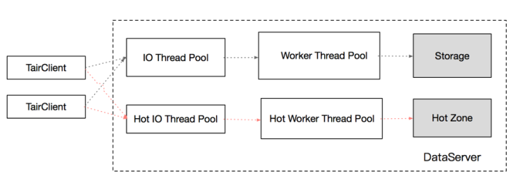

2. 客户端设计

当客户端在第一次请求前初始化时，会获取整个Tair集群的节点信息以及完整的数据路由表，同时也会获取配置的热点散列机器数（即客户端访问的HotZone的节点范围）。随后客户端随机选择一个HotZone区域作为自身固定的读写HotZone区域。在DataServer数量和散列机器数配置未发生变化的情况下，不会改变选择。即每个客户端只访问唯一的HotZone区域。

#### 写热点

对于写热点，因为一致性的问题，难以使用多级缓存的方式来解决。

热点Key的写请求在IO线程被分发到专门的热点合并线程处理，该线程根据Key对写请求进行一定时间内的合并，随后由定时线程按照预设的合并周期将合并后的请求提交到引擎层。合并过程中请求结果暂时不返回给客户端，等请求合并写入引擎成功后统一返回。这样做不会有一致性的问题，不会出现写成功后却读到旧数据，也避免了LDB集群返回成功，数据并未落盘的情况（假写）。具体的合并周期在服务端可配置，并支持动态修改生效。

# 分布式缓存面临的问题

## 缓存与数据库双写不一致

一般来说，如果允许缓存可以稍微的跟数据库偶尔有不一致的情况，也就是说如果你的系统不是严格要求 “缓存+数据库” 必须保持一致性的话，最好不要做这个方案，即：读请求和写请求串行化，串到一个内存队列里去。

串行化可以保证一定不会出现不一致的情况，但是它也会导致系统的吞吐量大幅度降低，用比正常情况下多几倍的机器去支撑线上的一个请求。

## 缓存穿透

访问一个不存在的 key，缓存不起作用，请求会穿透到 DB，流量大时 DB 会挂掉。

举个栗子。系统A，每秒 5000 个请求，结果其中 4000 个请求是黑客发出的恶意攻击。数据库 id 是从 1 开始的，而黑客发过来的请求 id 全部都是负数。这样的话，缓存中不会有，请求每次都“视缓存于无物”，直接查询数据库。这种恶意攻击场景的缓存穿透就会直接把数据库给打死。

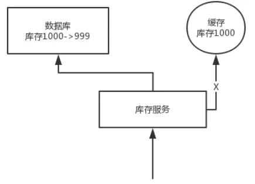

解决方案：

1. 对查询结果为空的情况也进行缓存，缓存时间设置短一点，或者该 key 对应的数据 insert 之后再清理缓存。
2. 对一定不存在的 key 进行过滤。可以把所有的可能存在的key放到一个大的Bitmap中，查询时通过该Bitmap过滤。

## 缓存雪崩

对于系统 A，假设每天高峰期每秒 5000 个请求，本来缓存在高峰期可以扛住每秒 4000 个请求，但是缓存机器意外发生了全盘宕机。缓存挂了，此时 1 秒 5000 个请求全部落数据库，数据库必然扛不住，它会报一下警，然后就挂了。此时，如果没有采用什么特别的方案来处理这个故障，DBA 很着急，重启数据库，但是数据库立马又被新的流量给打死了。

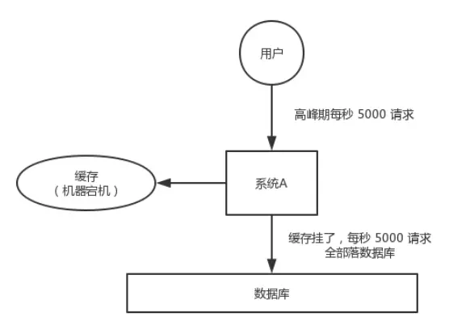

解决方案：
1. 在缓存失效后，通过加锁或者队列来控制读数据库写缓存的线程数量。比如对某个 key 只允许一个线程查询数据和写缓存，其他线程等待。
2. 不同的 key，设置不同的过期时间，让缓存失效的时间点尽量均匀。
3. 做二级缓存，A1 为原始缓存，A2为拷贝缓存，A1 失效时，可以访问 A2，A1 缓存失效时间设置为短期，A2 设置为长期（此点为补充）

缓存雪崩的事前事中事后的解决方案如下：

事前：Redis 高可用，主从+哨兵，Redis cluster，避免全盘崩溃。
事中：本地 ehcache 缓存 + hystrix 限流&降级，避免 MySQL 被打死。
事后：Redis 持久化，一旦重启，自动从磁盘上加载数据，快速恢复缓存数据。

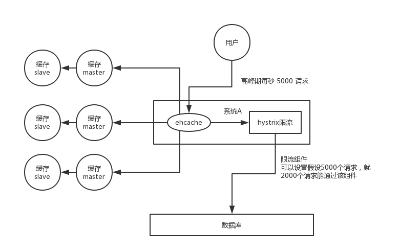

用户发送一个请求，系统 A 收到请求后，先查本地 ehcache 缓存，如果没查到再查 Redis。如果 ehcache 和 Redis 都没有，再查数据库，将数据库中的结果，写入 ehcache 和 Redis 中。

限流组件，可以设置每秒的请求，有多少能通过组件，剩余的未通过的请求，怎么办？走降级！可以返回一些默认的值，或者友情提示，或者空值。

好处：
- 数据库绝对不会死，限流组件确保了每秒只有多少个请求能通过。
- 只要数据库不死，就是说，对用户来说，2/5 的请求都是可以被处理的。
- 只要有 2/5 的请求可以被处理，就意味着你的系统没死，对用户来说，可能就是点击几次刷不出来页面，但是多点几次，就可以刷出来了

## 缓存击穿

某个 key 非常热点，访问非常频繁，处于集中式高并发访问的情况，当这个 key 在失效的瞬间，大量的请求就击穿了缓存，直接请求数据库，就像是在一道屏障上凿开了一个洞。

解决方案：
1. 使用互斥锁 (mutex key)：感知到缓存失效，去查询 DB 时，使用分布式锁，使得只有一个线程去数据库加载数据，加锁失败的线程，等待即可。
2. 手动过期：redis 上从不设置过期时间，功能上将过期时间存在 key 对应的 value 里，如果发现要过期，通过一个后台的异步线程进行缓存的构建，也就是“手动”过期。

不同场景下的解决方式可如下：
- 若缓存的数据是基本不会发生更新的，则可尝试将该热点数据设置为永不过期。
- 若缓存的数据更新不频繁，且缓存刷新的整个流程耗时较少的情况下，则可以采用基于 Redis、zookeeper 等分布式中间件的分布式互斥锁，或者本地互斥锁以保证仅少量的请求能请求数据库并重新构建缓存，其余线程则在锁释放后能访问到新缓存。
- 若缓存的数据更新频繁或者在缓存刷新的流程耗时较长的情况下，可以利用定时线程在缓存过期前主动地重新构建缓存或者延后缓存的过期时间，以保证所有的请求能一直访问到对应的缓存。

## 缓存并发竞争

某个时刻，多个系统实例都去更新某个 key。可以基于 zookeeper 实现分布式锁。每个系统通过 zookeeper 获取分布式锁，确保同一时间，只能有一个系统实例在操作某个 key，别人都不允许读和写。

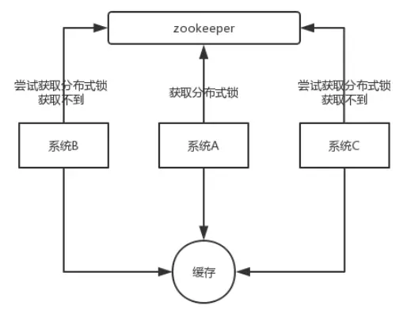

要写入缓存的数据都是从 mysql 里查出来的，都得写入 mysql 中，写入 mysql 中的时候必须保存一个时间戳，从 mysql 查出来的时候，时间戳也要查出来。

每次要写之前，先判断一下当前这个 value 的时间戳是否比缓存里的 value 的时间戳要新。如果是的话，那么可以写，否则，就不能用旧的数据覆盖新的数据。

# 常见缓存框架

## EhCache

EhCache 是一个纯Java的进程内缓存框架，具有快速、精干等特点，是Hibernate中默认CacheProvider

### 特性

- 快速、简单
- 多种缓存策略
- 缓存数据有两级：内存和磁盘
- 缓存数据会在虚拟机重启的过程中写入磁盘
- 可以通过RMI、可插入API等方式进行分布式缓存
- 具有缓存和缓存管理器的侦听接口
- 支持多缓存管理器实例，以及一个实例的多个缓存区域
- 内存统计

### 瓶颈

- 缓存漂移（Cache Drift）
每个应用节点只管理自己的缓存，在更新某个节点的时候，不会影响到其他的节点，这样数据之间可能就不同步了。

- 数据库瓶颈（Database Bottlenecks ）
对于单实例的应用来说，缓存可以保护数据库的读风暴；但是，在集群的环境下，每一个应用节点都要定期保持数据最新，节点越多，要维持这样的情况对数据库的开销也越大。

## Guava Cache

Guava Cache是Google开源的Java重用工具集库Guava里的一款缓存工具，它的设计灵感来源于ConcurrentHashMap，使用多个segments方式的细粒度锁，在保证线程安全的同时，支持高并发场景需求，同时支持多种类型的缓存清理策略，包括基于容量的清理、基于时间的清理、基于引用的清理等。
      Guava cache是google开发的，目前被常用在单机上，如果是分布式，它就无能为力了

### 特性

guava cache类似concurrentMap使用分段锁提高并发写的效率
- 支持缓存三种缓存淘汰策略
- 支持缓存移除监听(移除、过期、gc回收)
- 支持key/value的软引用、弱引用缓存
- 命中率统计