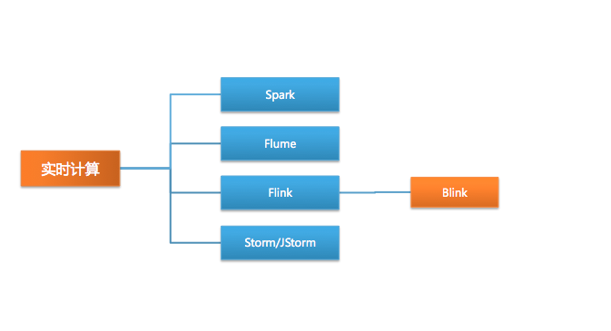
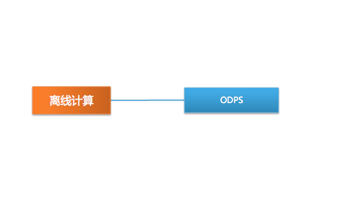

<!-- GFM-TOC -->
* [分布式计算](#分布式计算)
<!-- GFM-TOC -->

# 分布式计算

分布式计算系统构建在分布式存储的基础上，充分发挥分布式系统的数据冗余灾备，多副本高效获取数据的特性，进而并行计算，把原本需要长时间计算的任务拆分成多个任务并行处理，从而提高了计算效率。分布式计算系统在场景上分为离线计算，实时计算和流式计算。

- 离线：Hadoop
- 实时：Spark
- 流式：Storm，Flink/Blink

