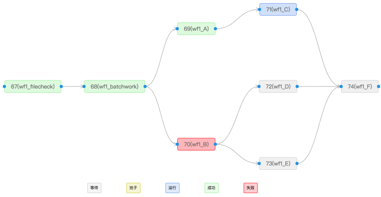
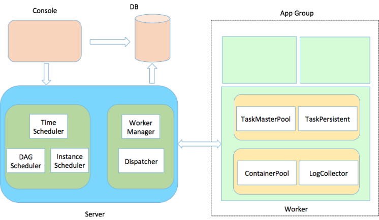
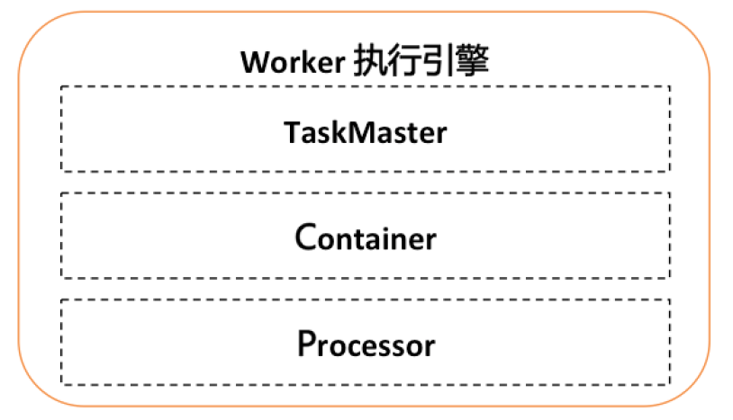

<!-- GFM-TOC -->
* [Schedulerx](#Schedulerx)
  * [主要功能](#主要功能)
  * [系统架构](#系统架构)
<!-- GFM-TOC -->

# Schedulerx

Schedulerx是阿里中间件自研的基于Akka架构（Akka in Schedulerx2.0）的新一代分布式任务调度平台，提供定时、任务编排、分布式跑批等功能，具有高可靠、海量任务、秒级调度、可运维等能力。

Schedulerx2.0开始于2018-01-22，没有参考DTS和Schedulerx，是全新自研的下一代任务调度平台，不但兼容老版本编程模型，还提供更多更快更强的能力。

- 更多：支持多种时间表达式，任务编排，支持更多的业务场景。单机群支持上千万任务，一天上十亿次调度，支持更多的任务数。
- 更快：支持秒级别调度，处理准实时业务。
- 更强：支持日志查询、原地重跑、重刷数据等多种操作，提供更强的运维能力和排错手段。

## 主要功能

- 强大的定时调度器：Crontab，当然，必须支持crontab表达式
- Fixed rate：众所周知，crontab必须被60整除，比如想每隔40分钟跑一次，cron不支持。Fixed rate专门用来做定期轮询，表达式简单。
- Fixed delay：适合做轮询的业务，比如每次执行完成隔10秒再跑，那么fixed delay非常适合你。
- 日历：支持多种日历，还可以自定义导入日历。比如金融业务需要在每个交易日执行。
- 时区：跨国的业务，需要在每个国家的时区定时执行某个任务。
- 任务编排：schedulerx2.0支持工作流（DAG）进行任务编排，操作简单，前端直接单手操作拖拖拽拽即可。详细的任务状态图能一目了然看到下游任务为什么没跑，如下图：
  
- 任务类型：支持多种任务类型，可以无限扩展！
  - java：可以跑在用户进程中，也可以上传jar包动态加载。
  - shell：前端直接写shell脚本。
  - python：前端直接写python脚本，需要机器有python环境。
  - go：前端直接写go脚本，需要机器有go环境。
  - 自定义：用户甚至可以自定义任务类型，然后实现一个plugin就行
- 执行方式&分布式编程模型
  - 单机：随机挑选一台机器执行
  - 广播：所有机器同时执行且等待全部结束
  - 并行计算：map/mapreduce模型，1~300个子任务，有子任务列表。
  - 内存网格：map/mapreduce模型，10W以下子任务，无子任务列表，基于内存计算，比网格计算快。
  - 网格计算：map/mapreduce模型，100W以下子任务，无子任务列表，基于文件H2计算。

## 系统架构

可扩展的执行引擎

- TaskMaster：类似于yarn的AppMaster，支持可扩展的分布式执行框架，进行整个jobInstance的生命周期管理、container的资源管理，同时还有failover等能力。默认实现StandaloneTaskMaster（单机执行），BroadcastTaskMaster（广播执行），MapTaskMaster（并行计算、内存网格、网格计算），MapReduceTaskMaster（并行计算、内存网格、网格计算）。
- Container：执行业务逻辑的容器框架，支持线程/进程/docker/actor等。
- Processor：业务逻辑框架，不同的processor表示不同的任务类型。