<!-- GFM-TOC -->
* [JavaScript](#JavaScript)
  * [JavaScript 简介](#JavaScript-简介)
* [JavaScript 语法](#JavaScript-语法)
  * [基础语法](#基础语法)
    * [变量](#变量)
    * [数据类型](#数据类型)
    * [作用域](#作用域)
    * [运算符](#运算符)
    * [流程控制](#流程控制)
  * [函数](#函数)
    * [自定义函数](#自定义函数)
    * [系统函数(内置函数)](#系统函数内置函数)
  * [面向对象](#面向对象)
    * [创建对象](#创建对象)
    * [构造函数](#构造函数)
    * [原型和原型链](#原型和原型链)
    * [继承](#继承)
  * [正则表达式](#正则表达式)
* [JavaScript DOM](#JavaScript-DOM)
  * [简介](#简介)
  * [节点树](#节点树)
    * [节点类型及属性](#节点类型及属性)
    * [文档节点(Document对象)](#文档节点Document对象)
    * [元素节点(Element对象)](#元素节点Element对象)
    * [属性节点(Attr对象)](#属性节点Attr对象)
    * [文本节点(Text)](#文本节点Text)
  * [事件](#事件)
    * [事件流](#事件流)
    * [事件处理程序](#事件处理程序)
    * [事件处理函数](#事件处理函数)
* [JavaScript BOM](#JavaScript-BOM)
  * [window 对象](#window-对象)
  * [其他对象](#其他对象)
    * [frames](#frames)
    * [history](#history)
    * [location](#location)
    * [screen](#screen)
    * [navigator](#navigator)
* [JavaScript 使用](#JavaScript-使用)
<!-- GFM-TOC -->


# JavaScript

## JavaScript 简介

JavaScript 是一种脚本，一门编程语言，它可以在网页上实现复杂的功能，网页展现给你的不再是简单的静态信息，而是实时的内容更新。

**JavaScript语言的介绍**：JavaScript是基于对象和原型的一种动态、弱类型的脚本语言

**JavaScript语言的组成**：JavaScript是由核心语法(ECMAScript)、文档对象模型(DOM)、浏览器对象模型(BOM)组成的


# JavaScript 语法

## 基础语法

### 变量

**变量的声明**
- var变量：var 变量名 = 值;
  - 存在变量声明提前,可声明同名变量覆盖。
- let变量：let 变量名 = 值;
  - 存在暂时性死区，不存在变量声明提前，不允许重复定义
- const变量：const 变量名 = 值;
  - 使用时必须初始化(即必须赋值)，存在暂时性死区，不存在变量声明提前，不允许重复定义


**暂时性死区**：只要一进入当前作用域，所要使用的变量就已经存在了，但是不可获取，只有等到声明变量的那一行代码出现，才可以获取和使用该变量

**变量声明提升**：变量在声明之前就访问，var会使用默认值undefined，而let会直接报错

**隐式变量**是指没有用var，let，const等关键字定义的变量，隐式变量是不存在变量提升

**变量声明方式区别**

|                  | var       | let  | const                          |
| ---------------- | --------- | ---- | ------------------------------ |
| 是否必须显式声明 | 否        | 是   | 是                             |
| 是否可重复声明   | 是        | 否   | 否                             |
| 是否可修改       | 是        | 是   | 基本数据类型不可，引用类型可以 |
| 作用域           | 全局/函数 | 块级 | 块级                           |
| 暂时性死区       | 否        | 是   | 是                             |
| 变量提升         | 是        | 否   | 否                             |

### 数据类型

数据类型判断 typeof

**原始类型**(基本类型)：值不可变(原始值)

- Number 表示所有的数值类型，数值范围在(Number.MIN_VALUE~Number.MAX_VALUE)之间，超出范围会自动转化为[-+]Infinity(无穷)，NaN是一个非数值
- String 表示一个字符串，其他类型可以使用toString方法转为字符串
- Boolean 布尔类型 只有true和false两个值
- Null 只有一个值null，表示一个空指针对象，因此我们应该将保存对象的变量初始化为null
- Undefined 未定义（声明了是var变量，但是没有赋值的时候）
- Symbol类型：表示一个符号，符号类型是唯一的并且是不可修改的

**引用类型**：值可变
- 引用类型是一种数据结构，用于将数据和功能组织在一起
- 常见引用类型：对象（Object）、数组（Array）、函数（Function）、正则（RegExp）和日期（Date）等

### 作用域

作用域（scope）就是变量访问规则的有效范围。
- 作用域外，无法引用作用域内的变量；
- 离开作用域后，作用域的变量的内存空间会被清除，比如执行完函数或者关闭浏览器
- 作用域与执行上下文是完全不同的两个概念。

#### 执行期上下文

当函数执行时，会创建一个称为执行期上下文的内部对象。一个执行期上下文定义了一个函数执行时的环境，函数每次执行时对应的执行上下文都是独一无二的，所以多次调用一个函数会导致创建多个执行上下文，当函数执行完毕，执行上下文被销毁。

JavaScript代码的整个执行过程，分为两个阶段，代码编译阶段与代码执行阶段。
- 编译阶段由编译器完成，将代码翻译成可执行代码，这个阶段作用域规则会确定。
- 执行阶段由引擎完成，主要任务是执行可执行代码，执行上下文在这个阶段创建。

#### 变量作用域

**全局作用域**：在所有函数声明或者{}之外定义的变量，都在全局作用域里。一旦声明一个全局变量，在任何地方都可以使用它。
  - 在函数中，如果不加 var 声明一个变量，那么这个变量会默认被声明为全局变量，如果是严格模式，则会报错。
  - 全局变量会造成命名污染，如果在多处对同一个全局变量进行操作，那么久会覆盖全局变量的定义。同时全局变量数量过多，非常不方便管理。
**局部作用域**：一般只在固定的代码片段内可访问到，而其外部是无法访问的，它分为函数作用域和块级作用域
  - **函数作用域**：在函数中定义一个局部变量，那么该变量只可以在该函数作用域中被访问
    - 嵌套函数作用域：在外层函数中，嵌套一个内层函数，那么这个内层函数可以向上访问到外层函数中的变量。
  - **块级作用域**：{}包裹的区域内生命的let/const变量，只能在{}内部使用这一变量
    - 块作用域内定义的函数在块作用域内会进行函数提升，提升到最上面，然后在最外层类似于var声明一个同名变量，默认值为undefined。

#### 词法作用域

词法作用域，也可以叫做静态作用域。意思是无论函数在哪里调用，词法作用域都只在由函数被声明时所处的位置决定。

动态作用域的作用域则是由函数被调用时执行的位置所决定。

JS的作用域是静态作用域

#### 作用域链

**作用域链**：[[scope]]中所存储的执行期上下文对象的集合，这个集合呈链式链接，我们把这种链式链接叫做作用域链。

在JS引擎中，通过标识符查找标识符的值，会从当前作用域向上查找，直到作用域找到第一个匹配的标识符位置。就是JS的作用域链。

#### 闭包

有权访问另一个函数作用域中的变量的函数

### 运算符

- 算数运算符：加(+)，减(-)，乘(*)，除(/)，求余(%)                        
- 赋值运算符：=，+=，-=，*=，%=                       
- 关系运算符：>，<，>=，<=，==(只比较值)，!=，===(值和数据类型都比较)                        
- 逻辑运算符：[&&，||](只有左侧满足才计算右侧)，！,[&，|](不管左侧结果如何，都要计算右侧)                        
- 三目运算符：(表达式) ? 值1，值2；

**注意**
- 没有除0异常，除零会出现正负无穷大（Infinity）
- 如果进行了非法的数学运算，结果是NaN(not a Number) 包括字符串转换类型失败时，结果也是NaN
- js中的 == 比较的是值（不同类型的值会转换后比较）

**数据转换**：
- ... --> boolean
  - string 数字：对应number
  - string 非数字：NaN(number类型)
  - boolean true： 1
  - boolean false：0
  - object 有具体： 1
  - object null： 0
- ... --> number
  - number 非0： true
  - number 0： false
  - string 非空字符串 : true
  - string 空字符串 "": false
  - object 具体的对象 : true
  - object null : false
  - 声明不赋值的变量 : false

### 流程控制

- 条件分支语句：if语句，switch语句                       
- 循环语句：while循环，do while循环，for循环，for-in循环

## 函数

**函数的概念**：具有独立功能的代码块。在js中使用function关键字定义函数

**函数的作用**：让代码结构更加清晰，提高代码重用性和可移植性

**js函数的分类**：自定义函数和系统函数

### 自定义函数

#### 函数的创建
1. 函数声明
    - 格式：function 函数名( [参数列表] ) { 要执行的代码 } 
    - 特点：预编译时会解释声明，所以在函数声明前后都可以调用函数
2. 函数表达式
   - 格式：var 函数名 = function( [参数列表] ) { 要执行的代码 }; 
   - 特点：系统只有加载到该函数时才会声明，所以只能在函数声明后调用   
3. 函数构造函数
   - 格式：var 函数名 = new Function( ["参数列表"]," { 要执行的代码 }" ) 
   - 注意：此声明表明在js中函数是作为对象存在的。”形参”是作为实参存在
4. 属性函数：属性名 : function( [参数列表] ) { 要执行的代码 } 

**总结**：
- 第一种和第二种函数的定义的方式其实是第三种 new Function 的语法糖，当我们定义函数时候都会通过 new Function 来创建一个函数，只是前两种进行了封装，js 中任意函数都是Function 的实例。
- 使用构造函数Function()创建的函数不使用词法作用域，相反的，它们总是被顶级函数来编译
- ECMAScript 定义的函数实际上是功能完整的对象。

```js
// 1. 函数声明
function create1() {
    alert("函数声明");
}
create1();

// 2. 函数表达式
var create2 = function() {
    alert("函数表达式");
};
create2();

// 3. 函数构造函数
var create3 = new Function('{alert("函数构造函数");}'); 

//4. 属性函数
var People = {
    name : function() {
        console.log("对象函数属性1");
    },
    age : function() {
        console.log("对象函数属性2");
    }
}
People.name();
```
#### 函数的调用

1. 函数调用模式
   - 函数声明后直接调用，一般是由函数声明和函数表达式创建的函数
   - this指向window对象
    
2. 方法调用模式
   - 对象调用属性函数，一般是由属性函数创建的函数
   - this指向当前对象
    
3. 构造器调用模式
   - 必须实例化对象后才能调用其原型方法
   - 如果没有return则返回this，this指向当前实例化对象；如果有return则返回return的值
    
4. apply调用模式
   - apply和call第一个如果使用null就是函数模式，使用对象就是方法模式
   - apply第二个参数是传入一个参数数组，call的参数是直接传入

5. 事件响应调用
   - 在HTML标签的事件属性中调用: `<input type="button" value="点我测试" onclick="函数名()" />`
   - 在js事件响应中调用: DOM对象.onclick = function(){要执行的代码}
   - 在js事件监听中调用: DOM对象.addEventListener(onclick，function(){要执行的代码}, false);
       
6. 超链接调用: `<a href="javascript: 函数名()">超链接调用</a>`

```js
// 1. 函数调用模式
function funCall1() {
    alert("函数调用模式1：函数声明");
}
funCall1();

var funCall2 = function() {
    alert("函数调用模式2：函数表达式");
};
funCall2();

// 2. 方法调用模式
var Menthods = {
    filed : function() {
        alert("方法调用模式：属性函数")
    }
}
Menthods.filed();

// 3. 构造器调用模式
function Fileds(name, value) {
    this.name = name;
    this.value = value;
    this.sayHello = function() {
        return this.name + ":" + this.value;
    }
}
var filed = new Fileds("address", "高老庄");
filed.sayHello();

// 4. apply调用模式
function add(a, b) {
    return a + b;
}
console.log(add.apply(add, [ 2, 3 ])); // apply调用模式
console.log(add.call(add, 2, 3)); // call调用模式
```

#### 匿名函数

没有名字的函数，创建闭包，避免造成全局变量的污染

**使用场景**：函数表达式、对象属性、事件及其参数，返回值

```js
window.onload = function() {
    // 1. 函数表达式
    let funcObj = function() {
        alert("我是在函数表达式中使用的匿名函数");
    };
    funcObj();

    // 2. 对象属性
    let Obj = {
        name : function() {
            alert("我是在对象属性中使用的匿名函数")
        }
    }
    Obj.name();

    // 3. 事件
    let btn1 = document.getElementById("btn1");
    btn1.onclick = function() {
        alert("我是在事件中使用的匿名函数");
    }

    // 4.1 事件参数
    setInterval(function() {
        alert("我是在事件参数中使用的匿名函数");
    }, 10000);
    
    // 4.2 事件监听参数
    // 1. 基于IE内核浏览器
    let btn2 = document.getElementById("btn2");
    btn2.attachEvent(onclick, function() {
        alert("我是在事件监听中使用的匿名函数");
    }, false);

    // 2.  基于W3C内核的事件监听
    let btn3 = document.getElementById("btn3");
    btn3.addEventListener(onclick, function() {
        alert("我是在事件监听中使用的匿名函数");
    }, false);
    

    // 5. 返回值
    function test(){
        return function(){
            return "哈哈";
        }
    }
    console.log(test()());
}
```

**匿名自执行函数**
- 概念：匿名函数的定义完成后立即执行，执行函数表达式
- 作用：实现闭包和创建独立的命名空间
- 使用：分组操作符()，void操作符，~操作符，!操作符等等

```js
// 1. 分组操作符
// 1.1 第一种：()在外面
(function funcObj1(){
    alert("我是由分组操作符使用匿名自执行函数1");
})();

// 1.2 第二种：()在里面
(function funcObj2(){
    alert("我是()操作符");
}());


// 2. void操作符
void function funcObj3(){
    alert("我是void操作符")
}();

// 3. ~操作符
~function funcObj4(){
    alert("我是~操作符");
}();

// 4. !操作符
!function funcObj5(){
    alert("我是!操作符");
}();

//函数表达式
var funcObj6 = function(){
    alert("我是函数表达式");
}();
```

### 系统函数(内置函数)

#### 常规函数

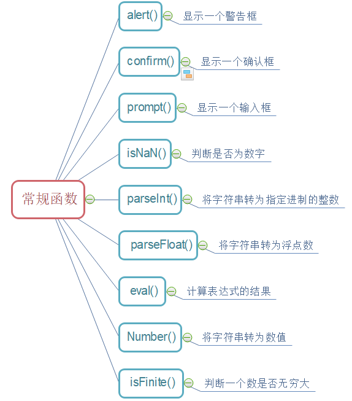

#### 数组函数

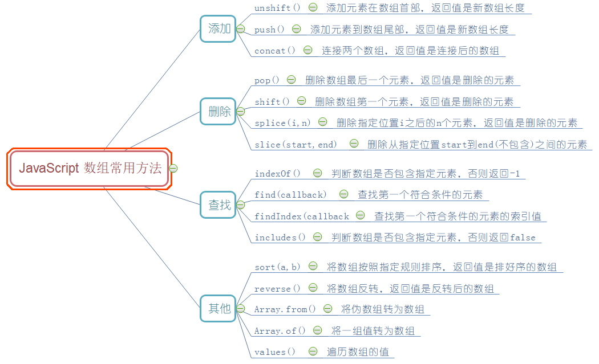

**数组常用操作**
- 数组声明
  - var arr=new Array();//声明一个空数组对象
  - var arr=new Array(length)//声明一个指定长度的数组
  - var arr=[元素]//声明数组(最常用);js中的数组声明不用指定长度，js的数组长度是不固定的，会随着元素的数量改变而改变。
- 数组的赋值和取值
  - 数组可以存储任意类型的数据：数组名[角标]=值;//角标可以是任意的正整数或者是0
  - 数组的取出：数组名[角标]//返回当前角标对应存储的值；如果角标不存在，返回undefined;
- 数组特点
  - js中的数组可以存储任意类型的数据。
  - js的数组可以通过length属性动态的改变长度。可以增加，也可以缩短。
  - 注意：
    - 如果是增加，则使用逗号进行占位
    - 如果是缩减则从后往前减少存储的数据。
- 数组的length属性
    - 作用1：数组名.length          //返回当前数组的长度。
    - 作用2：数组名.length=新的值   //动态的改变数组的长度
    - 注意：length>原有长度，则使用空进行填充。length<原有长度，则从后面进行截取，最后的数据会被删除。
- 数组的遍历
    - 普通for循环： for(var i=0;i < arr.length; i++)
    - for-in: for(var i in arr)

#### 日期函数

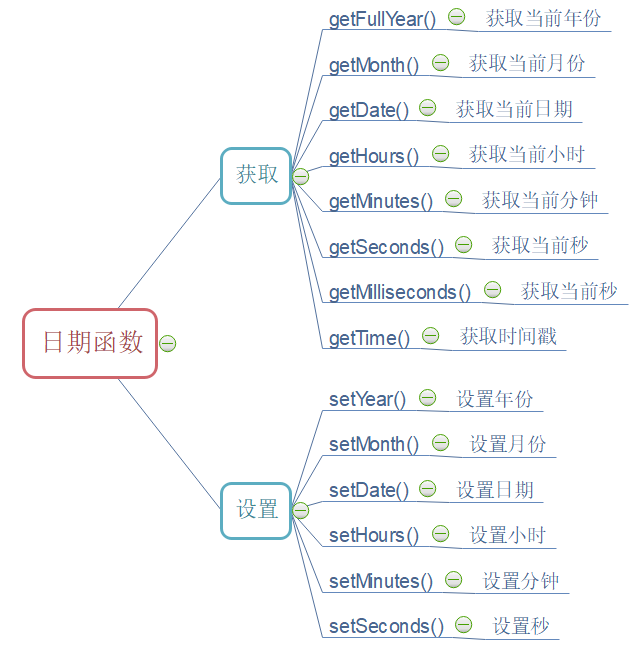

#### 数学函数

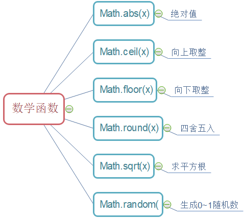

#### 字符串函数

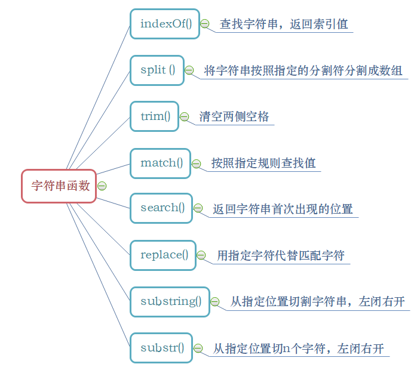


## 面向对象

js是基于**原型**，基于面向对象编程也即**OOP**(Object Oriented Programming)，它没有类的概念，而是直接使用**对象**来编程

### 创建对象

1. 创建Object实例和对象字面量
   - 缺点：重复实例化对象时代码冗余高

2. 工厂模式
   - 优点：解决重复实例化对象的问题
   - 缺点：无法识别对象的类型，因为所有的实例指向一个原型(Object)

3. 构造函数模式
   - 优点：实例可以识别为一个特定的类型，解决工厂模式的缺点
   - 缺点：多个实例重复创建方法，无法共享

4. 原型模式
   - 优点：方法不会被重复创建，解决了构造函数模式的缺点
   - 缺点：所有实例共享它的属性和方法，不能传参和初始化属性值

5. 混合模式(3+4)推荐
   - 优点：构造函数共享实例属性，原型共享方法和想要共享的属性，可传递参数，初始化属性值
   - 缺点：基本没有

```js
window.onload = function() {
    // 1. 创建Object实例
    let Person = new Object();
    Person.name = "张三";
    Person.age = "18";
    Person.showInfo = function() {
        console.log(this.name + "今年" + this.age + "了");
    }
    Person.showInfo();

    // 2. 对象字面量
    let Student = {
        name : "张三",
        age : "18",
        showInfo : function() {
            console.log(this.name + "今年" + this.age + "了");
        }
    };
    Student.showInfo();


    // 3. 工厂模式
    function createObjFactory(name, age) {
        const obj = new Object();
        obj.name = name;
        obj.age = age;
        obj.showInfo = function() {
            console.log(this.name + "今年" + this.age + "了");
        }
        return obj;
    }
    let obj = createObjFactory("张三", 17);
    obj.showInfo();
    // 缺点验证
    console.log(obj instanceof Object); // true
    console.log(obj instanceof createObjFactory); // false


    // 4. 构造函数模式
    function Teacher(name, age) {
        this.name = name;
        this.age = age;
        this.showInfo = function() {
            console.log(this.name + "今年" + this.age + "了");
        }
    }
    let tea1 = new Teacher("张三", 28);
    let tea2 = new Teacher("李四", 10);
    // 优点验证
    console.log(tea1 instanceof Object); // true
    console.log(tea1 instanceof Teacher); // true
    // 缺点验证
    console.log(tea1.showInfo == tea2.showInfo); // false
    

    // 5. 原型模式
    function Worker() {
    }
    Worker.prototype = {
        constructor : Worker,
        name : "张三",
        age : 18,
        showInfo : function() {
            console.log(this.name + "今年" + this.age + "了");
        }
    };
    let wor1 = new Worker();
    let wor2 = new Worker();
    // 优点验证
    console.log(wor1.showInfo == wor2.showInfo); // true
    // 缺点验证
    console.log(wor1.name == wor2.name); // true
   
    
    // 6. 混合模式(构造函数模式和原型模式)
    function People(name, age) {
        this.name = name;
        this.age = age;
    }
    People.prototype = {
        constructor : People,
        showInfo : function() {
            console.log(this.name + "今年" + this.age + "了");
        }
    };
    let p = new People("王五", 50);
    let p2 = new People("李四", 20);
    // 优点验证
    console.log(p.showInfo == p2.showInfo); // true
    console.log(p.name == p2.name); // false
}
```

### 构造函数

通过  new 函数名来实例化对象的函数叫构造函数。任何的函数都可以作为构造函数存在。之所以有构造函数与普通函数之分，主要从功能上进行区别的，构造函数的主要 功能为 初始化对象，特点是和new 一起使用。new就是在创建对象，从无到有，构造函数就是在为初始化的对象添加属性和方法。构造函数定义时首字母大写（规范）。

**常用的构造函数**
1. var arr = [];    为      var arr = new Array();      的语法糖
2. var obj = {}     为      var obj = new Object();     的语法糖
3. var  date = new Date();
4. ...

### 原型和原型链

**原型对象**
1. 函数对象都具有prototype属性，它指向函数的原型对象(浏览器内存创建的对象)，原型对象都具有constructor属性，它指向prototype属性所在的函数对象(构造函数)。
- 当调用构造函数创建一个实例后，该实例会有一个隐藏属性__proto__ ([[prototype]] )，它指向构造函数的原型对象。  
- 所有构造函数的prototype都是object类型，而Function的prototype是一个空函数，所有内置函数的_proto_指向这个空函数。
- 为实例添加一个属性时，这个属性会屏蔽原型对象中的同名属性(不会重写)，若想访问原型对象中的属性值，需要使用delete将这个同名属性在实例中彻底删除
- hasOwnProperty("属性名")可以检测一个属性是存在于实例还是原型对象中，true表示存在于实例中，false表示存在于原型对象中
- in操作符用来判断一个属性是否存在于这个对象中(无论是实例还是原型对象)
- 当使用对象字面量来重写原型对象时，会改变其constructor属性，使其指向Object构造函数，而不是原有的对

```js
window.onload = function() {
    // 函数对象
    function People(name, age) {
        this.name = name;
        this.age = age;
    }
    People.prototype = {
        constructor : People,
        showInfo : function() {
            console.log(this.name + "今年" + this.age + "岁了");
        }
    };

    let p = new People();
    p.showInfo();

    /**
     * 1. 验证第一条
     */
    // 1.1 构造函数的prototype属性指向原型对象
    console.log(People.prototype); // {constructor: ƒ, showInfo: ƒ}

    // 1.2 原型对象的constructor属性指向构造函数
    console.log(People.prototype.constructor); // ƒ People()

    /**
     * 2. 验证第二条
     */
    // 构造函数的实例有__proto__属性，他指向构造函数的原型对象
    console.log(p.__proto__ === People.prototype); // true

    /**
     * 3. 验证第三条
     */
    // 3.1 所有构造函数的prototype都是object
    function A() {
    }
    console.log(typeof People.prototype); // object
    console.log(typeof A.prototype); // object
    console.log(People.prototype instanceof Object); // true
    console.log(A.prototype instanceof Object); // true

    // 3.2 Function的prototype是个空函数
    console.log(Function.prototype); // ƒ ()

    // 3.3 所有内置函数的__proto__属性都指向这个空函数
    console.log(Array.__proto__); // ƒ ()
    console.log(Date.__proto__); // ƒ ()
    console.log(Math.__proto__); // ƒ ()
    console.log(String.__proto__); // ƒ ()

    /**
     * 4. 验证第四条
     */
    // 1. 为实例添加一个属性时会屏蔽原型对象的同名属性值，因为会先在实例中找，找不到才去原型对象中找
    function Teacher(name) {
        this.name = name;
    }
    Teacher.prototype.name = "张三";
    let tea = new Teacher("李四");
    console.log(tea.name); // 李四
    console.log(tea.__proto__.name); // 张三

    // 2. 使用delete删除实例的同名属性值
    console.log(
        delete tea.name
    ); // true
    console.log(tea.name); // 张三

    /**
     * 5. 验证第五条
     */
    // 检测一个属性在实例对象中(true)还是原型对象中(false)
    console.log(p.hasOwnProperty(name)); // false

    /**
     * 6. 验证第六条
     */
    // 判断实例和原型对象是否有此属性
    console.log(name in p); // false

    /**
     * 7. 验证第七条
     */
    //当使用对象字面量来重写原型对象时，会改变其constructor属性，使其指向Object构造函数，而不是原有的对象
    function Worker(name) {
        this.name = name;
    }
    Worker.prototype = {
        // 必须手动指向
        constuctor : Worker,
        showInfo : function() {
            alert(this.name);
        }
    };
    // 没有手动指向
    console.log(Worker.prototype); // {showInfo: ƒ}
    // 手动指向
    console.log(Worker.prototype); // {constuctor: ƒ, showInfo: ƒ}
    
    /**
     * 8. 判断一个对象是否在此对象的原型链中
     */
    console.log(Object.prototype.isPrototypeOf(p)); // true 
    console.log(People.prototype.isPrototypeOf(p)); // true
    
    /**
     * 9. 返回该对象的原型
     */
    console.log(p.__proto__ === Object.getPrototypeOf(p)); // true
}
```

**prototype和__proto__的区别**
- prototype属性只有函数对象有，而__proto__属性所有对象都有
- prototype是由函数对象指向原型对象，而__proto__属性是由实例指向函数对象的原型对象

**原型链**：将父类型的实例作为子类型的原型对象，以此构成的链式关系叫做原型链

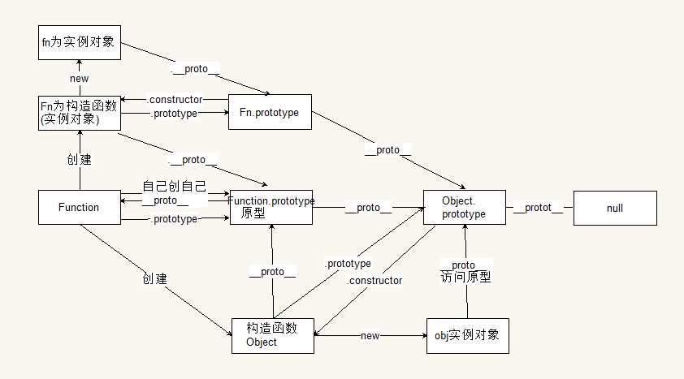

### 继承

1. 原型链继承
   - 优点：父类原型定义的属性和方法可以复用
   - 缺点：子类实例没有自己的属性，不能向父类传递参数

2. 构造函数继承
   - 优点：子类实例有自己的属性，可以向父类传递参数，解决原型链继承的缺点
   - 缺点：父类原型的属性和方法不可复用

3. 组合继承(推荐1)
   - 优点：原型的属性和方法可以复用，每个子类实例都有自己的属性。
   - 缺点：父类构造函数调用了两次，子类原型的中的父类实例属性被子类实例覆盖

4. 寄生组合式继承(推荐2)
    - 优点：解决了组合继承的缺点，效率高
    - 缺点：基本没有
  
5. class继承
   - class类中的方法是原型方法不用function声明
   - 子类的__proto__属性指向父类，表示构造函数的继承
   - 子类的原型的__proto__指向父类的原型，表示方法的继承
   - class类可以继承Object和null

**ES6 中 class 与构造函数的关系**

**构造函数**：通过  new 函数名来实例化对象的函数叫构造函数。任何的函数都可以作为构造函数存在。之所以有构造函数与普通函数之分，主要从功能上进行区别的，构造函数的主要功能为初始化对象，特点是和new 一起使用。new就是在创建对象，从无到有，构造函数就是在为初始化的对象添加属性和方法。构造函数定义时首字母大写（规范）。

class 为构造函数的语法糖，即 class 的本质是构造函数。class 的继承 extends  本质为构造函数的原型链的继承。

```js


function test1() {
    function SuperType() {
        this.city = ["北京", "上海", "天津"];
        this.property = true;
    }
    SuperType.prototype = {
        constructor: SuperType, // 保持构造函数和原型对象的完整性
        age: 15,
        getSuperValue: function () {
            return this.property;
        }
    };
    function SubType() {
        this.property = false;
    }

    SubType.prototype = {
        constructor: SuperType,
        getSubType: function () {
            return this.property;
        }
    };

    // 重写子类的原型指向父类的实例：继承父类的原型
    SubType.prototype = new SuperType();

    // 优点验证
    let son = new SubType();
    console.log(son.age, son.property); // 15
    console.log(son.getSuperValue()); // false

    // 缺点验证
    let instance1 = new SubType();
    instance1.city.push("重庆");
    console.log(instance1.city); // ["北京", "上海", "天津", "重庆"]

    let instance2 = new SubType();
    console.log(instance2.city); // ["北京", "上海", "天津", "重庆"]

}
test1();


/**
 *   2. 构造函数继承
 */
function test2() {
    function SuperType(name) {
        this.name = name;
        this.city = ["北京", "上海", "天津"]
    }
    SuperType.prototype = {
        constructor: SuperType,
        age: 18,
        showInfo: function () {
            return this.name;
        }
    };

    function SubType() {
        // 父类调用call()或者apply()方法和子类共用同一个this，实现子类实例属性的继承
        SuperType.call(this, "张三");
    }

    // 优点验证
    let instance = new SubType();
    instance.city.push("重庆");
    console.log(instance.city); // ["北京", "上海", "天津", "重庆"]

    let instance1 = new SubType();
    console.log(instance1.city); // ["北京", "上海", "天津"]

    // 缺点验证
    console.log(instance.age); // undefined
    instance.showInfo(); // son.showInfo is not a function
}
// test2();


/**
 *   3. 组合继承
 */
function test3() {
    function SuperType(name) {
        this.name = name;
        this.city = ["北京", "上海", "天津"]
    }
    SuperType.prototype = {
        constructor: SuperType,
        showInfo: function () {
            console.log(this.name + "今年" + this.age + "岁了");
        }
    };

    function SubType(name, age) {
        // 1. 通过构造方法继承实现实例属性的继承
        SuperType.call(this, name);
        this.age = age;
    }

    // 2. 通过原型链继承实现原型方法的继承
    SubType.prototype = new SuperType();

    // 优点验证
    let instance = new SubType("张三", 15);
    instance.showInfo(); // 张三今年15岁了

    let instance1 = new SubType();
    instance1.city.push("重庆");
    console.log(instance1.city); // ["北京", "上海", "天津", "重庆"]

    let instance2 = new SubType();
    console.log(instance2.city); // ["北京", "上海", "天津"]

}
// test3();


/*
 *   4. 寄生组合式继承
 */
function test4() {
    function inheritPrototype(subType, superType) {
        // 1. 继承父类的原型
        var prototype = Object.create(superType.prototype);
        // 2. 重写被污染的construct
        prototype.constructor = subType;
        // 3. 重写子类的原型
        subType.prototype = prototype;
    }
    function SuperType(name) {
        this.name = name;
        this.city = ["北京", "上海", "天津"];
    }

    SuperType.prototype.sayName = function () {
        console.log(this.name);
    };

    function SubType(name, age) {
        SuperType.call(this, name);
        this.age = age;
    }

    // 将父类原型指向子类
    inheritPrototype(SubType, SuperType);

    SubType.prototype.sayAge = function () {
        console.log(this.age);
    }

    // 优点验证
    let instance = new SubType("张三", 15);
    instance.sayName(); // 张三

    let instance1 = new SubType();
    instance1.city.push("重庆");
    console.log(instance1.city); // ["北京", "上海", "天津", "重庆"]

    let instance2 = new SubType();
    console.log(instance2.city); // ["北京", "上海", "天津"]
}
// test4();

function test5() {
    class SuperType {
        // 构造方法，只能有一个
        constructor(name, age) {
            this.name = name;
            this.age = age;
        }

        toString() {
            console.log(this.name + "今年" + this.age + "岁了");
        }
    }

    class SubType extends SuperType {
        // 子类必须继承父类构造方法
        constructor(name, age) {
            // 调用父类构造方法，只能在第一行
            super(name, age);
        }
    }

    var obj = new SubType("张三", 15);
    obj.toString(); // 张三今年15岁了
    // 验证第一条
    console.log(obj.toString === SuperType.prototype.toString); // true
    // 验证第二条
    console.log(SubType.__proto__); // class SuperType
    // 验证第三条
    console.log(SubType.prototype.__proto__); // {constructor: ƒ, toString: ƒ}
    // 验证第四条
    class A extends Object { }
    class B extends null{ }
    console.log(A.__proto__ === Object); // true
    console.log(A.prototype.__proto__ === Object.prototype); // true
    console.log(B.__proto__ === Function.prototype); // true
    console.log(B.prototype.__proto__ === undefined); // true
}
// test5()
```


## 正则表达式

**正则表达式**(regular expression)描述了一种字符串匹配的模式（pattern），通常被用来检索、替换那些符合某个模式(规则)的文本。

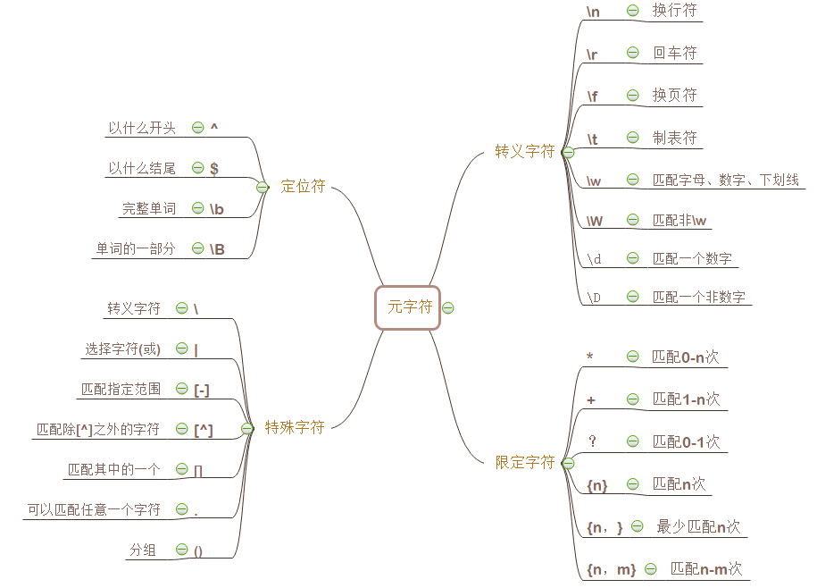

# JavaScript DOM

## 简介

**文档对象模型**（Document Object Model，简称DOM），是针对HTML和XML文档的一个API（应用程序接口），将 HTML 文档呈现为带有元素、属性和文本的树结构，即节点树

**作用**：JavaScript通过DOM能够改变页面中所有的HTML 元素、属性和 CSS 样式，并对页面中所有事件做出响应。

**结构图**

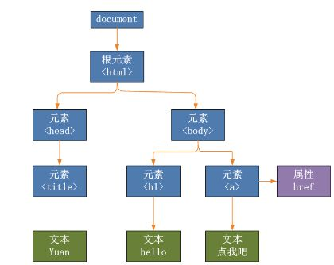

## 节点树

### 节点类型及属性
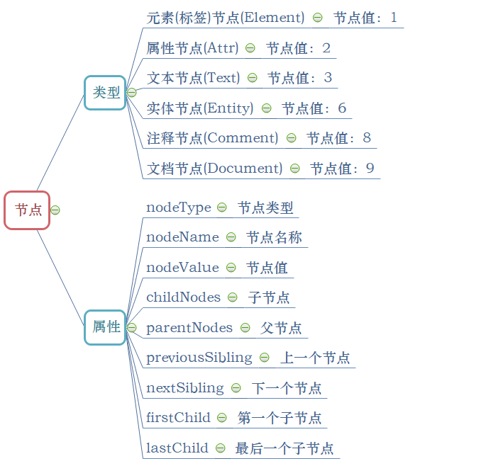

### 文档节点(Document对象)

document类型属性
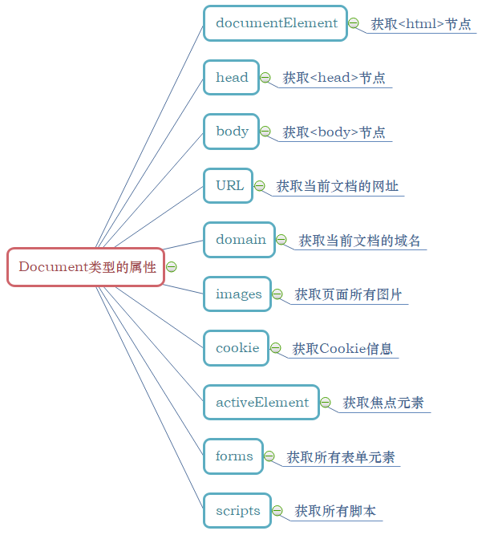

document类型方法
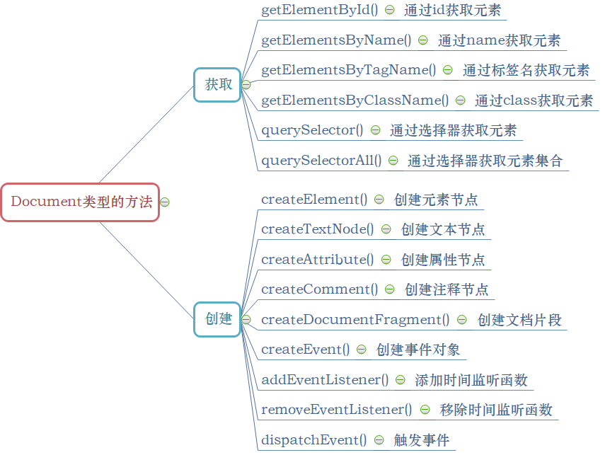

### 元素节点(Element对象)
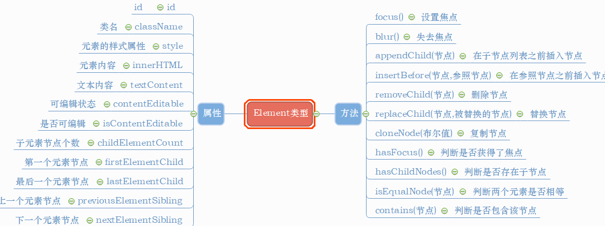

### 属性节点(Attr对象)
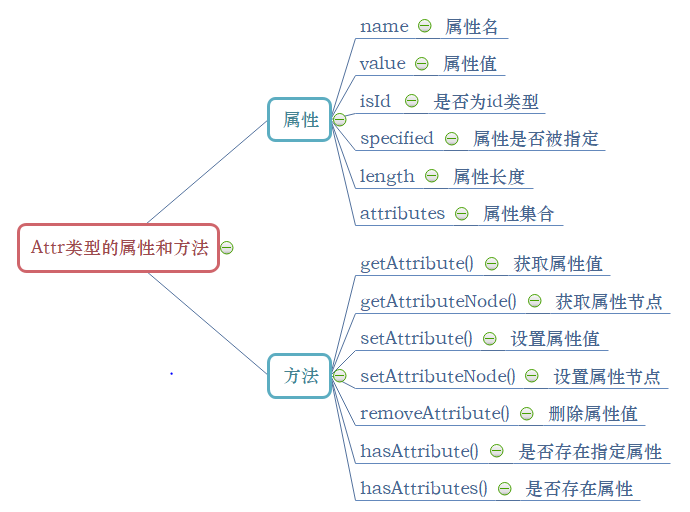

### 文本节点(Text)
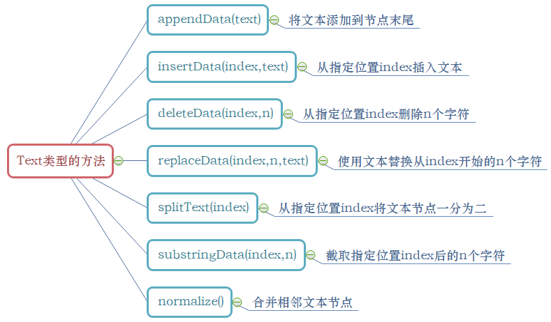

## 事件

**概述**：事件一般是用于浏览器和用户操作进行交互，当用户执行某些操作的时候才会执行特定的代码，例如单击图片等

### 事件流

事件发生时会在元素节点与根节点之间按照特定的顺序传播，路径所经过的所有节点都会收到该事件，这个传播过程即DOM事件流

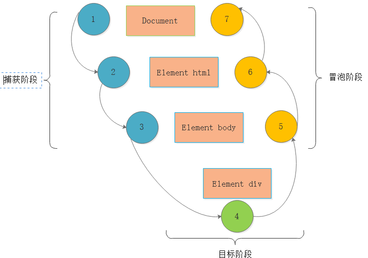

#### 捕获阶段

捕获阶段处于事件流的第一阶段，开始于Document，结束于目标阶段，主要作用是捕获截取事件。

#### 目标阶段

目标阶段处于事件流的第二阶段，具有双重范围，即捕获阶段的结束，冒泡阶段的开始，主要作用是执行绑定事件。

#### 冒泡阶段

冒泡阶段处于事件流的第三阶段，开始于目标元素，结束于Document，主要作用是将目标元素绑定事件执行的结果返回给浏览器，处理不同浏览器之间的差异。

### 事件处理程序

1. HTML事件处理程序
   - 优点：事件处理程序中的代码，能够访问全局作用域中的任何变量
   - 缺点：时差问题、扩展的作用域链在不同浏览器中会导致不同结果、html代码与js代码高度耦合

2. DOM0级事件处理程序
   - 优点：简单和浏览器兼容性好，解决了html代码和js代码的高度耦合
   - 缺点：一个元素只能绑定一个事件处理函数，只会在事件冒泡中运行

3. DOM2级事件处理程序   
   - 优点：同时支持事件处理的捕获和冒泡阶段，并且一个元素可以绑定多个处理函数
   - 缺点：IE不支持

4. 跨浏览器处理程序
   - 优点：继承了DOM2级事件处理程序的优点，并且可以解决其缺点

### 事件处理函数

#### 鼠标键盘事件
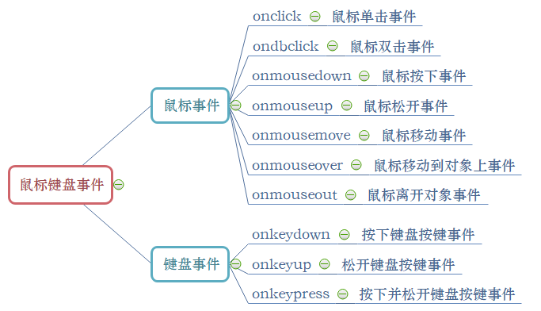

#### 页面窗口事件
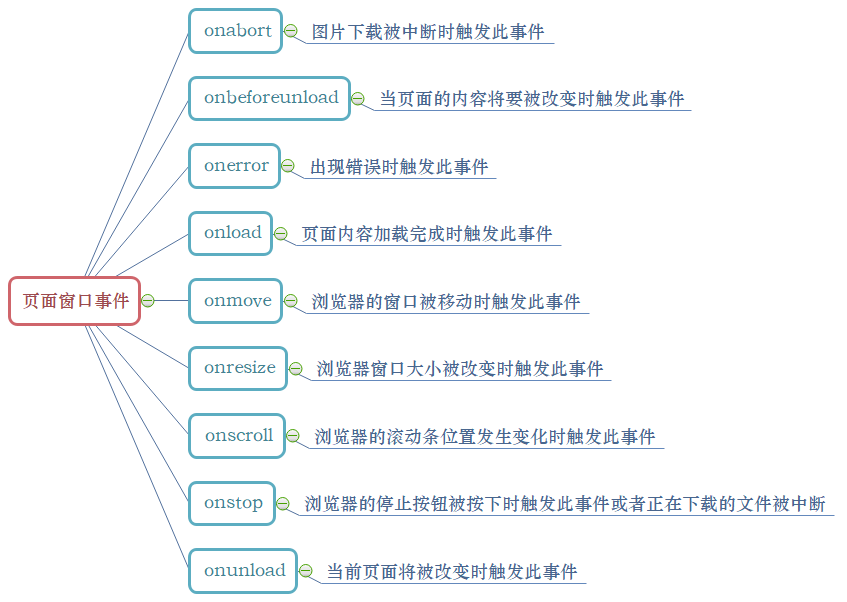

#### 表单事件
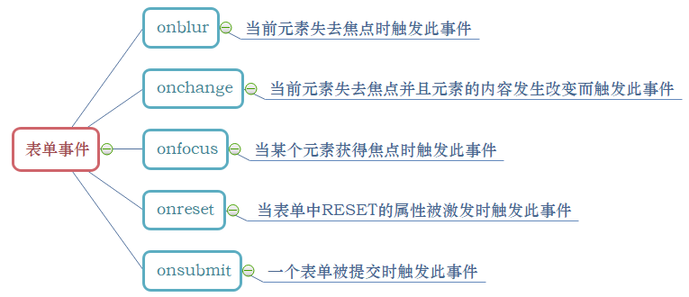

# JavaScript BOM

**概念**：浏览器对象模型（Browser Object Model，简称BOM），描述与浏览器进行交互的方法和接口，和网页内容无关

**作用**：管理窗口和窗口之间的通讯

**结构图**
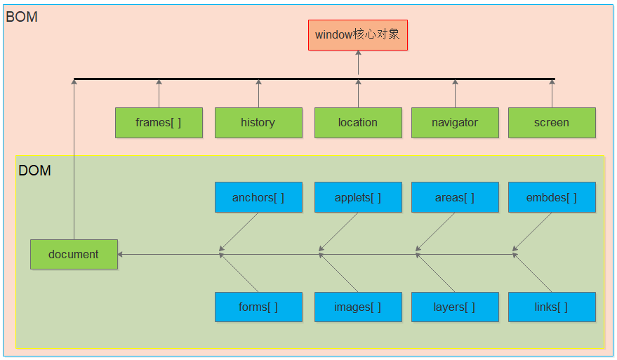

## window 对象

**BOM的核心对象就是window**，window对象也是BOM的顶级对象，所有浏览器都支持window对象，它代表的是浏览器的窗口。JavaScript的所有全局对象、

全局方法和全局变量全都自动被归为window对象的方法和属性，在调用这些方法和属性的时候可以省略window

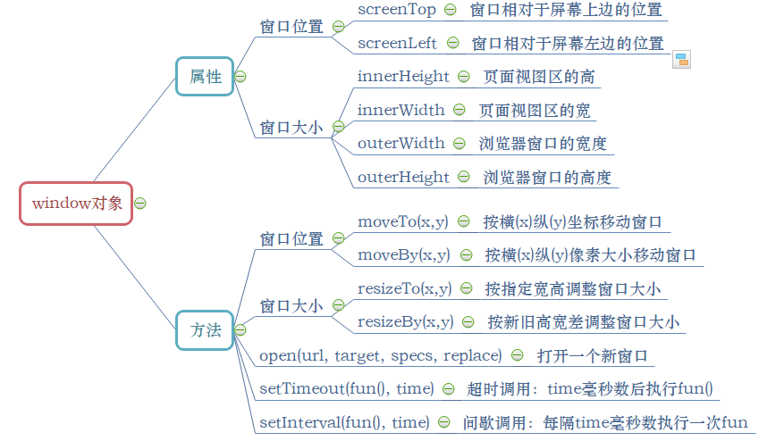

## 其他对象

### frames

如果页面包含框架，则每个框架都有自己的window对象，并且保存frames集合中，可以通过数值索引或框架名称来访问相应的window对象

### history

history对象保存着用户上网的历史记录，从窗口被打开的一刻算起
- back( )：加载 history 对象列表中的前一个URL
- forward( )：加载 history 对象列表中的下一个URL

### location

location对象提供了与当前窗口加载的文档有关的信息，还提供了一些导航功能
- replace()方法：用户不能回到前一个页面
- reload()方法：重新加载当前显示的页面

### screen

screen对象基本上只用来表明客户端的能力，其中包括浏览器窗口外部的显示器的信息，如像素宽度和高度等

### navigator

navigator属性通常用于检测显示网页的浏览器类型。可以使用plugins数组检测浏览器是否安装了特定的插件

plugins数组的属性：
- name：插件名字             
- description：插件的描述
- filename：插件的文件名    
- length：插件所处理的MIME类型数量


# JavaScript 使用

HTML 中的脚本必须位于 `<script>` 与 `</script>` 标签之间。

脚本可被放置在 HTML 页面的 `<body>` 和 `<head>` 部分中。

也可以把脚本保存到外部文件中。外部文件通常包含被多个网页使用的代码。外部 JavaScript 文件的文件扩展名是 .js。如需使用外部文件，请在 `<script>` 标签的 "src" 属性中设置该 .js 文件;(外部脚本不能包含 `<script>` 标签)
