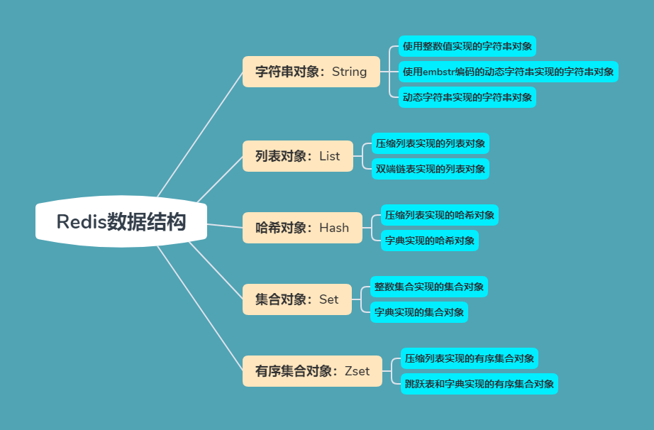

<!-- GFM-TOC -->
* [一、概述](#一概述)
* [二、数据类型](#二数据类型)
  * [STRING](#string)
    * [数据结构实现](#数据结构实现)
  * [LIST](#list)
    * [数据结构实现](#数据结构实现-1)
  * [SET](#set)
    * [数据结构实现](#数据结构实现-2)
  * [HASH](#hash)
    * [数据结构实现](#数据结构实现-3)
  * [ZSET](#zset)
    * [数据结构实现](#数据结构实现-4)
* [三、使用场景](#三使用场景)
  * [计数器](#计数器)
  * [缓存](#缓存)
  * [查找表](#查找表)
  * [消息队列](#消息队列)
  * [会话缓存](#会话缓存)
  * [分布式锁实现](#分布式锁实现)
  * [其它](#其它)
* [四、Redis 与 Memcached](#四redis-与-memcached)
  * [数据类型](#数据类型)
  * [数据持久化](#数据持久化)
  * [分布式](#分布式)
  * [内存管理机制](#内存管理机制)
* [五、键的过期时间](#五键的过期时间)
  * [删除策略](#删除策略)
* [六、数据淘汰策略](#六数据淘汰策略)
* [七、持久化](#七持久化)
  * [RDB 持久化 全量模式持久化](#rdb-持久化-全量模式持久化)
  * [AOF 持久化 增量模式持久化](#aof-持久化-增量模式持久化)
* [八、事务](#八事务)
* [九、事件](#九事件)
  * [文件事件](#文件事件)
  * [时间事件](#时间事件)
  * [事件的调度与执行](#事件的调度与执行)
* [十、复制](#十复制)
  * [连接过程](#连接过程)
  * [主从链](#主从链)
* [十一、Sentinel](#十一sentinel)
* [十二、分片](#十二分片)
* [十三、一个简单的论坛系统分析](#十三一个简单的论坛系统分析)
  * [文章信息](#文章信息)
  * [点赞功能](#点赞功能)
  * [对文章进行排序](#对文章进行排序)
* [参考资料](#参考资料)
<!-- GFM-TOC -->


# 一、概述

Redis 是速度非常快的非关系型（NoSQL）内存键值数据库，可以存储键和五种不同类型的值之间的映射。

键的类型只能为字符串，值支持五种数据类型：字符串、列表、集合、散列表、有序集合。

Redis 支持很多特性，例如将内存中的数据持久化到硬盘中，使用复制来扩展读性能，使用分片来扩展写性能。

# 二、数据类型

| 数据类型 |      可以存储的值      |                                                     操作                                                      |
| :------: | :--------------------: | :-----------------------------------------------------------------------------------------------------------: |
|  STRING  | 字符串、整数或者浮点数 |               对整个字符串或者字符串的其中一部分执行操作<br> 对整数和浮点数执行自增或者自减操作               |
|   LIST   |          列表          |              从两端压入或者弹出元素 <br> 对单个或者多个元素进行修剪，<br> 只保留一个范围内的元素              |
|   SET    |        无序集合        | 添加、获取、移除单个元素<br> 检查一个元素是否存在于集合中<br> 计算交集、并集、差集<br> 从集合里面随机获取元素 |
|   HASH   | 包含键值对的无序散列表 |                     添加、获取、移除单个键值对<br> 获取所有键值对<br> 检查某个键是否存在                      |
|   ZSET   |        有序集合        |                 添加、获取、删除元素<br> 根据分值范围或者成员来获取元素<br> 计算一个键的排名                  |

> [What Redis data structures look like](https://redislabs.com/ebook/part-1-getting-started/chapter-1-getting-to-know-redis/1-2-what-redis-data-structures-look-like/)




```java
REDIS_ENCODING_INT（long 类型的整数）
REDIS_ENCODING_EMBSTR embstr （编码的简单动态字符串）
REDIS_ENCODING_RAW （简单动态字符串）
REDIS_ENCODING_HT （字典）
REDIS_ENCODING_LINKEDLIST （双端链表）
REDIS_ENCODING_ZIPLIST （压缩列表）
REDIS_ENCODING_INTSET （整数集合）
REDIS_ENCODING_SKIPLIST （跳跃表和字典）
```

## STRING

<div align="center">  </div><br>

```html
> set hello world
OK
> get hello
"world"
> del hello
(integer) 1
> get hello
(nil)
```

### 数据结构实现
- int：8个字节的长整型
- embstr：小于等于39个字节的字符串
- raw：大于39个字节的字符串

## LIST

<div align="center">  </div><br>

```html
> rpush list-key item
(integer) 1
> rpush list-key item2
(integer) 2
> rpush list-key item
(integer) 3

> lrange list-key 0 -1
1) "item"
2) "item2"
3) "item"

> lindex list-key 1
"item2"

> lpop list-key
"item"

> lrange list-key 0 -1
1) "item2"
2) "item"
```

### 数据结构实现
- ziplist:
  - 列表对象保存的所有字符串元素的长度都小于64字节；
  - 列表元素保存的元素数量小于512个；
- linkedlist


## SET

<div align="center">  </div><br>

```html
> sadd set-key item
(integer) 1
> sadd set-key item2
(integer) 1
> sadd set-key item3
(integer) 1
> sadd set-key item
(integer) 0

> smembers set-key
1) "item"
2) "item2"
3) "item3"

> sismember set-key item4
(integer) 0
> sismember set-key item
(integer) 1

> srem set-key item2
(integer) 1
> srem set-key item2
(integer) 0

> smembers set-key
1) "item"
2) "item3"
```

### 数据结构实现
- intset
  - 集合对象保存的所有元素都是整数值；
  - 集合对象保存的元素数量不超过 512 个；
- hashtable

## HASH

<div align="center">  </div><br>

```html
> hset hash-key sub-key1 value1
(integer) 1
> hset hash-key sub-key2 value2
(integer) 1
> hset hash-key sub-key1 value1
(integer) 0

> hgetall hash-key
1) "sub-key1"
2) "value1"
3) "sub-key2"
4) "value2"

> hdel hash-key sub-key2
(integer) 1
> hdel hash-key sub-key2
(integer) 0

> hget hash-key sub-key1
"value1"

> hgetall hash-key
1) "sub-key1"
2) "value1"
```

### 数据结构实现
- ziplist:
  - 哈希对象保存的所有键值对的键和值的字符串长度都小于 64 字节；
  - 哈希对象保存的键值对数量小于 512 个；
- hashtable

#### 字典

dictht 是一个散列表结构，使用拉链法解决哈希冲突。

```c
/* This is our hash table structure. Every dictionary has two of this as we
 * implement incremental rehashing, for the old to the new table. */
typedef struct dictht {
    dictEntry **table;
    unsigned long size;
    unsigned long sizemask;
    unsigned long used;
} dictht;
```

```c
typedef struct dictEntry {
    void *key;
    union {
        void *val;
        uint64_t u64;
        int64_t s64;
        double d;
    } v;
    struct dictEntry *next;
} dictEntry;
```

Redis 的字典 dict 中包含两个哈希表 dictht，这是为了方便进行 rehash 操作。在扩容时，将其中一个 dictht 上的键值对 rehash 到另一个 dictht 上面，完成之后释放空间并交换两个 dictht 的角色。

```c
typedef struct dict {
    dictType *type;
    void *privdata;
    dictht ht[2];
    long rehashidx; /* rehashing not in progress if rehashidx == -1 */
    unsigned long iterators; /* number of iterators currently running */
} dict;
```

rehash 操作不是一次性完成，而是采用渐进方式，这是为了避免一次性执行过多的 rehash 操作给服务器带来过大的负担。

渐进式 rehash 通过记录 dict 的 rehashidx 完成，它从 0 开始，然后每执行一次 rehash 都会递增。例如在一次 rehash 中，要把 dict[0] rehash 到 dict[1]，这一次会把 dict[0] 上 table[rehashidx] 的键值对 rehash 到 dict[1] 上，dict[0] 的 table[rehashidx] 指向 null，并令 rehashidx++。

因为在进行渐进式 rehash 的过程中， 字典会同时使用 ht[0] 和 ht1 两个哈希表， 所以在渐进式 rehash 进行期间， 字典的删除（delete）、查找（find）、更新（update）等操作会在两个哈希表上进行： 比如说， 要在字典里面查找一个键的话， 程序会先在 ht[0] 里面进行查找， 如果没找到的话， 就会继续到 ht1 里面进行查找， 诸如此类。

另外， 在渐进式 rehash 执行期间， 新添加到字典的键值对一律会被保存到 ht1 里面， 而 ht[0] 则不再进行任何添加操作： 这一措施保证了 ht[0] 包含的键值对数量会只减不增， 并随着 rehash 操作的执行而最终变成空表。

要点
- 字典使用哈希表作为底层实现， 每个字典带有两个哈希表， 一个用于平时使用， 另一个仅在进行 rehash 时使用
- 当哈希表保存的键值对数量太多或者太少时， 程序需要对哈希表的大小进行相应的扩展或者收缩（rehash）
- rehash 动作并不是一次性、集中式地完成的， 而是分多次、渐进式地完成的
- 渐进式 rehash 的过程中， 字典会同时使用 ht[0] 和 ht[1] 两个哈希表

## ZSET

<div align="center">  </div><br>

```html
> zadd zset-key 728 member1
(integer) 1
> zadd zset-key 982 member0
(integer) 1
> zadd zset-key 982 member0
(integer) 0

> zrange zset-key 0 -1 withscores
1) "member1"
2) "728"
3) "member0"
4) "982"

> zrangebyscore zset-key 0 800 withscores
1) "member1"
2) "728"

> zrem zset-key member1
(integer) 1
> zrem zset-key member1
(integer) 0

> zrange zset-key 0 -1 withscores
1) "member0"
2) "982"
```

### 数据结构实现

- ziplist:
- zskiplist

#### 跳跃表

是有序集合的底层实现之一。

跳跃表是基于多指针有序链表实现的，可以看成多个有序链表。

<div align="center">  </div><br>

在查找时，从上层指针开始查找，找到对应的区间之后再到下一层去查找。下图演示了查找 22 的过程。

<div align="center">  </div><br>

与红黑树等平衡树相比，跳跃表具有以下优点：

- 插入速度非常快速，因为不需要进行旋转等操作来维护平衡性；
- 更容易实现；
- 支持无锁操作。


 
 展示了一个跳跃表示例， 位于图片最左边的是 zskiplist 结构， 该结构包含以下属性：

>
- header ：指向跳跃表的表头节点。
- tail ：指向跳跃表的表尾节点。
- level ：记录目前跳跃表内，层数最大的那个节点的层数（表头节点的层数不计算在内）。
- length ：记录跳跃表的长度，也即是，跳跃表目前包含节点的数量（表头节点不计算在内）。

zskiplist 结构右边的是四个 zskiplistNode 结构， 该结构包含以下属性：

- 层（level）：节点中用 L1 、 L2 、 L3 等字样标记节点的各个层， L1 代表第一层， L2 代表第二层，以此类推。每个层都带有两个属性：前进指针和跨度。前进指针用于访问位于表尾方向的其他节点，而跨度则记录了前进指针所指向节点和当前节点的距离。在上面的图片中，连线上带有数字的箭头就代表>前进指针，而那个数字就是跨度。当程序从表头向表尾进行遍历时，访问会沿着层的前进指针进行。
- 后退指针（backward）：节点中用 BW 字样标记节点的后退指针，它指向位于当前节点的前一个节点。后退指针在程序从表尾向表头遍历时使用。
- 分值（score）：各个节点中的 1.0 、 2.0 和 3.0 是节点所保存的分值。在跳跃表中，节点按各自所保存的分值从小到大排列。
- 成员对象（obj）：各个节点中的 o1 、 o2 和 o3 是节点所保存的成员对象。

注意表头节点和其他节点的构造是一样的： 表头节点也有后退指针、分值和成员对象， 不过表头节点的这些属性都不会被用到， 所以图中省略了这些部分， 只显示了表头节点的各个层。


# 三、使用场景

## 计数器

可以对 String 进行自增自减运算，从而实现计数器功能。

Redis 这种内存型数据库的读写性能非常高，很适合存储频繁读写的计数量。

## 缓存

将热点数据放到内存中，设置内存的最大使用量以及淘汰策略来保证缓存的命中率。

## 查找表

例如 DNS 记录就很适合使用 Redis 进行存储。

查找表和缓存类似，也是利用了 Redis 快速的查找特性。但是查找表的内容不能失效，而缓存的内容可以失效，因为缓存不作为可靠的数据来源。

## 消息队列

List 是一个双向链表，可以通过 lpush 和 rpop 写入和读取消息

不过最好使用 Kafka、RabbitMQ 等消息中间件。

## 会话缓存

可以使用 Redis 来统一存储多台应用服务器的会话信息。

当应用服务器不再存储用户的会话信息，也就不再具有状态，一个用户可以请求任意一个应用服务器，从而更容易实现高可用性以及可伸缩性。

## 分布式锁实现

在分布式场景下，无法使用单机环境下的锁来对多个节点上的进程进行同步。

可以使用 Redis 自带的 SETNX 命令实现分布式锁，除此之外，还可以使用官方提供的 RedLock 分布式锁实现。

## 其它

Set 可以实现交集、并集等操作，从而实现共同好友等功能。

ZSet 可以实现有序性操作，从而实现排行榜等功能。

# 四、Redis 与 Memcached

两者都是非关系型内存键值数据库，主要有以下不同：

## 数据类型

Memcached 仅支持字符串类型，而 Redis 支持五种不同的数据类型，可以更灵活地解决问题。

## 数据持久化

Redis 支持两种持久化策略：RDB 快照和 AOF 日志，而 Memcached 不支持持久化。

## 分布式

Memcached 不支持分布式，只能通过在客户端使用一致性哈希来实现分布式存储，这种方式在存储和查询时都需要先在客户端计算一次数据所在的节点。

Redis Cluster 实现了分布式的支持。

## 内存管理机制

- 在 Redis 中，并不是所有数据都一直存储在内存中，可以将一些很久没用的 value 交换到磁盘，而 Memcached 的数据则会一直在内存中。

- Memcached 将内存分割成特定长度的块来存储数据，以完全解决内存碎片的问题。但是这种方式会使得内存的利用率不高，例如块的大小为 128 bytes，只存储 100 bytes 的数据，那么剩下的 28 bytes 就浪费掉了。

# 五、键的过期时间

Redis 可以为每个键设置过期时间，当键过期时，会自动删除该键。

对于散列表这种容器，只能为整个键设置过期时间（整个散列表），而不能为键里面的单个元素设置过期时间。

## 删除策略

| 删除策略 | 对比结果                                                               |
| -------- | ---------------------------------------------------------------------- |
| 定时删除 | 1.节约内存,无占用 2.不分时段占用CPU资源,频度高 3.拿时间换空间          |
| 惰性删除 | 1.内存占用严重 2.延时执行,CPU利用率高 3.拿空间换时间                   |
| 定期删除 | 1.内存定期随机清理 2.每秒花费固定的CPU资源维护内存 3.随机抽查,重点抽查 |

Redis 采用的是 定期删除+惰性/懒汉式删除

仅仅通过给 key 设置过期时间还是有问题的。因为还是可能存在定期删除和惰性删除漏掉了很多过期 key 的情况。这样就导致大量过期 key 堆积在内存里，然后就Out of memory了。

怎么解决这个问题呢？答案就是： Redis 内存淘汰机制。

# 六、数据淘汰策略

可以设置内存最大使用量，当内存使用量超出时，会施行数据淘汰策略。

Redis 具体有 6 种淘汰策略：

|      策略       |                         描述                         |
| :-------------: | :--------------------------------------------------: |
|  volatile-lru   | 从已设置过期时间的数据集中挑选最近最少使用的数据淘汰 |
|  volatile-ttl   |   从已设置过期时间的数据集中挑选将要过期的数据淘汰   |
| volatile-random |      从已设置过期时间的数据集中任意选择数据淘汰      |
|   allkeys-lru   |       从所有数据集中挑选最近最少使用的数据淘汰       |
| allkeys-random  |          从所有数据集中任意选择数据进行淘汰          |
|   noeviction    |                     禁止驱逐数据                     |

作为内存数据库，出于对性能和内存消耗的考虑，Redis 的淘汰算法实际实现上并非针对所有 key，而是抽样一小部分并且从中选出被淘汰的 key。

使用 Redis 缓存数据时，为了提高缓存命中率，需要保证缓存数据都是热点数据。可以将内存最大使用量设置为热点数据占用的内存量，然后启用 allkeys-lru 淘汰策略，将最近最少使用的数据淘汰。

Redis 4.0 引入了 volatile-lfu 和 allkeys-lfu 淘汰策略，LFU 策略通过统计访问频率，将访问频率最少的键值对淘汰。

# 七、持久化

Redis 是内存型数据库，为了保证数据在断电后不会丢失，需要将内存中的数据持久化到硬盘上。

## RDB 持久化 全量模式持久化

将某个时间点的所有数据都存放到硬盘上。

可以将快照复制到其它服务器从而创建具有相同数据的服务器副本。

如果系统发生故障，将会丢失最后一次创建快照之后的数据。

如果数据量很大，保存快照的时间会很长。


## AOF 持久化 增量模式持久化

将写命令添加到 AOF 文件（Append Only File）的末尾。

使用 AOF 持久化需要设置同步选项，从而确保写命令同步到磁盘文件上的时机。这是因为对文件进行写入并不会马上将内容同步到磁盘上，而是先存储到缓冲区，然后由操作系统决定什么时候同步到磁盘。有以下同步选项：

|   选项   |         同步频率         |
| :------: | :----------------------: |
|  always  |     每个写命令都同步     |
| everysec |       每秒同步一次       |
|    no    | 让操作系统来决定何时同步 |

- always 选项会严重减低服务器的性能；
- everysec 选项比较合适，可以保证系统崩溃时只会丢失一秒左右的数据，并且 Redis 每秒执行一次同步对服务器性能几乎没有任何影响；
- no 选项并不能给服务器性能带来多大的提升，而且也会增加系统崩溃时数据丢失的数量。


随着服务器写请求的增多，AOF 文件会越来越大。Redis 提供了一种将 AOF 重写的特性，能够去除 AOF 文件中的冗余写命令。


AOF 重写可以产生一个新的 AOF 文件，这个新的 AOF 文件和原有的 AOF 文件所保存的数据库状态一样，但体积更小。

AOF 重写是一个有歧义的名字，该功能是通过读取数据库中的键值对来实现的，程序无须对现有 AOF 文件进行任何读入、分析或者写入操作。

在执行 BGREWRITEAOF 命令时，Redis 服务器会维护一个 AOF 重写缓冲区，该缓冲区会在子进程创建新 AOF 文件期间，记录服务器执行的所有写命令。当子进程完成创建新 AOF 文件的工作之后，服务器会将重写缓冲区中的所有内容追加到新 AOF 文件的末尾，使得新旧两个 AOF 文件所保存的数据库状态一致。最后，服务器用新的 AOF 文件替换旧的 AOF 文件，以此来完成 AOF 文件重写操作

# 八、事务

一个事务包含了多个命令，服务器在执行事务期间，不会改去执行其它客户端的命令请求。

事务中的多个命令被一次性发送给服务器，而不是一条一条发送，这种方式被称为流水线，它可以减少客户端与服务器之间的网络通信次数从而提升性能。

Redis 最简单的事务实现方式是使用 MULTI 和 EXEC 命令将事务操作包围起来。

# 九、事件

Redis 服务器是一个事件驱动程序。

## 文件事件

服务器通过套接字与客户端或者其它服务器进行通信，文件事件就是对套接字操作的抽象。

Redis 基于 Reactor 模式开发了自己的网络事件处理器，使用 I/O 多路复用程序来同时监听多个套接字，并将到达的事件传送给文件事件分派器，分派器会根据套接字产生的事件类型调用相应的事件处理器。

<div align="center">  </div><br>


注意！ Redis 6.0 之后的版本抛弃了单线程模型这一设计，原本使用单线程运行的 Redis 也开始选择性地使用多线程模型。

前面还在强调 Redis 单线程模型的高效性，现在为什么又要引入多线程？这其实说明 Redis 在有些方面，单线程已经不具有优势了。因为读写网络的 Read/Write 系统调用在 Redis 执行期间占用了大部分 CPU 时间，如果把网络读写做成多线程的方式对性能会有很大提升。

Redis 的多线程部分只是用来处理网络数据的读写和协议解析，执行命令仍然是单线程。 之所以这么设计是不想 Redis 因为多线程而变得复杂，需要去控制 key、lua、事务、LPUSH/LPOP 等等的并发问题。

## 时间事件

服务器有一些操作需要在给定的时间点执行，时间事件是对这类定时操作的抽象。

时间事件又分为：

- 定时事件：是让一段程序在指定的时间之内执行一次；
- 周期性事件：是让一段程序每隔指定时间就执行一次。

Redis 将所有时间事件都放在一个无序链表中，通过遍历整个链表查找出已到达的时间事件，并调用相应的事件处理器。

## 事件的调度与执行

服务器需要不断监听文件事件的套接字才能得到待处理的文件事件，但是不能一直监听，否则时间事件无法在规定的时间内执行，因此监听时间应该根据距离现在最近的时间事件来决定。

事件调度与执行由 aeProcessEvents 函数负责，伪代码如下：

```python
def aeProcessEvents():
    # 获取到达时间离当前时间最接近的时间事件
    time_event = aeSearchNearestTimer()
    # 计算最接近的时间事件距离到达还有多少毫秒
    remaind_ms = time_event.when - unix_ts_now()
    # 如果事件已到达，那么 remaind_ms 的值可能为负数，将它设为 0
    if remaind_ms < 0:
        remaind_ms = 0
    # 根据 remaind_ms 的值，创建 timeval
    timeval = create_timeval_with_ms(remaind_ms)
    # 阻塞并等待文件事件产生，最大阻塞时间由传入的 timeval 决定
    aeApiPoll(timeval)
    # 处理所有已产生的文件事件
    procesFileEvents()
    # 处理所有已到达的时间事件
    processTimeEvents()
```

将 aeProcessEvents 函数置于一个循环里面，加上初始化和清理函数，就构成了 Redis 服务器的主函数，伪代码如下：

```python
def main():
    # 初始化服务器
    init_server()
    # 一直处理事件，直到服务器关闭为止
    while server_is_not_shutdown():
        aeProcessEvents()
    # 服务器关闭，执行清理操作
    clean_server()
```

从事件处理的角度来看，服务器运行流程如下：

<div align="center">  </div><br>

# 十、复制

通过使用 slaveof host port 命令来让一个服务器成为另一个服务器的从服务器。

一个从服务器只能有一个主服务器，并且不支持主主复制。

## 连接过程

1. 主服务器创建快照文件，发送给从服务器，并在发送期间使用缓冲区记录执行的写命令。快照文件发送完毕之后，开始向从服务器发送存储在缓冲区中的写命令；

2. 从服务器丢弃所有旧数据，载入主服务器发来的快照文件，之后从服务器开始接受主服务器发来的写命令；

3. 主服务器每执行一次写命令，就向从服务器发送相同的写命令。

## 主从链

随着负载不断上升，主服务器可能无法很快地更新所有从服务器，或者重新连接和重新同步从服务器将导致系统超载。为了解决这个问题，可以创建一个中间层来分担主服务器的复制工作。中间层的服务器是最上层服务器的从服务器，又是最下层服务器的主服务器。

<div align="center">  </div><br>

# 十一、Sentinel

Sentinel（哨兵）可以监听集群中的服务器，并在主服务器进入下线状态时，自动从从服务器中选举出新的主服务器。

# 十二、分片

分片是将数据划分为多个部分的方法，可以将数据存储到多台机器里面，这种方法在解决某些问题时可以获得线性级别的性能提升。

假设有 4 个 Redis 实例 R0，R1，R2，R3，还有很多表示用户的键 user:1，user:2，... ，有不同的方式来选择一个指定的键存储在哪个实例中。

- 最简单的方式是范围分片，例如用户 id 从 0\~1000 的存储到实例 R0 中，用户 id 从 1001\~2000 的存储到实例 R1 中，等等。但是这样需要维护一张映射范围表，维护操作代价很高。
- 还有一种方式是哈希分片，使用 CRC32 哈希函数将键转换为一个数字，再对实例数量求模就能知道应该存储的实例。

根据执行分片的位置，可以分为三种分片方式：

- 客户端分片：客户端使用一致性哈希等算法决定键应当分布到哪个节点。
- 代理分片：将客户端请求发送到代理上，由代理转发请求到正确的节点上。
- 服务器分片：Redis Cluster。

# 十三、一个简单的论坛系统分析

该论坛系统功能如下：

- 可以发布文章；
- 可以对文章进行点赞；
- 在首页可以按文章的发布时间或者文章的点赞数进行排序显示。

## 文章信息

文章包括标题、作者、赞数等信息，在关系型数据库中很容易构建一张表来存储这些信息，在 Redis 中可以使用 HASH 来存储每种信息以及其对应的值的映射。

Redis 没有关系型数据库中的表这一概念来将同种类型的数据存放在一起，而是使用命名空间的方式来实现这一功能。键名的前面部分存储命名空间，后面部分的内容存储 ID，通常使用 : 来进行分隔。例如下面的 HASH 的键名为 article:92617，其中 article 为命名空间，ID 为 92617。

<div align="center">  </div><br>

## 点赞功能

当有用户为一篇文章点赞时，除了要对该文章的 votes 字段进行加 1 操作，还必须记录该用户已经对该文章进行了点赞，防止用户点赞次数超过 1。可以建立文章的已投票用户集合来进行记录。

为了节约内存，规定一篇文章发布满一周之后，就不能再对它进行投票，而文章的已投票集合也会被删除，可以为文章的已投票集合设置一个一周的过期时间就能实现这个规定。

<div align="center">  </div><br>

## 对文章进行排序

为了按发布时间和点赞数进行排序，可以建立一个文章发布时间的有序集合和一个文章点赞数的有序集合。（下图中的 score 就是这里所说的点赞数；下面所示的有序集合分值并不直接是时间和点赞数，而是根据时间和点赞数间接计算出来的）

<div align="center">  </div>

# 参考资料

- Carlson J L. Redis in Action[J]. Media.johnwiley.com.au, 2013.
- [黄健宏. Redis 设计与实现 [M]. 机械工业出版社, 2014.](http://redisbook.com/index.html)
- [REDIS IN ACTION](https://redislabs.com/ebook/foreword/)
- [Skip Lists: Done Right](http://ticki.github.io/blog/skip-lists-done-right/)
- [论述 Redis 和 Memcached 的差异](http://www.cnblogs.com/loveincode/p/7411911.html)
- [Redis 3.0 中文版- 分片](http://wiki.jikexueyuan.com/project/redis-guide)
- [Redis 应用场景](http://www.scienjus.com/redis-use-case/)
- [Using Redis as an LRU cache](https://redis.io/topics/lru-cache)


