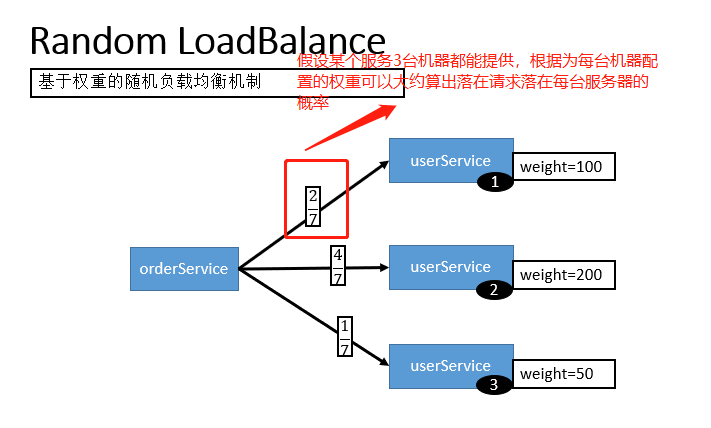
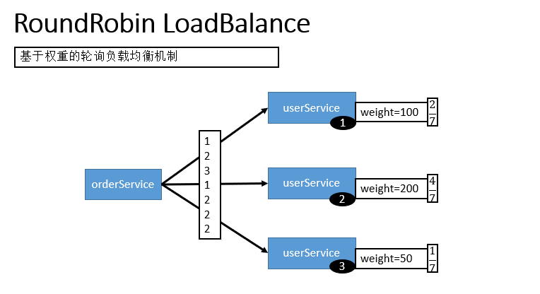

<!-- GFM-TOC -->
* [Dubbo 介绍](#Dubbo-介绍)
  * [简介](#简介)
  * [RPC](#RPC)
    * [常见的 RPC 框架](#常见的-RPC-框架)
    * [RPC HTTP](#RPC-HTTP)
  * [Dubbo 的产生](#Dubbo-的产生)
    * [Dubbo的背景](#Dubbo的背景)
    * [Dubbo的需求](#Dubbo的需求)
  * [分布式](#分布式)
* [Dubbo 架构](#Dubbo-架构)
  * [Dubbo 架构图解](#Dubbo-架构图解)
  * [Dubbo 架构特点](#Dubbo-架构特点)
  * [Dubbo 框架设计](#Dubbo-框架设计)
* [Dubbo 的使用](#Dubbo-的使用)
  * [Dubbo 的注册中心](#Dubbo-的注册中心)
  * [Dubbo 的负载均衡](#Dubbo-的负载均衡)
    * [负载均衡](#负载均衡)
    * [Dubbo 的负载均衡策略](#Dubbo-的负载均衡策略)
    * [配置方式](#配置方式)
<!-- GFM-TOC -->

# Dubbo 介绍

## 简介

Apache Dubbo (incubating) |ˈdʌbəʊ| 是一款高性能、轻量级的开源Java RPC 框架，它提供了三大核心能力：面向接口的远程方法调用，智能容错和负载均衡，以及服务自动注册和发现。简单来说 Dubbo 是一个分布式服务框架，致力于提供高性能和透明化的RPC远程服务调用方案，以及SOA服务治理方案。

Dubbo 目前已经有接近 23k 的 Star ，Dubbo的Github 地址：https://github.com/apache/incubator-dubbo 。 另外，在开源中国举行的2018年度最受欢迎中国开源软件这个活动的评选中，Dubbo 更是凭借其超高人气仅次于 vue.js 和 ECharts 获得第三名的好成绩。

Dubbo 是由阿里开源，后来加入了 Apache 。正式由于 Dubbo 的出现，才使得越来越多的公司开始使用以及接受分布式架构。

## RPC

RPC（Remote Procedure Call），远程过程调用，它是一种通过网络从远程计算机程序上请求服务，而不需要了解底层网络技术的协议。RPC协议假定某些传输协议的存在，如TCP或UDP，为通信程序之间携带信息数据。在OSI网络通信模型中，RPC跨越了传输层和应用层。RPC使得开发包括网络分布式多程序在内的应用程序更加容易。

RPC采用客户机/服务器模式。请求程序就是一个客户机，而服务提供程序就是一个服务器。首先，客户机调用进程发送一个有进程参数的调用信息到服务进程，然后等待应答信息。在服务器端，进程保持睡眠状态直到调用信息到达为止。当一个调用信息到达，服务器获得进程参数，计算结果，发送答复信息，然后等待下一个调用信息，最后，客户端调用进程接收答复信息，获得进程结果，然后调用执行继续进行。

比如两个不同的服务 A、B 部署在两台不同的机器上，那么服务 A 如果想要调用服务 B 中的某个方法该怎么办呢？使用 HTTP请求 当然可以，但是可能会比较慢而且一些优化做的并不好。 RPC 的出现就是为了解决这个问题。

RPC 主要解决了：**让分布式或者微服务系统中不同服务之间的调用像本地调用一样简单。**


1. 服务消费方（client）调用以本地调用方式调用服务；
2. client stub接收到调用后负责将方法、参数等组装成能够进行网络传输的消息体；
3. client stub找到服务地址，并将消息发送到服务端；
4. server stub收到消息后进行解码；
5. server stub根据解码结果调用本地的服务；
6. 本地服务执行并将结果返回给server stub；
7. server stub将返回结果打包成消息并发送至消费方；
8. client stub接收到消息，并进行解码；
9. 服务消费方得到最终结果。


### 常见的 RPC 框架

- **RMI（JDK自带）：** JDK自带的RPC，有很多局限性，不推荐使用。
- **Dubbo:** Dubbo是 阿里巴巴公司开源的一个高性能优秀的服务框架，使得应用可通过高性能的 RPC 实现服务的输出和输入功能，可以和 Spring框架无缝集成。目前 Dubbo 已经成为 Spring Cloud Alibaba 中的官方组件。
- **gRPC** ：gRPC是可以在任何环境中运行的现代开源高性能RPC框架。它可以通过可插拔的支持来有效地连接数据中心内和跨数据中心的服务，以实现负载平衡，跟踪，运行状况检查和身份验证。它也适用于分布式计算的最后一英里，以将设备，移动应用程序和浏览器连接到后端服务。

- **Hessian：** Hessian是一个轻量级的remotingonhttp工具，使用简单的方法提供了RMI的功能。 相比WebService，Hessian更简单、快捷。采用的是二进制RPC协议，因为采用的是二进制协议，所以它很适合于发送二进制数据。
- **Thrift：**  Apache Thrift是Facebook开源的跨语言的RPC通信框架，目前已经捐献给Apache基金会管理，由于其跨语言特性和出色的性能，在很多互联网公司得到应用，有能力的公司甚至会基于thrift研发一套分布式服务框架，增加诸如服务注册、服务发现等功能。

如何进行选择？
- **是否允许代码侵入：**  即需要依赖相应的代码生成器生成代码，比如Thrift。
- **是否需要长连接获取高性能：**  如果对于性能需求较高的haul，那么可以果断选择基于TCP的Thrift、Dubbo。
- **是否需要跨越网段、跨越防火墙：** 这种情况一般选择基于HTTP协议的Hessian和Thrift的HTTP Transport。

此外，Google推出的基于HTTP2.0的gRPC框架也开始得到应用，其序列化协议基于Protobuf，网络框架使用的是Netty4,但是其需要生成代码，可扩展性也比较差。  


### RPC HTTP

RPC 只是一种概念、一种设计，就是为了解决 **不同服务之间的调用问题**, 它一般会包含有 **传输协议** 和 **序列化协议** 这两个。

实现 RPC 的可以传输协议可以直接建立在 TCP 之上，也可以建立在 HTTP 协议之上。大部分 RPC 框架都是使用的 TCP 连接（gRPC使用了HTTP2）。

主要关键就在 HTTP 使用的 TCP 协议，和我们自定义的 TCP 协议在报文上的区别。

http1.1协议的 TCP 报文包含太多在传输过程中可能无用的信息；

> 首先要否认一点 HTTP 协议相较于自定义 TCP 报文协议，增加的开销在于连接的建立与断开。HTTP 协议是支持连接池复用的，也就是建立一定数量的连接不断开，并不会频繁的创建和销毁连接。二要说的是 HTTP 也可以使用 Protobuf 这种二进制编码协议对内容进行编码，因此二者最大的区别还是在传输协议上。

**使用自定义 TCP 协议进行传输就会避免上面这个问题，极大地减轻了传输数据的开销。**
这也就是为什么通常会采用自定义 TCP 协议的 RPC来进行进行服务调用的真正原因。
除此之外，成熟的 RPC框架还提供好了“服务自动注册与发现”、"智能负载均衡"、“可视化的服务治理和运维”、“运行期流量调度”等等功能，这些也算是选择RPC 进行服务注册和发现的一方面原因吧！


## Dubbo 的产生

Dubbo 的诞生和 SOA 分布式架构的流行有着莫大的关系。SOA 面向服务的架构（Service Oriented Architecture），也就是把工程按照业务逻辑拆分成服务层、表现层两个工程。服务层中包含业务逻辑，只需要对外提供服务即可。表现层只需要处理和页面的交互，业务逻辑都是调用服务层的服务来实现。SOA架构中有两个主要角色：服务提供者（Provider）和服务使用者（Consumer）。

### Dubbo的背景

随着互联网的发展，网站应用的规模不断扩大，常规的垂直应用架构已无法应对，分布式服务架构以及流动计算架构势在必行，亟需一个治理系统确保架构有条不紊的演进。


**单一应用架构**

当网站流量很小时，只需一个应用，将所有功能都部署在一起，以减少部署节点和成本。此时，用于简化增删改查工作量的数据访问框架(ORM)是关键。

**垂直应用架构**

当访问量逐渐增大，单一应用增加机器带来的加速度越来越小，将应用拆成互不相干的几个应用，以提升效率。此时，用于加速前端页面开发的Web框架(MVC)是关键。

**分布式服务架构**

当垂直应用越来越多，应用之间交互不可避免，将核心业务抽取出来，作为独立的服务，逐渐形成稳定的服务中心，使前端应用能更快速的响应多变的市场需求。此时，用于提高业务复用及整合的分布式服务框架(RPC)是关键。

**流动计算架构**

当服务越来越多，容量的评估，小服务资源的浪费等问题逐渐显现，此时需增加一个调度中心基于访问压力实时管理集群容量，提高集群利用率。此时，用于提高机器利用率的资源调度和治理中心(SOA)是关键。

### Dubbo的需求


在大规模服务化之前，应用可能只是通过 RMI 或 Hessian 等工具，简单的暴露和引用远程服务，通过配置服务的URL地址进行调用，通过 F5 等硬件进行负载均衡。

当服务越来越多时，服务 URL 配置管理变得非常困难，F5 硬件负载均衡器的单点压力也越来越大。 此时需要一个服务注册中心，动态地注册和发现服务，使服务的位置透明。并通过在消费方获取服务提供方地址列表，实现软负载均衡和 Failover，降低对 F5 硬件负载均衡器的依赖，也能减少部分成本。

当进一步发展，服务间依赖关系变得错踪复杂，甚至分不清哪个应用要在哪个应用之前启动，架构师都不能完整的描述应用的架构关系。 这时，需要自动画出应用间的依赖关系图，以帮助架构师理清理关系。

接着，服务的调用量越来越大，服务的容量问题就暴露出来，这个服务需要多少机器支撑？什么时候该加机器？ 为了解决这些问题，第一步，要将服务现在每天的调用量，响应时间，都统计出来，作为容量规划的参考指标。其次，要可以动态调整权重，在线上，将某台机器的权重一直加大，并在加大的过程中记录响应时间的变化，直到响应时间到达阈值，记录此时的访问量，再以此访问量乘以机器数反推总容量。


**Dubbo 的特性**
1. **负载均衡**：同一个服务部署在不同的机器时该调用那一台机器上的服务。
2. **服务调用链路生成**：随着系统的发展，服务越来越多，服务间依赖关系变得错踪复杂，甚至分不清哪个应用要在哪个应用之前启动，架构师都不能完整的描述应用的架构关系。Dubbo 可以为我们解决服务之间互相是如何调用的。
3. **服务访问压力以及时长统计、资源调度和治理**：基于访问压力实时管理集群容量，提高集群利用率。
4. **服务降级**：某个服务挂掉之后调用备用服务。

Dubbo 除了能够应用在分布式系统中，也可以应用在现在比较火的微服务系统中。不过，由于 Spring Cloud 在微服务中应用更加广泛，所以，我觉得一般我们提 Dubbo 的话，大部分是分布式系统的情况。

## 分布式

分布式或者说 SOA 分布式重要的就是面向服务，说简单的分布式就是我们把整个系统拆分成不同的服务然后将这些服务放在不同的服务器上减轻单体服务的压力提高并发量和性能。比如电商系统可以简单地拆分成订单系统、商品系统、登录系统等等，拆分之后的每个服务可以部署在不同的机器上，如果某一个服务的访问量比较大的话也可以将这个服务同时部署在多台机器上。

**为什么要分布式?**

从开发角度来讲单体应用的代码都集中在一起，而分布式系统的代码根据业务被拆分。所以，每个团队可以负责一个服务的开发，这样提升了开发效率。另外，代码根据业务拆分之后更加便于维护和扩展。

另外，将系统拆分成分布式之后不仅便于系统扩展和维护，更能提高整个系统的性能。把整个系统拆分成不同的服务/系统，然后每个服务/系统 单独部署在一台服务器上，是不是很大程度上提高了系统性能呢？

# Dubbo 架构

## Dubbo 架构图解


**节点角色说明：**

- **Provider：**    暴露服务的服务提供方
- **Consumer：**    调用远程服务的服务消费方
- **Registry：**    服务注册与发现的注册中心
- **Monitor：**     统计服务的调用次数和调用时间的监控中心
- **Container：**   服务运行容器

**调用关系说明：**

1. 服务容器负责启动，加载，运行服务提供者。
2. 服务提供者在启动时，向注册中心注册自己提供的服务。
3. 服务消费者在启动时，向注册中心订阅自己所需的服务。
4. 注册中心返回服务提供者地址列表给消费者，如果有变更，注册中心将基于长连接推送变更数据给消费者。
5. 服务消费者，从提供者地址列表中，基于软负载均衡算法，选一台提供者进行调用，如果调用失败，再选另一台调用。
6. 服务消费者和提供者，在内存中累计调用次数和调用时间，定时每分钟发送一次统计数据到监控中心。

## Dubbo 架构特点

- 连通性
- 健壮性
- 伸缩性
- 升级性

总结
- 注册中心负责服务地址的注册与查找，相当于目录服务，服务提供者和消费者只在启动时与注册中心交互，注册中心不转发请求，压力较小
- 监控中心负责统计各服务调用次数，调用时间等，统计先在内存汇总后每分钟一次发送到监控中心服务器，并以报表展示
- 注册中心，服务提供者，服务消费者三者之间均为长连接，监控中心除外
- 注册中心通过长连接感知服务提供者的存在，服务提供者宕机，注册中心将立即推送事件通知消费者
- 注册中心和监控中心全部宕机，不影响已运行的提供者和消费者，消费者在本地缓存了提供者列表
- 注册中心和监控中心都是可选的，服务消费者可以直连服务提供者
- 服务提供者无状态，任意一台宕掉后，不影响使用
- 服务提供者全部宕掉后，服务消费者应用将无法使用，并无限次重连等待服务提供者恢复

**连通性**
- 注册中心负责服务地址的注册与查找，相当于目录服务，服务提供者和消费者只在启动时与注册中心交互，注册中心不转发请求，压力较小
- 监控中心负责统计各服务调用次数，调用时间等，统计先在内存汇总后每分钟一次发送到监控中心服务器，并以报表展示
- 服务提供者向注册中心注册其提供的服务，并汇报调用时间到监控中心，此时间不包含网络开销
- 服务消费者向注册中心获取服务提供者地址列表，并根据负载算法直接调用提供者，同时汇报调用时间到监控中心，此时间包含网络开销
- 注册中心，服务提供者，服务消费者三者之间均为长连接，监控中心除外
- 注册中心通过长连接感知服务提供者的存在，服务提供者宕机，注册中心将立即推送事件通知消费者
- 注册中心和监控中心全部宕机，不影响已运行的提供者和消费者，消费者在本地缓存了提供者列表
- 注册中心和监控中心都是可选的，服务消费者可以直连服务提供者

**健壮性**
- 监控中心宕掉不影响使用，只是丢失部分采样数据
- 数据库宕掉后，注册中心仍能通过缓存提供服务列表查询，但不能注册新服务
- 注册中心对等集群，任意一台宕掉后，将自动切换到另一台
- 注册中心全部宕掉后，服务提供者和服务消费者仍能通过本地缓存通讯
- 服务提供者无状态，任意一台宕掉后，不影响使用
- 服务提供者全部宕掉后，服务消费者应用将无法使用，并无限次重连等待服务提供者恢复

**伸缩性**
- 注册中心为对等集群，可动态增加机器部署实例，所有客户端将自动发现新的注册中心
- 服务提供者无状态，可动态增加机器部署实例，注册中心将推送新的服务提供者信息给消费者

**升级性**
- 当服务集群规模进一步扩大，带动IT治理结构进一步升级，需要实现动态部署，进行流动计算，现有分布式服务架构不会带来阻力。

## Dubbo 框架设计


图中从下至上分为十层，各层均为单向依赖，右边的黑色箭头代表层之间的依赖关系，每一层都可以剥离上层被复用，其中，Service 和 Config 层为 API，其它各层均为 SPI。

**各层说明**：

- 第一层：**service层**，接口层，给服务提供者和消费者来实现的
- 第二层：**config层**，配置层，主要是对dubbo进行各种配置的
- 第三层：**proxy层**，服务接口透明代理，生成服务的客户端 Stub 和服务器端 Skeleton
- 第四层：**registry层**，服务注册层，负责服务的注册与发现
- 第五层：**cluster层**，集群层，封装多个服务提供者的路由以及负载均衡，将多个实例组合成一个服务
- 第六层：**monitor层**，监控层，对rpc接口的调用次数和调用时间进行监控
- 第七层：**protocol层**，远程调用层，封装rpc调用
- 第八层：**exchange层**，信息交换层，封装请求响应模式，同步转异步
- 第九层：**transport层**，网络传输层，抽象mina和netty为统一接口
- 第十层：**serialize层**，数据序列化层，网络传输需要

# Dubbo 的使用

[Dubbo 中文手册](http://dubbo.apache.org/zh-cn)

## Dubbo 的注册中心

- **Zookeeper** 注册中心(推荐使用)
  - 优点:支持网络集群
  - 缺点:稳定性受限于Zookeeper
- Redis 注册中心
  - 优点:性能高
  - 缺点:对服务器环境要求较高
- Multicast 注册中心
  - 优点:面中心化,不需要额外安装软件
  - 缺点:建议同机房(局域网)内使用
- Simple 注册中心
  - 适用于测试环境.不支持集群


## Dubbo 的负载均衡

### 负载均衡

> 维基百科对负载均衡的定义：负载均衡改善了跨多个计算资源（例如计算机，计算机集群，网络链接，中央处理单元或磁盘驱动的的工作负载分布。负载平衡旨在优化资源使用，最大化吞吐量，最小化响应时间，并避免任何单个资源的过载。使用具有负载平衡而不是单个组件的多个组件可以通过冗余提高可靠性和可用性。负载平衡通常涉及专用软件或硬件。

**用通俗的话说**

比如我们的系统中的某个服务的访问量特别大，我们将这个服务部署在了多台服务器上，当客户端发起请求的时候，多台服务器都可以处理这个请求。那么，如何正确选择处理该请求的服务器就很关键。假如，你就要一台服务器来处理该服务的请求，那该服务部署在多台服务器的意义就不复存在了。负载均衡就是为了避免单个服务器响应同一请求，容易造成服务器宕机、崩溃等问题，我们从负载均衡的这四个字就能明显感受到它的意义。

### Dubbo 的负载均衡策略

在集群负载均衡时，Dubbo 提供了多种均衡策略，默认为 `random` 随机调用。可以自行扩展负载均衡策略，参见：[负载均衡扩展](https://dubbo.gitbooks.io/dubbo-dev-book/content/impls/load-balance.html)。

#### Random LoadBalance

**基于权重的随机负载均衡机制**(默认)


- **随机，按权重设置随机概率。**
- 在一个截面上碰撞的概率高，但调用量越大分布越均匀，而且按概率使用权重后也比较均匀，有利于动态调整提供者权重。



#### RoundRobin LoadBalance

**基于权重的轮询负载均衡机制**(不推荐)

- 轮循，按公约后的权重设置轮循比率。
- 存在慢的提供者累积请求的问题，比如：第二台机器很慢，但没挂，当请求调到第二台时就卡在那，久而久之，所有请求都卡在调到第二台上。



#### LeastActive LoadBalance

- 最少活跃调用数，相同活跃数的随机，活跃数指调用前后计数差。
- 使慢的提供者收到更少请求，因为越慢的提供者的调用前后计数差会越大。

#### ConsistentHash LoadBalance

**一致性 Hash，相同参数的请求总是发到同一提供者。(如果需要的不是随机负载均衡，是要一类请求都到一个节点，那就走这个一致性hash策略。)**
- 当某一台提供者挂时，原本发往该提供者的请求，基于虚拟节点，平摊到其它提供者，不会引起剧烈变动。
- 算法参见：http://en.wikipedia.org/wiki/Consistent_hashing
- 缺省只对第一个参数 Hash，如果要修改，请配置 `<dubbo:parameter key="hash.arguments" value="0,1" />`
- 缺省用 160 份虚拟节点，如果要修改，请配置 `<dubbo:parameter key="hash.nodes" value="320" />`

### 配置方式

**xml 配置方式**

服务端服务级别

```java
<dubbo:service interface="..." loadbalance="roundrobin" />
```
客户端服务级别

```java
<dubbo:reference interface="..." loadbalance="roundrobin" />
```

服务端方法级别

```java
<dubbo:service interface="...">
    <dubbo:method name="..." loadbalance="roundrobin"/>
</dubbo:service>
```

客户端方法级别

```java
<dubbo:reference interface="...">
    <dubbo:method name="..." loadbalance="roundrobin"/>
</dubbo:reference>
```

**注解配置方式：**

消费方基于基于注解的服务级别配置方式：

```java
@Reference(loadbalance = "roundrobin")
HelloService helloService;
```