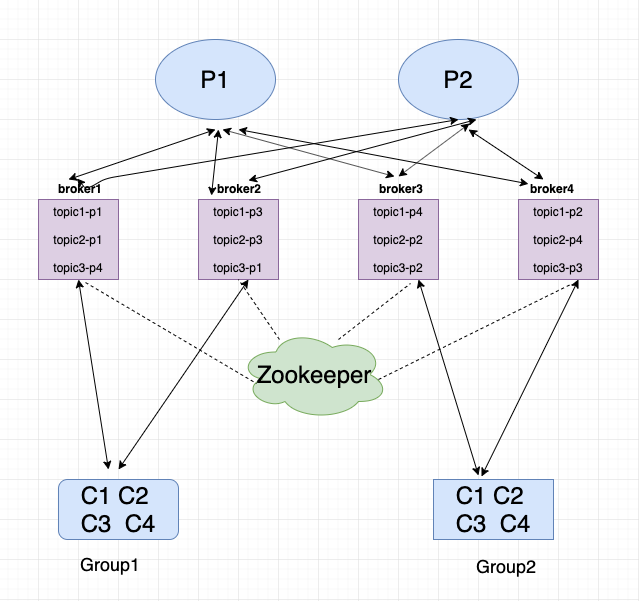
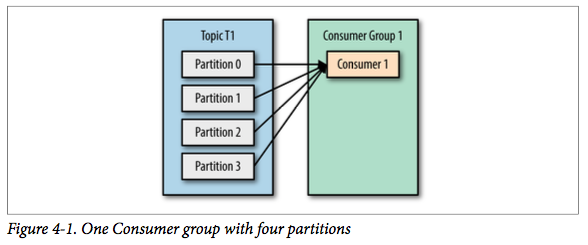
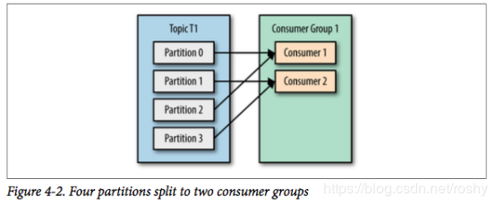
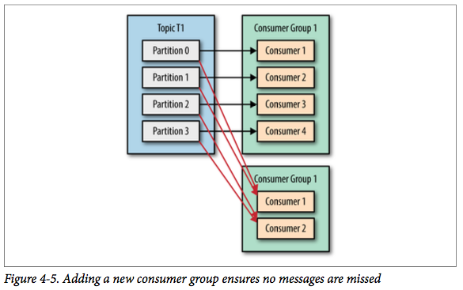
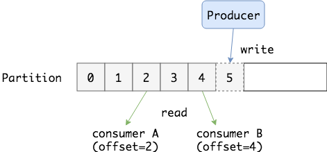

<!-- GFM-TOC -->
* [Kafka 介绍](#Kafka-介绍)
  * [Kafka 简介](#Kafka-简介)
  * [Kafka 核心概念](#Kafka-核心概念)
    * [生产者与消费者](#生产者与消费者)
    * [主题(Topic) 和 分区(Partition)](#主题Topic-和-分区Partition)
    * [Broker 和 Cluster](#Broker-和-Cluster)
    * [多集群](#多集群)
* [Kafka 设计与实现](#Kafka-设计与实现)
  * [Kafka 架构](#Kafka-架构)
  * [Kafka 文件系统作为存储](#Kafka-文件系统作为存储)
    * [底层存储设计](#底层存储设计)
  * [生产者设计](#生产者设计)
  * [消费者设计](#消费者设计)
    * [消费者和消费者组](#消费者和消费者组)
    * [消费者组与分区重平衡](#消费者组与分区重平衡)
    * [Partition 与消费模型](#Partition-与消费模型)
    * [消费者的 pull 模型](#消费者的-pull-模型)
  * [Kafka 可靠性](#Kafka-可靠性)
* [对比RocketMQ](#对比RocketMQ)
  * [消息消费](#消息消费)
    * [消息投递实时性](#消息投递实时性)
    * [消费失败重试](#消费失败重试)
<!-- GFM-TOC -->

# Kafka 介绍

## Kafka 简介

**Kafka 是一种分布式的，基于发布 / 订阅的消息系统。** 

主要设计目标如下：

- 以时间复杂度为 O(1) 的方式提供消息持久化能力，即使对 TB 级以上数据也能保证常数时间复杂度的访问性能。
- 高吞吐率。即使在非常廉价的商用机器上也能做到单机支持每秒 100K 条以上消息的传输。
- 支持 Kafka Server 间的消息分区，及分布式消费，同时保证每个 Partition 内的消息顺序传输。
- 同时支持离线数据处理和实时数据处理。
- Scale out：支持在线水平扩展。

## Kafka 核心概念

### 生产者与消费者


对于 Kafka 来说客户端有两种基本类型：

1. **生产者（Producer）**
2. **消费者（Consumer）**

除此之外，还有用来做数据集成的 Kafka Connect API 和流式处理的 Kafka Streams 等高阶客户端，但这些高阶客户端底层仍然是生产者和消费者API，它们只不过是在上层做了封装。

生产者（也称为发布者）创建消息，而消费者（也称为订阅者）负责订阅和消费消息。

**Consumer Group**：同一个Consumer Group中的Consumers，Kafka将相应Topic中的每个消息只发送给其中一个Consumer；消费者用consumerGroup来标识自己。同一个消费组可以并发地消费多个分区的消息，同一个partition也可以由多个consumerGroup并发消费，但是在consumerGroup中一个partition只能由一个consumer消费。

### 主题(Topic) 和 分区(Partition)


在 Kafka 中，消息以**主题（Topic）**来分类，每一个主题都对应一个 **「消息队列」**，这有点儿类似于数据库中的表。但是如果我们把所有同类的消息都塞入到一个“中心”队列中，势必缺少可伸缩性，无论是生产者/消费者数目的增加，还是消息数量的增加，都可能耗尽系统的性能或存储。

我们使用一个生活中的例子来说明：现在 A 城市生产的某商品需要运输到 B 城市，走的是公路，那么单通道的高速公路不论是在「A 城市商品增多」还是「现在 C 城市也要往 B 城市运输东西」这样的情况下都会出现「吞吐量不足」的问题。所以我们现在引入**分区（Partition）**的概念，类似“允许多修几条道”的方式对我们的主题完成了水平扩展。

消息的主题、队列，每一个消息都有它的topic，Kafka通过topic对消息进行归类。Kafka中可以将Topic从物理上划分成一个或多个分区（Partition），每个分区在物理上对应一个文件夹，以“topicName_partitionIndex”的命名方式命名，该目录包含了这个分区的所有消息(.log)和索引文件(.index)，这使得Kafka的吞吐率可以水平扩展。

### Broker 和 Cluster

一个 Kafka 服务器也称为 Broker，它接受生产者发送的消息并存入磁盘；Broker 同时服务消费者拉取分区消息的请求，返回目前已经提交的消息。使用特定的机器硬件，一个 Broker 每秒可以处理成千上万的分区和百万量级的消息。

若干个 Broker 组成一个集群（Cluster），其中集群内某个 Broker 会成为集群控制器（Cluster Controller），它负责管理集群，包括分配分区到 Broker、监控 Broker 故障等。在集群内，一个分区由一个 Broker 负责，这个 Broker 也称为这个分区的 Leader；当然一个分区可以被复制到多个 Broker 上来实现冗余，这样当存在 Broker 故障时可以将其分区重新分配到其他 Broker 来负责。下图是一个样例：


Kafka 的一个关键性质是日志保留（retention），我们可以配置主题的消息保留策略，譬如只保留一段时间的日志或者只保留特定大小的日志。当超过这些限制时，老的消息会被删除。我们也可以针对某个主题单独设置消息过期策略，这样对于不同应用可以实现个性化。

### 多集群

随着业务发展，我们往往需要多集群，通常处于下面几个原因：

- 基于数据的隔离；
- 基于安全的隔离；
- 多数据中心（容灾）

当构建多个数据中心时，往往需要实现消息互通。举个例子，假如用户修改了个人资料，那么后续的请求无论被哪个数据中心处理，这个更新需要反映出来。又或者，多个数据中心的数据需要汇总到一个总控中心来做数据分析。

上面说的分区复制冗余机制只适用于同一个 Kafka 集群内部，对于多个 Kafka 集群消息同步可以使用 Kafka 提供的 MirrorMaker 工具。本质上来说，MirrorMaker 只是一个 Kafka 消费者和生产者，并使用一个队列连接起来而已。它从一个集群中消费消息，然后往另一个集群生产消息。

# Kafka 设计与实现

## Kafka 架构

能够发布和订阅消息流（类似于消息队列） 以容错的、持久的方式存储消息流 多分区概念，提高了并行能力



## Kafka 文件系统作为存储

**首先应该知道 Kafka 的消息是存在于文件系统之上的**。Kafka 高度依赖文件系统来存储和缓存消息，一般的人认为 “磁盘是缓慢的”，所以对这样的设计持有怀疑态度。实际上，磁盘比人们预想的快很多也慢很多，这取决于它们如何被使用；一个好的磁盘结构设计可以使之跟网络速度一样快。

现代的操作系统针对磁盘的读写已经做了一些优化方案来加快磁盘的访问速度。比如，**预读**会提前将一个比较大的磁盘快读入内存。**后写**会将很多小的逻辑写操作合并起来组合成一个大的物理写操作。并且，操作系统还会将主内存剩余的所有空闲内存空间都用作**磁盘缓存**，所有的磁盘读写操作都会经过统一的磁盘缓存（除了直接 I/O 会绕过磁盘缓存）。综合这几点优化特点，**如果是针对磁盘的顺序访问，某些情况下它可能比随机的内存访问都要快，甚至可以和网络的速度相差无几。**

**上述的 Topic 其实是逻辑上的概念，面相消费者和生产者，物理上存储的其实是 Partition**，每一个 Partition 最终对应一个目录，里面存储所有的消息和索引文件。默认情况下，每一个 Topic 在创建时如果不指定 Partition 数量时只会创建 1 个 Partition。比如，我创建了一个 Topic 名字为 test ，没有指定 Partition 的数量，那么会默认创建一个 test-0 的文件夹，这里的命名规则是：`<topic_name>-<partition_id>`。


任何发布到 Partition 的消息都会被追加到 Partition 数据文件的尾部，这样的顺序写磁盘操作让 Kafka 的效率非常高（经验证，顺序写磁盘效率比随机写内存还要高，这是 Kafka 高吞吐率的一个很重要的保证）。

每一条消息被发送到 Broker 中，会根据 Partition 规则选择被存储到哪一个 Partition。如果 Partition 规则设置的合理，所有消息可以均匀分布到不同的 Partition中。

### 底层存储设计

假设现在 Kafka 集群只有一个 Broker，我们创建 2 个 Topic 名称分别为：「topic1」和「topic2」，Partition 数量分别为 1、2，那么根目录下就会创建如下三个文件夹：

```shell
    | --topic1-0
    | --topic2-0
    | --topic2-1
```

在 Kafka 的文件存储中，同一个 Topic 下有多个不同的 Partition，每个 Partition 都为一个目录，而每一个目录又被平均分配成多个大小相等的 **Segment File** 中，Segment File 又由 index file 和 data file 组成，他们总是成对出现，后缀 “.index” 和 “.log” 分表表示 Segment 索引文件和数据文件。

现在假设设置每个 Segment 大小为 500 MB，并启动生产者向 topic1 中写入大量数据，topic1-0 文件夹中就会产生类似如下的一些文件：

```shell
   | --topic1-0 
       | --00000000000000000000.index 
       | --00000000000000000000.log 
       | --00000000000000368769.index 
       | --00000000000000368769.log 
       | --00000000000000737337.index 
       | --00000000000000737337.log 
       | --00000000000001105814.index | --00000000000001105814.log 
   | --topic2-0 
   | --topic2-1

```

**Segment 是 Kafka 文件存储的最小单位。**Segment 文件命名规则：Partition 全局的第一个 Segment 从 0 开始，后续每个 Segment 文件名为上一个 Segment 文件最后一条消息的 offset 值。数值最大为 64 位 long 大小，19 位数字字符长度，没有数字用0填充。如 00000000000000368769.index 和 00000000000000368769.log。

以上面的一对 Segment File 为例，说明一下索引文件和数据文件对应关系：


其中以索引文件中元数据 `<3, 497>` 为例，依次在数据文件中表示第 3 个 message（在全局 Partition 表示第 368769 + 3 = 368772 个 message）以及该消息的物理偏移地址为 497。

注意该 index 文件并不是从0开始，也不是每次递增1的，这是因为 Kafka 采取稀疏索引存储的方式，每隔一定字节的数据建立一条索引，它减少了索引文件大小，使得能够把 index 映射到内存，降低了查询时的磁盘 IO 开销，同时也并没有给查询带来太多的时间消耗。

因为其文件名为上一个 Segment 最后一条消息的 offset ，所以当需要查找一个指定 offset 的 message 时，通过在所有 segment 的文件名中进行二分查找就能找到它归属的 segment ，再在其 index 文件中找到其对应到文件上的物理位置，就能拿出该 message 。

由于消息在 Partition 的 Segment 数据文件中是顺序读写的，且消息消费后不会删除（删除策略是针对过期的 Segment 文件），这种顺序磁盘 IO 存储设计师 Kafka 高性能很重要的原因。

> Kafka 是如何准确的知道 message 的偏移的呢？这是因为在 Kafka 定义了标准的数据存储结构，在 Partition 中的每一条 message 都包含了以下三个属性：
> - offset：表示 message 在当前 Partition 中的偏移量，是一个逻辑上的值，唯一确定了 Partition 中的一条 message，可以简单的认为是一个 id；
> - MessageSize：表示 message 内容 data 的大小；
> - data：message 的具体内容

## 生产者设计

当发送消息之前，先问几个问题：每条消息都是很关键且不能容忍丢失么？偶尔重复消息可以么？关注的是消息延迟还是写入消息的吞吐量？

举个例子，有一个信用卡交易处理系统，当交易发生时会发送一条消息到 Kafka，另一个服务来读取消息并根据规则引擎来检查交易是否通过，将结果通过 Kafka 返回。对于这样的业务，消息既不能丢失也不能重复，由于交易量大因此吞吐量需要尽可能大，延迟可以稍微高一点。

再举个例子，假如我们需要收集用户在网页上的点击数据，对于这样的场景，少量消息丢失或者重复是可以容忍的，延迟多大都不重要只要不影响用户体验，吞吐则根据实时用户数来决定。

不同的业务需要使用不同的写入方式和配置。具体的方式在这里不做讨论，现在先看下生产者写消息的基本流程：


流程如下：

1. 首先，我们需要创建一个ProducerRecord，这个对象需要包含消息的主题（topic）和值（value），可以选择性指定一个键值（key）或者分区（partition）。
2. 发送消息时，生产者会对键值和值序列化成字节数组，然后发送到分配器（partitioner）。
3. 如果我们指定了分区，那么分配器返回该分区即可；否则，分配器将会基于键值来选择一个分区并返回。
4. 选择完分区后，生产者知道了消息所属的主题和分区，它将这条记录添加到相同主题和分区的批量消息中，另一个线程负责发送这些批量消息到对应的Kafka broker。
5. 当broker接收到消息后，如果成功写入则返回一个包含消息的主题、分区及位移的RecordMetadata对象，否则返回异常。
6. 生产者接收到结果后，对于异常可能会进行重试。

## 消费者设计

### 消费者和消费者组

假设场景：从Kafka中读取消息，并且进行检查，最后产生结果数据。可以创建一个消费者实例去做这件事情，但如果生产者写入消息的速度比消费者读取的速度快怎么办呢？这样随着时间增长，消息堆积越来越严重。对于这种场景，需要增加多个消费者来进行水平扩展。

Kafka消费者是**消费组**的一部分，当多个消费者形成一个消费组来消费主题时，每个消费者会收到不同分区的消息。假设有一个T1主题，该主题有4个分区；同时我们有一个消费组G1，这个消费组只有一个消费者C1。那么消费者C1将会收到这4个分区的消息，如下所示：



如果我们增加新的消费者C2到消费组G1，那么每个消费者将会分别收到两个分区的消息，如下所示：



如果增加到4个消费者，那么每个消费者将会分别收到一个分区的消息，如下所示：


但如果我们继续增加消费者到这个消费组，剩余的消费者将会空闲，不会收到任何消息：


总而言之，我们可以通过增加消费组的消费者来进行水平扩展提升消费能力。这也是为什么建议创建主题时使用比较多的分区数，这样可以在消费负载高的情况下增加消费者来提升性能。另外，消费者的数量不应该比分区数多，因为多出来的消费者是空闲的，没有任何帮助。

**Kafka一个很重要的特性就是，只需写入一次消息，可以支持任意多的应用读取这个消息。**换句话说，每个应用都可以读到全量的消息。为了使得每个应用都能读到全量消息，应用需要有不同的消费组。对于上面的例子，假如我们新增了一个新的消费组G2，而这个消费组有两个消费者，那么会是这样的：



在这个场景中，消费组G1和消费组G2都能收到T1主题的全量消息，在逻辑意义上来说它们属于不同的应用。

最后，总结起来就是：如果应用需要读取全量消息，那么请为该应用设置一个消费组；如果该应用消费能力不足，那么可以考虑在这个消费组里增加消费者。

### 消费者组与分区重平衡

当一些原因导致consumer对partition消费不再均匀时，kafka会自动执行reblance，使得consumer对partition的消费再次平衡。
什么时候发生rebalance？：

- 组订阅topic数变更
- topic partition数变更
- consumer成员变更
- consumer 加入群组或者离开群组的时候
- consumer被检测为崩溃的时候

可以看到，当新的消费者加入消费组，它会消费一个或多个分区，而这些分区之前是由其他消费者负责的；另外，当消费者离开消费组（比如重启、宕机等）时，它所消费的分区会分配给其他分区。这种现象称为**重平衡（rebalance）**。重平衡是 Kafka 一个很重要的性质，这个性质保证了高可用和水平扩展。**不过也需要注意到，在重平衡期间，所有消费者都不能消费消息，因此会造成整个消费组短暂的不可用。**而且，将分区进行重平衡也会导致原来的消费者状态过期，从而导致消费者需要重新更新状态，这段期间也会降低消费性能。后面我们会讨论如何安全的进行重平衡以及如何尽可能避免。

消费者通过定期发送心跳（hearbeat）到一个作为组协调者（group coordinator）的 broker 来保持在消费组内存活。这个 broker 不是固定的，每个消费组都可能不同。当消费者拉取消息或者提交时，便会发送心跳。

如果消费者超过一定时间没有发送心跳，那么它的会话（session）就会过期，组协调者会认为该消费者已经宕机，然后触发重平衡。可以看到，从消费者宕机到会话过期是有一定时间的，这段时间内该消费者的分区都不能进行消息消费；通常情况下，我们可以进行优雅关闭，这样消费者会发送离开的消息到组协调者，这样组协调者可以立即进行重平衡而不需要等待会话过期。

在 0.10.1 版本，Kafka 对心跳机制进行了修改，将发送心跳与拉取消息进行分离，这样使得发送心跳的频率不受拉取的频率影响。另外更高版本的 Kafka 支持配置一个消费者多长时间不拉取消息但仍然保持存活，这个配置可以避免活锁（livelock）。活锁，是指应用没有故障但是由于某些原因不能进一步消费。

### Partition 与消费模型

上面提到，Kafka 中一个 topic 中的消息是被打散分配在多个 Partition(分区) 中存储的， Consumer Group 在消费时需要从不同的 Partition 获取消息，那最终如何重建出 Topic 中消息的顺序呢？

答案是：没有办法。Kafka 只会保证在 Partition 内消息是有序的，而不管全局的情况。

下一个问题是：Partition 中的消息可以被（不同的 Consumer Group）多次消费，那 Partition中被消费的消息是何时删除的？ Partition 又是如何知道一个 Consumer Group 当前消费的位置呢？

无论消息是否被消费，除非消息到期 Partition 从不删除消息。例如设置保留时间为 2 天，则消息发布 2 天内任何 Group 都可以消费，2 天后，消息自动被删除。
Partition 会为每个 Consumer Group 保存一个偏移量，记录 Group 消费到的位置。 如下图：



### 消费者的 pull 模型

消费者应该向 Broker 要数据（pull）还是 Broker 向消费者推送数据（push）？作为一个消息系统，Kafka 遵循了传统的方式，选择由 Producer 向 broker push 消息并由 Consumer 从 broker pull 消息。一些 logging-centric system，比如 Facebook 的[Scribe](https://github.com/facebookarchive/scribe)和 Cloudera 的[Flume](https://flume.apache.org/)，采用 push 模式。事实上，push 模式和 pull 模式各有优劣。

**push 模式很难适应消费速率不同的消费者，因为消息发送速率是由 broker 决定的**。push 模式的目标是尽可能以最快速度传递消息，但是这样很容易造成 Consumer 来不及处理消息，典型的表现就是拒绝服务以及网络拥塞。**而 pull 模式则可以根据 Consumer 的消费能力以适当的速率消费消息。**

**对于 Kafka 而言，pull 模式更合适**，pull 模式可简化 broker 的设计，Consumer 可自主控制消费消息的速率，同时 Consumer 可以自己控制消费方式——即可批量消费也可逐条消费，同时还能选择不同的提交方式从而实现不同的传输语义。

## Kafka 可靠性

Kafka 中的可靠性保证有如下四点：

- 对于一个分区来说，它的消息是有序的。如果一个生产者向一个分区先写入消息A，然后写入消息B，那么消费者会先读取消息A再读取消息B。
- 当消息写入所有in-sync状态的副本后，消息才会认为**已提交（committed）**。这里的写入有可能只是写入到文件系统的缓存，不一定刷新到磁盘。生产者可以等待不同时机的确认，比如等待分区主副本写入即返回，后者等待所有in-sync状态副本写入才返回。
- 一旦消息已提交，那么只要有一个副本存活，数据不会丢失。
- 消费者只能读取到已提交的消息。

使用这些基础保证，我们构建一个可靠的系统，这时候需要考虑一个问题：究竟我们的应用需要多大程度的可靠性？可靠性不是无偿的，它与系统可用性、吞吐量、延迟和硬件价格息息相关，得此失彼。因此，我们往往需要做权衡，一味的追求可靠性并不实际。

# 对比RocketMQ

## 消息消费

### 消息投递实时性
- Kafka使用短轮询方式，实时性取决于轮询间隔时间
- RocketMQ使用长轮询，同Push方式实时性一致，消息的投递延时通常在几个毫秒。

### 消费失败重试

- Kafka消费失败不支持重试
- RocketMQ消费失败支持定时重试，每次重试间隔时间顺延