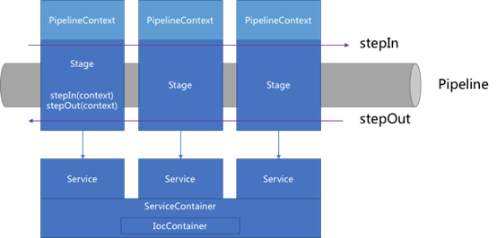
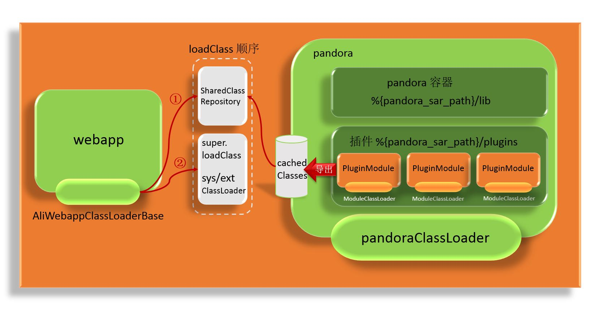
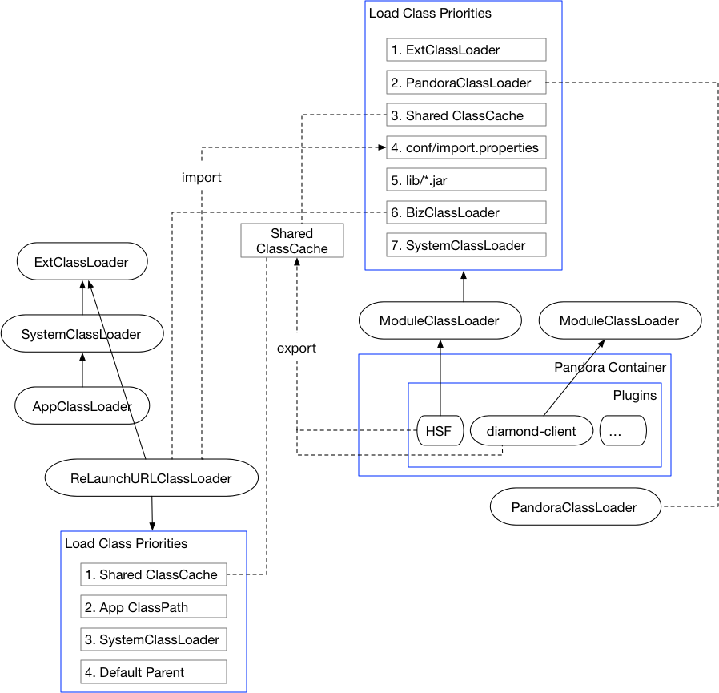

<!-- GFM-TOC -->
* [Pandora Boot](#Pandora-Boot)
  * [Pandora介绍](#Pandora介绍)
    * [功能](#功能)
    * [用途](#用途)
    * [架构](#架构)
    * [加载机制](#加载机制)
<!-- GFM-TOC -->

# Pandora Boot

首先，Pandora Boot 与 Spring Boot 无缝集成，使用 Pandora Boot 的同时也可以充分享受 Spring Boot 的便利；

其次，Pandora Boot 是在 Pandora 的基础之上，发展出的更轻量使用集团中间件的方式；它基于 Pandora 和 Fat Jar 技术，可以直接在 IDE 里启动 Pandora 环境，开发调试等效率都大大提高；

## Pandora介绍

Pandora是一个轻量级的隔离容器，也就是taobao-hsf.sar，它用来隔离Webapp和中间件的依赖，也用来隔离中间件之间的依赖。

### 功能
- 依赖隔离：能够隔离中间件与应用、中间件与中间件之间的依赖，让其相互之间互不影响
- 部署隔离：部署和应用分离，中间件升级相对于应用透明

### 用途

- 升级：应用方可以在运维系统上轻松选择中间件版本并进行升级，该过程不需要应用方修改应用依赖配置，对应用方透明，能够在短时间做到大规模的中间件客户端升级
- 束腰：这里提到束腰其实代表着中间件客户端都会以Sar包的形式统一交付，发散不同的团队开发不同的产品，但是到pandora sar包阶段，只会有一个交付的包，这时就能够进行统一的测试，而不用各个团队分开执行，是测试效率的有效保证

> 束腰，古代建筑学术语。指建筑中的收束部位。 宋 李诫 《营造法式》卷三：“造殿阶基之制……其叠澁每层露棱五寸，束腰露身一尺，用隔身版柱，柱内平面作起突壶门造。”

- 隔离:由于隔离了中间件对于应用的依赖冲突，对应用升级时应用依赖包的影响基本为0，非常安全

### 架构

整个框架由Pipeline、Stage、Service构成。Pipeline表示管道，在管道的每一个环节由Stage完成相应的操作。Pipeline、所有的Stage、Service注册到轻量级的IoC容器，该IoC容器支持Setter注入和单例模式。

Pandora启动过程中的几个核心类：
 
PandoraContainer ：容器入口，启动Pandora容器，创建PipelineContext、ServiceContainer。
 
ServiceContainer ：IOC容器，管理服务的实例化、装配、依赖注入及生命周期管理等操作。框架服务容器管理Pandora注册的Pipeline、Stage、Service，只能由框架自己进行注册，所有插件在任何阶段都可以通过Context访问到这些服务
 
PluginModuleFactory：插件工厂，提供插件初始化, 最终通过ClassLoaderService.createModuleClassLoader为每个插件创建一个ModuleClassLoader。

### 加载机制

JVM中区分类的方式是判断全限定类名和对应类加载器，如果二者一致，则认为是同一个类。对于jar版本不同的类其全限定类名是一致的，所以只能通过不同的classLoader来实现类隔离。

Pandora 中有 3 种 ClassLoader，其中 2 种是 Pandora 内部构建的 ClassLoader，另外一种是第三方应用的ClassLoader。如下：
- PandoraClassLoader：Pandora容器启动类加载器，用于加载包括PandoraContainer在内的 %{pandora_sar_path}/lib 下jar包中的类。PandoraClassLoader 就是一个普通的 URLClassLoader，并没有什么特别之处，由于 pandoraClassLoader 和应用的 ClassLoader 并不是同一个 ClassLoader，因此 pandora 容器与第三方应用容器实现了隔离。
- ModuleClassLoader：Pandora 中间件的类加载器，用于加载%{pandora_sar_path}/plugins目录下的中间件。在部署每一个中间件的时候，pandora 都会创建一个新的 ModuleClassLoader，因此中间件与中间件之间也是相互隔离的。
- bizClassLoader：外部类加载器，可以在构建 PandoraContainer 的时候作为参数从第三方容器中传入，作为类导出/导入交互的类加载器，但这不是必须的。

通过上图我们可以看出，PandoraClassLoader 实现了 pandora中所有中间件与业务方应用的隔离，在 Pandora 内部利用 ModuleClassLoader 实现了各个中间件之间的隔离，然后 Pandora 会把加载好的隔离的中间件中的类导出到 cachedClasses 中(Pandora 内部维护的一个 Map)，AliTomcat 会利用动态代理或者纯粹是反射去获取 cachedClasses 存放到 SharedClassRepository 中(AliTomcat 内部维护的一个类，用于管理 Pandora 导出的 classes)。业务方应用的类加载器 AliWebappClassLoaderBase 在加载类的时候，并不是严格遵循双亲委派模型，它首先会从 SharedClassRepository 中查找需要加载的类，如果找不到才会去走 tomcat 加载类的流程。因此，Pandora 中的中间件是优先被加载的。

