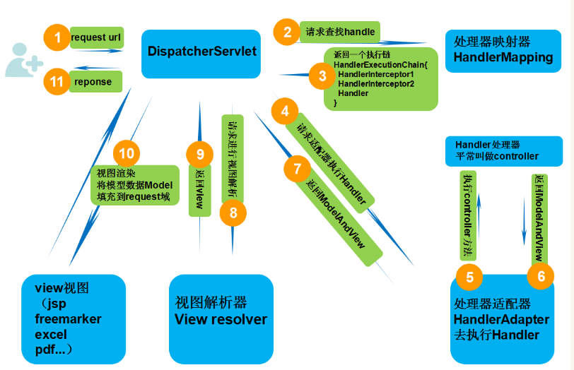
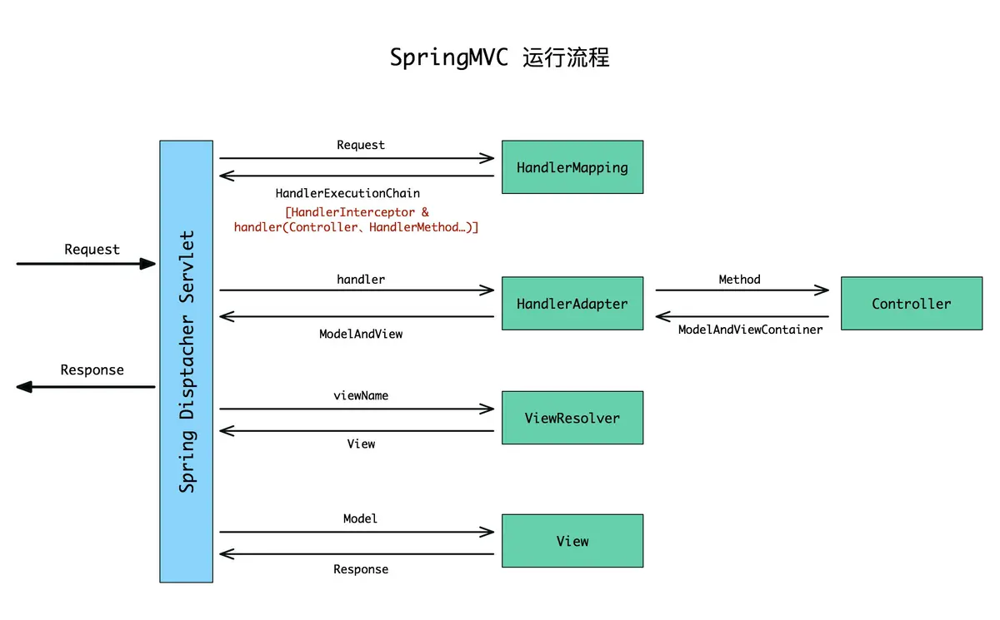

<!-- GFM-TOC --> 
* [Spring MVC 介绍](#Spring-MVC-介绍)
  * [MVC模式](#MVC模式)
    * [MVC的好处](#MVC的好处)
    * [MVC模式在Web中应用](#MVC模式在Web中应用)
  * [Spring MVC](#Spring-MVC)
    * [SpringMVC 特点](#SpringMVC-特点)
    * [对比 Struts2](#对比-Struts2)
* [Spring MVC请求响应过程](#Spring-MVC请求响应过程)
  * [Spring MVC组件](#Spring-MVC组件)
    * [DispatcherServlet 前端控制器](#DispatcherServlet-前端控制器)
    * [HandlerMapping 处理器映射器](#HandlerMapping-处理器映射器)
    * [HandlerAdapter 处理器适配器](#HandlerAdapter-处理器适配器)
    * [Handler 处理器](#Handler-处理器)
    * [ViewResolver 视图解析器](#ViewResolver-视图解析器)
    * [View 视图](#View-视图)
  * [Spring MVC工作详解](#Spring-MVC工作详解)
    * [处理器映射 HandlerMapping](#处理器映射-HandlerMapping)
    * [处理器适配器 HandlerAdapter](#处理器适配器-HandlerAdapter)
    * [参数解析 HandlerAdapter Handler](#参数解析-HandlerAdapter-Handler)
    * [视图解析 View & ViewResolver](#视图解析-View--ViewResolver)
    * [标签 `<mvc:annotation-driven/>`](#标签-mvcannotation-driven)
* [Spring MVC 注解](#Spring-MVC-注解)
<!-- GFM-TOC --> 

# Spring MVC 介绍

Spring Web MVC是一种基于Java的实现了Web MVC设计模式的请求驱动类型的轻量级Web框架，即使用了MVC架构模式的思想，将web层进行职责解耦，基于请求驱动指的就是使用请求-响应模型。

## MVC模式

**MVC**(Model View Controller)是一种软件设计的框架模式，它采用模型(**Model**)-视图(**View**)-控制器(**Controller**)的方法把业务逻辑、数据与界面显示分离。MVC的理念就是把数据处理、数据展示(界面)和程序/用户的交互三者分离开的一种编程模式。

MVC框架模式是一种复合模式，MVC的三个核心部件分别是
- Model(模型)：所有的用户数据、状态以及程序逻辑，独立于视图和控制器
- View(视图)：呈现模型，类似于Web程序中的界面，视图会从模型中拿到需要展现的状态以及数据，对于相同的数据可以有多种不同的显示形式(视图)
- Controller(控制器)：负责获取用户的输入信息，进行解析并反馈给模型，通常情况下一个视图具有一个控制器

### MVC的好处

程序通过将M(Model)和V(View)的代码分离，实现了前后端代码的分离
- 可以使同一个程序使用不同的表现形式，如果控制器反馈给模型的数据发生了变化，那么模型将及时通知有关的视图，视图会对应的刷新自己所展现的内容
- 模型是独立于视图的，所以模型可复用，模型可以独立的移植到别的地方继续使用
- 前后端的代码分离，使项目开发的分工更加明确，程序的测试更加简便，提高开发效率

### MVC模式在Web中应用

**MVC框架模式在B/S下的应用**

- V：View视图，Web程序中指用户可以看到的并可以与之进行数据交互的界面，比如一个html网页界面，MVC可以为程序处理很多不同的视图，用户在视图中进行输出数据以及一系列操作，注意：视图中不会发生数据的处理操作
- M：Model模型：进行所有数据的处理工作，模型返回的数据是中立的，和数据格式无关，一个模型可以为多个视图来提供数据，所以模型的代码重复性比较低
- C：Controller控制器：负责接受用户的输入，并且调用模型和视图去完成用户的需求，控制器不会输出也不会做出任何处理，只会接受请求并调用模型构件去处理用户的请求，然后在确定用哪个视图去显示返回的数据

<div align="center">


</div>

1. 浏览器发送请求到控制器;
2. 控制器不能处理请求必须给模型层来处理接着去访问数据库
3. 模型层将处理好的结果返回给控制层
4. 控制层将逻辑视图响应给浏览器.

MVC的本质 : MVC的核心思想是业务数据抽取,同物业数据呈现分离;有利于程序简化,方便编程

**MVC在Web中的优点**
- 耦合性低：视图(页面)和业务层(数据处理)分离，一个应用的业务流程或者业务规则的改变只需要改动MVC中的模型即可，不会影响到控制器与视图
- 部署快，成本低：MVC使开发和维护用户接口的技术含量降低。使用MVC模式使开发时间得到相当大的缩减，它使程序员（Java开发人员）集中精力于业务逻辑，界面程序员（HTML和JSP开发人员）集中精力于表现形式上
- 可维护性高：分离视图层和业务逻辑层也使得WEB应用更易于维护和修改
  
**MVC在Web中的缺点**
- 调试困难：因为模型和视图要严格的分离，这样也给调试应用程序带来了一定的困难，每个构件在使用之前都需要经过彻底的测试
- 不适合小型，中等规模的应用程序：在一个中小型的应用程序中，强制性的使用MVC进行开发，往往会花费大量时间，并且不能体现MVC的优势，同时会使开发变得繁琐
- 增加系统结构和实现的复杂性：对于简单的界面，严格遵循MVC，使模型、视图与控制器分离，会增加结构的复杂性，并可能产生过多的更新操作，降低运行效率
- 视图与控制器间的过于紧密的连接并且降低了视图对模型数据的访问：视图与控制器是相互分离，但却是联系紧密的部件，视图没有控制器的存在，其应用是很有限的，反之亦然，这样就妨碍了他们的独立重用。依据模型操作接口的不同，视图可能需要多次调用才能获得足够的显示数据。对未变化数据的不必要的频繁访问，也将损害操作性能

## Spring MVC

Spring MVC采用了松散耦合的可插拔组件结构，比其他的MVC框架更具有灵活性和扩展性，Spring MVC通过使用一套注解，使一个Java类成为前端控制器(Controller)，不需要实现任何接口，同时，Spring MVC支持REST形式的URL请求，除此之外，Spring MVC在在数据绑定、视图解析、本地化处理及静态资源处理上都有许多不俗的表现。

### SpringMVC 特点

1. 清晰的角色划分：
   - 前端控制器（DispatcherServlet）
   - 请求到处理器映射（HandlerMapping）
   - 处理器适配器（HandlerAdapter）
   - 视图解析器（ViewResolver）
   - 处理器或页面控制器（Controller）
   - 验证器（ Validator）
   - 表单对象（Form Object 提供给表单展示和提交到的对象就叫表单对象）
2. 由于命令对象就是一个POJO，无需继承框架特定API，可以使用命令对象直接作为业务对象；
3. 和Spring 其他框架无缝集成，是其它Web框架所不具备的；
4. 可适配，通过HandlerAdapter可以支持任意的类作为处理器；
5. 可定制性，HandlerMapping、ViewResolver等能够非常简单的定制；
6. 功能强大的数据验证、格式化、绑定机制；
7. 利用Spring提供的Mock对象能够非常简单的进行Web层单元测试；
8. 本地化、主题的解析的支持，使我们更容易进行国际化和主题的切换。
9. 非常容易与其它视图技术集成，如Velocity、FreeMarker等，因为模型数据不放在特定的API里，而是放在一 个Model里（Map数据结构实现，因此很容易被其他框架使用）。
10. RESTful风格的支持、简单的文件上传、约定优于配置的契约式编程支持、基于注解的零配置支持。

### 对比 Struts2

1. spring mvc是基于方法的设计，而struts2是基于类的设计。 
2. struts2有以自己的interceptor机制，spring mvc用的是独立的AOP方式。 
3. spring mvc的方法之间基本上独立的，独享request response数据，struts2所有Action变量是共享的。 
4. 机制：spring mvc的入口是servlet，而struts2是filter。 
5. 性能：spring会稍微比struts快。 spring mvc是基于方法的设计 ， 而sturts是基于类 ， 每次发一次请求都会实例一个action，每个action都会被注入属性，而spring基于方法，粒度更细
6. 参数传递：struts是在接受参数的时候，可以用属性来接受参数，这就说明参数是让多个方法共享的。
7. 设计思想上： struts更加符合oop的编程思想 ， spring就比较谨慎，在servlet上扩展。 
8. intercepter(拦截器)的实现机制：struts有以自己的interceptor机制， spring mvc用的是独立的AOP方式 。

# Spring MVC请求响应过程




具体步骤：
1. 发起请求到前端控制器(DispatcherServlet)
2. 前端控制器请求HandlerMapping查找 Handler （可以根据xml配置、注解进行查找）
3. 处理器映射器HandlerMapping向前端控制器返回Handler，HandlerMapping会把请求映射为HandlerExecutionChain对象(包含一个Handler处理器（页面控制器）对象，多个HandlerInterceptor拦截器对象），通过这种策略模式，很容易添加新的映射策略
4. 前端控制器调用处理器适配器去执行Handler
5. 处理器适配器HandlerAdapter将会根据适配的结果去执行Handler
6. Handler执行完成给适配器返回ModelAndView
7. 处理器适配器向前端控制器返回ModelAndView （ModelAndView是springmvc框架的一个底层对象，包括 Model和view）
8. 前端控制器请求视图解析器去进行视图解析 （根据逻辑视图名解析成真正的视图(jsp)），通过这种策略很容易更换其他视图技术，只需要更改视图解析器即可
9. 视图解析器向前端控制器返回View
10. 前端控制器进行视图渲染 （视图渲染将模型数据(在ModelAndView对象中)填充到request域）
11. 前端控制器向用户响应结果


## Spring MVC组件

### DispatcherServlet 前端控制器

- 用户请求到达前端控制器,相当于MVC中的C
- DispatcherServlet是整个流程的核心,它来调用其他组件来处理用户请求,前端控制器的存在降低了其他组件之间的耦合度.

### HandlerMapping 处理器映射器

- HandlerMapping 负责根据用户请求找到Handler即处理器。（如用户自定义的Controller）SpringMVC提供了不同的映射器实现不同的映射方式，例如：配置文件方式，实现接口方式，注解方式等。
- 映射器相当于配置信息或注解描述。映射器内部封装了一个类似map的数据结构。使用URL作为key，HandlerExecutionChain作为value。核心控制器，可以通过请求对象（请求对象中包含请求的 URL）在handlerMapping中查询HandlerExecutionChain对象。
- 是SpringMVC核心组件之一。是必不可少的组件。无论是否配置，SpringMVC 会有默认提供。
- 默认的映射器是：RequestMappingHandlerMapping。（老版本中有其他的映射器，但是已经过时。）
  
### HandlerAdapter 处理器适配器

- 通过HandlerAdapter对处理器（Handler）进行执行，这是适配器模式的应用，通过扩展适配器可以对更多类型的处理器进行执行。
- 适配器也是 SpringMVC 中的核心组件之一。必须存在。SpringMVC 框架有默认值。
- 典型的适配器：SimpleControllerHandlerAdapter，最基础的。处理自定义控制器（Handler）和SpringMVC控制器顶级接口Controller之间关联的。

### Handler 处理器

- Handler 是后端控制器, 在前端控制器的控制下后端控制器对具体的用户请求进行处理，Handler涉及到具体的用户请求,所以一般情况下需要程序员根据自己的业务开发
- 在SpringMVC中对Handler没有强制的类型要求。在SpringMVC框架中，对Handler的引用定义类型为Object
- 处理器理论上说不是必要的核心组件。
- SpringMVC框架是一个线程不安全的，轻量级的框架。一个handler对象，处理所有的请求。开发过程中，注意线程安全问题。

### ViewResolver 视图解析器
- ViewResolver 负责将处理结果生成 View 视图，ViewResolver 首先根据逻辑视图名解析成物理视图名即具体的页面地址，再生成 View 视图对象，最后对 View 进行渲染将处理结果通过页面展示给用户。
- 是SpringMVC中必要的组件之一。SpringMVC提供默认视图解析器。

### View 视图

View是一个接口，实现类支持不同的View类型（jsp、freemarker、pdf...）需要工程师开发


## Spring MVC工作详解




### 处理器映射 HandlerMapping

[处理器映射详解](https://www.jianshu.com/p/f04816ee2495)

<!--  -->


SpringMVC 内部是根据 HandlerMapping 将 Request 和 Controller 里面的方法对应起来的。
`HandlerMapping` 功能就是根据请求匹配到对应的 `Handler，然后将找到的` `Handler` 和所有匹配的 `HandlerInterceptor` （拦截器）绑定到创建的 `HandlerExecutionChain` 对象上并返回。

`HandlerMapping` 只是一个接口类，不同的实现类有不同的匹对方式，根据功能的不同我们需要在 SpringMVC 容器中注入不同的映射处理器 `HandlerMapping。`


#### HandlerMapping 接口


容器被初始化的时候会被调用，加载容器中注入的 HandlerMapping。其实常用到的 HandlerMapping 都是由 `<mvc:annotation-driven />` 标签帮我们注册的(包括 RequestMappingHandlerMapping 和 BeanNameUrlHandlerMapping)，如果没有写该标签系统也会帮我们注入默认的映射器，当然也有些需要我们自己手动注入。

在 HandlerMapping 接口中只有一个方法
```java
    HandlerExecutionChain getHandler(HttpServletRequest request) throws Exception;
```


**AbstractHandlerMapping**

实现 `getHandler()` 接口方法得到 HandlerExecutionChain 对象

`getHandler()` 调用抽象方法 `getHandlerInternal()` 匹配并返回对应的 Handler 对象

##### 1. AbstractUrlHandlerMapping

URL 映射的抽象基类，提供将处理程序映射到 Controller，所以该类最终直接返回的 handler 就是 Controller 对象

- 实现父抽象类的抽象方法 `getHandlerInternal()` 匹配并返回对应的 Handler 对象
- 根据路径匹对 handler 的方法 `lookupHandler()`
- 从 `this.handlerMap` 中通过 urlPath 匹对找到对应的 handler 对象
- `registerHandler(String urlPath, Object handler)` 在子类中被调用将 handler 对象加入到 this.handlerMap 

AbstractUrlHandlerMapping 的子类从大致分为两类：
- 间接继承 AbstractUrlHandlerMapping 的 BeanNameUrlHandlerMapping
- 直接继承 AbstractUrlHandlerMapping 的 SimpleUrlHandlerMapping

**1.1 BeanNameUrlHandlerMapping**

在 SpringMVC 容器中，且在注入了 `BeanNameUrlHandlerMapping` 映射器的时候，只要是以 "/" 开头的 bean 的 name，都会作为该映射器匹配的 Handler 对象

注意手动注入 BeanNameUrlHandlerMapping 映射器记得不要跟 `<mvc:annotation-driven />` 标签自动帮我们注入重复(如自己手动注入要么放在 `<mvc:annotation-driven />` 标签之前，要么直接不写)。
注意自定义 Controller 实现类注入 bean 的 id 或 name 必须以 "/" 开头，BeanNameUrlHandlerMapping 映射器主要映射以 "/" 开头的 beanName。


**1.2 SimpleUrlHandlerMapping**

SimpleUrlHandlerMapping 映射器跟前面 BeanNameUrlHandlerMapping 映射器有点不一样。后者是有点类似遍历容器里面有所的 bean 的 name 或 id 找到匹配的，并且 bean 的 name 或 id 有特殊要求，匹配的则加入。而前者则是先将加入该映射器的 handler 先加进该映射器的一个集合属性里面，容器初始化的时候免去了遍历麻烦的步骤。

##### 2. AbstractHandlerMethodMapping

AbstractHandlerMethodMapping 最终获取的 handler 是 `HandlerMethod` 类型对象。

类的实现链
- AbstractHandlerMethodMapping
  - RequestMappingInfoHandlerMapping
    - RequestMappingHandlerMapping 

**2.1 HandlerMethod**

HandlerMethod 其实可以简单理解为保持方法信息的pojo类

**2.2 RequestMappingInfo 类**

主要用来记录方法上 @RequestMapping() 注解里面的参数，针对 RequestMappingHandlerMapping 映射器来使用。

RequestMappingInfo 对象是用来装载方法的匹配相关信息，每个匹配的方法都会对应一个 RequestMappingInfo 对象

**2.3 RequestMappingHandlerMapping**

存储映射关系对象(`MappingRegistry`)

该实体类里面最重要的两个记录集合分别是 mappingLookup 和 urlLookup 

- urlLookup：主要用来记录 lookupPath 请求路径对应的 mapping 集合。这里 Spring 留了一个很活的机制，拿 @RequestMapping 注解来说，他的 value 属性本身就是一个字符数组，在多重设置中难免有路径重复的，所以最终有可能会出现一个 lookupPath 对应多个 RequestMappingInfo，最终在请求过来的时候给了自定义抽象方法让实现类自己实现择优的方式MutivalueMap 是 SpringMVC 自定义的一个 Map 类，key 对应的 value 是一个集合，这从名字上也能看出来。

- mappingLookup：key 是 mapping 对象，value 是 HandlerMethod 对象，最终是通过 lookupPath 在 urlLookup 集合中找到对应的 mapping 对象，通过 mapping 在 mappingLookup 集合中找到 HandlerMethod 对象。


#### 总结

现在开发基本都不用 AbstractUrlHandlerMapping 这种类型的映射器了，但是 SpringMVC 内部还有用到的地方，例如直接 <mvc:view-controller path="" view-name=""/> 标签配置资源不经过视图控制器直接跳转就用到了 SimpleUrlHandlerMapping 这种映射器。AbstractUrlHandlerMapping 匹对解析对应请求最终返回的 handler 是 Controller 对象。

现在习惯直接用 @Controller 和 @RequestMapping 这样注解来描述视图控制器的逻辑，这种资源映射用的是 AbstractHandlerMethodMapping 抽象类的子类 RequestMappingHandlerMapping 映射器，匹对解析对应的请求返回HandlerMethod 对象。


### 处理器适配器 HandlerAdapter

<!--  -->

[处理器适配器 详解](https://www.jianshu.com/p/23ad68d8b421)

不同的映射处理器(HandlerMapping) 映射出来的 handler 对象是不一样的，AbstractUrlHandlerMapping 映射器映射出来的是 handler 是 Controller 对象，AbstractHandlerMethodMapping 映射器映射出来的 handler 是 HandlerMethod 对象。映射的处理器也应该有很多种，不同的映射由不同的适配器来负责解析。

#### HandlerAdapter 接口


```java
public interface HandlerAdapter {
    boolean supports(Object var1);

    @Nullable
    ModelAndView handle(HttpServletRequest var1, HttpServletResponse var2, Object var3) throws Exception;

    long getLastModified(HttpServletRequest var1, Object var2);
}
```

### 参数解析 HandlerAdapter Handler

HandlerAdapter 描述了 handler 是怎么匹配到合适的适配器，进行 handler 对应方法的执行。其他几种适配器还好，但是 RequestMappingHandlerAdapter 适配器对应接下来的参数解析及绑定并执行并不是那么简单。

<!--  -->

RequestMappingHandlerAdapter 大概解析流程如下


[参数解析 HandlerAdapter Handler](https://www.jianshu.com/p/2bfd65bc9ce4)

[自定义参数解析 HandlerAdapter Handler](https://www.jianshu.com/p/6eba4e2c6cab)


#### HandlerMethod

- HandlerMethod 封装方法定义相关的信息 (如类、方法、参数等)
- InvocableHandlerMethod 参数准备委托 HandlerMethodArgumentResolver 进行具体的解析
- ServletInvocableHandlerMethod 添加返回值处理职责，ResponseStatus 处理

在容器初始化的时候，RequestMappingHandlerMapping 映射处理器就将 @RequestMapping 描述的方法以 RequestMappingInfo 为 key，HandlerMethod 为 value 放进自己的缓存 

#### 解析器

参数解析器(HandlerMethodArgumentResolver)
返回值的解析器(HandlerMethodReturnValueHandler)

参数解析及转换的过程，先是通过参数解析器解析参数，然后再是转换器转换参数，最终绑定到对应 RequestMapping 方法参数上。

有些开发场景中，SpringMVC 提供的参数解析器满足不了咱们的需求。例如在数据量大的提交环境中，提交数据用到了表单和JSON融合的方式，就是表单某个字段的 value 是JSON字符串。
如果整个提交的数据体是JSON数据还好，导入Jackson架包，用 @RequestBody 修饰参数，最终 SpringMVC 会通过自带的 RequestResponseBodyMethodProcessor 解析器进行解析，使用 Jackson 提供的 MappingJackson2HttpMessageConverter 转换器将JSON数据转换成我们想要的格式。

如果提交的是正常表单数据也好，用 @RequestParam 修饰参数，最终 SpringMVC 会通过自带的 RequestParamMethodArgumentResolver 解析器解析出表单里面的 value，然后找到合适的转换器将数据装换成我们想要的格式。


### 视图解析 View & ViewResolver

[视图解析 View & ViewResolver](https://www.jianshu.com/p/ec70ae3d1021)

#### ModelAndView

SpringMVC 内部最终会将返回的参数及视图名字封装成一个 ModelAndView 对象，这个对象包含两个部分：Model 是一个 HashMap 集合，View 一般则是一个 String 类型记录要跳转视图的名字或者是视图对象(如果是视图对象的话则直接跳过视图解析器的解析过程)

#### 视图 View

视图的作用是渲染模型数据，将模型里的数据以某种形式呈现给客户，其实就是 html、jsp 甚至 word、excel 文件；

| 视图                    | 说明                                                                          |
| ----------------------- | ----------------------------------------------------------------------------- |
| InternalResourceView    | 将 JSP 或其他资源封装成一个视图，一般 JSP 页面用该视图类                      |
| JstlView                | 继承自InternalResourceView，如果 JSP 页面使用了 JSTL 标签，则需要使用该视图类 |
| AbstractPdfView         | PDF视图的抽象超类                                                             |
| AbstractXlsView         | 传统XLS格式的Excel文档视图的便捷超类，与Apache POI 3.5及更高版本兼容。        |
| AbstractXlsxView        | Office 2007 XLSX格式的Excel文档视图的便捷超类，兼容Apache POI 3.5及更高版本。 |
| MappingJackson2JsonView | 将模型数据 通过 Jackson 开源框架的 ObjectMapper 以 JSON 方式输出              |

#### 视图解析器 ViewResolver

SpringMVC 为逻辑视图名的解析提供了不同的策略，可以在 Spring Web 上下文中配置一种或多种解析策略，并指定他们之间的先后顺序。

- 每一种映射策略对应一个具体的视图解析器实现类。
- 视图解析器的作用是将逻辑视图解析为一个具体的物理视图对象。
- 所有的视图解析器都必须实现 ViewResolver 接口。
- 可以选择一种或多种视图解析器，可以通过其 order 属性指定解析器的优先顺序，order 越小优先级越高。
- SpringMVC 会按照视图解析器顺序的优先次序进行解析，直到返回视图对象。若无，则抛出 ServletException 异常。


| 视图解析器                     | 说明                                                                                                                              |
| ------------------------------ | --------------------------------------------------------------------------------------------------------------------------------- |
| AbstractCachingViewResolver    | 一个抽象视图，继承该类可以让视图解析器具有缓存功能                                                                                |
| XmlViewResolver                | 接受XML文件的视图解析器，默认配置文件在 /WEB-INF/views.xml                                                                        |
| ResourceBundleViewResolver     | 使用properties配置文件的视图解析器，默认配置文件是类路径下的views.properties                                                      |
| UrlBasedViewResolver           | 一个简单的视图解析器，不做任何匹配，需要视图名和实际视图文件名相同                                                                |
| InternalResourceViewResolver   | UrlBasedViewResolver的一个子类，支持Servlet容器的内部类型（JSP、Servlet、以及JSTL等），可以使用setViewClass(..)指定具体的视图类型 |
| FreeMarkerViewResolver         | 也是UrlBasedViewResolver的子类，用于FreeMarker视图技术                                                                            |
| ContentNegotiatingViewResolver | 用于解析基于请求文件名或Accept header的视图                                                                                       |
| BeanNameViewResolver           | 将逻辑视图名解析为一个 Bean，Bean 的 id 等于逻辑视图名                                                                            |


### 标签 `<mvc:annotation-driven/>`

`<mvc:annotation-driven/>`，这个标签会帮我们注入很多关键而实用的bean，但是用它也得小心跟自己手动注入的bean重复，会造成不必要的麻烦。

所有的自定义命名空间（像mvc，context等）下的标签解析都是由BeanDefinitionParser 接口的实现类来完成的；`<mvc:annotation-driven/>`标签，找到对应的实现类是org.springframework.web.servlet.config.AnnotationDrivenBeanDefinitionParser。

AnnotationDrivenBeanDefinitionParser，为 `<annotation-driven />` MVC名称空间元素提供配置。

注册以下 **HandlerMappings** (映射器们)：
- RequestMappingHandlerMapping 的排序为0，用于将请求映射到带@RequestMapping注释的控制器方法。
- BeanNameUrlHandlerMapping 在排序为2，以将URL路径映射到控制器bean名称。

注册以下 **HandlerAdapters** (适配器们)：
- RequestMappingHandlerAdapter 用于使用带@RequestMapping注解的控制器方法处理请求。
- HttpRequestHandlerAdapter 用于使用HttpRequestHandlers处理请求。
- SimpleControllerHandlerAdapter 用于使用基于接口的控制器处理请求。
  
注册以下 **HandlerExceptionResolvers** (异常处理解析器们)：
- ExceptionHandlerExceptionResolver，用于通过 org.springframework.web.bind.annotation.ExceptionHandler 方法处理异常。
- ResponseStatusExceptionResolver 用于使用 org.springframework.web.bind.annotation.ResponseStatus 注释的异常。
- DefaultHandlerExceptionResolver 用于解析已知的Spring异常类型
  
**其他**
- 注册 org.springframework.util.AntPathMatcher 和 org.springframework.web.util.UrlPathHelper 以供 RequestMappingHandlerMapping、ViewControllers 的 HandlerMapping 和 HandlerMapping 服务资源是使用。


# Spring MVC 注解

@**EnableWebMvc**
 
在配置类中开启Web MVC的配置支持，如一些ViewResolver或者MessageConverter等，若无此句，重写WebMvcConfigurerAdapter方法（用于对SpringMVC的配置）。

@**Controller**

声明该类为SpringMVC中的Controller

@**RequestMapping**

用于映射Web请求，包括访问路径和参数（类或方法上）

@**ResponseBody**

支持将返回值放在response内，而不是一个页面，通常用户返回json数据（返回值旁或方法上）

@**RequestBody**

允许request的参数在request体中，而不是在直接连接在地址后面。（放在参数前）

@**RequestParam**

将请求的参数绑定到方法中的参数上，有required参数，默认情况下，required=true，也就是该参数必须要传。

@**PathVariable**

用于接收路径参数，比如@RequestMapping(“/hello/{name}”)申明的路径，将注解放在参数中前，即可获取该值，通常作为Restful的接口实现方法。

@**RestController**

该注解为一个组合注解，相当于@Controller和@ResponseBody的组合，注解在类上，意味着，该Controller的所有方法都默认加上了@ResponseBody。

@**ControllerAdvice**

通过该注解，我们可以将对于控制器的全局配置放置在同一个位置，注解了@Controller的类的方法可使用@ExceptionHandler、@InitBinder、@ModelAttribute注解到方法上， 
这对所有注解了 @RequestMapping的控制器内的方法有效。

@**ExceptionHandler**

用于全局处理控制器里的异常

@**InitBinder**

用来设置WebDataBinder，WebDataBinder用来自动绑定前台请求参数到Model中。

@**ModelAttribute**

本来的作用是绑定键值对到Model里，在@ControllerAdvice中是让全局的@RequestMapping都能获得在此处设置的键值对。