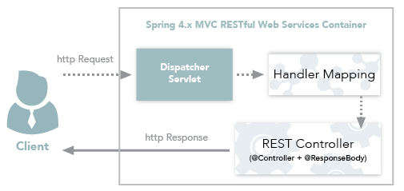
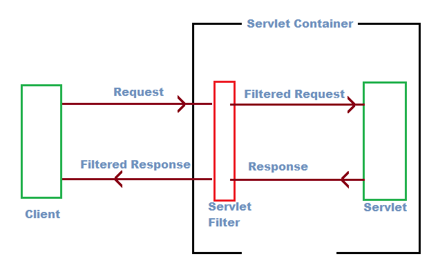
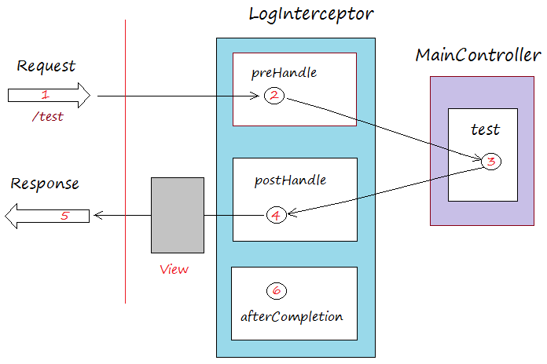

<!-- GFM-TOC --> 
* [SpringBoot 介绍](#SpringBoot-介绍)
  * [Spring 不足](#Spring-不足)
  * [Spring Boot 的引入](#Spring-Boot-的引入)
    * [Spring Boot优点](#Spring-Boot优点)
  * [Spring Boot 环境要求](#Spring-Boot-环境要求)
    * [JDK](#JDK)
    * [构建工具](#构建工具)
    * [开发工具推荐](#开发工具推荐)
    * [Web 服务器](#Web-服务器)
* [Spring Boot 开发](#Spring-Boot-开发)
  * [RESTful Web 服务开发](#RESTful-Web-服务开发)
    * [RESTful Web 服务介绍](#RESTful-Web-服务介绍)
    * [常用注解](#常用注解)
    * [@RestController vs @Controller](#RestController-vs-Controller)
  * [Spring Boot Filter](#Spring-Boot-Filter)
    * [Filter 介绍](#Filter-介绍)
    * [Filter拦截的实现机制](#Filter拦截的实现机制)
    * [自定义Filter](#自定义Filter)
    * [多个Filter顺序](#多个Filter顺序)
  * [Spring Boot Interceptor](#Spring-Boot-Interceptor)
    * [Interceptor介绍](#Interceptor介绍)
    * [过滤器和拦截器的区别](#过滤器和拦截器的区别)
    * [自定义 Interceptor](#自定义-Interceptor)
  * [Spring Boot 异常处理](#Spring-Boot-异常处理)
    * [@ControllerAdvice和@ExceptionHandler处理全局异常](#ControllerAdvice和ExceptionHandler处理全局异常)
    * [@ExceptionHandler 处理 Controller 级别的异常](#ExceptionHandler-处理-Controller-级别的异常)
    * [ResponseStatusException](#ResponseStatusException)
    * [常用解决方案](#常用解决方案)
  * [Spring Boot 热部署](#Spring-Boot-热部署)
* [Spring Boot 进阶](#Spring-Boot-进阶)
  * [Bean映射工具](#Bean映射工具)
  * [参数校验](#参数校验)
    * [校验注解](#校验注解)
    * [验证Controller的输入](#验证Controller的输入)
    * [验证 Service 中的方法](#验证-Service-中的方法)
    * [Validator 编程方式手动进行参数验证](#Validator-编程方式手动进行参数验证)
    * [自定义 Validator](#自定义-Validator)
    * [`@NotNull` vs `@Column(nullable = false)`](#NotNull-vs-Columnnullable--false)
  * [Spring Schedule 定时任务](#Spring-Schedule-定时任务)
    * [创建 scheduled task](#创建-scheduled-task)
    * [启动类`@EnableScheduling`注解](#启动类EnableScheduling注解)
    * [自定义线程池执行 scheduled task](#自定义线程池执行-scheduled-task)
    * [@EnableAsync 和 @Async  使定时任务并行执行](#EnableAsync-和-Async-使定时任务并行执行)
  * [Spring Boot 异步编程](#Spring-Boot-异步编程)
* [Spring Security](#Spring-Security)
<!-- GFM-TOC --> 

# SpringBoot 介绍

## Spring 不足

Spring是重量级企业开发框架 Enterprise JavaBean（EJB） 的替代品，Spring为企业级Java开发提供了一种相对简单的方法，通过 依赖注入 和 面向切面编程 ，用简单的 Java对象（Plain Old Java Object，POJO） 实现了EJB的功能

虽然Spring的组件代码是轻量级的，但它的配置却是重量级的（需要大量XML配置） 。Spring 2.5引入了基于注解的组件扫描，这消除了大量针对应用程序自身组件的显式XML配置。Spring 3.0引入了基于Java的配置，这是一种类型安全的可重构配置方式，可以代替XML。

尽管如此，我们依旧没能逃脱配置的魔爪。开启某些Spring特性时，比如事务管理和Spring MVC，还是需要用XML或Java进行显式配置。启用第三方库时也需要显式配置，比如基于Thymeleaf的Web视图。配置Servlet和过滤器（比如Spring的DispatcherServlet）同样需要在web.xml或Servlet初始化代码里进行显式配置。组件扫描减少了配置量，Java配置让它看上去简洁不少，但Spring还是需要不少配置。

## Spring Boot 的引入

**官方介绍**
> Spring Boot makes it easy to create stand-alone, production-grade Spring based Applications that you can “just run”...Most Spring Boot applications need very little Spring configuration.
> 
> Spring Boot可以轻松创建独立的生产级基于Spring的应用程序,只要通过 “just run”（可能是run ‘Application’或java -jar 或 tomcat 或 maven插件run 或 shell脚本）便可以运行项目。大部分Spring Boot项目只需要少量的配置即可)

简而言之，从本质上来说，Spring Boot就是Spring，它做了那些没有它你自己也会去做的Spring Bean配置。

Spring Framework旨在简化J2EE企业应用程序开发。Spring Boot Framework旨在简化Spring开发。

### Spring Boot优点

1. 开发基于 Spring 的应用程序很容易。
2. Spring Boot 项目所需的开发或工程时间明显减少，通常会提高整体生产力。
3. Spring Boot不需要编写大量样板代码、XML配置和注释。
4. Spring引导应用程序可以很容易地与Spring生态系统集成，如Spring JDBC、Spring ORM、Spring Data、Spring Security等。
5. Spring Boot遵循“固执己见的默认配置”，以减少开发工作（默认配置可以修改）。
6. Spring Boot 应用程序提供嵌入式HTTP服务器，如Tomcat和Jetty，可以轻松地开发和测试web应用程序。（这点很赞！普通运行Java程序的方式就能运行基于Spring Boot web 项目，省事很多）
7. Spring Boot提供命令行接口(CLI)工具，用于开发和测试Spring Boot应用程序，如Java或Groovy。
8. Spring Boot提供了多种插件，可以使用内置工具(如Maven和Gradle)开发和测试Spring Boot应用程序。

##  Spring Boot 环境要求

### JDK

截止到目前Spring Boot 的最新版本：2.1.8.RELEASE 要求 JDK 版本在 1.8 以上，所以确保你的电脑已经正确下载安装配置了 JDK（推荐 JDK 1.8 版本）。

### 构建工具

构建工具(本项目涉及的代码大部分会采用 Maven 作为包管理工具):

| Build Tool | Version |
| ---------- | ------- |
| Maven      | 3.3+    |
| Gradle     | 4.4+    |

### 开发工具推荐

推荐使用 IDEA 进行开发。最好的 Java 后台开发编辑器，没有之一！

### Web 服务器

Spring Boot支持以下嵌入式servlet容器:

| Name         | Servlet Version |
| ------------ | --------------- |
| Tomcat 9.0   | 4.0             |
| Jetty 9.4    | 3.1             |
| Undertow 2.0 | 4.0             |

您还可以将Spring引导应用程序部署到任何Servlet 3.1+兼容的 Web 容器中。

这就是你为什么可以通过直接像运行 普通 Java 项目一样运行 SpringBoot 项目。这样的确省事了很多，方便了我们进行开发，降低了学习难度。

# Spring Boot 开发

## RESTful Web 服务开发

### RESTful Web 服务介绍

RESTful Web 服务与传统的 MVC 开发一个关键区别是返回给客户端的内容的创建方式：**传统的 MVC 模式开发会直接返回给客户端一个视图，但是 RESTful Web 服务一般会将返回的数据以 JSON 的形式返回，这也就是现在所推崇的前后端分离开发。**

### 常用注解

1. `@RestController`  **将返回的对象数据直接以 JSON 或 XML 形式写入 HTTP 响应(Response)中。**绝大部分情况下都是直接以  JSON 形式返回给客户端，很少的情况下才会以 XML 形式返回。转换成 XML 形式还需要额为的工作，上面代码中演示的直接就是将对象数据直接以 JSON 形式写入 HTTP 响应(Response)中。关于`@Controller`和`@RestController` 的对比，我会在下一篇文章中单独介绍到（`@Controller` +`@ResponseBody`= `@RestController`）。
2. `@RequestMapping` :上面的示例中没有指定 GET 与 PUT、POST 等，因为**`@RequestMapping`默认映射所有HTTP Action**，你可以使用`@RequestMapping(method=ActionType)`来缩小这个映射。
3. `@PostMapping`实际上就等价于 `@RequestMapping(method = RequestMethod.POST)`，同样的 ` @DeleteMapping` ,`@GetMapping`也都一样，常用的 HTTP Action 都有一个这种形式的注解所对应。
4. `@PathVariable` :取url地址中的参数。`@RequestParam ` url的查询参数值。
5. `@RequestBody`:可以**将 HttpRequest body 中的 JSON 类型数据反序列化为合适的 Java 类型。**
6. `ResponseEntity`: **表示整个HTTP Response：状态码，标头和正文内容**。我们可以使用它来自定义HTTP Response 的内容。

###  @RestController vs @Controller

单独使用 `@Controller` 不加 `@ResponseBody`的话一般使用在要返回一个视图的情况，这种情况属于比较传统的Spring MVC 的应用，对应于前后端不分离的情况。


`@RestController`只返回对象，对象数据直接以 JSON 或 XML 形式写入 HTTP 响应(Response)中，这种情况属于 RESTful Web服务，这也是目前日常开发所接触的最常用的情况（前后端分离）。



如果需要在Spring4之前开发 RESTful Web服务的话，你需要使用`@Controller` 并结合`@ResponseBody`注解，也就是说`@Controller` +`@ResponseBody`= `@RestController`（Spring 4 之后新加的注解）。

> `@ResponseBody` 注解的作用是将 `Controller` 的方法返回的对象通过适当的转换器转换为指定的格式之后，写入到HTTP 响应(Response)对象的 body 中，通常用来返回 JSON 或者 XML 数据，返回 JSON 数据的情况比较多。


## Spring Boot Filter

### Filter 介绍

Filter 过滤器主要是用来过滤用户请求的，它允许我们对用户请求进行前置处理和后置处理，比如实现 URL 级别的权限控制、过滤非法请求等等。Filter 过滤器是面向切面编程——AOP 的具体实现

另外，Filter 是依赖于 Servlet 容器，`Filter`接口就在 Servlet 包下面，属于 Servlet 规范的一部分。所以，很多时候也称其为“增强版 Servlet”。

### Filter拦截的实现机制

`Filter`接口中有一个叫做 `doFilter` 的方法，这个方法实现了对用户请求的过滤。具体流程大体是这样的：

1. 用户发送请求到 web 服务器,请求会先到过滤器；
2. 过滤器会对请求进行一些处理比如过滤请求的参数、修改返回给客户端的 response  的内容、判断是否让用户访问该接口等等。
3. 用户请求响应完毕。
4. 进行一些自己想要的其他操作。



### 自定义Filter

#### 手动注册配置实现

**自定义的 Filter 需要实现`javax.Servlet.Filter`接口，并重写接口中定义的3个方法。**

`MyFilter.java`

```java
@Component
public class MyFilter implements Filter {
    private static final Logger logger = LoggerFactory.getLogger(MyFilter.class);

    @Override
    public void init(FilterConfig filterConfig) {
        logger.info("初始化过滤器：", filterConfig.getFilterName());
    }

    @Override
    public void doFilter(ServletRequest servletRequest, ServletResponse servletResponse, FilterChain filterChain) throws IOException, ServletException {
        //对请求进行预处理
        logger.info("过滤器开始对请求进行预处理：");
        HttpServletRequest request = (HttpServletRequest) servletRequest;
        String requestUri = request.getRequestURI();
        System.out.println("请求的接口为：" + requestUri);
        long startTime = System.currentTimeMillis();
        //通过 doFilter 方法实现过滤功能
        filterChain.doFilter(servletRequest, servletResponse);
        // 上面的 doFilter 方法执行结束后用户的请求已经返回
        long endTime = System.currentTimeMillis();
        System.out.println("该用户的请求已经处理完毕，请求花费的时间为：" + (endTime - startTime));
    }

    @Override
    public void destroy() {
        logger.info("销毁过滤器");
    }
}
```

`MyFilterConfig.java`

**在配置中注册自定义的过滤器。**

```java
@Configuration
public class MyFilterConfig {
    @Autowired
    MyFilter myFilter;
    @Bean
    public FilterRegistrationBean<MyFilter> thirdFilter() {
        FilterRegistrationBean<MyFilter> filterRegistrationBean = new FilterRegistrationBean<>();

        filterRegistrationBean.setFilter(myFilter);

        filterRegistrationBean.setUrlPatterns(new ArrayList<>(Arrays.asList("/api/*")));

        return filterRegistrationBean;
    }
}
```

#### 注解实现

**在自己的过滤器的类上加上`@WebFilter` 然后在这个注解中通过它提供好的一些参数进行配置。**

```java
@WebFilter(filterName = "MyFilterWithAnnotation", urlPatterns = "/api/*")
public class MyFilterWithAnnotation implements Filter {

   ......
}
```

### 多个Filter顺序

**在配置中注册自定义的过滤器，通过`FilterRegistrationBean` 的`setOrder` 方法可以决定 Filter 的执行顺序。**

## Spring Boot Interceptor

### Interceptor介绍

**拦截器(Interceptor)** 同Filter 过滤器一样，它俩都是面向切面编程——AOP 的具体实现。

你可以使用 Interceptor 来执行某些任务，例如在 **Controller** 处理请求之前编写日志，添加或更新配置......

在 **Spring中**，当请求发送到 **Controller** 时，在被**Controller**处理之前，它必须经过 **Interceptors**（0或更多）。

**Spring Interceptor**是一个非常类似于**Servlet Filter** 的概念 。

### 过滤器和拦截器的区别

对于过滤器和拦截器的区别， [知乎@Kangol LI](https://www.zhihu.com/question/35225845/answer/61876681) 的回答很不错。

- 过滤器（Filter）：当你有一堆东西的时候，你只希望选择符合你要求的某一些东西。定义这些要求的工具，就是过滤器。
- 拦截器（Interceptor）：在一个流程正在进行的时候，你希望干预它的进展，甚至终止它进行，这是拦截器做的事情。

### 自定义 Interceptor

如果你需要自定义 **Interceptor** 的话必须实现 **org.springframework.web.servlet.HandlerInterceptor**接口或继承 **org.springframework.web.servlet.handler.HandlerInterceptorAdapter**类，并且需要重写下面下面3个方法：

```java
    public boolean preHandle(HttpServletRequest request, HttpServletResponse response, Object handler) {
    }


    public void postHandle(HttpServletRequest request, HttpServletResponse response,
                           Object handler, ModelAndView modelAndView) {
    }

    public void afterCompletion(HttpServletRequest request, HttpServletResponse response,
                                Object handler, Exception ex) {
    }
```

注意： ***preHandle***方法返回 **true**或 **false**。如果返回 **true**，则意味着请求将继续到达 **Controller** 被处理。



**配置拦截器**

```java
@Configuration
public class WebConfig implements WebMvcConfigurer {
    @Override
    public void addInterceptors(InterceptorRegistry registry) {
        // LogInterceptor apply to all URLs.
        registry.addInterceptor(new MyInterceptor());
    }
}
```

## Spring Boot 异常处理

### @ControllerAdvice和@ExceptionHandler处理全局异常

### @ExceptionHandler 处理 Controller 级别的异常

### ResponseStatusException

### 常用解决方案


## Spring Boot 热部署

> 热部署可以简单的这样理解：我们修改程序代码后不需要重新启动程序，就可以获取到最新的代码，更新程序对外的行为。

通过 SpringBoot 提供的 spring-boot-devtools 实现简单的热部署。

**依赖:**

Maven:

```xml
		<dependency>
			<groupId>org.springframework.boot</groupId>
			<artifactId>spring-boot-devtools</artifactId>
            <scope>runtime</scope>
			<optional>true</optional>
		</dependency>
```

```xml
  <plugin>
     <groupId>org.springframework.boot</groupId>
     <artifactId>spring-boot-maven-plugin</artifactId>
  </plugin>
```

Gradle:

```groovy
configurations {
    developmentOnly
    runtimeClasspath {
        extendsFrom developmentOnly
    }
}
dependencies {
      developmentOnly("org.springframework.boot:spring-boot-devtools")
}

```

# Spring Boot 进阶

## Bean映射工具

在实际项目开发过程中，经常需要将不同的两个对象实例进行属性复制，从而基于源对象的属性信息进行后续操作，而不改变源对象的属性信息,比如DTO数据传输对象和数据对象DO，我们需要将DO对象进行属性复制到DTO，但是对象格式又不一样，所以我们需要编写映射代码将对象中的属性值从一种类型转换成另一种类型。

创建由多个层组成的大型 Java 应用程序需要使用多种领域模型，如持久化模型、领域模型或者所谓的 DTO。为不同的应用程序层使用多个模型将要求我们提供 bean 之间的映射方法。手动执行此操作可以快速创建大量样板代码并消耗大量时间。幸运的是，Java 有多个对象映射框架。

## 参数校验

即使在前端对数据进行校验的情况下，我们还是要对传入后端的数据再进行一遍校验，避免用户绕过浏览器直接通过一些 HTTP 工具直接向后端请求一些违法数据

### 校验注解

**JSR提供的校验注解**

- `@Null`   被注释的元素必须为 null 
- `@NotNull`    被注释的元素必须不为 null
- `@AssertTrue`     被注释的元素必须为 true 
- `@AssertFalse`    被注释的元素必须为 false 
- `@Min(value) `    被注释的元素必须是一个数字，其值必须大于等于指定的最小值 
- `@Max(value) `    被注释的元素必须是一个数字，其值必须小于等于指定的最大值 
- `@DecimalMin(value) ` 被注释的元素必须是一个数字，其值必须大于等于指定的最小值
- `@DecimalMax(value)`  被注释的元素必须是一个数字，其值必须小于等于指定的最大值 
- `@Size(max=, min=) `  被注释的元素的大小必须在指定的范围内 
- `@Digits (integer, fraction) `    被注释的元素必须是一个数字，其值必须在可接受的范围内 
- `@Past `  被注释的元素必须是一个过去的日期 
- `@Future`     被注释的元素必须是一个将来的日期  
- `@Pattern(regex=,flag=) ` 被注释的元素必须符合指定的正则表达式


**Hibernate Validator提供的校验注解**：

- `@NotBlank(message =) `  验证字符串非null，且长度必须大于0 
- `@Email`  被注释的元素必须是电子邮箱地址 
- `@Length(min=,max=) ` 被注释的字符串的大小必须在指定的范围内 
- `@NotEmpty `  被注释的字符串的必须非空 
- `@Range(min=,max=,message=)`  被注释的元素必须在合适的范围内


### 验证Controller的输入

**验证请求体(RequestBody)**

在需要验证的参数上加上了`@Valid`注解，如果验证失败，它将抛出`MethodArgumentNotValidException`。默认情况下，Spring会将此异常转换为HTTP Status 400（错误请求）。

**验证请求参数(Path Variables 和 Request Parameters)**

在需要验证的参数上加上了`@Valid`注解

一定不要忘记在类上加上 `Validated` 注解了，这个参数可以告诉 Spring 去校验方法参数。

### 验证 Service 中的方法

还可以验证任何Spring组件的输入，而不是验证控制器级别的输入，我们可以使用`@Validated`和`@Valid`注释的组合来实现这一需求。

一定不要忘记在类上加上 `Validated` 注解了，这个参数可以告诉 Spring 去校验方法参数。

### Validator 编程方式手动进行参数验证

某些场景下可能会需要我们手动校验并获得校验结果。

```java
        ValidatorFactory factory = Validation.buildDefaultValidatorFactory();
        Validator validator = factory.getValidator();
        ...
        Set<ConstraintViolation<T>> violations = validator.validate(t);
```
上面是通过 `Validator` 工厂类获得的 `Validator` 示例，当然你也可以通过 `@Autowired`  直接注入的方式。但是在非 Spring Component 类中使用这种方式的话，只能通过工厂类来获得 `Validator`。
```java
        @Autowired
        Validator validator;
```

### 自定义 Validator

如果自带的校验注解无法满足需求的话，还可以自定义实现注解。

**案例:校验特定字段的值是否在可选范围**

比如我们现在多了这样一个需求：多了一个 region 字段，region 字段只能是`China`、`China-Taiwan`、`China-HongKong`这三个中的一个。

```java
@Target({FIELD})
@Retention(RUNTIME)
@Constraint(validatedBy = RegionValidator.class)
@Documented
public @interface Region {

    String message() default "Region 值不在可选范围内";

    Class<?>[] groups() default {};

    Class<? extends Payload>[] payload() default {};
}
```

第二步你需要实现 `ConstraintValidator`接口，并重写`isValid` 方法：

```java
import javax.validation.ConstraintValidator;
import javax.validation.ConstraintValidatorContext;
import java.util.HashSet;

public class RegionValidator implements ConstraintValidator<Region, String> {

    @Override
    public boolean isValid(String value, ConstraintValidatorContext context) {
        HashSet<Object> regions = new HashSet<>();
        regions.add("China");
        regions.add("China-Taiwan");
        regions.add("China-HongKong");
        return regions.contains(value);
    }
}

```

现在可以使用这个注解：

```java
    @Region
    private String region;
```

###  `@NotNull` vs `@Column(nullable = false)`

在使用 JPA 操作数据的时候会经常碰到 `@Column(nullable = false)`  这种类型的约束，那么它和 `@NotNull` 有何区别呢？搞清楚这个还是很重要的！

- `@NotNull`是 JSR 303 Bean验证批注,它与数据库约束本身无关。
- `@Column(nullable = false)` : 是JPA声明列为非空的方法。

总结来说就是即前者用于验证，而后者则用于指示数据库创建表的时候对表的约束。

## Spring Schedule 定时任务

### 创建 scheduled task
使用 `@Scheduled` 注解就能很方便地创建一个定时任务，下面的代码中涵盖了 `@Scheduled `的常见用法，包括：固定速率执行、固定延迟执行、初始延迟执行、使用 Cron 表达式执行定时任务。

>  Cron 表达式:  主要用于定时作业(定时任务)系统定义执行时间或执行频率的表达式，非常厉害，你可以通过 Cron 表达式进行设置定时任务每天或者每个月什么时候执行等等操作。
>
> 推荐一个在线Cron表达式生成器：[http://cron.qqe2.com/](http://cron.qqe2.com/)


```java
@Component
public class ScheduledTasks {
    private static final Logger log = LoggerFactory.getLogger(ScheduledTasks.class);
    private static final SimpleDateFormat dateFormat = new SimpleDateFormat("HH:mm:ss");

    /**
     * fixedRate：固定速率执行。每5秒执行一次。
     */
    @Scheduled(fixedRate = 5000)
    public void reportCurrentTimeWithFixedRate() {
        log.info("Current Thread : {}", Thread.currentThread().getName());
        log.info("Fixed Rate Task : The time is now {}", dateFormat.format(new Date()));
    }

    /**
     * fixedDelay：固定延迟执行。距离上一次调用成功后2秒才执。
     */
    @Scheduled(fixedDelay = 2000)
    public void reportCurrentTimeWithFixedDelay() {
        try {
            TimeUnit.SECONDS.sleep(3);
            log.info("Fixed Delay Task : The time is now {}", dateFormat.format(new Date()));
        } catch (InterruptedException e) {
            e.printStackTrace();
        }
    }

    /**
     * initialDelay:初始延迟。任务的第一次执行将延迟5秒，然后将以5秒的固定间隔执行。
     */
    @Scheduled(initialDelay = 5000, fixedRate = 5000)
    public void reportCurrentTimeWithInitialDelay() {
        log.info("Fixed Rate Task with Initial Delay : The time is now {}", dateFormat.format(new Date()));
    }

    /**
     * cron：使用Cron表达式。　每分钟的1，2秒运行
     */
    @Scheduled(cron = "1-2 * * * * ? ")
    public void reportCurrentTimeWithCronExpression() {
        log.info("Cron Expression: The time is now {}", dateFormat.format(new Date()));
    }
}
```

### 启动类`@EnableScheduling`注解

在 SpringBoot 中需要在启动类上加上`@EnableScheduling`便可以启动定时任务了。

### 自定义线程池执行 scheduled task

默认情况下，`@Scheduled`任务都在Spring创建的大小为1的默认线程池中执行

如果需要自定义线程池执行话只需要新加一个实现`SchedulingConfigurer`接口的 `configureTasks` 的类即可，这个类需要加上 `@Configuration` 注解。

```java
@Configuration
public class SchedulerConfig implements SchedulingConfigurer {
    private final int POOL_SIZE = 10;

    @Override
    public void configureTasks(ScheduledTaskRegistrar scheduledTaskRegistrar) {
        ThreadPoolTaskScheduler threadPoolTaskScheduler = new ThreadPoolTaskScheduler();

        threadPoolTaskScheduler.setPoolSize(POOL_SIZE);
        threadPoolTaskScheduler.setThreadNamePrefix("my-scheduled-task-pool-");
        threadPoolTaskScheduler.initialize();

        scheduledTaskRegistrar.setTaskScheduler(threadPoolTaskScheduler);
    }
}
```

### @EnableAsync 和 @Async  使定时任务并行执行

如果想要代码并行执行的话，还可以通过`@EnableAsync` 和 @`Async `这两个注解实现

```java
@Component
@EnableAsync
public class AsyncScheduledTasks {
    private static final Logger log = LoggerFactory.getLogger(AsyncScheduledTasks.class);
    private static final SimpleDateFormat dateFormat = new SimpleDateFormat("HH:mm:ss");

    /**
     * fixedDelay：固定延迟执行。距离上一次调用成功后2秒才执。
     */
    //@Async
    @Scheduled(fixedDelay = 2000)
    public void reportCurrentTimeWithFixedDelay() {
        try {
            TimeUnit.SECONDS.sleep(3);
            log.info("Fixed Delay Task : The time is now {}", dateFormat.format(new Date()));
        } catch (InterruptedException e) {
            e.printStackTrace();
        }
    }
}
```

运行程序输出如下，`reportCurrentTimeWithFixedDelay()`  方法会每5秒执行一次，因为`@Scheduled`任务都在Spring创建的大小为1的默认线程池中执行。

```
Current Thread : scheduling-1
Fixed Delay Task : The time is now 14:24:23
Current Thread : scheduling-1
Fixed Delay Task : The time is now 14:24:28
Current Thread : scheduling-1
Fixed Delay Task : The time is now 14:24:33
```

`reportCurrentTimeWithFixedDelay()` 方法上加上 `@Async`   注解后输出如下，`reportCurrentTimeWithFixedDelay()`  方法会每 2 秒执行一次。

```
Current Thread : task-1
Fixed Delay Task : The time is now 14:27:32
Current Thread : task-2
Fixed Delay Task : The time is now 14:27:34
Current Thread : task-3
Fixed Delay Task : The time is now 14:27:36
```

## Spring Boot 异步编程

# Spring Security

