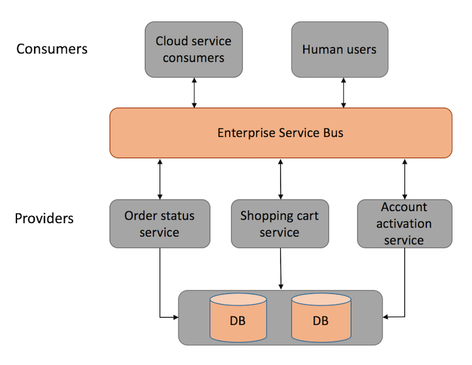
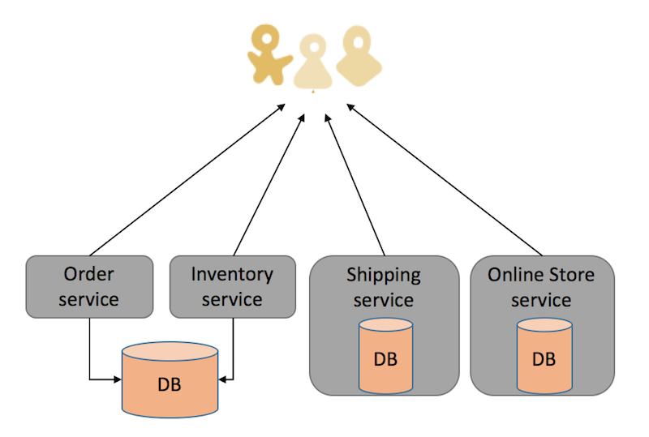

<!-- GFM-TOC -->

<!-- GFM-TOC -->

# 微服务简介

微服务架构的出现主要是为了有效的拆分应用，以实现应用间的解耦、敏捷开发和部属。服务被拆得多了自然就增加了复杂度：客户端如何访问微服务的能力、服务之间如何通信、其中一个服务挂了如何解决问题等等。因此微服务框架应运而生，帮助我们解决上述这些问题，愉快的开发业务逻辑。

## SOA到MSA的进化

SOA面向服务架构
由于业务发展到一定层度后，需要对服务进行解耦，进而把一个单一的大系统按逻辑拆分成不同的子系统，通过服务接口来通讯，面向服务的设计模式，最终需要总线集成服务，而且大部分时候还共享数据库，出现单点故障的时候会导致总线层面的故障，更进一步可能会把数据库拖垮，所以才有了更加独立的设计方案的出现。

MSA微服务架构
微服务是真正意义上的独立服务，从服务入口到数据持久层，逻辑上都是独立隔离的，无需服务总线来接入，但同时增加了整个分布式系统的搭建和管理难度，需要对服务进行编排和管理，所以伴随着微服务的兴起，微服务生态的整套技术栈也需要无缝接入，才能支撑起微服务的治理理念。

