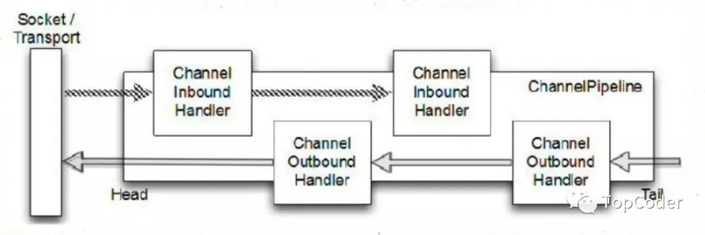
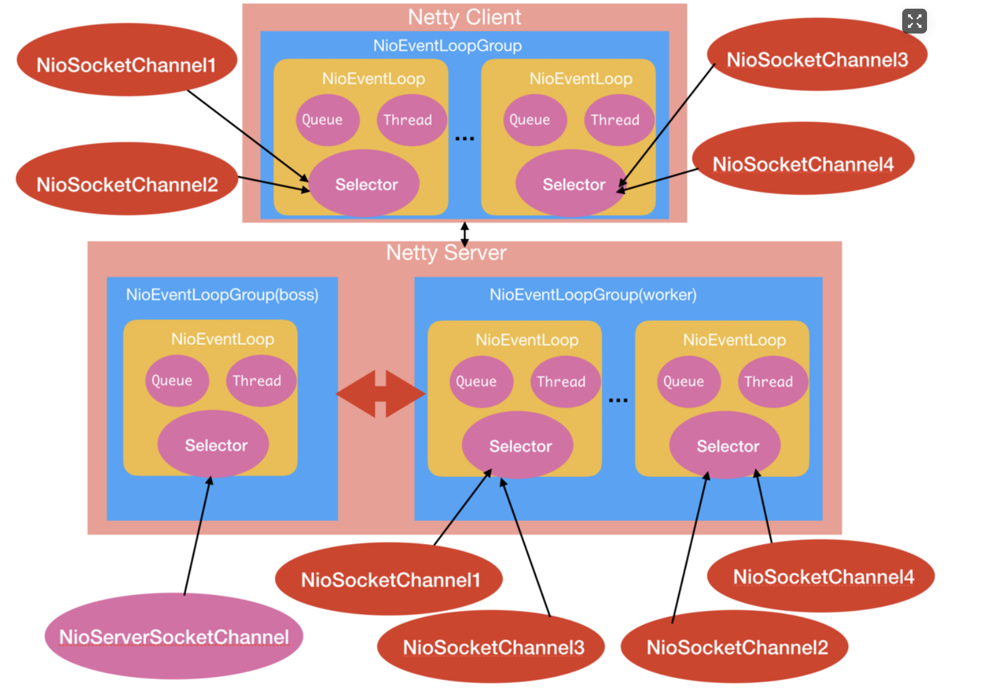

<!-- GFM-TOC  -->
* [介绍](#介绍)
  * [Netty优势](#Netty优势)
  * [核心组件](#核心组件)
  * [线程模型](#线程模型)
<!-- GFM-TOC  -->

# 介绍

Netty 是一个利用 Java 的高级网络的能力，隐藏其背后的复杂性而提供一个易于使用的 API 的客户端/服务器框架。

Netty是一个异步、基于事件驱动的网络应用程序框架，其对 Java NIO进行了封装，大大简化了 TCP 或者 UDP 服务器的网络编程。

## Netty优势

- 并发高
- 传输快
- 封装好

## 核心组件

- Bootstrap和ServerBootstrap：Netty应用程序通过设置bootstrap引导类来完成，该类提供了一个用于应用程序网络层配置的容器。Bootstrap服务端的是ServerBootstrap，客户端的是Bootstrap。
- Channel：Netty 中的接口 Channel 定义了与 socket 丰富交互的操作集：bind, close, config, connect, isActive, isOpen, isWritable, read, write 等等。
- ChannelHandler：ChannelHandler 支持很多协议，并且提供用于数据处理的容器，ChannelHandler由特定事件触发， 常用的一个接口是ChannelInboundHandler，该类型处理入站读数据（socket读事件）。
- ChannelPipeline：ChannelPipeline 提供了一个容器给 ChannelHandler 链并提供了一个API 用于管理沿着链入站和出站事件的流动。每个 Channel 都有自己的ChannelPipeline，当 Channel 创建时自动创建的
- EventLoop：EventLoop 用于处理 Channel 的 I/O 操作。一个单一的 EventLoop通常会处理多个 Channel 事件。一个 EventLoopGroup 可以含有多于一个的 EventLoop 和 提供了一种迭代用于检索清单中的下一个。
- ChannelFuture：Netty 所有的 I/O 操作都是异步。因为一个操作可能无法立即返回，我们需要有一种方法在以后获取它的结果。出于这个目的，Netty 提供了接口 ChannelFuture,它的 addListener 方法

Netty 是一个非阻塞、事件驱动的网络框架。Netty 实际上是使用 Threads（ 多线程） 处理 I/O事件的，对于熟悉多线程编程的读者可能会需要关注同步代码。这样的方式不好，因为同步会影响程序的性能，Netty 的设计保证程序处理事件不会有同步。因为某个Channel事件是被添加到一个EventLoop中的，以后该Channel事件都是由该EventLoop来处理的，而EventLoop是一个线程来处理的，也就是说Netty不需要同步IO操作，EventLoop与EventLoopGroup的关系可以理解为线程与线程池的关系一样。

## 线程模型

上图下侧为Netty Server端,当NettyServer启动时候会创建两个NioEventLoopGroup线程池组，其中boss组用来接受客户端发来的连接，worker组则负责对完成TCP三次握手的连接进行处理；如上图每个NioEventLoopGroup里面包含了多个NioEventLoop，每个NioEventLoop中包含了一个NIO Selector、一个队列、一个线程；其中线程用来做轮询注册到Selector上的Channel的读写事件和对投递到队列里面的事件进行处理。

当NettyServer启动时候会注册监听套接字通道NioServerSocketChannel到boss线程池组中的某一个NioEventLoop管理的Selector上，然后其对应的线程则会负责轮询该监听套接字上的连接请求；当客户端发来一个连接请求时候，boss线程池组中注册了监听套接字的NioEventLoop中的Selector会读取读取完成了TCP三次握手的请求，然后创建对应的连接套接字通道NioSocketChannel，然后把其注册到worker线程池组中的某一个NioEventLoop中管理的一个NIO Selector上，然后该连接套接字通道NioSocketChannel上的所有读写事件都由该NioEventLoop管理。当客户端发来多个连接时候，NettyServer端则会创建多个NioSocketChannel，而worker线程池组中的NioEventLoop是有个数限制的，所以Netty有一定的策略把很多NioSocketChannel注册到不同的NioEventLoop上，也就是每个NioEventLoop中会管理好多客户端发来的连接，然后通过循环轮询处理每个连接的读写事件。

如上图上侧部分为Netty Client部分，当NettyClient启动时候会创建一个NioEventLoopGroup，用来发起请求并对建立TCP三次连接的套接字的读写事件进行处理。当调用Bootstrap的connect方法发起连接请求后内部会创建一个NioSocketChannel用来代表该请求，并且会把该NioSocketChannel注册到NioSocketChannel管理的某个NioEventLoop的Selector上，然后该NioEventLoop的读写事件都有该NioEventLoop负责处理。

Netty之所以说是异步非阻塞网络框架是因为通过NioSocketChannel的write系列方法向连接里面写入数据时候是非阻塞的，马上会返回的，即使调用写入的线程是我们的业务线程，这是Netty通过在ChannelPipeline中判断调用NioSocketChannel的write的调用线程是不是其对应的NioEventLoop中的线程来实现的，如果发现不是则会把写入请求封装为WriteTask投递到其对应的NioEventLoop中的队列里面，然后等其对应的NioEventLoop中的线程轮询连接套接字的读写事件时候捎带从队列里面取出来执行；总结说就是每个NioSocketChannel对应的读写事件都是在其对应的NioEventLoop管理的单线程内执行，对同一个NioSocketChannel不存在并发读写，所以无需加锁处理。

另外当从NioSocketChannel中读取数据时候，并不是使用业务线程来阻塞等待，而是等NioEventLoop中的IO轮询线程发现Selector上有数据就绪时候，通过事件通知方式来通知我们业务数据已经就绪，可以来读取并处理了。

总结一句话就是使用Netty框架进行网络通信时候，当我们发起请求后请求会马上返回，而不会阻塞我们的业务调用线程；如果我们想要获取请求的响应结果，也不需要业务调用线程使用阻塞的方式来等待，而是当响应结果出来时候使用IO线程异步通知业务的方式，可知在整个请求-响应过程中业务线程不会由于阻塞等待而不能干其他事情。